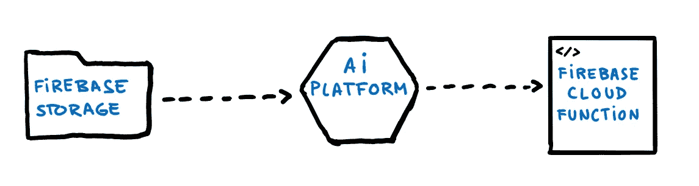
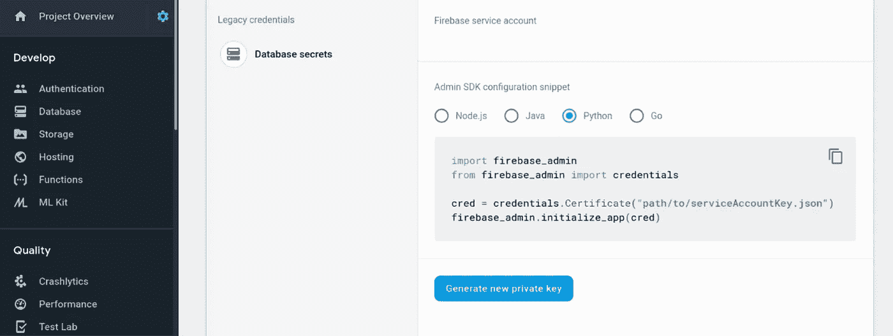
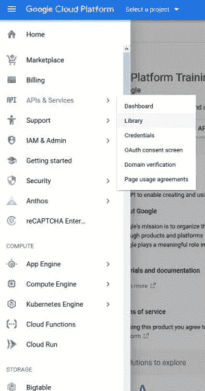
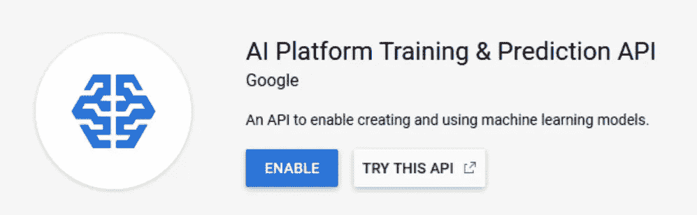
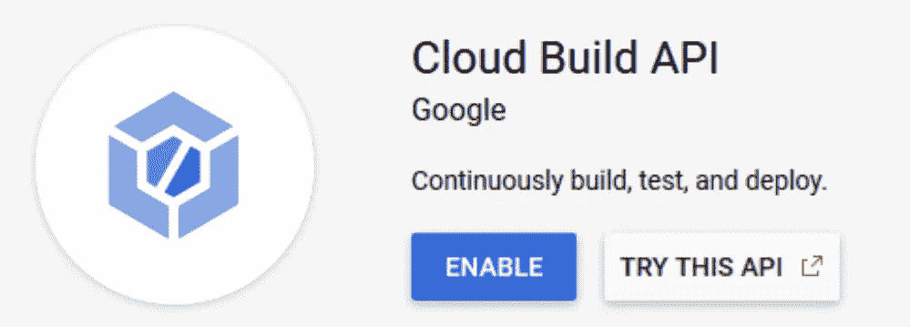
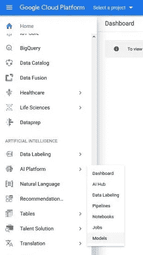
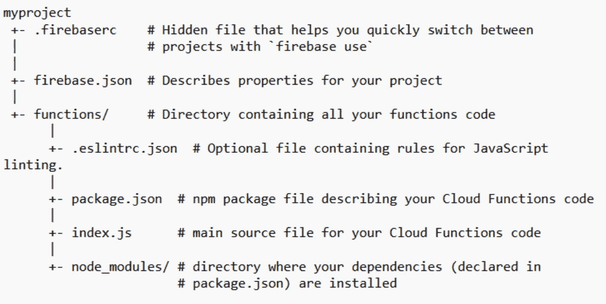
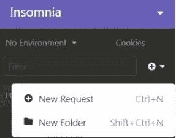
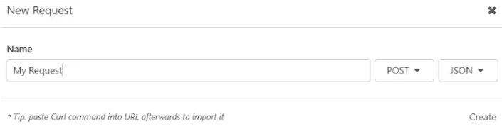
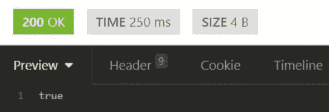

# 如何利用人工智能平台大规模部署模型

> 原文：<https://towardsdatascience.com/how-to-deploy-models-at-scale-with-ai-platform-fd1badf449ea?source=collection_archive---------35----------------------->

## 将机器学习模型部署到云中，并将其作为 API 提供给世界其他地方。


马里乌斯·马萨拉尔在 [Unsplash](https://unsplash.com/s/photos/machine-learning?utm_source=unsplash&utm_medium=referral&utm_content=creditCopyText) 上拍摄的照片由作者编辑。

通常，当我们都开始学习机器学习时，我们会发现大量关于如何建立模型的信息，这当然是主题的核心。但是在数据科学的学术世界中，ML 还有一个同样重要的方面很少被教授，那就是**如何部署这些模型。我如何与世界上的其他人分享我做的这件有用的事情？因为，在一天结束的时候…这就是我们工作的目的，对吗？让人们的生活更轻松😊。**

在本帖中，我们将学习如何将机器学习模型部署到云中，并将其作为 API 提供给世界其他地方。

# 工作流程

我们将首先将模型存储在 Firebase 存储中，以将其部署到 AI 平台，我们可以在生产中对其进行版本化和分析。最后，我们将通过具有 Firebase 云功能的 API 来提供我们的模型。



图片由作者提供。

## AI 平台是什么？🧠

AI Platform 是[谷歌云平台](https://console.cloud.google.com) (GCP)的一项服务，通过不必担心维护自己的基础设施，让你只为使用付费，可以轻松管理整个生产和部署过程。这将使您能够为快速增长的项目大规模扩展您的产品。

你可以利用 GCP 的 12 个月、300 美元的免费试用来免费尝试这个和更多的实验**。**

## 什么是 Firebase 云函数？🔥

本质上，对于本文的目的，云函数将作为一个 API 工作。我们将通过一个任何人都可以提出请求的链接来提供我们模型的预测，并实时接收我们模型的响应。

# 你需要什么

*   一个准备分享✔的模型
*   一个谷歌账户✔

是的，就这些

# 入门指南

为了简单起见，我假设这个模型是用 Python 开发的，并且存在于一个 Jupyter 笔记本中。但是当然，这些步骤可以适用于任何其他环境。

## 1.登录 Firebase

首先，用你的谷歌账户登录到 [Firebase 控制台](https://console.firebase.google.com)，创建一个新项目。现在你在 Firebase 仪表板里面，进入*项目设置* > *服务账户* > *Firebase 管理 SDK* ，(在这种情况下)你选择 Python 选项并点击*生成新私钥*。这将给出您的服务帐户的 JSON 文件，您可以将其保存在笔记本的目录中。



然后，安装 Firebase Admin SDK 包:`pip install firebase-admin`

## 2.燃料库中的存储模型

一旦你训练和测试了你的模型，它就可以上传到人工智能平台了。但在此之前，我们需要先将模型导出并存储在 Firebase 存储中，这样 AI 平台才能访问它。

如果您使用笔记本，在末尾创建一个新的单元格，并添加以下脚本。这将启用您的 firebase 帐户:

```
import firebase_admin
from firebase_admin import credentials
from firebase_admin import firestore# Use a service account
if (not len(firebase_admin._apps)):
	cred = credentials.Certificate(r'service_account.json')
	firebase_admin.initialize_app(cred)db = firestore.client()
```

现在，要运行下面的代码，您需要获取项目 ID，您可以在 Firebase 项目设置中再次找到它。

一旦我们有了我们的项目 ID，我们就通过运行下面的代码来上传模型(您应该首先用您的项目 ID 来更改它)。

```
from sklearn.externals import joblib
from firebase_admin import storagejoblib.dump(clf, 'model.joblib')
bucket = storage.bucket(name='[YOUR PROJECT ID HERE].appspot.com')
b = bucket.blob('model-v1/model.joblib')
b.upload_from_filename('model.joblib')
print('model uploaded!')
```

现在，我们可以通过检查指定目录(在我们的例子中是`model-v1/`)中的 Firebase 存储来验证模型已经被正确上传。

## 3.在人工智能平台中部署模型

现在模型已经存储好了，可以接入 AI 平台了。

我们需要在[谷歌云平台](https://console.cloud.google.com)中启用几个 API。在左侧面板上，在*库*部分中，我们找到 API*“AI 平台训练&预测 API”*和*“云构建 API”*并启用它们。



现在，在左侧面板上，我们点击*人工智能平台>模型*，我们*创建新模型*并输入相应的信息。



一旦我们创建了模型，是时候创建它的一个版本了，它将指向*。我们之前存储的 joblib* 文件。我们点击*型号* > *新版本*并填写信息。重要的是，我们选择用于训练模型的相同 Python 版本。我们选择 scikit-learn 作为框架。当指定它的版本时，我们可以通过在笔记本中运行下面的代码来获得它。

```
import sklearn
print('The scikit-learn version is {}.'.format(sklearn.__version__))
```

在选择 ML 运行时版本时，您应该选择推荐的版本。机器类型可以暂时默认保留。

最后，我们指定我们的*所在的文件夹。joblib* 文件被定位。重要的是选择文件夹，而不是文件！其余字段可以保留默认并保存。那时，我们模型的一个实例将被部署在人工智能平台上。

现在，我们将能够从命令行或其他 Google APIs 进行预测，如 Cloud Function，我们将在接下来看到。此外，我们将能够获得模型的一些性能指标。

## 4.创建云函数

让我们看看如何实现该功能！

我们将在终端上运行一些命令，但为此，您需要确保您的计算机上安装了 [Node.js](https://nodejs.org/) 。以下命令特定于 Windows，但是您应该能够在 Unix 和 Mac OS 设备中使用它们，方法是在每个命令的开头添加`sudo`。

让我们从安装 Firebase 客户端开始:`$ npm install -g firebase-tools`

我们进入谷歌账户:`$ firebase login`

初始化一个新的项目目录(确保你在你想要初始化它的目录中):`$ firebase init`

运行最后一个命令时，将会询问您几个问题。当询问您想要在目录中包含的 Firebase 项目时，您必须选择包含我们之前导出的 ML 模型的项目。选择 JavaScript 作为编程语言。我们不使用 ESLint，所以回答*否*。最后，用 *npm* 安装依赖项，回答*是*。

创建项目后，目录将具有以下结构:



在这个目录中，我们将只修改 *index.js* 和 *package.json* 文件。

我们安装 Google API 的包:`$ npm i googleapis`

现在，我们通过打开 *package.json* 文件来检查软件包是否已经正确安装。如果你想在你的代码中使用任何其他的外部包，你也应该把它和它相应的版本一起添加到这个文件中。

目前，它应该具有类似于以下的结构:

```
"dependencies"​: {
	​"firebase-admin"​: ​"~7.0.0"​,​
	"firebase-functions"​: ​"^2.3.0"​,​
	"googleapis"​: ​"^39.2.0"​
}
```

我将简要说明它们的作用:

*   firebase-admin :它是管理 SDK，允许从特权环境与 firebase 交互。
*   firebase-functions:这是一个定义 firebase 中[云函数](https://firebase.google.com/docs/functions)的 SDK。
*   *Google APIs*:是 Google API 使用的客户端库 Node.js。

现在让我们看看函数的实现(我们正在编辑 *index.js* 文件)，你也可以在[这个 GitHub 库](https://github.com/ElsaScola/sample_cloud_function)中找到。作为一个例子，我将使用代码访问一个简单的假账户检测模型。

我们首先加载 *firebase-functions* 和 *firebase-admin* 模块。

```
const​​ functions ​​= ​​require​(​'firebase-functions'​);
const ​​admin​​ =​​ require​(​'firebase-admin'​);
```

我们加载 *googleapis* 模块，并添加对 ml 版本 1 的引用。

```
admin​.​initializeApp​(​functions​.​config​().​firebase​);
const​​ googleapis_1​​ =​​ require​(​"googleapis"​);
const​​ ml​​ = ​​googleapis_1​.​google​.​ml​(​'v1'​);
```

这些请求将被发送到一个 http 函数。

```
exports​.​predictSPAM​​ = ​​functions​.​https​.​onRequest​(​async​​(request,​​response)​​=>
{
```

我们指定函数的输入值。在这个例子中，我得到了一些关于社交媒体账户的数据，我的模型将使用这些数据来分类虚假与否。您应该指定您计划随后输入到模型中的字段。

```
const ​​account_days_old​​ = ​​request​.​body​.​account_days_old​;​
const​​ followers_count​​ =​​ request​.​body​.​followers_count​;​
const ​​following_count ​​= ​​request​.​body​.​following_count​;
​const​​ publications_count​​ =​​ request​.​body​.​publications_count​;
```

之后，我们构建模型的输入，也就是我们将发送给模型以获得预测的输入参数。请注意，这些输入应遵循与模型训练时相同的结构(要素顺序)。

```
const​​ instance ​​= 
[[account_days_old,followers_count,following_count,publications_count]]
```

现在，让我们向 Google API 发出请求，这个请求需要认证，这将把我们的 Firebase 凭证与 Google API 连接起来。

```
const ​​model​​ =​​ "[HERE THE NAME OF YOUR MODEL]"​;​
const​ { ​credential​ } ​=​​ await
googleapis_1​.​google​.​auth​.​getApplicationDefault​();
```

在一个变量中存储了我们的模型的名称之后(这个名称应该与您在 AI 平台控制台中给它的名称相同)，我们通过发送我们的凭证、模型的名称和我们想要预测的实例来对 AI 平台进行预测调用。

```
const ​​modelName​​ =​​ `projects/[YOUR PROJECT ID HERE]/models/​${​model​}​`​;
const​​ preds ​​= ​​await ​​ml​.​projects​.​predict​({
		auth​:​​ credential, 
		name​:​​ modelName,  
		requestBody​:​​ {
			​instance
		​}​
	});​
	response​.​send​(​preds​.​data​[​'predictions'​][​0​]);
});
```

## 5.将云功能部署为 API

一旦我们创建了访问模型的云函数，我们只需要将它上传到 Firebase，将其作为 API 进行部署。

为了上传 Firebase 函数，我们在终端中运行以下命令:`$ firebase deploy --only functions`

一旦完成加载，将获得一个 URL，通过该 URL 可以访问该功能，这可以通过登录 Firestore，在*功能*部分，在*请求*下以较小的字体找到。

就这样，现在你的模型已经建立并运行了，可以开始分享了！🎉🎉🎉

你可以从一个移动应用程序、一个网站向这个 API 发出请求…它可以被集成到任何地方！

## 6.用失眠测试你的 API

当然，这是一个可选的步骤，如果您遵循了前面的指南，您的模型应该准备好接收请求。然而，作为一名程序员，我喜欢测试东西，以检查一切工作正常。

我最喜欢的测试 API 的方法是使用[失眠](https://insomnia.rest/)。失眠症是一个 REST API 客户端，它让您可以轻松地测试您的 API。这款免费的桌面应用适用于 Windows、MacOS 和 Ubuntu。让我们检查一下我们新做的 API 是否工作正常！

安装桌面应用程序后，我们可以创建新的请求。



我们将编写请求名，并选择 POST 作为方法，JSON 作为其结构。



一旦我们创建了请求，我们就复制云函数的 URL，并将其粘贴到顶栏中。

我们现在将按照我们在函数中指定的格式编写请求，在我的例子中，它是这样的:

```
{  
  "account_days_old": 32,
  "followers_count": 162,
  "following_count": 152,
  "publications_count": 45,
}
```

我们现在点击*发送*，我们将得到响应，以及响应时间和大小。如果有任何错误，您也应该收到错误代码，而不是`200 OK`消息。



当然，您得到的响应会因您的型号而异。但是如果一切正常，那么恭喜你！您已经准备好与全世界分享您的模型了！🌍

如果你做到了这一步，感谢你的时间，我希望你能从这篇文章中得到一些价值😊

下一集再见！🚀