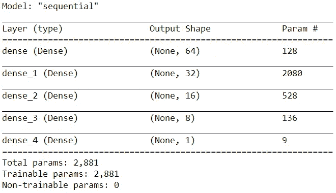
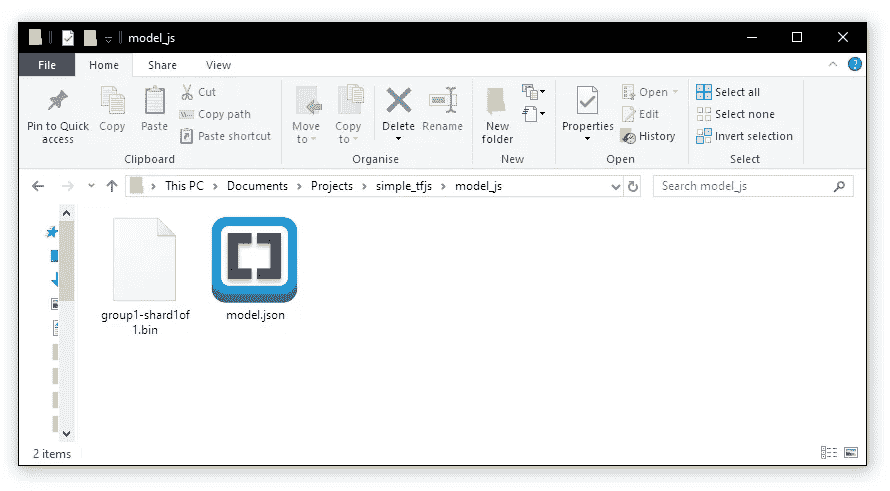
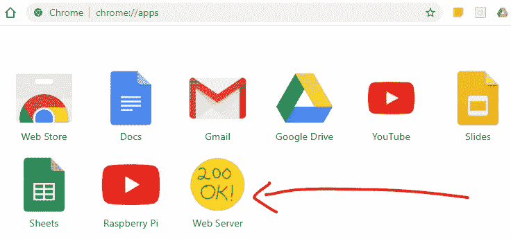
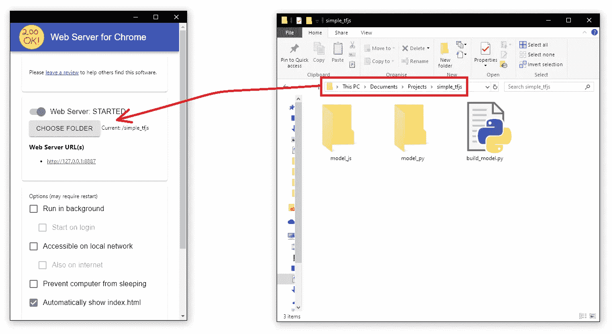
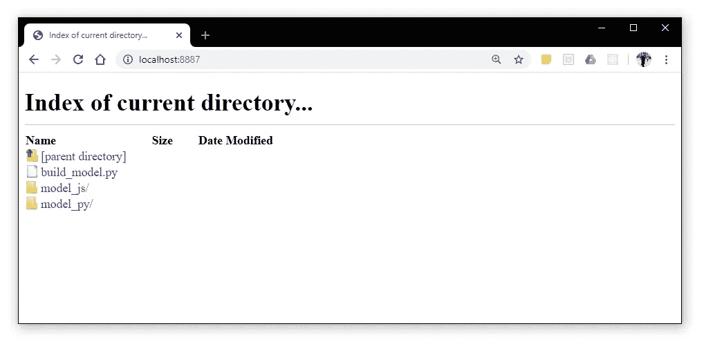
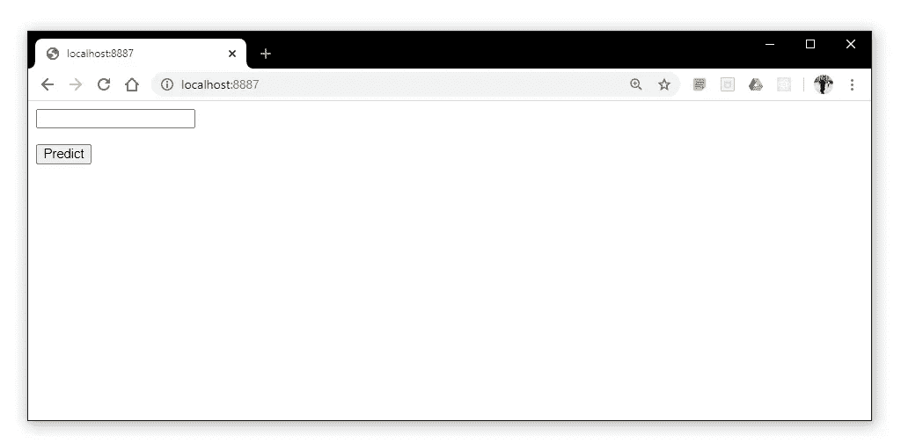
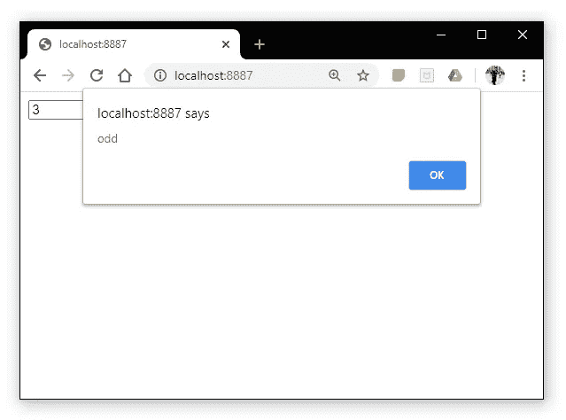
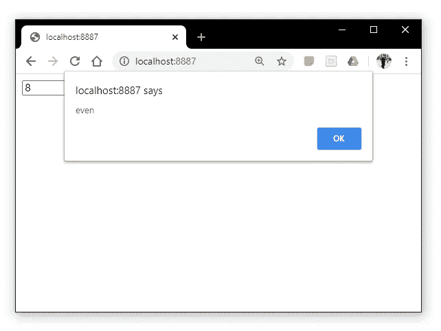

# 将张量流模型部署到 Web

> 原文：<https://towardsdatascience.com/how-to-deploy-tensorflow-models-to-the-web-81da150f87f7?source=collection_archive---------15----------------------->

## 如何使用基本的 JavaScript 在浏览器中运行 Python 构建的模型


Avi Richards 在 [Unsplash](https://unsplash.com?utm_source=medium&utm_medium=referral) 上拍摄的照片

用 Python 开发机器学习模型会是一种美妙的体验。Python 对 ML 和数据科学的支持和社区是任何其他语言都无法比拟的。

尽管如此，与非 Python 用户共享这些模型的方法非常少——对于我们大多数人来说，这描述了我们的大多数同事和最终用户。

另一方面，世界上几乎每个拥有电脑的人都有一个互联网浏览器。

幸运的是，我们只需要一个网络浏览器。

在本文中，我们将使用 Python 和 TensorFlow 创建一个简单的模型。我们将导出它，并将其部署到使用 JavaScript 和 TensorFlow.js 的 web 浏览器中——我们将保持它非常简单。要做到这一点，您不需要了解 JavaScript。

# Python 部分

我们将使用一个基本的神经网络来告诉我们 0-10 之间的数字是奇数还是偶数。当然，我们不需要一个神经网络来做到这一点，但这意味着我们保持这个例子非常简单——没有任何错误。

这个模型需要一个数字作为输入，并产生一个数字作为输出。奇数会产生一个`1`甚至一个`0`。

首先，我们创建训练数据:

```
x = []
y = []
for _ in range(10000):
    num = np.random.randint(0, 101)  *# generate random integer*
    x.append(num)
    y.append(num % 2)
```

`**x** =[2, 7, 4, 1, 9, ..., 0]`

`**y** = [0, 1, 0, 1, 1, ..., 0]`

现在我们有了数据，让我们建立模型:



事实证明，模函数的表达具有惊人的挑战性。因此，神经网络确实包含合理数量的参数——训练后偶尔会告诉我们 10 是一个奇数——但它在大多数情况下是有效的。

现在我们保存它:

```
model.save('model_py/model.h5')
```

这将我们的模型保存为一个`HDF5`文件——准备转换为`TensorFlow.js` web 格式。

要转换模型，我们首先需要`pip install tensorflowjs`。安装完成后，我们从命令行运行`tensorflowjs_converter`(`Command Prompt`、`Terminal`、`Bash`等)。).

打开命令行并导航到我们的项目文件夹(Windows 上的`cd <directory_path>`)。然后通过键入以下命令运行转换器:

```
tensorflowjs_converter \
     --input_format=keras \
     model_py/model.h5 \
     model_js
```

这里，我们告诉`tensorflowjs_converter`期待`keras`模型格式。然后我们指定模型路径`model_py/model.h5`。最后，我们告诉转换器将转换后的模型保存在`model_js`目录中。

如果我们导航到`model_js we`，会发现以下内容:



那个`.json`文件是我们的支持 web 的模型，可以在 JavaScript 中使用。

# JavaScript 部分

## 服务器设置

首先，我们需要建立一个本地 web 服务器。由此，我们可以模拟一个网页的行为，它将包含我们的模型和用户前端。

最简单的方法是使用 Chrome 网络服务器应用程序。这是超级轻量级的，易于使用。

安装完成后，导航至`chrome://apps/`并点击网络服务器图标:



这将启动 web 服务器，但可能不在正确的目录中。点击`CHOOSE FOLDER`并导航到包含我们项目的目录:



现在，输入`localhost:8887`应该会显示 chrome 中的同一个目录:



这意味着我们的服务器设置正确。如果`localhost:8887`不工作，服务器很可能被托管在另一个端口上。要找到正确的地址，请查看 Chrome Web 服务器窗口中的`Web Server URL(s)`列表，并单击给定的 URL。

## 构建页面

接下来，我们需要一个网页。首先，创建名为`index.html`的文件。在其中，我们创建了一个`form`来为我们的模型提供输入，如下所示:

```
<input type="text"></input><button>Predict</button>
```



当然，这还没有做任何事情。我们需要添加一些 JavaScript。

我们将编写两个函数，一个用于加载模型，另一个用于进行预测:

该代码可以通过包装在`<script>`标签中嵌入到`index.html`中。我们还需要导入`tensorflow.js`——同样可以使用`<script>`标签来完成。

将所有这些都写入代码会给我们带来:

最后一步是将我们在`<input>`框中输入的内容连接到我们的模型。

我们可以通过在调用`predict`时获取`<input>`元素来做到这一点。为此，我们给`<input>`一个惟一的标识符`id="userInput"`，然后用这个标识符将元素拉进我们的带有`document.getElementByID('userInput')`的函数中——这给了我们整个元素，所以我们通过在末尾添加`.value`来指定值。

现在我们已经将用户给定值连接到我们的`predict`函数，我们只需要触发它。我们简单的把`onclick="predict(model)"`加到`<button>`上。所有这些给了我们完整的代码:



这就是我们的 NN，运行在一个世界上任何人都可以使用的浏览器中。当然，除了告诉我们一个数字是奇数还是偶数之外，我们可能还需要一些东西——但是我们都是从某个地方开始的。

# 后续步骤

在此基础上，您还可以做更多的事情。你已经知道最难的部分——教机器学习。在这之后，你需要的只是一点点时间，足够的激情，你就能创造出一些令人惊叹的东西。

实际上，像我们在本文中所做的那样快速而直接地编写东西并不是您处理真实项目的方式。为了学习和简洁，我们跳过了许多步骤和最佳实践。

使用 Angular 或 Node 之类的框架(Python 的替代方案包括 Django 和 Flask)可以轻松构建交互式、快速、可伸缩的 web 应用程序。Bootstrap 是另一个神奇的工具，它可以让我们看起来很糟糕的网站变得漂亮，而我们几乎不需要付出任何努力。

我不能代表所有人，但是以我个人的经验，学习 [Angular](https://angular.io/start) ，用 [Bootstrap](https://getbootstrap.com/docs/4.4/getting-started/introduction/) 设计 web 应用程序，会产生很好的效果——而且可以很快上手。

如果这是你想进一步探索的东西，我强烈推荐这两个。

我希望你喜欢这篇文章——如果你有任何问题或建议，请告诉我！

感谢阅读！