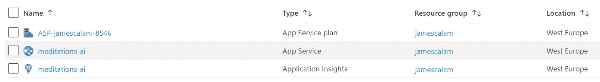

# 如何使用 Azure 部署 Web 应用

> 原文：<https://towardsdatascience.com/how-to-deploy-web-apps-with-azure-52ca340b41b9?source=collection_archive---------19----------------------->

## 利用 Angular 和 Azure 应用服务快速轻松地部署应用


照片由[卡斯帕·卡米尔·鲁宾](https://unsplash.com/@casparrubin?utm_source=medium&utm_medium=referral)在 [Unsplash](https://unsplash.com?utm_source=medium&utm_medium=referral) 上拍摄

azure——或任何其他云服务——让分享我们创造性劳动的成果变得前所未有的容易。

我们可以用 Angular(一个非常容易上手的框架)构建一个应用程序，并以比制作咖啡更快的速度将其部署到世界各地。

对我来说，这真的是惊人的。我们开发和部署的容易程度和速度令人难以置信。它解放了我们的创新精神，让我们可以在几分钟内与世界分享。

这篇文章将带我们经历从孤独的 Angular app 到高度可用、高度连接的 Angular app 的步骤。

我们将使用的所有服务都是免费的(感谢微软),而且——老实说——非常容易使用。简而言之，我们将涵盖:

> ***>准备我们的 App***
> 
> ***>设置我们的 Azure 应用服务***
> 
> ***>使用 Azure DevOps 创建我们的部署管道***

尽情享受吧！

# 准备我们的应用

首先，我们需要一个应用程序——如果你没有，没问题——我们可以使用自然语言生成应用程序，你可以在 [GitHub 这里](https://github.com/jamescalam/nlg-project)找到。

## 应用程序编译

```
*The* ***App Compilation*** *step is repeated in our Azure pipeline. It can be skipped now — but it is useful to be aware of, and useful to confirm that our app compiles.*
```

Azure 需要一个`dist/`目录——这是一个 Angular 构建的分发目录——包含我们已编译并准备好用于生产的整个应用程序。

为了构建`dist/`,我们打开 Angular CLI 并导航到我们的 Angular 应用程序目录。然后我们告诉 Angular 使用*生产配置* 和`ng build --prod`进行[构建——然后应用程序将编译到`dist/`目录中。](https://angular.io/cli/build#:~:text=Shorthand%20for%20%22%2D%2Dconfiguration%3D,also%20limited%20dead%20code%20elimination.)


显示 **ng 构建**过程的屏幕截图。

## 检查输出

我们需要确保我们的`ng build --prod`命令将我们的应用程序直接输出到`dist/`目录中。默认情况下，Angular 将分配给`dist/<app-name>/`——我们在`angular.json`中对此进行了更改:


在 angular.json 中，我们从" outputPath "中删除了我们的 app-name，留下了 **"outputPath": "dist"** 。

现在，在`dist/`目录中，我们应该能够看到`index.html`——如果它不在那里，找到它在哪里，并相应地调整`angular.json`中的`"outputPath"`值。

# 设置我们的 Azure 应用服务

首先，我们需要前往 Azure 门户网站——Azure 云的首页。如果你需要注册，那就去吧，只需要几分钟。

[](https://azure.microsoft.com/en-us/features/azure-portal/) [## Microsoft Azure 门户| Microsoft Azure

### 从微软和我们的合作伙伴提供的 3，000 多种服务中进行选择，其中许多是免费的。找到打开的…

azure.microsoft.com](https://azure.microsoft.com/en-us/features/azure-portal/) 

既然我们已经登录到门户，我们应该欢迎进入门户屏幕。如果这是你第一次使用 Azure，你将需要注册一个免费试用版(我们将坚持使用免费版，因此我们不会使用任何点数！).

我们通过点击类似于**“从 Azure 免费试用开始”**的大方块来注册。

注册后，我们会创建一个应用服务实例，如下所示:


一旦我们注册了免费试用，我们就可以通过点击上面突出显示的图标来创建一个应用服务实例。

在这里，我们需要为我们的应用程序键入一些细节。这些选项中的大部分将特定于您正在构建的内容——但是对于**运行时堆栈**,请选择**ASP.NET 4.7 版**,当然还要选择离您最近的**区域**:


我们的 web 应用程序详细信息—注意**运行时堆栈**。接下来讨论我们的**应用服务计划**。

接下来，我们需要选择我们的 **Windows 计划** —如果您还没有计划设置，我们需要创建一个。选择**创建资源组**，按**开发/测试**找到自由选项，如下图:


资源组规格。

现在我们已经创建了我们的应用服务资源！我们可以通过点击左上角的按钮(三条水平线)并点击 **All Resources** 来查看我们所有的资源。



资源列表应该是这样的——应用程序服务本身是中间项。

然后我们可以通过在浏览器中输入`<app service name>.azurewebsites.net`来浏览我们的网页。我们将看到:


# 使用 Azure DevOps 创建我们的部署管道

现在我们需要设置我们的 Azure DevOps 项目。为此，请转到 Azure DevOps，使用您在 Azure 门户中使用的同一 Microsoft 帐户登录。

登录后，您应该会在屏幕的右上角看到创建一个新组织的选项，单击此处。

然后我们将看到另一个窗口，在这里我们命名我们的组织并为我们组织的项目分配一个地理位置。我常驻罗马，所以选择了**西欧**。


在下一个屏幕上，我们可以创建我们的项目:


现在我们有了项目设置，我们需要连接我们的 GitHub 库并建立一个生产构建管道。

## 连接到 GitHub

要连接到我们的 GitHub 存储库，使用右边的工具栏导航到 Pipelines 区域，并单击 **Create Pipeline** 。


我们将被带到一个新窗口，Azure 将询问我们的代码在哪里——我们正在拉入一个现有的 GitHub repo，因此我们单击 **GitHub** 。


然后，我们授权 AzurePipelines 在下一个窗口中访问我们的 GitHub 帐户。

下一步是选择我们想要使用的存储库，对我来说就是`jamescalam/nlg-project`——你可以使用自己的 repo 或者简单地派生[这个](https://github.com/jamescalam/nlg-project)。


现在我们需要**批准&为我们选择的存储库安装** Azure 管道。

下一步，我们配置我们的管道，使用带有 Angular 的 **Node.js，这将生成以下 YAML 脚本:**


在脚本中，我们可以看到管道 YAML 设置的步骤。首先，第 6 行是`trigger`——设置为`master`——这意味着每当我们的 GitHub repo 中的主分支被更新时，我们的 YAML 脚本就会被触发。

接下来——在第 10 行——我们可以看到这将在运行 Ubuntu 的虚拟机(VM)上运行。然后我们在第 13 行看到，该脚本将 Node.js 安装到我们的虚拟机上。

最后，我们的 YAML 脚本安装 Angular CLI，然后使用我们之前创建`dist/`目录时使用的相同方法构建我们的应用程序——这执行相同的功能*(我们也可以在早期跳过这一步，但这对于确认应用程序编译无误非常有用)*。

但是我们缺少最后一步，部署到我们的 Azure 应用服务。

要添加这个，在右上角找到**展示助手**——点击这个。现在我们将看到可以添加到 YAML 脚本中的所有任务的列表；我们需要 **Azure 应用服务部署**:


点击后，会出现一个表格。我们需要做的就是添加我们的 **Azure 订阅**(我的是这个奇怪的俄语文本——我不知道为什么)，我们的**应用服务名称**，最后将**包或文件夹**改为`dist/`。


现在我们将把 **Azure App Service deploy** 代码添加到我们的 YAML 脚本中——确保这被添加到脚本的末尾。因此，我们的 YAML 脚本应该包括:

```
trigger
pool
steps
- task (install Node.js)
- script (npm install Angular CLI and build app)
**- task (deploy to Azure App Service)**
```

我们单击“save ”,将更改提交给我们的回购。最后点击**运行**。

YAML 管道将需要一分钟左右的时间来运行。如果似乎什么都没有发生，并且作业状态停留在 **Queued** 中，刷新页面并允许管道在提示时使用您的描述。

完成后，我们的作业状态将变为 **Success** ，现在我们可以使用之前使用的相同网址`<app service name>.azurewebsites.net`导航到我们部署的 web 应用程序，对我来说，这是`meditations-ai.azurewebsites.net`。


使用由 Azure App Services 托管的自然语言生成器 web 应用程序。

# 我们做到了！

仅此而已——我们现在知道如何用 Azure App Services 部署 Angular 应用了。有一些技能并不太难学，但对我们能构建的东西有着巨大的影响——这是其中之一。

能够使用我们内置的 Angular 应用程序，并以比制作咖啡更快的速度与世界分享，这是非常了不起的。

如果这还不够的话，我们不仅部署了一个应用程序，还将它直接挂在了我们的 GitHub 上。

所以现在，每次我们想把我们最新发布的网络应用推向世界，我们只需输入`git push`——对我来说，这太不可思议了。

我希望这篇文章对你和对我一样有用。我很乐意听到你的想法、问题或评论——所以请随时通过 [Twitter](https://twitter.com/jamescalam) 或在下面的评论中联系我们。

感谢阅读！

对更有棱角感兴趣？请随意查看我写的这篇关于构建基于 TensorFlow 的 Angular 应用程序的基础知识的文章:

[](/how-to-use-angular-to-deploy-tensorflow-web-apps-5675b5a042cc) [## 如何使用 Angular 部署 TensorFlow Web 应用程序

### 在角度构建的 web 应用程序中使用 Python 构建的模型

towardsdatascience.com](/how-to-use-angular-to-deploy-tensorflow-web-apps-5675b5a042cc)