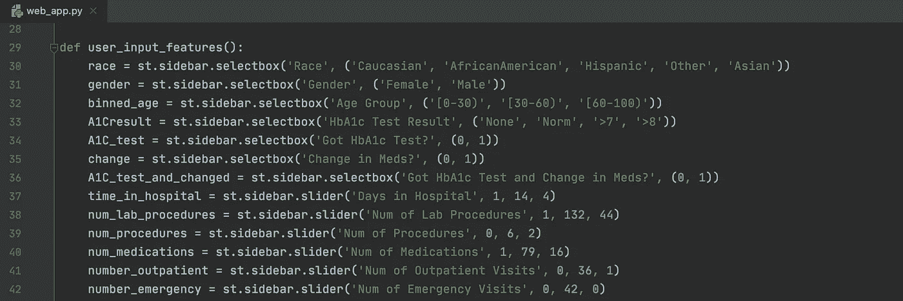
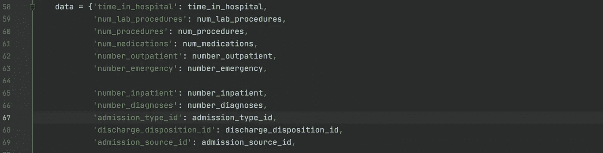

# 如何使用 Streamlit 和 Heroku 部署您的定制 ML 模型

> 原文：<https://towardsdatascience.com/how-to-deploy-your-custom-ml-model-with-streamlit-and-heroku-53456cb054fb?source=collection_archive---------30----------------------->


我的互动模型！作者图片

## [数据科学](https://towardsdatascience.com/data-science/home)

## 一步一步的指导来主持你的模型！

我一直想把我的一些数据科学项目放到网上，这样我的模型就可以是交互式的，有更大的影响力。YouTube 上的[数据教授](https://www.youtube.com/channel/UCV8e2g4IWQqK71bbzGDEI4Q) (Chanin Nantasenamat)有一个关于 [Streamlit](https://www.streamlit.io/) 的很棒的教程系列，这是一个开源的交互式数据应用平台，似乎提供了我正在寻找的一切！

TLDR: [这是我的最后一页](https://diabetes-hospitalization.herokuapp.com/)！

所以我回到了之前的项目，根据电子健康记录预测糖尿病患者的住院需求(EHR)。我的 GitHub [repo](https://github.com/ArenCarpenter/Diabetes_Hospitalizations) 包含原始建模的所有代码，以及在 Heroku 上托管的必要附加内容。

但是！我遇到了一个问题。甚至当我把一系列简单应用的指南和教程拼凑在一起的时候，我仍然无法将最终的应用部署到 Heroku！所以这里有另一个指南，希望这个能帮助你跟随我的脚步。

# 步骤 0 —所有传统的 CRISP-DM 步骤！

本指南从最终模型到托管。因此，我假设您已经完成了开发模型的尽职调查，从数据和业务理解到清理和 EDA，再到建模和评估。

# 第一步——腌制你的模型


腌制它！[瑞卡·比罗-霍瓦特](https://unsplash.com/@allwithzest)打开 [Unsplash](https://unsplash.com/)

我使用 scikit-learn 的 LogisticRegressionCV 开发了一个多元逻辑回归模型。它被称为 *logreg_nopoly* ，因为它没有包含多项式或交互特性。

```
**import** **pickle**pickle.dump(logreg_nopoly, open('diabetes_model.pkl', 'wb'))
```

您的腌泡模型应该在根目录中。

# 步骤 2-创建 web_app.py 文件

这是[链接](https://github.com/ArenCarpenter/Diabetes_Hospitalizations/blob/master/web_app.py)到我的文件。我的模型有 19 个特征，混合了分类特征和连续特征，所以我需要清理我的数据，并对用户输入的数据执行相同的转换(特征工程和 get_dummies)。

Streamlit 允许简单的降价风格的标题和文本，以及嵌入图像和图表。为了将数据输入模型以获得预测，您应该创建一个函数，允许用户为您的每个要素定义一个值。

## 对于连续变量:

> st.sidebar.slider('名称'，最小值，最大值，默认值)

```
num_medications = st.sidebar.slider('Num of Medications', 1, 79, 16)
```

## 对于分类变量:

> st.sidebar.selectbox('name '，(' option1 '，' option2 '，…)，其中包含该功能中的所有类别

```
gender = st.sidebar.selectbox('Gender', ('Female', 'Male'))
```



如何在 Streamlit 中对滑块和框进行编码的示例。作者图片

该功能的前半部分将创建用户将在应用程序上与之交互的各种滑块和框。**这些可以是任何顺序**。我将一些最有影响力的特性放在栈顶，以使改变预测的体验更容易。



如何创建实际输入数据帧的示例。作者图片

函数的第二部分是创建数据集特征名(键)和我们在上面为相应特征(值)创建的变量的字典。然后将它加载到熊猫数据帧中。**这个字典应该按照原始数据中列的顺序排列**，这样当我们连接时，我们的 input_df 和原始 df 匹配。

您会注意到，为了确保所有分类变量都以相同的方式编码(以便我们的 get_dummies 编码特性中所有可能的条目),我们需要在这个文件中执行相同的数据清理和特性工程步骤，并且我们需要将这个用户输入连接到数据集。

以一些特征工程步骤为例——这里是要检查的[完整文件](https://github.com/ArenCarpenter/Diabetes_Hospitalizations/blob/master/web_app.py)。在这里，我创建了一些二元特征来确定患者是否接受了 HbA1c 测试，以及他们的药物治疗是否有所改变。

```
# Feature Engineering
df['A1C_test'] = np.where(df.A1Cresult == 'None', 0, 1)df.change = np.where(df.change == 'No', 0, 1)df['A1C_test_and_changed'] = np.where((df.change == 1) &      (df.A1C_test == 1), 1, 0)
```

然后，我们删除目标特征(“重新接收”)，并在编码前连接用户输入。

```
X = df.drop('readmitted', axis = 1) # drop target feature
df = pd.concat([input_df, X], axis=0) # add user input to dfencode = [categorical_variables]
for col in encode:    # encode all categorical
    dummy = pd.get_dummies(df[col], prefix=col)    
    df = pd.concat([df, dummy], axis=1)    
    del df[col]
df = df[:1] # first row is user input
```

现在我们将读入我们的 pickled 模型，以便对用户输入进行预测！st.write 方法接受要显示的字符串，但它也将以本机方式显示 pandas 数据帧和系列。

```
load_clf = pickle.load(open('diabetes_model.pkl', 'rb'))
prediction = load_clf.predict(df)
prediction_proba = load_clf.predict_proba(df)readmitted = np.array(['NO','<30','>30'])
st.write(readmitted[prediction]) # writes value from array
st.write(prediction_proba) # writes probability of each value 
```

# 第三步——在本地改进 Steamlit 应用程序

一旦处理好建模，您就可以在本地托管 Streamlit，并添加必要的降价来构建应用程序。

## 在您的终端/CLI 中

这将安装 Streamlit(如果尚未安装)并打开演示页面。

```
$ pip install streamlit
$ streamlit hello
```

现在您已经准备好了一个 web_app.py 文件(或者足够接近)，可以在本地打开它进行实时查看和编辑。你应该在应用程序的根目录。

```
$ streamlit run web_app.py
```

一旦打开，任何时候你更新和保存。py 文件，Streamlit 应用程序将检测到这些更改，并可以设置为自动更新应用程序。

# 步骤 4-创建 Heroku 依赖项

因此，您的应用程序已经准备就绪，正在本地运行！太棒了。所以现在我们需要在这个根目录下创建一些文件来馈送给 Heroku。本节大量参考了本[之前的指南](/from-streamlit-to-heroku-62a655b7319)，但是我已经更改了 setup.sh 文件的内容，因为最初的指南对我不适用。

## Procfile

在 Jupyter 中，创建一个名为 Procfile 的文件。将此作为唯一内容粘贴。这告诉 Heroku 运行我们将要创建的 setup.sh 文件，并运行我们之前运行的 Streamlit 命令来运行我们的应用程序。

```
web: sh setup.sh && streamlit run app.py
```

## requirements.txt

在 Jupyter 中，创建一个名为 requirements.txt 的文件。在这里，您可以指定必要的包及其版本，以确保您的应用程序不会因进一步的更新而中断。这是我的版本(因为我正在使用的模型，所以我需要 sklearn)。

```
streamlit==0.71.0
scikit-learn==0.23.2
```

## setup.sh

在 Jupyter 中，创建一个名为 setup.sh 的文件，这个文件创建一个目录，设置 Heroku 在托管你的 app 时使用的一些变量，并存储在 config.toml 文件中(一种开源的配置文件格式)。

```
mkdir -p ~/.streamlit echo "[server]
headless = true
port = $PORT
enableCORS = false
" > ~/.streamlit/config.toml
```

# 第五步——Heroku！

从这里你可以跟随[汉密尔顿·张的原版导游](http://streamlit==0.71.0 scikit-learn==0.23.2)！他可以指导您加载文件、运行应用程序和部署应用程序。我只补充一个方面…

## 如何更新 Git 远程路径

Heroku 给你一个随机生成的应用程序名称。重命名应用程序部署后，您必须更新 Git 远程路径，以便您可以继续更新应用程序并推送更改。

首先，删除原来的 heroku 路径。然后，添加新的远程路径。我将我的应用程序命名为糖尿病住院(也就是我对我部署的应用程序的命名)。

```
$ git remote rm heroku
$ heroku git:remote -a diabetes-hospitalization
```

然后，您可以更新应用程序，并将更改推送到您的回购中！

```
$ git push heroku master
```

# 结论

希望这个指南是有帮助的，是最新的(！).这些步骤使我能够将模型的交互式版本发布到 web 上，供用户进行交互！你可以在这里参观[和游玩。拥有一个你的项目的工作演示是将你的项目扩展到雇主的一个很好的方法，它表明你可以部署一个工作/健壮的模型。虽然 Streamlit 不是最强大的工具，但它的易用性和开源特性使它非常适合初学者项目。](https://diabetes-hospitalization.herokuapp.com/)

# 连接

我一直在寻找连接和探索其他项目！或者让我知道本指南中的某些内容是否可以扩展/不适用！

[LinkedIn](https://www.linkedin.com/in/aren-carpenter/)|[Medium](https://arencarpenter.medium.com/)|[GitHub](https://github.com/ArenCarpenter)