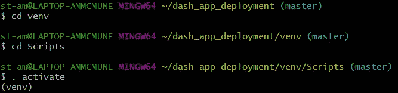
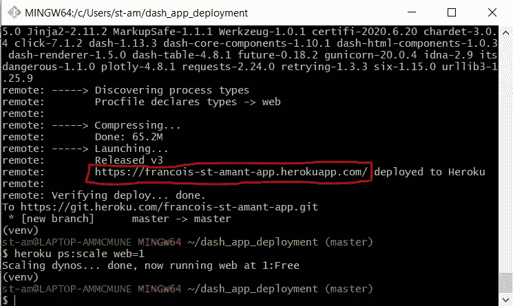
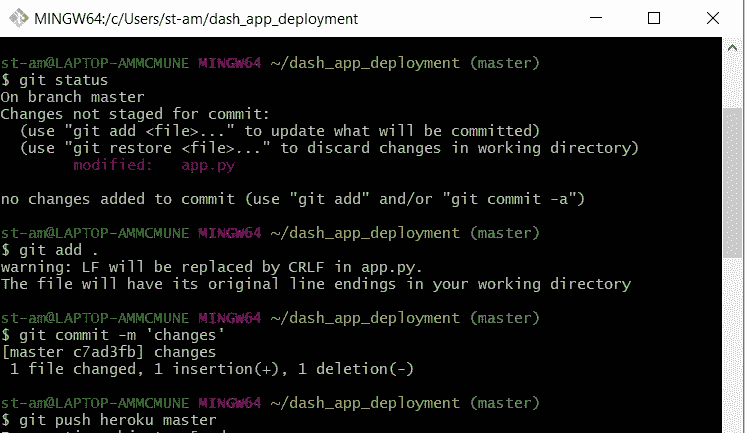

# 如何在 Heroku 上部署 Dash 应用程序

> 原文：<https://towardsdatascience.com/how-to-deploy-your-dash-app-with-heroku-a4ecd25a6205?source=collection_archive---------21----------------------->

## 与世界分享您的应用程序的分步说明


来源:[https://unsplash.com/photos/xrVDYZRGdw4](https://unsplash.com/photos/xrVDYZRGdw4)

你刚刚花了几周时间开发你的 Dash 应用。它现在看起来很棒，你想让全世界都看到它？本教程将向您展示如何使用 Heroku 做到这一点。

Heroku 是一个云应用平台，允许你运行你的应用程序，完全免费。

## 你需要什么

对于本教程，您需要安装一些东西:

*   **Heroku 账号**:[https://id.heroku.com/login](https://id.heroku.com/login)
*   **饭桶痛击**:[https://git-scm.com/download/win](https://git-scm.com/download/win)
*   **Virtualenv** ，可以安装 pip: `pip install virtualenv`。

你还应该下载 4 个文件，都在这里:[https://github.com/francoisstamant/dash_heroku_deployment](https://github.com/francoisstamant/dash_heroku_deployment)。

`App.py`是包含 Dash 应用程序的文件。如果你想更新/改进应用程序，你应该更改这个文件。

`requirements.txt`包含运行应用程序本身所需的 Python 依赖项。

## 循序渐进教程

好了，现在你已经得到了所有需要的东西，下面是一步一步的教程，它会让你部署你的 Dash 应用程序给其他人看！

1.  打开 Git。在那里，键入以下代码为项目创建一个文件夹，并将该文件夹作为当前目录。

```
$mkdir dash_app_deployment
$cd dash_app_deployment
```

2.用一个空的 Git 存储库和`$ git init`初始化文件夹。

3.用`$ virtualenv venv`创建一个名为 venv 的虚拟环境。

4.如果您使用 Git Bash 来激活环境，那么首先需要将 Scripts 文件夹作为当前目录。然后，就可以激活环境了。以下是命令:



5.然后，在虚拟环境中安装 Dash 和 Gunicorn:

```
$ pip install dash
$ pip install gunicorn
```

只是提醒一下，安装 dash 可能需要一段时间(对我来说大约需要 4 分钟)。

5.然后，确保将目录改回存储库，在本例中使用`$ cd ~/dash_app_deployment`。

6.现在，确保前面的 4 个文件确实被复制到当前位置，一旦它们被复制，通过逐个添加它们来初始化文件夹，就像这样:

```
$ git add app.py
$ git add Procfile
$ git add requirements.txt
$ git add .gitignore
```

7.现在你可以用你想要的名字创建 heroku 应用程序。该名称需要唯一。如果名字不可用，它会让你知道。然后，您可以将代码部署到 heroku。

```
$ heroku create francois-st-amant-app    
$ git add .                              
$ git commit -m 'Initial app template'
$ git push heroku master
```

8.最后，通过做`$ heroku ps:scale web=1`在一个 dyno 上运行应用程序。Dynos 是运行应用/代码的“容器”。假设你想保持所有东西都是免费的，你可以运行 2 个 dynos，每个都有 512MB 的内存。

在步骤 7 之后，您的应用程序的 URL 应该是可见的。基本上会是 [https:// **你的应用名** .herokuapp.com](https://my-dash-app.herokuapp.com) 。



这是我的应用:[https://francois-st-amant-app.herokuapp.com/](https://francois-st-amant-app.herokuapp.com/)

你会注意到，如果你现在登录 Heroku 账户，你会看到你的应用页面。在那里，您可以管理应用程序设置、添加合作者等。

## 更新应用程序

要更改应用程序，只需修改 app.py 文件。然后，以下 4 个命令将允许您将更改推送到 Heroku 应用程序。



我希望这有所帮助。如果您有任何问题，请随时联系我们。感谢阅读！