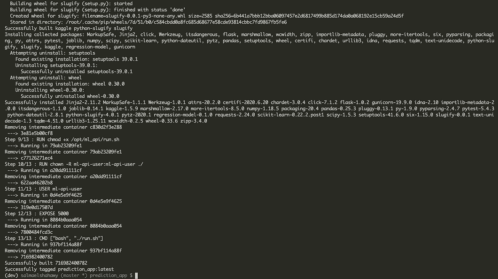

# 如何部署你的第一个机器学习模型——第二部分

> 原文：<https://towardsdatascience.com/how-to-deploy-your-first-machine-learning-models-part-2-9e1d0fcfb68?source=collection_archive---------45----------------------->

## 使用带有较少命令的 CircleCI 管道将机器学习 API 部署到 Heroku


照片由 [timJ](https://unsplash.com/@the_roaming_platypus?utm_source=unsplash&utm_medium=referral&utm_content=creditCopyText) 在 [Unsplash](https://unsplash.com/s/photos/ultimate?utm_source=unsplash&utm_medium=referral&utm_content=creditCopyText) 上拍摄

[在之前的文章](/exclusive-how-to-deploy-your-first-machine-learning-models-bf0a2109e522)中，我给出了根据行业最佳实践开发机器学习管道所需步骤的高度概述。在这一部分中，我将继续构建可访问的 REST-API 端点，并使用 CI/CD 管道将其部署到 Heroku 平台。

> 这篇文章中的大部分代码已经在第一部分解释过了。

Github 的[项目回购](https://github.com/salma71/prediction_app)如果你想跟进的话。

# 目录

1.  开发 REST-api 包
2.  定义所需的 circleci 配置
3.  部署到 Heroku 平台
4.  测试一个端点。

我们一个一个的分解一下，了解一下结构。

# 什么是 REST API？

REST 代表表述性状态转移(REST ),这意味着服务器将向客户机传送所请求的资源状态的表示。API 代表应用编程接口；在本教程中，我们不会构建一个完整的 REST-API；我们将开发一种预测服务。这是因为本教程的范围是为 ML 模型开发一个 REST-API。

为了理解 API 结构，[这里有一个很好的资源，可以从头开始学习 API](https://www.fullstackpython.com/api-creation.html) 和[的创建，本指南](https://programminghistorian.org/en/lessons/creating-apis-with-python-and-flask)和[在这里](https://realpython.com/flask-connexion-rest-api/)。

作为一个软件架构的思维模式，你会专注于做出设计决策，使其易于更改、可扩展性，当然还有更少的错误。这就是使用 MVC(模型、视图、控制器)架构的好处，它在应用程序中模块化不同的功能，提供三个组件的抽象。让我们简要总结一下这三个组成部分:

1.  视图:终端用户在与应用程序交互时的体验——界面。
2.  模型:数据驻留和更改的位置
3.  控制器:模型和视图组件之间的通信器。

## MVC 模式的好处是:

1.  模块化:每个部分都是独特的、封装的，并且可以在不破坏应用程序其余部分的情况下进行替换。
2.  语言不可知——可用于多种语言，不仅仅是 python。
3.  简单快速的开发过程。
4.  可伸缩和可扩展。

如果你想了解更多关于 MVC 模式和软件工程中的其他模式，[查看本指南](https://realpython.com/the-model-view-controller-mvc-paradigm-summarized-with-legos/)和[本指南](https://www.tutorialspoint.com/python_design_patterns/python_design_patterns_model_view_controller.htm)。

[第 1 部分](/exclusive-how-to-deploy-your-first-machine-learning-models-bf0a2109e522)是通过在 Gemfury 上以私人包的形式发布回归模型而完成的。在这一部分中，我们将使用这个包来处理数据并部署到 Heroku 平台。

我们首先在**包**主目录下创建一个名为 **ml_api** 的新包。包框架将包括以下内容:


包目录结构

**ml_package** 有三个主目录和其他 python 脚本文件。

**requirements.txt** :包含运行包的所有需求。

ml_api 包的 requirements.txt

这里没有什么新的，我只是包括了我希望使用的 flask 版本。此外，包括我在 gemfury 上发布的 **regression_model** 包——我提供了 **index-url** 变量，因为它是私有包，还没有公开。如果您希望在本地使用这个包，只需添加您的路径而不是我的路径，然后取消注释即可。我包含了用于模式验证的 marshmallow，以及用于部署的 gunicorn。

> 重要的是每个单独的包都有自己的需求文件。
> 
> 如果您克隆了 [Github repo](https://github.com/salma71/prediction_app) 并遵循以下步骤，请确保在 ml_api 包目录中安装所需的依赖项。

*   app.py :这个文件就像 flask 应用程序的工厂，它通过一系列命令来创建 flask 应用程序和蓝图。这个蓝图负责创建位于控制器中的端点。

*   **controller.py** :该文件作为浏览器后端代码和前端的接口。所以，这个控制器有三个端点，*健康*、*版本*、*v1/预测/回归*。保持 API 版本化是一个很好的实践。

controller.py

*   **run.py** :这将是启动应用程序的入口点。负责调用 **create_app()** 方法来启动应用程序。

run.py

在这个阶段，您可以尝试检查浏览器上的 API 端点。我们可以通过告诉 flask 启动 API 的入口点来做到这一点。在终端中，运行以下命令

```
FLASK_APP=run.py
```

然后从终端运行`python run.py`执行 **run.py** 文件；现在您可以看到服务器已经启动并运行在 **/health** 端点的端口 5000 上。


在端口 5000 成功运行服务器，端点健康

更好地了解 Flask 微框架的资源:

*   链接 Python 装饰初级读本:[https://realpython.com/primer-on-python-decorators/](https://realpython.com/primer-on-python-decorators/)
*   烧瓶入门:[http://flask.pocoo.org/docs/1.0/quickstart/](http://flask.pocoo.org/docs/1.0/quickstart/)
*   Flask Mega 教程:[https://blog . miguelgrinberg . com/post/the-flask-Mega-tutorial-part-I-hello-world](https://blog.miguelgrinberg.com/post/the-flask-mega-tutorial-part-i-hello-world)
*   烧瓶设计图:[http://flask.pocoo.org/docs/1.0/blueprints/](http://flask.pocoo.org/docs/1.0/blueprints/)
*   烧瓶源代码:[https://github.com/pallets/flask](https://github.com/pallets/flask)(可读性很强！)
*   Flask Web 开发:*用 Python 开发 Web 应用程序*

*   **config.py** :如果你是从 [part#1](/exclusive-how-to-deploy-your-first-machine-learning-models-bf0a2109e522) 跟进的话，跟***regression _ model***包的逻辑是一样的。我只添加了一些配置对象来设置特定的 flask 属性。除了微框架使用的其他几个不同的标志之外，还将 development 设置为 true。

配置. py

*   **版本**文件:将版本添加到`__init__.py`文件中，以便能够调用版本。

*   **validation.py** :这将负责验证模式；模式是数据的一种表示。在这里，它表示我们将接收到 API 的输入。关于模式优先 API 设计方法的争论越来越多。虽然有一种观点认为模式应该存在于模型包中，但是我们在这里使用它来定义 API 契约，这在这里是有意义的。

验证. py

我们实例化了模式，然后将输入数据转换成正确的格式。之后，加载输入数据并对模式进行检查，以确保没有错误。如果在验证检查过程中出现问题，它只会引发一个验证错误。

# 使用容器 Docker 映像进行部署

这些步骤如下:

1.  安装 docker。
2.  通过 Circleci 配置 Docker
3.  通过 Circleci 将 docker 映像部署到 Heroku。

这看起来有点吓人，但是一旦你有了这个想法，这将是一个简单的任务。所以，让我们开始吧！

## 什么是容器？

容器是软件的标准单元，它将代码及其所有依赖项打包，以便应用程序能够从一个计算环境快速可靠地运行到另一个计算环境。

## Docker 是什么？

Docker 是一个让创建、部署和运行容器变得简单的工具。Docker 容器是软件开发的标准化单元，包含软件应用程序运行所需的一切。这包括代码、运行时、系统工具、库、依赖等。

## 以上所有这些看起来都很好，很新奇，我为什么要使用它们呢？

容器自 2013 年发现以来变得如此受欢迎，因为它们提供了可再现性。这是一个巨大的好处，因为你确切地知道创建一个给定容器的步骤，容易跟踪错误。此外，它比虚拟机更快、更轻量级。易于与 CI/CD 管道一起使用。

# 1.安装 Docker

你可以导航到 [docker](https://www.docker.com/get-started) 并按照步骤将其下载到你的本地机器上。

# 2.Dockerfile 文件设置

因此，我们想要创建的是一个基于 linux 的容器映像，这就是为什么大多数命令都是 linux 命令。

*   Dockerfile:它拉下所需的 python 版本镜像，指定工作目录，安装需求，设置服务器端口。

Dockerfile 文件

*   **run.sh** :这个 shell 脚本负责运行 guicorn 来启动 flask 应用程序。

run.sh

*   **dockerignore:** 在构建映像后告诉 docker 忽略哪些文件。

。dockerignore

# 建立码头工人形象

现在我们已经准备好构建图像了；为此，如果您在 OSX/莱纳斯，我们需要在终端中运行以下命令:

```
prediction_app $ docker build --build-arg PIP_EXTRA_INDEX_URL=${PIP_EXTRA_INDEX_URL} -t YOUR_APP_NAME:latest .
```

> 重要提示:如果您希望首先在本地机器上构建映像作为测试，您可以使用`.env`文件在本地定义 PIP_EXTRA_INDEX_URL。否则，下面的命令将抛出一个错误，即它无法获取所需的包，回归模型。

```
In the above command, just replace ${PIP_EXTRA_INDEX_URL} with yours if you wish to build locally before doing so through the circleci pipeline. 
```



构建映像的快照

您可以通过在终端中使用`docker images`来检查图像是否已成功构建。它将列出在您的本地机器上构建的所有 docker 映像。

## 一些有用的 docker 命令:

1.  建造一个集装箱— [参考](https://docs.docker.com/engine/reference/commandline/build/)

```
docker build --build-arg PIP_EXTRA_INDEX_URL=${PIP_EXTRA_INDEX_URL} -t YOUR_APP_NAME:latest .
```

2.运行 docker 镜像— [参考](https://docs.docker.com/engine/reference/run/)

```
docker run --name YOUR_APP_NAME -d -p 8000:5000 --rm YOUR_APP_NAME:latest
```

3.查看正在运行的容器:

```
docker ps
```

4.查看容器日志(通过运行`docker ps`获得容器 ID)—[引用](https://docs.docker.com/engine/reference/commandline/container_logs/)

```
docker logs CONTAINER_ID — tail
```

# 和 docker 一起部署到 Heroku

Heroku 是一个基于云的平台即服务，允许开发人员完全在云中构建、运行和操作应用程序。

## 实现应用程序所需的步骤有:

1.  如果您没有帐户，请浏览 heroku 网站并创建帐户。
2.  导航至`New`菜单并创建新应用，填写应用名称并选择地区，然后点击创建应用。
3.  安装 [heroku-cli](https://devcenter.heroku.com/articles/heroku-cli) 工具，确保保留默认设置，以便 heroku 被添加到您的系统路径中。
4.  安装后重新启动命令行工具。
5.  通过`heroku login`使用 cli 工具登录 heroku 账户，输入你的邮箱和密码，你就可以登录 heroku 平台了。

# Heroku 构型

为了能够部署，您需要将 **PIP_EXTRA_INDEX_URL** 变量添加到 heroku 项目设置中的 config vars 列表中。

为此，导航至应用程序设置→显示配置变量→

关键字:PIP_EXTRA_INDEX_URL

值:your_token@pypi.fury.io/user_name/→添加。

现在是时候配置部署管道了，以便在每次提交到远程时自动执行部署。

## 为此，我们将从以下方面着手:

1.  根据 [heroku 指令](https://devcenter.heroku.com/articles/getting-started-with-python#define-a-procfile)创建过程文件。这个文件负责运行应用程序和访问错误日志文件。

```
web: gunicorn --pythonpath packages/ml_api --access-logfile - --error-logfile - run:application
```

2.确保**regression-model = = 1 . 0 . 0**和 **gunicorn==19.9.0** 都被导入到 **ml_api** 目录下的需求文件中。

3.创建负责捕获主分支上最新变更的提交 id 的 Makefile，然后创建一个 remote，最后将工作推入 heroku。

生成文件

4. **config.py** 将所需步骤添加到 circleci 配置文件——第 10 节和第 11 节。它基本上设置了部署所需的步骤，从重新安装需求到捕获新的依赖项，再到设置 heroku remote 并进行部署。最后，指定管道的工作流，在训练模型之后应该在哪里进行部署——逻辑步骤。

> 页（page 的缩写）n:在第 114 行，我设置了`docker_layer_caching: false`,因为在运行 circleci 时将它设置为 true 会出错。您需要升级您的飞机才能将此设置为真。

完整配置文件

现在，当您将更改提交到 github 时，应用程序应该会自动部署到 heroku 平台。

# 测试 API

你可以导航到 heroku dashboard 并从那里打开应用程序，或者使用像 [postman](https://chrome.google.com/webstore/detail/postman/fhbjgbiflinjbdggehcddcbncdddomop/related?hl=en) 这样的工具来确保 API 正在工作。


使用 postman 测试 API，为 GET 动词返回 200 状态代码


工作应用 JSON


circleci 仪表板工作流程

注意，我们只有两个端点，健康和版本。一旦确认一切正常，就可以添加额外的端点。这种方法非常有用，从简单开始会更容易捕捉错误和 bug，从而在调试会话中花费更少的时间。

# 总结和结论

在这一部分中，我们探讨了许多关于 API 设计的概念，以及如何自动化这个过程以节省时间。这个项目为您提供了一些构建产品级应用程序的最佳实践。此外，它还让您领略了 SLCD 的实际工作流程——机器学习模型的软件生命周期开发。有问题就问吧；我很乐意帮忙！快乐学习！