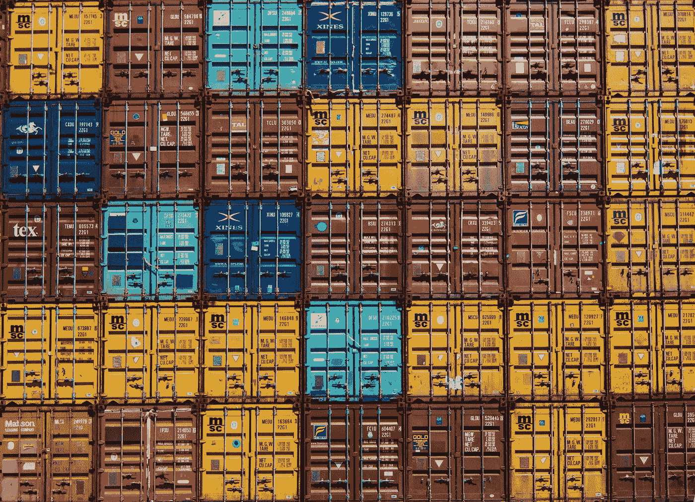

# 如何在 Kubernetes 上部署你的机器学习模型

> 原文：<https://towardsdatascience.com/how-to-deploy-your-machine-learning-models-on-kubernetes-36e260027ce1?source=collection_archive---------19----------------------->

## 使用 GCP 的 Kubernetes 和 Terraform 部署、扩展和管理您的机器学习服务。



Guillaume Bolduc 在 [Unsplash](https://unsplash.com?utm_source=medium&utm_medium=referral) 上拍摄的照片

[Kubernetes](https://kubernetes.io/) 是一个生产级的容器编排系统，它自动化了容器化应用的部署、扩展和管理。该项目是开源的，并通过谷歌运行的关键任务应用程序进行了测试。


机器学习解决方案通常被分解成许多步骤，这些步骤可能与操作系统和框架无关。此外，数据科学项目通常遵循数据流编程范式，其中程序被设计为一个有向图，数据从一个操作移动到下一个操作。这些方法和抽象很容易用 Kubernetes 实现，将基础设施管理的负担留给了系统。

在这个故事中，我们将在 Kubernetes 上部署一个简单的图像分类器 web 服务。我们将在谷歌云平台(GCP)上工作，并利用他们的安全和管理的 Kubernetes 服务产品:GKE。我们将首先使用 [Terraform](https://www.terraform.io/) 来供应和管理所需的基础设施，然后创建一个预训练 [PyTorch](https://pytorch.org/) 模型的简单部署。我们开始吧。

> [学习率](https://mailchi.mp/d2d2d4a109b5/learning-rate-newsletter)是为那些对 AI 和 MLOps 的世界感到好奇的人准备的时事通讯。你会在每周五收到我关于最新人工智能新闻和文章的更新和想法。在这里订阅！

# 基础设施作为代码

为了建造所需的基础设施，我们将使用 Terraform。Terraform 将基础设施视为代码，以供应和管理任何云、基础设施或服务。Terraform 将使我们很容易创造我们需要的资源，并在我们完成后进行清理，以避免积累成本。要安装 Terraform，请遵循您的[平台](https://learn.hashicorp.com/terraform/getting-started/install.html)的说明。

## 预赛

要处理 GCP，我们首先需要创建一个项目资源。项目资源是一个逻辑组织实体，它是创建、启用和使用其他 Google 云服务的基础。有必要开始对 GCP 和容易建设一个或使用任何新的 GCP 帐户初始化默认项目的工作。

要创建一个新的，从侧面板转到`IAM & Admin`并选择底部的`Manage Resources`。按下`Create Project`按钮，给出一个名字，你就可以开始了。

下一步是创建一个服务帐户，terraform 将使用它来创建我们需要的资源。服务帐户是一种特殊的帐户，由应用程序使用，而不是由个人使用。确保您正在使用您创建的项目，返回到`IAM & Admin`选项并选择`Service Accounts`。按下按钮`Create Service Account`创建一个新的，将其命名为`terraform`并按下 Create。下一步，授予服务帐户`Project Editor`的角色，然后按 continue。最后，通过按下`Create Key`按钮生成一个 JSON 密钥。该密钥将成为 Terraform 的身份验证方法。

## 地形结构

首先，我们需要配置 Terraform 使用 Google 存储桶来存储它需要的元数据。这是保持 Terraform 在自动化环境中运行的一个很好的方法。首先，让我们创建桶；创建一个名为`main.tf`的新文件:

然后，我们需要为它使用的变量创建一个新文件。创建该文件并将其命名为`variables.tf`:

这个文件告诉 Terraform 应该使用哪些变量，并提供了一些默认值。例如，我们第一个脚本中的`location`变量现在有了一个默认值`US`。还有其他变量，比如`project_id`，我们需要自己提供值。为此，我们创建一个新的`terraform.tfvars`文件:

确保用必要的信息填充`terraform.tfvars`文件，然后运行`terraform init`和`terraform apply`。最后，转到 GCP 控制台，验证铲斗是否在那里。

## 改造您的 GKE 集群

我们现在准备剥离我们的 Kubernetes 集群。我们将在一个新目录中创建三个单独的文件:一个用于定义 Terraform 后端，一个用于云提供商，一个用于实际的集群。当然，我们需要两个额外的变量文件。让我们设置后端。创建一个`terraform.tf`文件，并将以下内容复制到其中:

确保提供您之前创建的存储桶的名称。然后为云提供商创建一个`provider.tf`文件:

最后，创建一个`main.tf`文件来配置我们想要的 GKE 集群。对于这个例子，我们将把它保持在最低限度。

我们将改变的一件事是删除默认的节点池并创建一个我们自己的节点池，其中我们使用`n1-standard-1`可抢占的机器。最后，创建`variables.tf`和`terraform.tfvars`文件，提供必要的变量。

和`terraform.tfvars`文件:

将位置设置为区域格式将创建一个区域簇。谷歌为每个付费账户提供一个免费的区域集群，因此我们将利用这个折扣。像以前一样，运行`terraform init`和`terraform apply`，等待几分钟，您的集群将准备就绪。

# 图像分类器

对于这个例子，我们使用一个预先训练的 PyTorch 模型和 [Flask](https://flask.palletsprojects.com/en/1.1.x/) ，来创建一个简单的机器学习 web 服务。接下来，我们将创建一个简单的 Kubernetes 部署来部署、管理和扩展 web 服务。

## PyTorch +烧瓶

为了设计一个简单的图像分类器服务，我们使用了一个用于图像分类的 CNN 模型 [AlexNet](https://papers.nips.cc/paper/4824-imagenet-classification-with-deep-convolutional-neural-networks.pdf) 的 PyTorch 实现。我们使用烧瓶微型框架来提供它。

首先，我们定义一个`Predict` Flask 资源，它初始化模型并接受一个`HTTP POST`请求。我们使用`any-host`标识符(`0.0.0.0`)将它与烧瓶一起提供。

> Flask 的内置服务器不适合生产，因为它的伸缩性不好。对于我们的目的是好的，但是如果你想知道如何正确地部署 Flask 应用程序，请看这里的。

## 集装箱化

要在 Kubernetes 上部署它，我们首先需要将服务容器化。为此，我们定义如下`Dockerfile`:

要从这个`Dockerfile`构建一个映像，在同一个文件夹中创建一个`requirements.txt`文件，包含以下内容:

```
flask
flask-restful
```

在同一个文件夹中下载包含 Imagenet 标签的 JSON 文件[这里](https://github.com/raghakot/keras-vis/blob/master/resources/imagenet_class_index.json)。我们现在准备建立我们的 docker 形象；运行以下命令:

```
docker build -t <your-dockerhub-username>/image-classifier:latest .
```

最后，您需要将映像推送到容器注册中心。例如，要在 docker hub 上推送它，创建一个帐户，配置 docker 并运行以下命令:

```
docker login --username usernamedocker push <your-dockerhub-username>/image-classifier:latest
```

为了简单起见，你可以用我为你准备的图像。可以从 [docker hub](https://hub.docker.com/repository/docker/dpoulopoulos/moirai-image-classifier) 拉出来。

## 部署

最后一步是部署。为此，我们使用一个简单的`YAML`配置文件。但是首先，我们需要安装`kubectl`并获得连接到我们的集群的凭证。

要安装`kubectl`，请遵循[平台](https://kubernetes.io/docs/tasks/tools/install-kubectl/)的说明。接下来，[安装](https://cloud.google.com/sdk/install) `gcloud`，GCP 的 CLI 工具。要获取 GKE 群集的凭据，请运行以下命令:

```
cloud container clusters get-credentials <the-name-of-your-cluster> --zone <the-zone-that-it-is-in>
```

例如:

```
cloud container clusters get-credentials my-gke-cluster --zone us-central1-a
```

该命令将创建一个配置文件，并指示`kubectl`如何连接您的 GKE 集群。最后，定义图像分类器`YAML`部署文件。

这个配置分为三部分:首先，我们定义一个名称空间，它为我们的资源名称提供了一个范围。然后，我们定义实际的部署，其中我们只使用服务的一个副本。你可以根据自己的需要调整这个数字。最后，我们用一个`LoadBalancer`来公开我们的 web 服务。这将使我们的服务可以从互联网上访问。通过运行以下命令创建部署:

```
kubectl apply -f image-classifier.yaml
```

您现在已经准备好测试您的图像分类器 web 服务了。对于这个例子，我们使用`curl`。

```
curl -X POST -d '{"url": "[https://i.imgur.com/jD2hDMc.jpg](https://l.messenger.com/l.php?u=https%3A%2F%2Fi.imgur.com%2FjD2hDMc.jpg&h=AT3BE3ChNWH0HYFPvWjWK_Aqtq08m0_DGLZpxfwEu_219IP625hqKCAjWzfap2ucsTFqtwk224-0Djl3nFCbpbxixNC4XgclqUkdsR9kOzTEkVVjazQJx395DGlzq3offB8i10LHlveiqg)"}' -H 'Content-Type: application/json' [http://<your-cluster's-ip>/predict](http://35.239.113.2/predict)
```

这个命令将使用一个小猫图片查询您的服务。你得到的是与某种自信相关的预测。您现在已经在 Kubernetes 上成功部署了一个机器学习模型！

# 清理

为了清理我们自己，我们将按相反的顺序进行:

1.  删除命名空间、部署和负载平衡器:

```
kubectl delete -f image-classifier.yaml
```

2.销毁集群:

```
terraform destroy
```

> 从您在“改造您的 GKE 集群”步骤中创建的文件夹中运行此命令。

3.删除 Google 存储桶:

```
terraform destroy
```

> 从您在“地形配置”步骤中创建的文件夹中运行此命令。

# 结论

在这个故事中，我们看到了如何在 GKE 用地形创造资源。具体来说，我们创建了一个 GKE 集群，以利用 Google 云平台提供的托管 Kubernetes 解决方案。然后，我们创建了一个简单的图像分类 web 服务，用它构建了一个 docker 图像，并将其部署在 Kubernetes 上。最后，我们自己清理，销毁我们不再需要的资源，以避免额外的成本。

Kubernetes 是一个为生产部署机器学习模型的伟大平台。在后面的文章中，我们将探索 KubeflowKubernetes 的机器学习工具包。

***我叫 Dimitris Poulopoulos，是希腊比雷埃夫斯大学***[***BigDataStack***](https://bigdatastack.eu/)***和博士(c)的机器学习研究员。我曾为欧洲委员会、欧盟统计局、国际货币基金组织、欧洲中央银行、经合组织和宜家等主要客户设计和实施人工智能和软件解决方案。如果你有兴趣阅读更多关于机器学习、深度学习和数据科学的帖子，请关注我关于*** [***中***](https://medium.com/@dpoulopoulos) ***、***[***LinkedIn***](https://www.linkedin.com/in/dpoulopoulos/)***或***[***@ james2pl***](https://twitter.com/james2pl)***上***