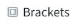

# 如何将您的 ML 模型部署到浏览器中

> 原文：<https://towardsdatascience.com/how-to-deploy-your-ml-models-into-the-browser-f52ea62bfa60?source=collection_archive---------36----------------------->

## 来自 TensorFlow 的 jS 哥哥的嗨

## 以及如何有效地做到这一点。

当我刚开始学习 AI 和 ML 时，我经常会有这样的问题:我为什么要学习这个？在找到工作之前，我能有所作为吗？


这些问题出现是因为*我知道如何训练模型*，但不知道 ***如何部署*** 。因此，如果你正处于这个阶段，并且想学习如何使用模型，那么你来对地方了！

## 我是谁

我是 Dweep，一个充满热情的高中生，从各种课程和项目中获得了许多深度学习知识。

## 认识一下 TensorFlow 的哥哥 TensorFlow.jS

我们都知道 TensorFlow，以及如何在 TensorFlow 中制作模型(如果你不知道，那么我会推荐你阅读[这篇博客](https://lightspeedac.blogspot.com/2020/03/lightspeed-intro-to-deep-learning.html)，然后回到这里。)然而，它的 *javaScript 兄弟*却是相当的鲜为人知。但这并不意味着 TensorFlow.jS(也称为 tfjs)就没那么有用。大部分 TensorFlow 模型可以直接转向 tfjs 模型，tfjs 本身也有能力训练模型！

## 关于你下一步要做的事情

我深信*代码是学习代码*的最佳方式。因此，在本文的最后，您将在浏览器上实现一个 tfjs 系统。顺便说一下，我从 Coursera 上的数据和部署专业化的第一门课程中学到了大部分内容，我在这里[回顾了一下](https://lightspeedac.blogspot.com/2020/04/a-honest-review-of-data-and-deployment.html)。因为 tfjs 最常见的用例是迁移学习，所以您将实现它。

为了使*尽可能与 tensor flow*相关，我将首先解释 TensorFlow Keras 库和 tfjs 层库之间的关系。

# 代码风格的显著差异

就像 Keras 构建在 TensorFlow 库之上以提供高级功能一样，Layers 库也为 tfjs 做了同样的事情。

## 忘记下划线

所有的 jS 代码都在*lower case*中，这意味着所有的一切都应该有小写的第一个单词的第一个字母(像 *l* )，以及大写的第一个单词(像 *C* )。所有的函数和语法都遵循这个规则。因此，我们应该使用 *inputShape* 而不是 *input_shape* 。此外，所有语法都以分号结尾。

## 数据到张量

由于 javaScript 没有 NumPy，所有数据都需要转化为张量，供 tfjs 进行推理或训练模型。

## 使用{ }进行配置

另一个显著的区别是，与 Python 不同，所有的函数输入都在花括号内配置。一个例外是当你输入数据时，比如训练集。

还有一些差异，但我认为这些就足够了。

## 基本语法

下面列出了最常用的函数。要了解其中任何一个函数的更多信息，只需单击该函数的名称。我建议你对每一个都这样做，以便更好地理解。

*   [***TF . tensor(****data，shape****)***](https://js.tensorflow.org/api/latest/#tensor)*创建一个张量，tfjs 稍后可以使用它进行训练或推理，并将其保存在分配给该函数的变量中*
*   *[***TF . sequential()***](https://js.tensorflow.org/api/latest/#sequential)*创建由一系列层组成的*模型*。该模型保存到一个 *const* 或常量变量中。**
*   **[***TF . layers . dense({****单位:_ _ _ _，激活:' _ _ _ _ _ _ '****})***](https://js.tensorflow.org/api/latest/#layers.dense)*创建一个 tfjs 图层，可以使用 ***model.add()*** 添加到模型中。注意，像 TensorFlow 一样，第一层有一个可选的附加输入，称为 *inputShape* ，它将进入模型第一层的配置内部。***
*   **[***model . add()***](https://js.tensorflow.org/api/latest/#tf.Sequential.add)*获取一个 *tf.layers* 图层，并将其添加到模型中现有的图层列表中。也可以使用 *tf.layers.flatten* 或 *tf.layers.conv2d* 。***
*   **[***model . compile({****优化器:' ___ '，损耗:' _ _ _ '****})***](https://js.tensorflow.org/api/latest/#tf.LayersModel.compile)*编译模型。优化器在 *tf.train* ，比如 *tf.train.adam* 和 *tf.train.rmsprop* 。***
*   **[***model . fit(****xs，ys，****{****epochs:_ _ _，回调:****{****_ _ _ _ _ _****})***](https://js.tensorflow.org/api/latest/#tf.Sequential.fit)*拟合模型上 *xs，ys* 的数据集。***
*   **[***. predict(****【xs】****)***](https://js.tensorflow.org/api/latest/#tf.Sequential.predict)*使用训练好的模型来预测标签。***

***语法已经过时了，我们现在可以开始编程了。***

****请注意，该程序是数据&部署专业化中 tfjs 课程中基于浏览器的模型的第 4 周示例的定制。****

# **人脸识别**

**我们用 tfjs 中的迁移学习做一个人脸识别模型。该模型首先将三个人的图像作为输入，并将输出模型从网络摄像头中看到的人。如果你只是想看看演示，那么我在下面的一个网站上有。看看吧！**

 **[## 人脸识别 TFjS 演示

### 展示浏览器训练和推理能力的演示

djthegr8.github.io](https://djthegr8.github.io/)** 

## **安装**

****

*   **从[这里](https://chrome.google.com/webstore/detail/web-server-for-chrome/ofhbbkphhbklhfoeikjpcbhemlocgigb?hl=en)下载 Chrome 的 200 OK *网络服务器。它需要消除多个 HTTP 请求，并确保我们得到良好的上传。***

****

*   **可选地，如果你想编辑我的代码来玩 tfjs(我真的推荐这么做)，你可以下载一个编辑器，比如[括号](http://brackets.io/)，让你的工作更容易。**
*   **最后，所有的代码都可以在[这个 GitHub 库](https://github.com/djthegr8/Face-recognition-tfjs)中找到。请下载它，并将 Chrome Web 服务器的目标设置到该文件夹中。要运行，请打开服务器应用程序中的链接，然后打开 facerecgn.html 文件。**

## **实际模型**

**让我们首先看一下 TensorFlow.jS 库的导入。这一行位于 HTML 页面的 head 部分。**

```
**<script src="[https://cdn.jsdelivr.net/npm/@tensorflow/tfjs@latest](https://cdn.jsdelivr.net/npm/@tensorflow/tfjs@latest)"> </script>**
```

**现在，我们将跳过 HTML 代码，在 index.jS 页面中查看 Tensorflow.jS 代码。**

**下面是加载 MobileNet 的代码，MobileNet 是一个经过预先训练的 tfjs 网络，它本身可以将图像分类到大约 1000 个类别。该函数通过声明一个新的模型来移除它的推理层，该模型采用倒数第二层的输出。**

**下面是代码中最重要的函数。我们正在展平 MobileNet 编码的三维输出(在 *loadMobilenet()* 函数中声明的模型的输出)，然后通过一个小的 NN。损失是分类交叉熵，优化器是 adam。**

**我将展示的另一个函数是处理最终导致数据集创建的按钮按压的函数。这是不言自明的。**

**最后一个主要功能是 *predict()* ，它根据模型预测人。该函数查找预测概率并输出最高的概率。**

**完成后，rps-dataset.jS 就剩下了……与其描述代码，我将快速描述它的功能。它所做的只是创建一个可追加的数据集，并具有(一次性)标签。当然，代码在存储库中。**

**完成所有这些函数后，您可以查看最终的 index.jS 代码。**

## **谢谢并评论**

**非常感谢你阅读这篇文章，如果你发现任何错误，请评论！**

## **免费的任何疑问，项目帮助或任何合作机会！**

**给我发邮件到[我的 Gmail](mailto:dweepjoshipuracar@gmail.com) 获取任何关于 TF、Keras、TFjS 或 Python 的帮助或合作！或者查看我的 [Linkedin](https://linkedin.com/in/dweep-joshipura)**