# 如何设计一款流行的视频游戏:使用 NLP 和随机森林进行评分预测

> 原文：<https://towardsdatascience.com/how-to-design-a-popular-video-game-rating-prediction-using-nlp-and-random-forest-d52a408bbadc?source=collection_archive---------67----------------------->

诚然，电子游戏行业现在是热点，其收入是电影的 4 倍，音乐的 7 倍。尤其是现在面对新冠肺炎，越来越多的人在虚拟的电子游戏世界中寻求社交联系和自我娱乐。毫无疑问，视频游戏行业前景广阔。

然而，在电子游戏行业成功容易吗？答案是否定的！尽管前景看好，但这仍是一项风险很大的业务。首先，有超过 100 万的视频游戏在行业内引发了激烈的竞争。第二，利润空间超级紧张。例如，playstation4 的利润率接近 5%。你猜怎么着，大部分成本来自研发。因此，在游戏设计上的准确投资可以产生巨大的差异。**本文旨在使用随机森林和 NLP 技术来寻找能够极大地影响游戏评级的关键游戏设计特征。**

作者来源

# 资料组

现有的亚马逊数据集包含元数据(包括视频游戏的基本产品信息)和评论数据(包括视频游戏的评论和评级)。这些表通过唯一的产品 ID (asin)链接在一起。下面是数据集的快照。虽然列出了许多特性，但没有一个与游戏设计特性直接相关。我们可能在哪里产生游戏设计特征？评论！接下来，我们将深入评论以提取特征。

元数据快照，按作者排序

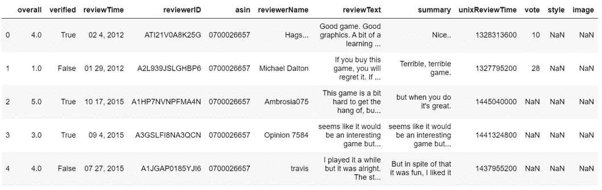

作者来源的综述数据快照

# 特征工程

在这个项目中，我们将使用 [IBM 自然语言理解](https://cloud.ibm.com/apidocs/natural-language-understanding?code=python#sentiment)包来实现特征工程。这个包中的一个嵌入功能是“keywords ”,它可以返回整个文本的关键字。此外，可以返回情感信息或情绪信息。我们从提取整个评论数据集中的关键词(合并所有评论)开始。然而，返回的不是一个词，而是一个阶段。正如在文本挖掘中经常出现的情况一样，关键字也因为不同形式的单词而变得非常混乱。

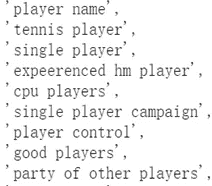

关键词示例，按作者来源

因此，我们应用了 PorterStemmer、word_tokenize、stopwords 来精简我们的关键字列表。最后，我们得到了如下所示的关键字列表。提到最多的关键词是“character”，是“character”的缩写。您可能已经注意到，如果我们将“character”输入到情感提取函数中，该函数无法检测到文本中相应的形式。下一步，我们检查了最常用的关键字形式，并给它们添加了内容。例如，打架可以是打架、打架和打架。

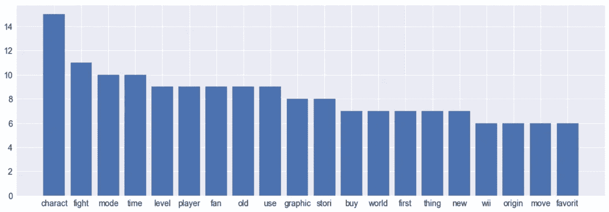

关键字列表的快照 1，按作者排序的来源

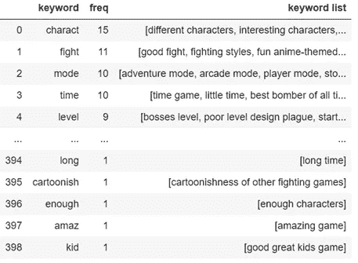

关键字列表快照 2，按作者排序的来源

现在我们已经有了最终的关键字列表。将所有功能放在一个篮子里可能会很混乱，也不太直观。让我们将它们归类到不同的篮子中，以进一步研究我们的关键字。关键词可以进一步分为 4 个篮子——游戏类型、系列、游戏元素和特征。

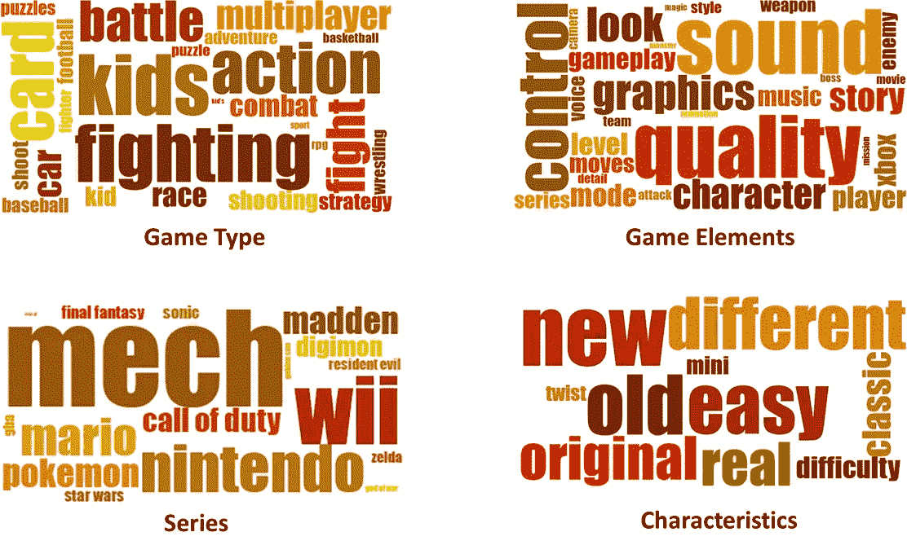

不同关键字组的 Wordcloud，按作者排序

最后，我们提取了每个产品在这些关键词上的情感得分。最终的特征矩阵是稀疏的，具有许多缺失值。考虑到许多关键词指向同一个游戏设计特征，如故事、情节和故事线，我们通过平均它们的情感分数来聚合相似的特征。

# 描述性分析

*   **评分**:平均评分约为 4.15，排名前 25%的产品评分超过 4.46。

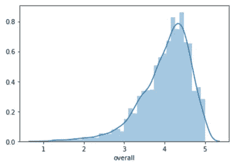

评级分布，来源按作者

*   **游戏类型**:就平均收视率和波动性而言，rpg(角色扮演游戏)在所有游戏类型中脱颖而出，其次是冒险游戏和多人游戏。体育游戏和动作游戏在收视率上表现不佳。

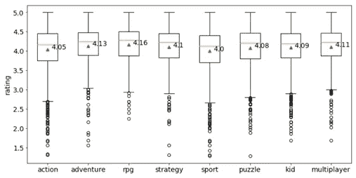

不同游戏类型的分级，由作者提供

*   **游戏系列**:数码宝贝、口袋妖怪、金太阳平均评分最高，在 4.25 以上，而马登平均评分仅 3.88。

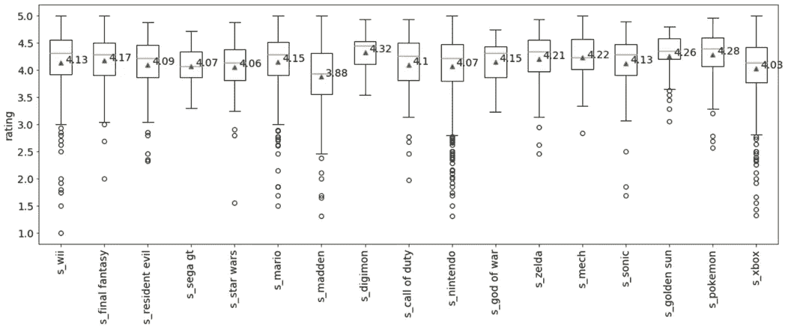

不同游戏系列的评分，由作者提供

*   **游戏元素&特点**:标尺是情绪得分。不同元素&特征之间的平均情感分数是一条乏味的直线，但情感分数的标准差确实形成了一些见解。在图形、新、易等方面，情感得分差异很大。与怪物相比。

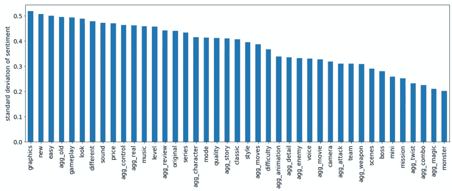

游戏元素情感得分的标准差，来源于作者

# 机器学习和解释

现在我们为机器学习做好了准备。根据描述性分析中的发现，我们将评分降低到 4.4 分，形成一个高绩效组(30%)和一个低绩效组。功能是我们从评论中提取的，价格也是。游戏类型和游戏系列被编码为二进制变量，而其他的是连续的。

从个人经验来看，逻辑回归和随机森林在解释和预测准确性方面确实很突出。我们应用了这两种技术，并最终选择随机森林作为主要的解释器模型，因为它的性能稍好一些。采用的性能矩阵是 AUC 和准确性。

*   **重采样**:由于我们将产品分成不同组的方式，数据集有点倾斜。我们尝试了欠采样、过采样和 smote。为了更好的解释和准确性，我们最终利用欠采样。
*   **特征选择**:尝试了特征重要性技术和递归特征消除技术，但改进不大。
*   **超参数调整**:使用网格搜索调整 n_estimators、max_depth 和 min_sample_split。

最后，我们能够在验证集上实现 70%的准确性和 72%的 AUC。为了解释，我们使用排列重要性分数，因为我们有一些二元变量。我们也删除了游戏系列在解说剧情中的特征，因为它们对游戏设计贡献很少。

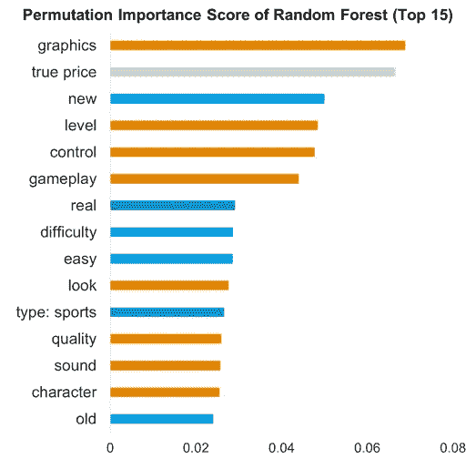

排列重要性分数，来源于作者

*   **游戏类型(深蓝)** : **体育游戏对区分高性能产品有很大影响。**结合描述性分析中体育游戏对收视率产生负面影响的发现，我们通过进行逻辑回归进一步支持这一观点，逻辑回归也表明体育游戏**对收视率产生显著的负面影响**。
*   **游戏元素(橙色)** : **图形、关卡、控制对评分贡献最大。**在描述性分析中，我们还发现图形在行业内具有最大的可变性。下面是评论中与“图形”或“级别”一起出现的词，它们可以为游戏设计提供很好的见解。产品设计的其他焦点可以是外观、声音和个性。

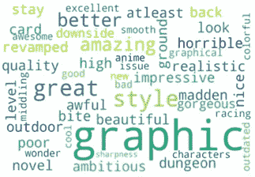

评论中的“图形”,来源于作者

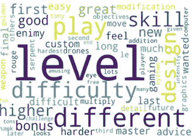

评论中的“级别”,来源于作者

*   **特征(浅蓝色)** : **创新当然应该受到鼓励**，因为“新”在重要性分数中排名第三。最常谈论的创新是“新功能”、“新武器”和“新风格”。

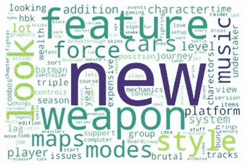

评论中的“新”，来源按作者

对于进一步的调查，可以做更多的工作。例如:

*   对于不同类型的电子游戏，不同功能的重要性分数会有很大差异吗？
*   图形是成本结构的一大部分。哪种类型/风格的图形对市场更有吸引力？
*   哪些创新会带来更高的回报？
*   难度等级设计如何选择合适的方法？

代码来源:[https://github . com/JinPu-DuDu du/How-to-Design-a-Popular-Video-Game-Rating-Prediction-Using-NLP-and-Random-Forest](https://github.com/JinPu-dududu/How-to-Design-a-Popular-Video-Game-Rating-Prediction-Using-NLP-and-Random-Forest)