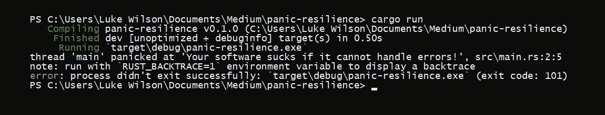

# 如何设计 Rust 中的恐慌恢复能力

> 原文：<https://towardsdatascience.com/how-to-design-for-panic-resilience-in-rust-55d5fd2478b9?source=collection_archive---------26----------------------->

## 错误处理

## 不要慌！学会构建对错误有弹性的高质量软件。


照片:[安德烈斯·达利蒙提](https://unsplash.com/@dallimonti) /Unsplash



试着想象使用一些软件和 WHAM，一堆文本，以及大脑无法忽略的视觉垃圾。或者更好的是，当你的用户同时按下两个按钮，飞机关闭时，他们正在驾驶一架商业客机。我们需要的是明确的反馈，并防止暂停执行。在这个故事中，我们讨论 Rust 应用程序中的恐慌恢复方法，以使高质量的软件用户可以依赖。

> 如果你认为你的软件是一辆时速 60 英里的汽车，恐慌就像撞上了一堵砖墙。

1990 年，一次软件更新导致美国电话电报公司全国 114 个电子交换系统全部瘫痪。当一座塔发生故障时，它会向邻近的塔发送一条信息，告知它正在停止交通。其他塔收到的信息导致它们进入类似的故障状态，通过整个美国电话电报公司长途网络使信息永久存在。

糟糕的逻辑是大多数有害软件错误的原因。C #中的错误可能更谨慎，因为被忽略的错误不会产生警告。Rust 本可以防止过去发生的一些讨厌的软件错误，但前提是软件开发人员利用了 Rust 语言提供的重要错误处理逻辑。

在 C 语言中，数值是表达“发生了错误”的惯用方法。函数调用返回一个表示错误代码的整数。如果代码为零，则没有错误发生。否则，可以将代码与值进行比较，以确定发生了什么故障。

C 中错误处理方法的问题是，忽略函数调用的返回值既不是错误，也不是警告。失败可能会被忽视和处理。

> 错误处理的首要目标是防止崩溃。

一些在 C 之后设计的新语言使用异常进行错误处理，这是对错误代码的高级抽象。调用一个可能失败并导致异常的函数需要一个`try`和`catch` 块来执行可能导致异常的代码，并处理异常发出的错误信号。异常仍然不总是被显式处理，因此一些懒惰的程序员处理异常的方式与`.unwrap()`在 Rust 中处理错误的方式相同——打印错误并失败。

在 Rust 中，错误显而易见。根据习语的说法，铁锈中的错误有`Result`和`Option`三种类型。因为错误是显而易见的，程序员厌倦了处理它们，最终更喜欢`.unwrap()`每一个错误，这在恐慌恢复的名义下毫无用处。Unwrap 鼓励“最好的希望”,盲目地钻研可能存在的任何数据，如果在任何情况下都失败了，那就是严重的崩溃——恐慌。

错误处理的首要目标是防止崩溃。

让我们看看 Rust 中处理错误的三个关键部分:

1.  什么时候恐慌，
2.  处理错误，
3.  和附加部分:库中的错误处理。

# 何时恐慌

带着错误代码退出总比惊慌失措好。在最好的情况下，你写的任何软件都不会死机。死机是一种可控制的崩溃，为了构建可靠的软件，必须避免死机。

崩溃从来都不是“恰当”的行为，但这总比让你的系统造成物理损坏要好。如果在任何时候，人们认为该软件可能会导致一些致命的、昂贵的或破坏性的事情发生，那么最好是将其关闭。

如果你认为你的软件是一辆时速 60 英里的汽车，恐慌就像撞上了一堵砖墙。

死机会解开调用堆栈，跳出每个函数调用并从程序执行中返回，在此过程中破坏对象。这不被认为是安全或干净的关闭。避免恐慌。

结束程序执行的最好方法是让它运行到最后一个大括号。以某种方式，为那种行为编程。它允许所有物体安全地自我毁灭。参见[掉落特性](https://doc.rust-lang.org/std/ops/trait.Drop.html)。

# 处理错误

> 恐慌是最后的手段，而不是一个很好的内置工具，可以很容易地通过一个消息退出！

`*Result*`、`*Option*`、`std::io::*Result*`等其他一些类型可以代表一次手术的成功。在惯用的 Rust 中，如果某个东西可能失败，它会返回一个`*Result*` ，该值编码了两个可能的值:要么是成功值(`**Ok**`)，要么是错误值(`Err`)。`*Result*<**T**, **E**>`其中`T`是*成功*值类型，`E`是*错误*值类型。

我们将我们的`*Result*`与成功和错误值相匹配。如果这是一个成功，那么我们只是把我们的价值和进展，在我们的软件。但是，如果该值产生错误，我们必须基于以下问题制定有效的备份计划:

1.  我们能再试一次吗？
2.  数据是绝对强制进行的，还是可以生成、调整或假设的？

如果需要数据*来继续，那么我们需要向调用者报告错误。除了 main 以外，我们绝对不能对任何功能感到恐慌。否则，你会得到自认为是上帝的东西的函数。适当的错误处理会尽其所能，当有疑问时，让调用者来处理问题。*

下面的例子适用于第一个问题:*我们可以再试一次吗？*

```
**fn** open_config() -> *Result*<std::fs::File, std::io::Error> {
    **use** std::fs::File;
    **match** File::**open**("config.toml") {
        **Ok**(f) => **Ok**(f),
        // If not found, search in second location:
        **Err**(e) => **match** File::**open**("data/config.toml") {
            **Ok**(f) => **Ok**(f),
            // Otherwise, bubble first error up to caller
            _ => **Err**(e),
        }
    }
}**fn** main() {
    **let mut** result = **open_config**();
    **if** result.**is_err**() { // If failed the first time
        // Try again in about 5 seconds ...
        std::thread::**sleep**(std::time::Duration::**from_secs**(5));
        // Reattempt
        result = **open_config**();
    } **match** result {
        // Proceed as usual ...
        **Ok**(cfg) => *println!*(**"Opened the config file"**),
        // Print the cause to stderr, and DONT PANIC
        **Err**(e) => *{
            eprintln!*(**"File could not be opened: {:?}"**, e.**kind**());
            std::process::**exit**(1); // Exit with code 1 (fail)
    }
}
```

这段代码试图在“config.toml”中找到一个配置文件。如果失败，它会尝试在特定的子文件夹中查找相同的配置文件。只有当第二次尝试失败时，它才会将错误冒泡到调用者。调用者是 main，它愿意在暂停 5 秒钟后第一次重试失败。请注意，即使 main 也不会死机，因为虽然这是一个致命的错误，但是可以恢复正常的退出进程。带着错误代码退出总比惊慌失措好。

但是和恐慌一样，`std::process:exit`可以防止物品的毁坏，所以只能在没有需要掉落的物品时使用。因此，恐慌是最后的手段，而不是一个漂亮的内置功能，可以很容易地通过一个消息退出！

最后一个例子适用于第二个问题:*数据是否绝对必须继续？*

```
/// Get the username from the config if it is present.
**fn** read_username_from_config() -> *Option*<*String*> {
    // Implementation hidden
}/// Get the username if present. Otherwise returns the
/// default username "unnamed".
**fn** get_username() -> *String* {
    **read_username_from_config**()
        .**unwrap_or**(*String*::**from**(**"unnamed"**))
}**fn** main() {
    **let** username = **get_username**();
    *println!*(**"Username is: {}"**, username);
}
```

在上面的例子中，main 只请求一个用户名。`get_username`返回`String`，这意味着它没有失败的能力。它试图使用`read_username_from_config`从配置文件中读取一个用户名，但是如果无法检索到，它将使用默认字符串“未命名”。

权衡你可能得不到的数据的价值是很重要的。考虑是否有可能返回到输入循环，或者带着警告继续。关注你的软件的可用性，以及它如何克服缺乏数据的问题。⁴

# 库中的错误处理

> 将错误值表示为代码时，可以使用枚举。

```
#[derive(Debug, PartialEq)] // Use derives
**enum** *SafeDivideError* { // Define a custom error type
  **DivideByZero**,
}**fn** safe_divide(dividend: **i32**, divisor: **i32**) -> *Result*<**i32**, *SafeDivideError*> {
  **if** divisor == 0 { // If the dividend is zero …
    **Err**(*SafeDivideError*::***Divi*deByZero**) // Return the error value
  } **else** { // Otherwise …
    **Ok**(dividend / divisor) // Return the success value
  }
}*assert_eq!*(safe_divide(4, 2), **Ok**(4/2));
*assert_eq!*(safe_divide(4, 0), **Err**(*SafeDivideError*::**DivideByZero**));
```

在上面的例子中，我们使用自定义枚举作为错误返回类型。这很容易看出我们产生错误的原因，但是在这种情况下，被零除是我们需要报告错误的唯一原因。因此，更好的型号可能是`*Option*<**i32**>`。

创建自定义错误类型很有价值。当您使用空枚举作为错误类型时，数据足迹可能很小。这很重要，因为不管使用`*Result*<**i32**, *String*>`的成功或错误值，例如，它消耗的内存和它的最大成员一样多。在这种情况下，是一个字符串，比堆栈上的一个`**i32**` 大 16 个字节。相反，`SafeDivideError`枚举消耗“零”字节的内存。

```
*println!*(**"String:          {}B"**, std::mem::size_of::<*String*>());
*println!*(**"SafeDivideError: {}B"**, std::mem::size_of::<*SafeDivideError*>());// String:          24B
// SafeDivideError: 0B
```

当使用两个或更多值时，它就变成了一个`u8`的大小，在获得另一个字节之前，可以表示多达 256 个不同的错误值。将错误值表示为代码时，可以使用枚举。

利用文档注释来解释函数为什么会返回错误，尤其是不同的错误值意味着什么，这一点很重要。如果一个函数返回`*Result*<**i32**, *String*>`，那么使用你的库的人肯定会想知道函数失败会返回什么不同的字符串。

旧的规则仍然适用于创建库:永远不要惊慌，只允许函数的调用者在您不能处理错误时处理错误——必要时冒泡错误。设计一个好的错误恢复库需要强调健壮的错误类型和它们的文档。从`[std::io::Error](https://doc.rust-lang.org/std/io/struct.Error.html)`中汲取一些天才。

Rust 使任何人都能够构建高度健壮、可靠和高效的软件。所以不要慌！使用正确的方法编写可靠的 Rust 软件。

## 脚注

1.  来源:[http://www.phworld.org/history/attcrash.htm](http://www.phworld.org/history/attcrash.htm)
2.  这里有一个很好的列表:https://en.wikipedia.org/wiki/List_of_software_bugs
3.  错误冒泡是指代码向上游传递错误，因为它肯定不会处理它。又名错误传播。
4.  但是不要执行[静默数据操作。](https://en.wikibooks.org/wiki/JavaScript/Automatic_semicolon_insertion)