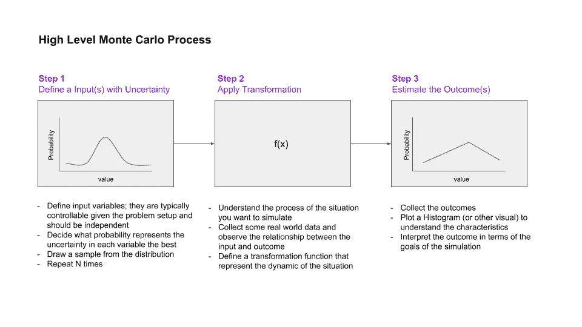
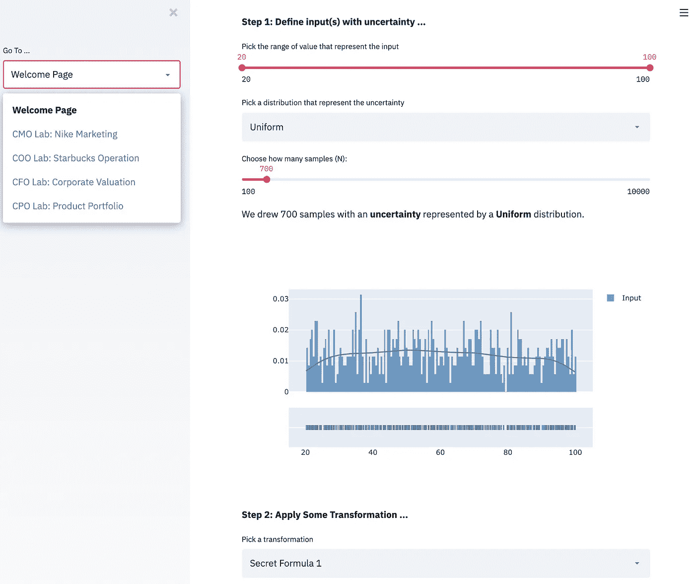
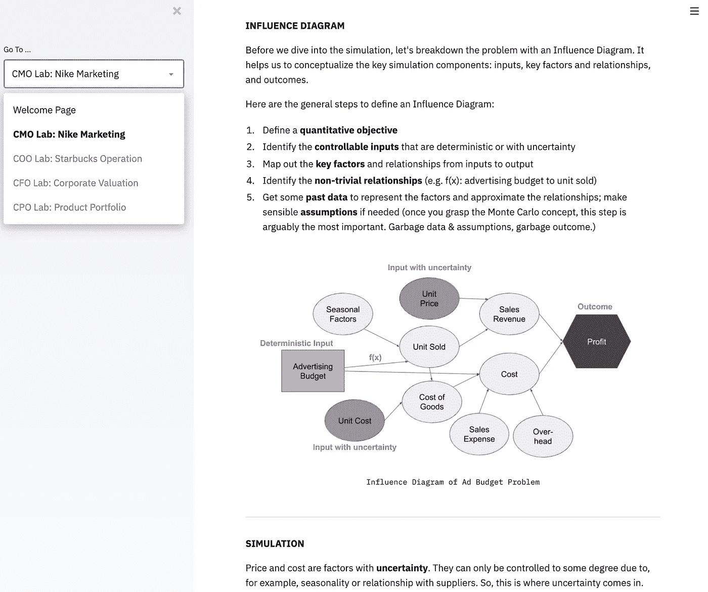
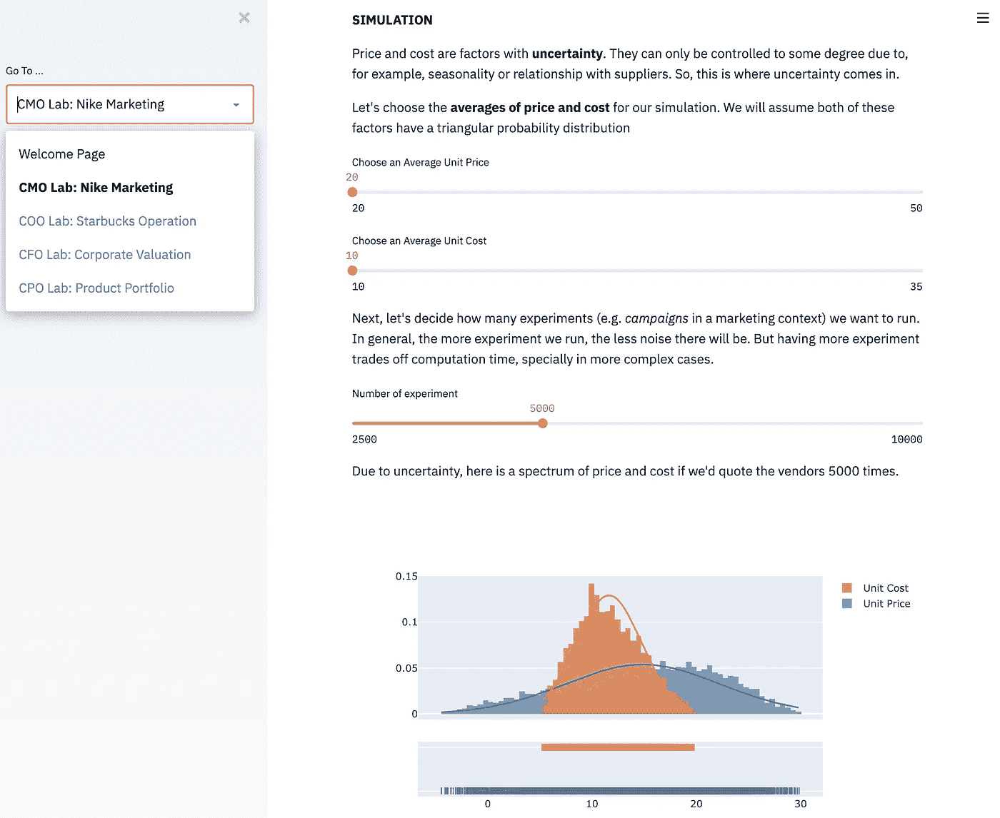

# 被遗忘的算法

> 原文：<https://towardsdatascience.com/how-to-design-monte-carlo-simulation-138e9214910a?source=collection_archive---------4----------------------->

## 用 Streamlit 探索蒙特卡罗模拟

乔纳森·彼得森在 [Unsplash](https://unsplash.com/s/photos/game?utm_source=unsplash&utm_medium=referral&utm_content=creditCopyText) 上拍摄的照片

**TL；博士**—当我们谈论机器学习时，我们经常会想到有监督和无监督的学习。在本文中，我想讨论一个经常被遗忘但同样强大的算法:蒙特卡罗模拟。我将分享一个通用的设计框架和一个交互式工具的营销应用程序。最后，你也可以在文末找到一个不错的模拟工具列表。

***免责声明:*** *此非 Streamlit 赞助。我交替使用数据科学和机器学习。*

***喜欢读什么？*** *跟我上* [*中*](https://medium.com/@ianxiao)*[*LinkedIn*](https://www.linkedin.com/in/ianxiao/)*[*Twitter*](https://twitter.com/ian_xxiao)*。查看我的《* [*用机器学习影响*](https://www.bizanalyticsbootcamp.com/influence-with-ml-digital) *》指南。它有助于数据科学家更好地交流。***

# **不配的那个**

**在最近的机器学习(ML)兴起中，监督和非监督学习算法，如深度学习的分类和 KNN 的聚类，得到了大多数的关注。当这些算法从热情的社区获得谄媚的赞美时，同样强大而优雅的东西平静而安静地坐在黑暗的角落里。它的名字是**蒙特卡洛**——原子物理学、现代金融和生物医学研究以及赌博领域被遗忘且不配的英雄(或者是恶棍，取决于你对这些事情的看法)。**

***注:为了简洁起见，我将监督和非监督学习方法称为“ML 算法”，将蒙特卡罗方法称为“模拟”。***

# **简短的历史**

**斯坦尼斯劳·乌拉姆、[恩利克·费密](https://en.wikipedia.org/wiki/Enrico_Fermi)和[约翰·冯·诺依曼](https://en.wikipedia.org/wiki/John_von_Neumann)——洛斯阿拉莫斯的天才们——在 20 世纪 30 年代发明、改进并推广了蒙特卡罗方法，为了一个不那么高尚的事业*(提示:这不是为了炸弹)*。观看视频了解更多信息。**

**蒙特卡洛模拟简史(YouTube)**

# **蒙特卡洛模拟是什么？**

**如果要我用一句话来总结蒙特卡洛模拟，那就是:**假装十亿次，直到我们知道真实情况。****

**[吉菲](https://media.giphy.com/media/aVytG2ds8e0tG/giphy.gif)**

**在技术(也是更严肃的)层面上，蒙特卡罗方法的目标是在给定各种输入、不确定性和系统动态的情况下，**逼近对结果的** **期望**。这个视频为感兴趣的人介绍了一些高级数学。**

**蒙特卡洛近似， [YouTube](https://youtu.be/7TybpwBlcMk)**

# **为什么使用模拟？**

**如果我要强调模拟相对于 ML 算法的一个(过于简化的)优势，那就是:**探索。**我们用模拟来理解任何规模的任何系统的内部运作*(例如，世界、社区、公司、团队、个人、车队、汽车、车轮、原子等。)***

**通过模拟虚拟地重新创建一个系统，我们可以计算和分析假设的结果，而无需实际改变世界或等待真实事件的发生。换句话说，模拟允许我们**提出大胆的问题**和**制定策略**来管理各种未来结果，而没有太多的风险和投资。**

# **何时使用模拟，而不是 ML？**

**知名仿真专家 [Benjamin Schumann](https://www.benjamin-schumann.com/blog/2018/5/7/time-to-marry-simulation-models-and-machine-learning) 认为，仿真是*过程驱动*，而 ML 是*以数据为中心*。为了产生好的模拟，我们需要理解系统的过程和基本原理。相比之下，我们可以通过使用来自数据仓库的数据和一些现成的算法，使用 ML 创建相当好的预测。**

**换句话说，创建好的模拟通常在经济上和认知上更加昂贵。我们为什么要使用模拟？**

**好吧，考虑三个简单的问题:**

*   **您的数据仓库中有代表业务问题的数据吗？**
*   **你有足够的这些数据——数量上和质量上的——来建立一个好的 ML 模型吗？**
*   **预测比探索更重要吗(例如，提出假设问题并制定策略来支持业务决策)？**

**如果你的答案是否定的，那么你应该考虑使用模拟而不是最大似然算法。**

# **如何设计一个蒙特卡罗模拟？**

**要创建蒙特卡洛模拟，至少需要遵循 3 个步骤:**

****

**模拟过程，作者的分析**

**如您所见，创建蒙特卡洛模拟仍然需要数据，更重要的是，需要对系统动态的一些理解(例如，销售量和价格之间的关系)。要获得这样的知识，通常需要与专家交谈、研究流程和观察真实的业务操作。**

# **又一个模拟器**

**要了解基本概念是如何实现的，你可以去 [**另一个模拟器**](https://yet-another-sim.herokuapp.com/)**——这是我用 [Streamlit](https://www.streamlit.io/) 开发的一个交互工具。****

****在**欢迎页面**上，您可以尝试各种输入设置，并观察结果如何根据您应用的功能而变化。****

********

****欢迎页[又一个模拟器](https://yet-another-sim.herokuapp.com/)，作者的作品****

****除了基本示例，该工具还包括 4 个案例研究，讨论各种设计技术，如影响图、灵敏度分析、优化以及将 ML 与模拟相结合。****

****例如，在 **CMO 的例子**中，我讨论了如何使用影响图来帮助设计一个模拟来解决广告预算分配问题。****

********

****影响图，作者作品****

****最后，你将接替首席营销官(CMO)的数据科学家职位。你的目标是帮助 CMO 决定在广告上花多少钱，探索各种场景，并想出在不同的不确定性下最大化回报的策略。****

********

****广告预算分配，作者的工作****

****我希望这些例子能说明蒙特卡罗模拟是如何工作的，与最大似然算法相比，它在允许我们探索方面的优势，以及如何用不同的设计技术设计有用的模拟。****

****一些案例研究仍在积极进行中。在这里 注册 [**以便在他们准备好的时候得到通知。**](https://docs.google.com/forms/d/e/1FAIpQLSfL57Eb6Kd7fK3OLfXNUENa3H0rLhmcgxnLQp6SwSWNZ_pLaQ/viewform?usp=sf_link)****

# ****综上****

****我希望这篇文章提供了对蒙特卡罗方法的另一种看法；在今天的 ML 讨论中，我们经常忘记这样一个有用的工具。模拟有许多传统 ML 算法无法提供的优势——例如，在巨大的不确定性下探索大问题的能力。****

****在即将发表的文章中，我将讨论**如何在真实的商业环境中结合 ML 和模拟**以获得两个世界的最佳效果，以及如何阐明不同模拟场景的含义。****

****敬请关注我上[**中**](https://medium.com/@ianxiao) **，**[**LinkedIn**](https://www.linkedin.com/in/ianxiao/)**，**或**[**Twitter**](https://twitter.com/ian_xxiao)**。********

******直到下一次，******

******伊恩******

******[吉菲](https://giphy.com/gifs/two-9-two-9-nine-l4FGsEzqS8Zz8aOWs)******

# ******如果你喜欢这篇文章，你可能也会喜欢这些:******

****** [## 最有用的 ML 工具 2020

### 每个懒惰的全栈数据科学家都应该使用的 5 套工具

towardsdatascience.com](/the-most-useful-ml-tools-2020-e41b54061c58)  [## 12 小时 ML 挑战

### 如何使用 Streamlit 和 DevOps 工具构建和部署 ML 应用程序

towardsdatascience.com](/build-full-stack-ml-12-hours-50c310fedd51)  [## ML 和敏捷注定的联姻

### 如何在 ML 项目中不应用敏捷

towardsdatascience.com](/a-doomed-marriage-of-ml-and-agile-b91b95b37e35)  [## 数据科学很无聊

### 我如何应对部署机器学习的无聊日子

towardsdatascience.com](/data-science-is-boring-1d43473e353e)  [## 抵御另一个人工智能冬天的最后一道防线

### 数字，五个战术解决方案，和一个快速调查

towardsdatascience.com](/the-last-defense-against-another-ai-winter-c589b48c561)  [## 人工智能的最后一英里问题

### 许多数据科学家没有充分考虑的一件事是

towardsdatascience.com](/fixing-the-last-mile-problems-of-deploying-ai-systems-in-the-real-world-4f1aab0ea10)  [## 我们创造了一个懒惰的人工智能

### 如何为现实世界设计和实现强化学习

towardsdatascience.com](/we-created-a-lazy-ai-5cea59a2a749) 

# 流行工具

当我讨论模拟时，许多人询问关于工具的建议。这是我知道的工具列表，选择适合你的目的的。享受吧。

*   [AnyLogic](https://www.anylogic.com/) (这大概是仿真专业人士的必备工具；免费增值)
*   [Simio](https://www.simio.com/index.php) (免费增值)
*   [亚赛](http://yasai.rutgers.edu/) (Excel 插件，免费)
*   [甲骨文水晶球](https://www.crystalballservices.com/Store/Oracle-Crystal-Ball)(免费增值)
*   [SimPy](https://simpy.readthedocs.io/en/latest/index.html) (Python 包，免费)
*   [Hash](https://hash.ai/) (在编写本报告时以秘密模式启动。相当坚实的创始团队。大概是免费增值)

# 参考

**决策树的历史**——[http://pages . stat . wisc . edu/~ loh/Tree progs/guide/loh isi 14 . pdf](http://pages.stat.wisc.edu/~loh/treeprogs/guide/LohISI14.pdf)

**聚类历史**—[https://link . springer . com/chapter/10.1007/978-3-540-73560-1 _ 15](https://link.springer.com/chapter/10.1007/978-3-540-73560-1_15)

**结婚时间模拟与 ML**——[https://www . Benjamin-Schumann . com/blog/2018/5/7/结婚时间模拟模型与机器学习](https://www.benjamin-schumann.com/blog/2018/5/7/time-to-marry-simulation-models-and-machine-learning)

**仿真分类**—[https://gamingthepast . net/theory-practice/Simulation-design-guide/](https://gamingthepast.net/theory-practice/simulation-design-guide/)

**什么是蒙特卡洛，它是如何运作的**——[https://www.palisade.com/risk/monte_carlo_simulation.asp](https://www.palisade.com/risk/monte_carlo_simulation.asp)******