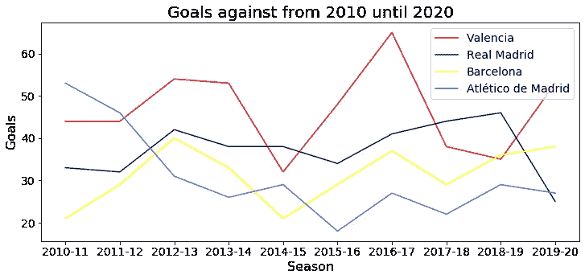
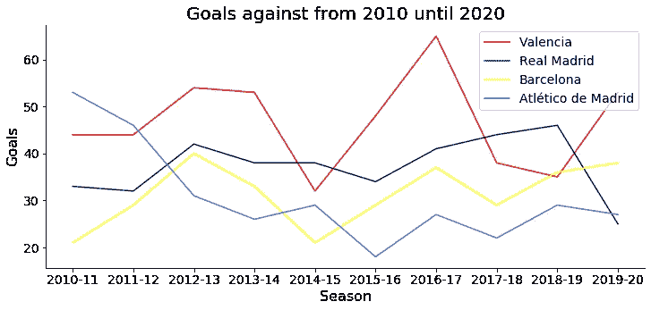
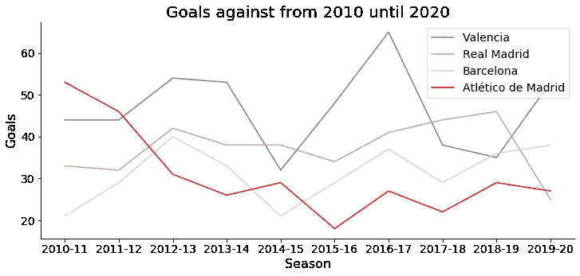
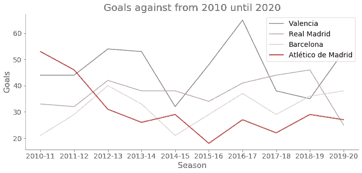
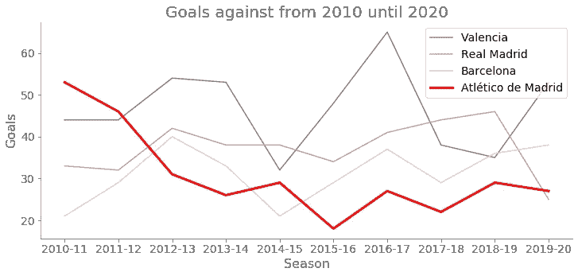
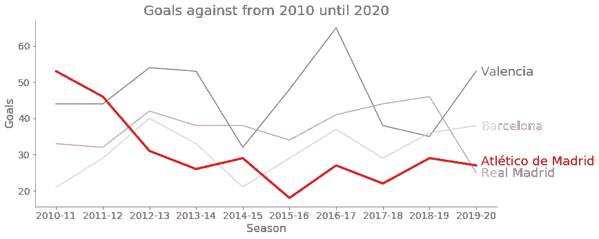
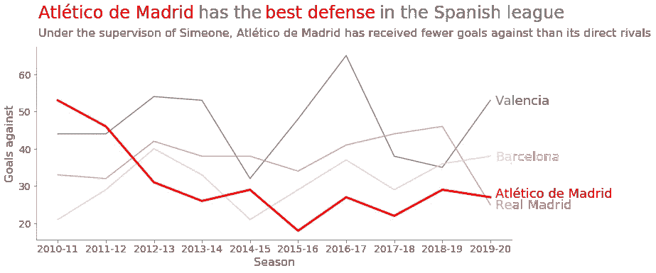

# 如何设计更丰富的可视化效果

> 原文：<https://towardsdatascience.com/how-to-design-more-informative-visualizations-19f27fc8549a?source=collection_archive---------36----------------------->

## 用静态可视化更有效地向观众传播信息的 5 个技巧

**数据可视化**是成为**数据科学家**的必备技能。大多数时候，我们完全专注于学习如何使用可视化工具，我们没有停下来思考在制作可视化时我们应该遵循的**设计原则**和**良好实践**。可视化提供了一目了然的关键见解，它们比原始数据更有效地传达了一个想法。这主要是因为人脑无法同时处理大量数据。然而，仅仅向观众提供视觉效果是不够的，还必须进行适当的设计。**可视化设计**极大地影响了信息传达给观众的速度。出于这个原因，从布局到颜色、标签和背景的每个元素都必须经过挑选，以便于信息的传输。

本文简要解释了最重要的**设计原则**以及如何应用它们来使可视化**更具知识性**和**更易于处理**。我们将**一步一步地重新设计视觉效果**,这样你就可以了解这些原则是如何帮助你更有效地理解信息的。此外，我们提供了对 Github 库的访问，在那里你可以找到这篇文章中使用的代码。

顺便提一下，我想提一下，本文中解释的所有技术都是针对静态可视化的。这些可视化可以在印刷报纸、静态报告或公司演示中找到。它们只关注特定的数据故事，观众无法实时修改。相反，**交互式可视化**允许用户通过与数据交互来回答问题。因此，应该使用其他原则和工具来设计它们。

照片由[absolute vision](https://unsplash.com/@freegraphictoday)**在 [Unsplash](https://unsplash.com/?utm_source=medium&utm_medium=referral) 上拍摄**

**假设你是一名**数据记者**，你正在写一篇关于马竞自 2011 年 12 月迭戈·西蒙尼加盟以来的表现的文章。你想传达给观众的关键信息是**马竞的防守比它的直接对手**强得多。为此，您执行以下可视化操作，该操作描述了过去 10 个赛季西班牙顶级球队的进球情况。**

****

**在这里，你有一个特定的信息要传达给你的读者。然而，这种可视化并不能一目了然地传达这一信息。但是，你如何改进这种形象化，不仅更快而且更有效地向观众传达信息呢？接下来，我将向你展示 5 种技术，你可以将它们应用到你的可视化中，使它们更具知识性。我们开始吧！💜**

> **“卓越的图形能够在最短的时间内，用最少的笔墨，在最小的空间里，向观众传达最多的思想。”**
> 
> **爱德华·塔夫特[1]**

# **1.数据-油墨比**

****数据-油墨比率**是由**爱德华·塔夫特**在八十年代早期引入的概念，指的是显示实际数据的绘图油墨与可视化中使用的总油墨(数据-油墨+非数据油墨)的比例。**

> **数据-油墨比率=数据-油墨/总油墨**

**根据 Tufte 的说法，设计可视化时的一个关键方面是获得高数据-墨水比率。为了实现这一目标，我们必须**强调**包含信息的**元素(在这种情况下是剧情**的**线)，并尽量减少那些没有给观众带来任何信息且专门用于装饰目的的元素。**非数据墨水**包括(1) 3D 和阴影效果，(2)框架，(3)网格线，(4)边框和(5)背景。当这些元素对可视化没有任何价值时，它们应该被删除，这样最重要的信息就突出来了。****

**现在，是时候应用 **Tufte 的设计原则**和减少**非数据墨水**出现在我们的可视化中了。在这种特殊情况下，我们只需移除顶部和右边界。然而，如果您的可视化包含上述元素中的另一个，您应该认真考虑消除它。**

****

# **2.颜色**

**误用**颜色**是制作可视化效果时的一个常见问题，因为它通常用于美学目的而非信息目的。色彩在讲故事中起着关键作用，可以战略性地用于**指示观众往哪里看**【2】。**

**在最初的情节中，所有的线条都有明亮的颜色，并且都在平等地争夺观众的注意力。为了克服这个缺点，上面的视觉效果被重新设计，除了我们想要强调的红色的**之外，所有的线**都使用了灰色**，给观众一个在哪里看的提示。****

****

****的颜色**有**的含义** **与之相关的**。因此，在设计可视化效果时，重要的是要记住颜色可以**唤起某些情绪**并相应地使用它们来避免误解【2】。红色通常与危险和谨慎的感觉联系在一起，并与消极的结果联系在一起。由于这个原因，当涉及到可视化时，必须谨慎使用它。然而，这种情况是一个例外，因为你可能知道，足球队也有代表性的颜色。任何熟悉西班牙足球联赛的读者都会将红色与马德里竞技联系在一起，因此，在这种情况下，使用另一种颜色(而不是红色)可能会产生误导。**

**此外，我们还可以将灰色用于次要元素，如标题、标签和轴，以使我们的**数据更加突出**。**

****

# **3.行距**

****前注意属性**帮助我们**快速识别**视觉效果中的某个元素【3】，而无需我们有意识的行动。这是通过修改一个特定元素的外观来实现的，使它从其余的数据中突出出来。这些属性是有效的，因为我们的大脑能够立即注意到环境中的差异。在前面的部分中，我们只使用了**颜色**(红色对灰度)作为预先注意的属性来突出显示可视化的特定行；然而，你可以用更多的预先注意属性来吸引观众的注意力。**

**Colin Ware 将**前注意属性**分为 4 大类[5]:**

1.  ****颜色:**这个类别包括两个属性(1)颜色**色相**和(2)颜色**强度**。色调用于区分类别，而颜色强度可以携带数值[2]。**
2.  ****形式**:我们可以改变一个元素的形式，比如它的**大小**、**长度**、**曲率**，或者**方向**，如果我们想要强调它**。****
3.  ****空间位置:**该视觉编码包括 **2D 定位**、**立体深度**、**凹凸定位**【6】等属性。**
4.  ****运动:**这种前注意属性在**交互式可视化**中特别有用，可以吸引观众的注意力。**

**正如我之前提到的，前注意属性可以一起使用；例如，我们不仅可以改变元素的**颜色**，还可以改变元素的**形状**(线宽)，以更有效地吸引查看者的注意力，如下图所示。**

****

# ****4。直接贴标****

**大多数可视化工具，如 Matplotlib 或 Seaborn，默认情况下都提供了一个**图例**来表示可视化中的数据序列。然而，使用图例有一个缺点。查看者必须不断地在图例和图表之间来回扫描，这是一个非常耗时的可视化过程。或者，对于线图，我们可以**直接标记**数据序列，而不是提供颜色编码的图例，如下所示。这样做，我们使图表更清晰，更容易理解。**

****

**现在，最后一次修改:标题:)**

# **5.标题和副标题**

**我们可以有策略地使用标题来描述我们想要传达给读者的主要思想，而不仅仅是像我们最初做的那样给出一个无聊的数据描述。在这种特殊的情况下，我们希望观众不要认为马德里竞技队拥有西班牙联赛中最好的防守，因此我们将这一想法放在可视化的标题上，使读者一眼就能理解图形的主要信息。此外，我们提供与**副标题**上的数据相关的**补充信息**，以确保可视化的正确解释。最后，我们在左边对齐标题和副标题。通过这样做，我们可以确保读者首先关注这些信息。**

****

**瞧啊。现在，我们有了一个更引人注目的视觉效果，可以有效地传达一个特定的想法！看出区别了吗😉**

## **以前**

****

## **在...之后**

****

# **Github 知识库**

**下面的 **Github 库**包含一个 **Jupyter 笔记本**，在这里你可以找到所有用于创建可视化的代码。**

** [## amandaiglesiasmoreno/可视化

### 此时您不能执行该操作。您已使用另一个标签页或窗口登录。您已在另一个选项卡中注销，或者…

github.com](https://github.com/amandaiglesiasmoreno/visualizations) 

好消息是，我没有使用复杂的工具来制作这些可视化效果。一切都是用 Matplotlib 完成的。💛

# **有趣的视频**

在 Youtube 上观看了一系列关于数据可视化的视频后，我决定写这篇文章。这些视频让我认真地重新考虑了我到目前为止进行可视化的方式，并让我学会了许多有趣的数据可视化技术，我肯定会将这些技术应用到我未来的图表中。这些视频由谷歌数据分析师**科尔·努斯鲍默**解说，并基于她的书**用数据讲故事:商业人士数据可视化指南**。

它们只持续一个半小时，所以不要犹豫去看它们！💜

*   **整理你的可视化数据**

*   **巧用色彩**

*   **你看到了吗？对比的力量**

# 数据可视化清单

在写这篇文章的时候，我看到了斯蒂芬妮·常青树和安·k·埃莫里创建的一个非常有用的清单。您可以使用此列表作为开发高效数据可视化的指南💙。

# 参考

[1]爱德华·塔夫特。定量信息的可视化显示。第二版，美国图形出版社，1991 年。

[2]科尔·努斯鲍默。巧用色彩【视频文件】。2015 年 10 月 1 日【引自 2020 年 10 月 30 日】。可用从:*[https://www.youtube.com/watch?v=AiD6etOB6qI&t = 1200s](https://www.youtube.com/watch?v=AiD6etOB6qI&t=1200s)。*

*[3] Udacity。atributos Pre-aten ao[视频文件]。2015 年 2 月 23 日【引用于 2020 年 10 月 30 日】。可用从:*[https://www.youtube.com/watch?v=AiD6etOB6qI&t = 1200s](https://www.youtube.com/watch?v=6UvLbIX0NQ4&list=RDCMUCBVCi5JbYmfG3q5MEuoWdOw&start_radio=1&t=9)。**

**[4]科尔·努斯鲍默。用数据讲故事:商业专家数据可视化指南。第一版，美国威利，2015。**

**[5]科林·韦尔。信息可视化:设计感知。第三版，爱思唯尔，1999 年。**

**[6]巴勃罗·埃尔南德斯。了解大脑是如何工作的！；2020 年 2 月 13 日[引用于 2020 年 10 月 31 日]。来自:[https://www.diabetesaustralia.com.au/gestational-diabetes](https://datascience.aero/brain-data-visualization/)**

**感谢你阅读❤️**

**阿曼达·伊格莱西亚斯****