# 如何用 Python 设计专业的维恩图

> 原文：<https://towardsdatascience.com/how-to-design-professional-venn-diagrams-in-python-693c9ed2c288?source=collection_archive---------19----------------------->

## 使用 matplotlib-venn 绘制时尚专业的维恩图的快速指南

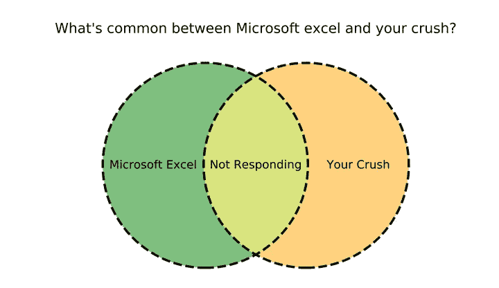

两个都没有反应。来源:作者

上周，我为我的 Python 课程设计了一些阅读材料。讲座主题是 [**Python 集**](https://medium.com/python-pandemonium/https-medium-com-python-pandemonium-an-introduction-to-python-sets-part-i-120974a713be) 。

为了说明一些功能，我想画出 [**维恩图**](https://en.wikipedia.org/wiki/Venn_diagram) 。是的，你经常在数据演示中发现的重叠圆形图。

来源:[吉菲](https://giphy.com/gifs/loop-design-hypnotic-l4FGw4d101Sa0pGTe)

我对用于设计专业外观维恩图的**开源工具**的搜索引导我找到了像 [**Canva、**](https://www.canva.com/en_in/graphs/venn-diagrams/) [**元图表**](https://www.meta-chart.com/venn) 和 [**Creately 这样的工具。虽然它们有吸引人的设计，但没有一个具备所需的优雅，而且很少可以定制。**](https://creately.com/lp/venn-diagram-maker/)

> 在谷歌搜索深处的某个地方，我遇到了 [matplotlib-venn](https://github.com/konstantint/matplotlib-venn) ，并爱上了它。

[**matplotlib-Venn**](https://github.com/konstantint/matplotlib-venn)库允许你完全定制你的文氏图，从圆的大小到边框类型和线宽。这是使用该库生成的[样本图](https://github.com/konstantint/matplotlib-venn)。

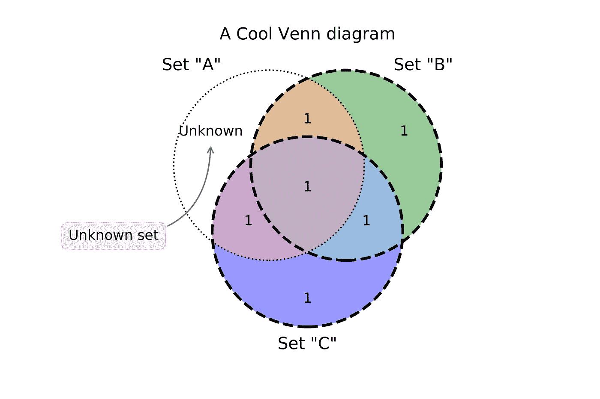

由作者生成并清理。代码来源于[图书馆主页](https://github.com/konstantint/matplotlib-venn)。

在将这个库用于多个项目之后，我决定分享我通过本教程所学到的东西。我将解释**如何使用**[**matplotlib-Venn**](https://github.com/konstantint/matplotlib-venn)**创建你自己的专业维恩图**。

# 设置

本教程中的所有例子都是在运行 Python 3.7 的 [Jupyter 笔记本](https://jupyter.org/)上测试的。我们将在本教程中使用 matplotlib-venn。

本教程有一个附带的 Jupyter 笔记本[**这里**](https://github.com/ChaitanyaBaweja/Programming-Tutorials/blob/master/Professional%20Venn%20Diagrams%20in%20Python/Untitled.ipynb) **。**

# **维恩图介绍**

[**文氏图**](https://www.mathsisfun.com/sets/venn-diagrams.html) 是用来描绘不同组或集合之间的逻辑关系的图示。

每个组用一个圆来表示。每个圆圈的大小对应于群体的大小/重要性。

> 这些圆之间的重叠表示两个集合之间的交集。因此，这些图对于识别每个集合之间的共享元素特别有用。

让我们看一个例子来更好地说明。假设你有一群选修多门课程的学生。这些科目中有两门是英语和法语。

```
English = {**'John'**, 'Amy', 'Howard', 'Lucy', **'Alice'**, 'George', 'Jacob', 'Rajesh', 'Remy', 'Tom'}French = {'Arthur', 'Leonard', 'Karan', 'Debby', 'Bernadette', **'Alice'**, 'Ron', 'Penny', 'Sheldon', **'John'**}
```

两个科目各有十名学生。爱丽丝和约翰都学英语和法语。

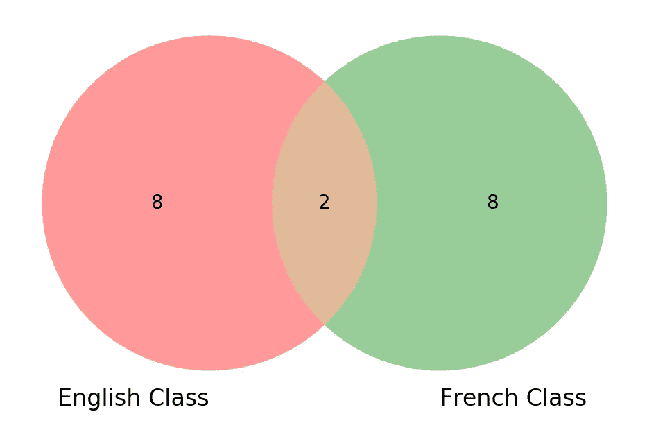

文英语和法语课。来源:作者

现在，我们将使用维恩图来可视化这些集合。

**两个圆圈一样大。这是因为这两个集合有相同数量的学生。**

两个圆之间的重叠部分包含两个对象:爱丽丝和约翰。

现在，我们了解了什么是维恩图，让我们用 Python 来设计一些。

# **如何使用 Python 创建维恩图？**

第一步，导入需要的库:[**matplotlib-Venn**](https://github.com/konstantint/matplotlib-venn)和 [**matplotlib**](https://matplotlib.org/) 。然后，我们定义希望绘制的集合:

最后，我们将使用 matplotlib-venn 的`[**venn2**](https://python-graph-gallery.com/170-basic-venn-diagram-with-2-groups/)` **函数**绘制我们的文氏图:

```
venn2([English,French])
```

输出:

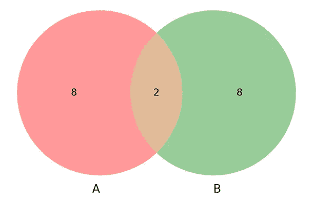

Venn 由 venn2 函数绘制。来源:作者

该函数将两个集合的列表**作为参数，并绘制所需的文氏图。**

**我们还可以给剧情和单个圈子添加标签。**

输出:

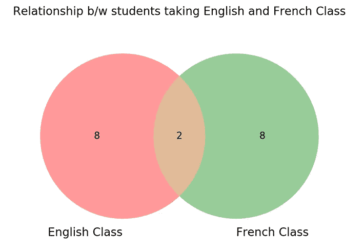

# 三组维恩图

现在，让我们再考虑两个科目:**数学**和**理科**。

```
Math = {'Amy', 'Leo', 'Ash', 'Brandon', 'Sara', 'Alice', 'Ron', 'Annie', 'Jake', 'Zac'}
Science = {'Dexter', 'Geeta', 'James', 'Charles', 'Sammy', 'Brandon', 'Aayush', 'Josephy', 'Casey', 'Will'}
```

我们现在将绘制一个包含三组内容的维恩图:英语、法语和数学。我们使用`[venn3](https://pypi.org/project/matplotlib-venn/)` [函数](https://pypi.org/project/matplotlib-venn/)来实现这一点:

输出:

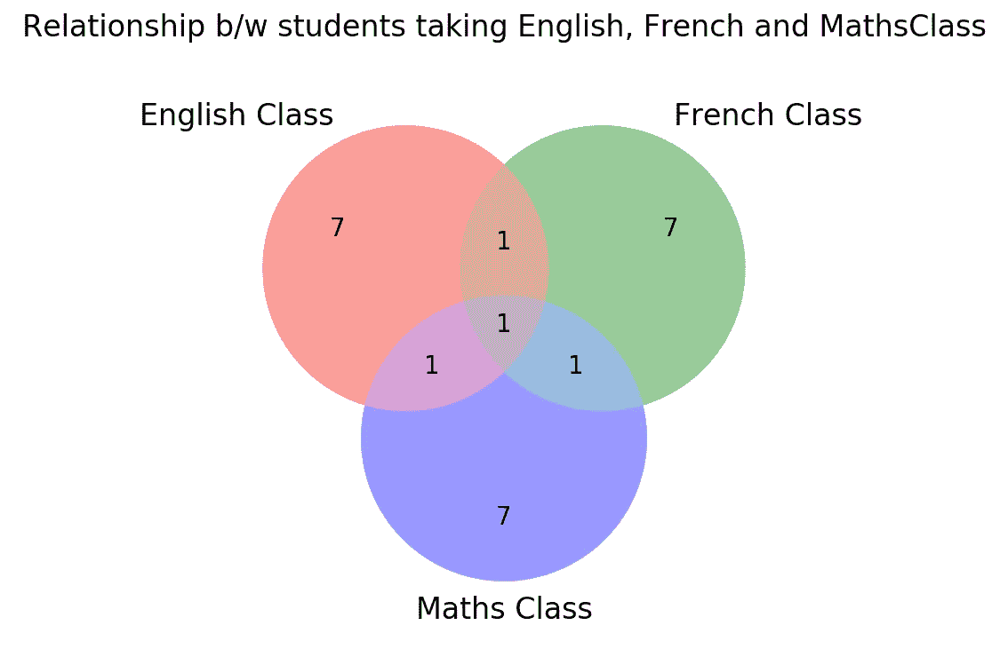

正如所料，这三个集合之间存在重叠。所有布景都有共同的**爱丽丝**。

现在，让我们考虑用科学而不是数学作为第三套。

输出:

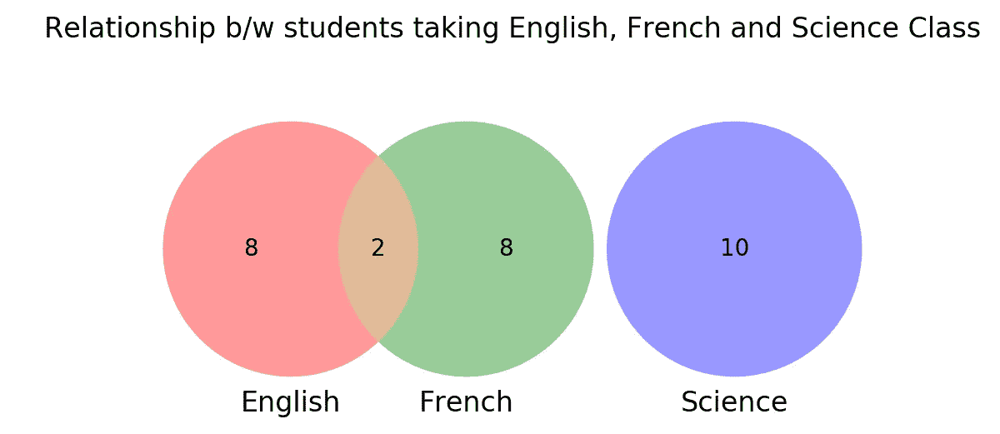

**我们看到，科学是一个** [**不相交的集合**](https://en.wikipedia.org/wiki/Disjoint_sets) **，与其他圆圈没有任何重叠。**

假设有一门叫做**消防安全**的必考科目，每个人都必须参加。我们可以通过取一个 [**集合所有科目的**](https://medium.com/swlh/an-introduction-to-python-sets-part-iii-dbb3e5df2ffc) 来定义它。

输出:

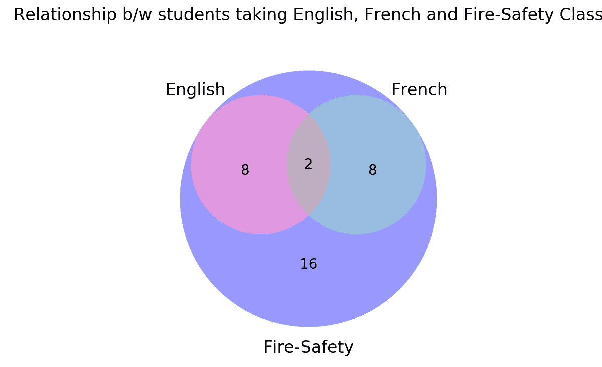

# 使用组的大小

有时我们没有现成的定义。我们只知道这些集合的大小以及它们之间的重叠量。在这样的情况下，我们使用 [**子集参数**](https://github.com/konstantint/matplotlib-venn) :

`subsets`是一个包含三个值的[元组](https://www.w3schools.com/python/python_tuples.asp):

1.  包含在集合 A 中，但不包含在集合 B 中
2.  包含在集合 B 中，但不包含在 A 中
3.  集合 A 和 B 的交集

```
venn2(subsets = (50, 20, 10), set_labels = ('Set A', 'Set B'))
```

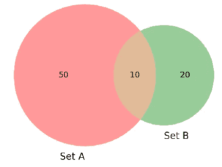

你可以在这里 找到更多使用子集 [**的细节和例子。**](/how-to-create-and-customize-venn-diagrams-in-python-263555527305)

# 改变颜色和透明度

虽然默认颜色(红色和绿色)适合大多数情况，但是您可以根据自己的方便选择不同的颜色。

> `set_colors`参数允许我们设置组的颜色。
> 
> `alpha`参数允许我们控制透明度。

```
venn2([English, French], set_labels = ('English Class', 'French Class'), set_colors=('darkblue', 'yellow'), alpha = 0.8);
```

输出:


使用设置颜色和阿尔法。来源:作者

# 添加自定义边框

我们还可以在维恩图中添加自定义边框。我们通过在原始轮廓上叠加定制轮廓来实现这一点。

我们使用`**venn2_circles**`和`**venn3_circles**`绘制这个轮廓。看一看:


图表周围的额外粗轮廓。来源:作者

我们还可以分别使用`linewidth`和`linestyle`参数选择边框的宽度和样式。

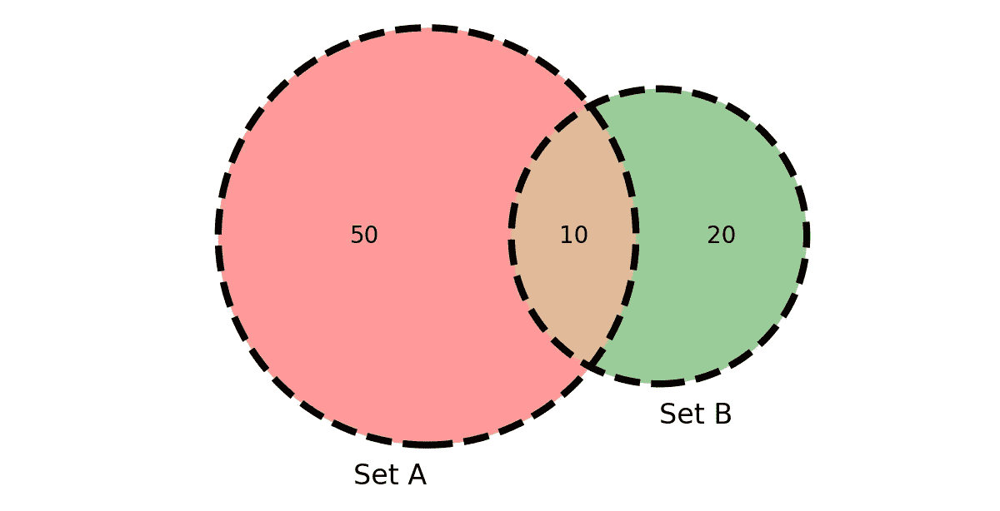

宽度为 3 且样式为虚线的轮廓。来源:作者

更多的例子可以在 [**这里找到**](https://python-graph-gallery.com/venn-diagram/) 。

# 使用 Id 进行自定义

我们也可以使用它们的 id 访问维恩图的每个元素。

下图显示了 2 组和 3 组文氏图中每个区域的 id。

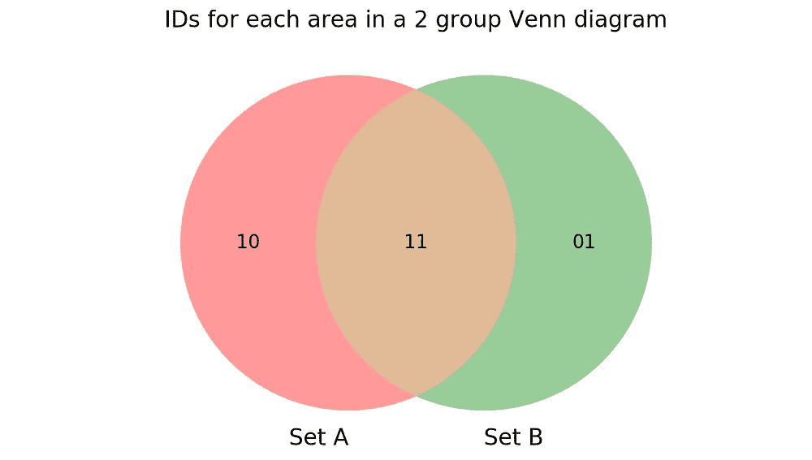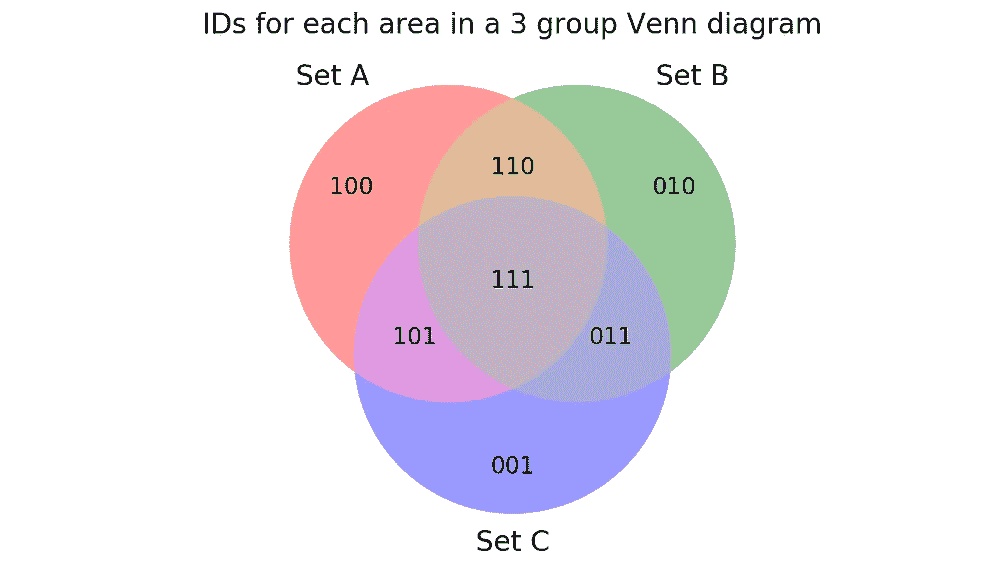

您可以使用`**get_patch_by_id**`方法自定义图表中每个区域的颜色。我们还可以使用`**get_label_by_id**` 方法定制每个区域的文本。

看一看:

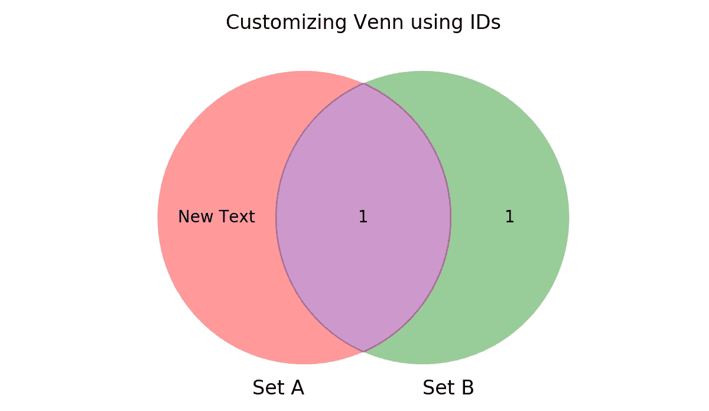

来源:作者

请注意，交叉区域现在是紫色的，左边的圆圈上写着“新文本”。

更多关于定制的细节可以在 [**这里**](https://www.badgrammargoodsyntax.com/compbio/2017/10/29/compbio-012-making-venn-diagrams-the-right-way-using-python) 。

# 结论

[**matplotlib-Venn**](https://github.com/konstantint/matplotlib-venn)库允许你完全定制你的文氏图，从圆的大小到边框类型和线宽。它可以用来制作二组和三组维恩图。

建议不要设计超过三组的维恩图。这仍然是一个 [**打开的问题库里的**](https://github.com/konstantint/matplotlib-venn/issues/15) 。

你可以在这本附带的 [**丘比特笔记本**](https://github.com/ChaitanyaBaweja/Programming-Tutorials/blob/master/Professional%20Venn%20Diagrams%20in%20Python/Untitled.ipynb) 中找到所有的片段。

希望你觉得这个教程有用。

Chaitanya Baweja 渴望用工程解决方案解决现实世界的问题。在 [Twitter](https://twitter.com/openvayu) 和 [Linkedin](https://www.linkedin.com/in/chaitanya-baweja/) 上关注他的旅程。