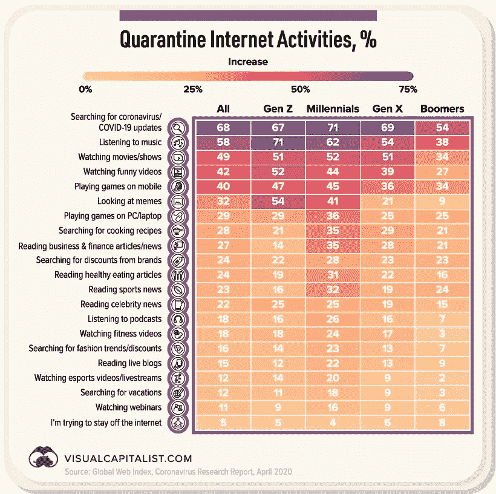
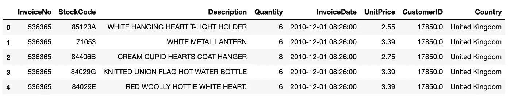
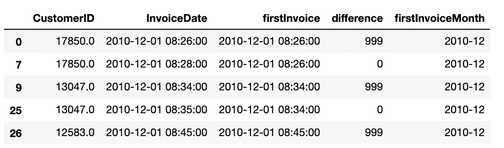
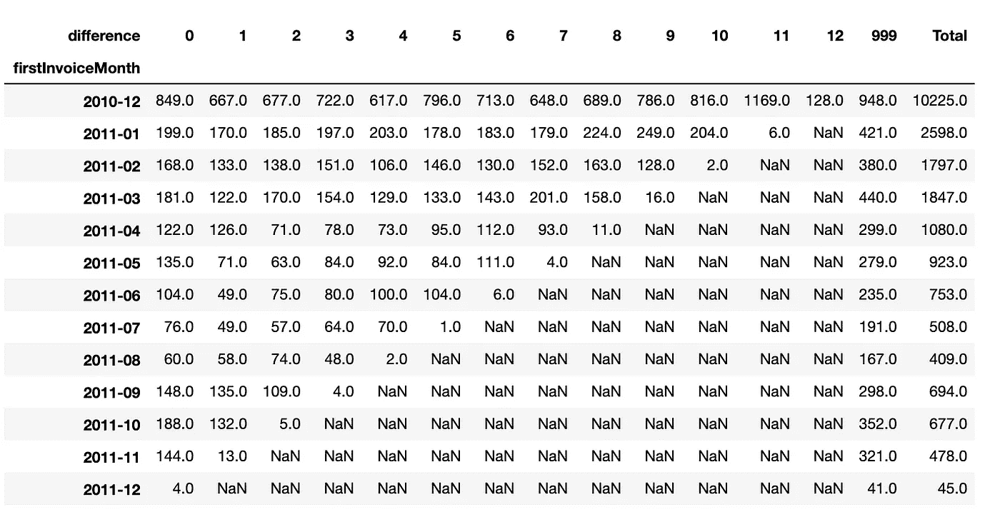
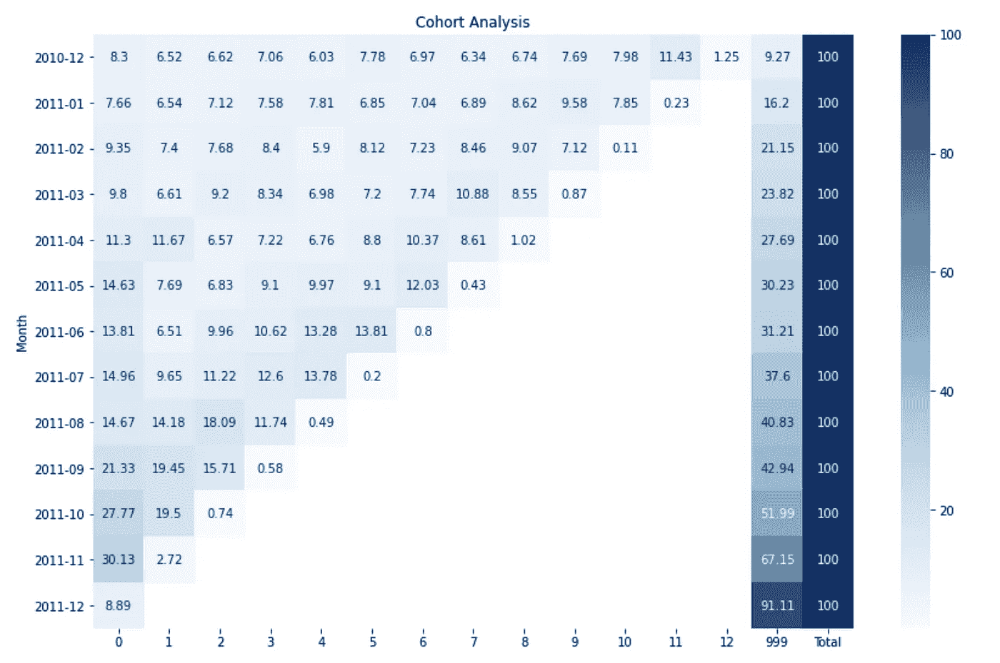

# 使用 Python、SQL 和 Tableau 创建实时群组

> 原文：<https://towardsdatascience.com/how-to-design-real-time-cohort-analysis-in-python-sql-tableau-1df527c19b7e?source=collection_archive---------31----------------------->

[来源](https://en.saype-artiste.com/istanbul-2020)

队列是在选定时期内具有共同特征的一群人，如 2019 年 6 月毕业的硕士生或在美国出现首例新冠肺炎后报名参加网飞免费试用的用户。

有几个队列变异，但假设只有两个队列。在三月或四月注册网飞的用户。随着时间的推移，在分析群组中用户的行为之后，我们可以了解群组的“质量”，例如订阅、客户终身价值或每个用户每天观看的平均时间。

虽然《网飞》的下载和订阅数量因爆发而增加，但群组分析有助于我们进行比较，并提供更多关于用户“享受”或哪部电影有助于留住客户的见解。

> 群组分析对于理解几代人在特定时期的行为也很重要，比如像新冠肺炎这样的外部冲击。

在社会隔离时期，人们花更多的时间在社交媒体上。下面你会看到在互联网上消费内容时，不同代人(群体)之间的差异。

[来源](https://2oqz471sa19h3vbwa53m33yj-wpengine.netdna-ssl.com/wp-content/uploads/2020/04/Supp-1-Activities-Covid-Media-1.jpg)

在本文中，我们将分析一个来自 UCI 的著名在线零售数据集，并了解如何在离线(Python)和在线(SQL-Tableau stack)中设计群组分析。

【http://archive.ics.uci.edu/ml/datasets/Online+Retail/ 

**Python 部分(离线)**

数据集包含客户 id、国家、价格、数量等，但我们只需要 customer id 和 InvoiceDate 列。

首先，我们丢弃重复的值并删除缺失的值。然后，我们使用 transform 函数找到每个用户的第一个订单日期，并计算下一个订单日期之间的日期差。

**我们将 999 设置为第一个订单日期的虚拟**，因为这些订单不计入**留存**而计入**流失**。

我们可以很容易地使用数据透视表创建群组，并在右侧添加“总计”列。根据客户第一次购买或注册的时间对他们进行分组是很常见的。

(对于 Tableau 中的离线分析，我们将数据框保存为 excel 格式。)

478 名客户在 2011 年 11 月下了第一笔订单。其中 144 名用户在同一个月再次订购，13 名用户在下个月(2011-12 年)再次订购。

321%的顾客不再订购。这就是为什么我们把 999 作为第一批订单的虚拟订单。

我们**根据用户数量来标准化**群组表，因为更常见的是以百分比来分析群组。

**SQL 部分(在线)**

让我们假设 online_retail 模式下的“orders”表中的数据集和每个用户购买的一条记录。我们在 Python 部分中使用 SQL 中的 first_value 函数计算第一个订单日期。

然后，我们使用 datediff()函数计算订单日期之间的日期差，并使用 case when 为第一个订单设置 999。现在，我们准备连接到 Tableau 中的数据源，并在下面的 Tableau 视频之后分析群组。

**画面部分(在线)**

如果您有任何问题，可以通过 [Twitter](https://twitter.com/hkaansimsek) 或 [LinkedIn 联系我。](https://www.linkedin.com/in/hakkikaansimsek)