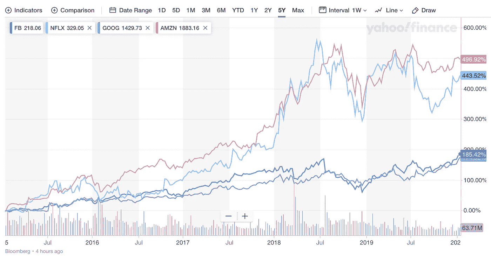
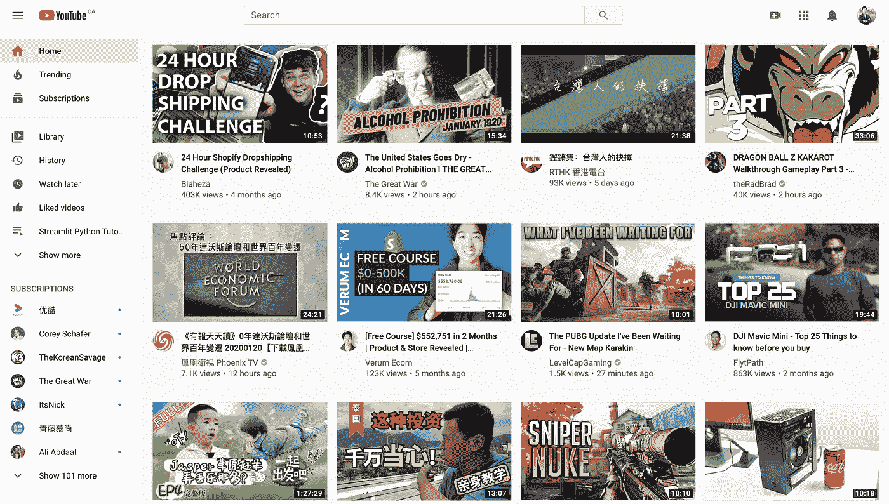
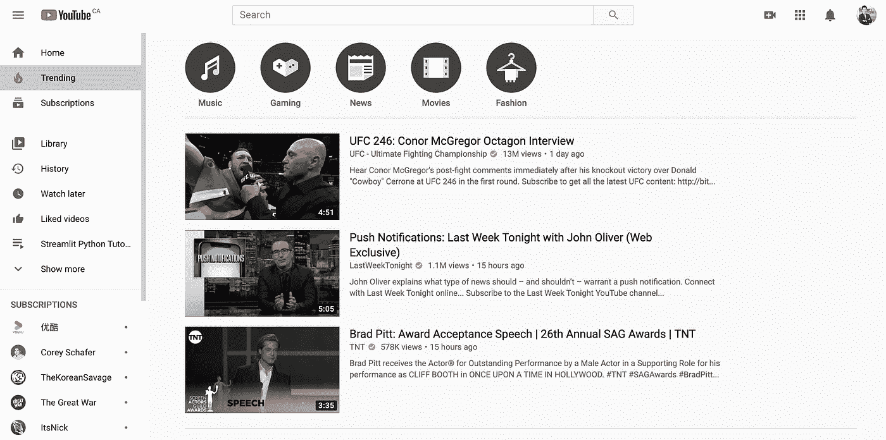
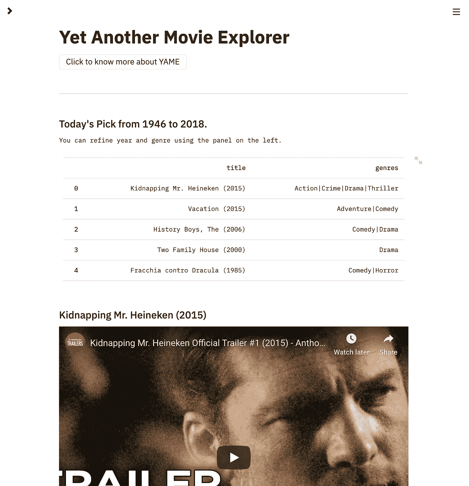
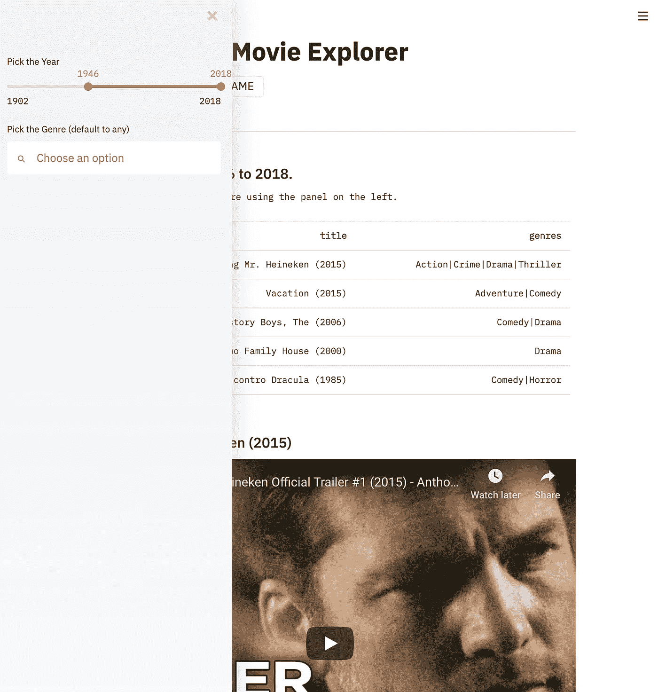

# 越狱

> 原文：<https://towardsdatascience.com/how-to-design-search-engines-24e9e2e7b7d0?source=collection_archive---------26----------------------->

## 我们应该如何设计推荐系统

照片由[德鲁·比默](https://unsplash.com/@drew_beamer?utm_source=unsplash&utm_medium=referral&utm_content=creditCopyText)在 [Unsplash](https://unsplash.com/s/photos/neon?utm_source=unsplash&utm_medium=referral&utm_content=creditCopyText) 上拍摄

**TL；博士**——我们被 YouTube 或亚马逊等公司设计的推荐算法所禁锢。这些算法产生了难以逃脱的回音室。我想要能带来刺激的东西，更重要的是，在不剥夺便利的同时还能掌控一切。在这篇文章中，我想介绍一下我用 [Streamlit](https://www.streamlit.io/) 构建的独立电影应用 [YAME](https://yame-movies.herokuapp.com/) 。我用它作为例子来讨论为未来设计更好的机器学习系统的原则。

***免责声明:*** *本文不是由 Streamlit 或我工作的任何公司赞助的。所有观点都是我自己的。*

***喜欢读什么？*** *跟我上* [*中*](https://medium.com/@ianxiao)*[*LinkedIn*](https://www.linkedin.com/in/ianxiao/)*，或者*[*Twitter*](https://twitter.com/ian_xxiao)*。**

# *仓鼠、飞轮和魔法*

*[推荐系统驱动互联网](https://www.wired.com/story/how-recommendation-algorithms-run-the-world/)。公司设计推荐算法来吸引你的注意力。这些算法推动你的手指滚动，就像**一只仓鼠**在**飞轮**上(或下面)。对仓鼠来说，这可能很有趣，但对人类来说，这似乎是个陷阱。*

*[吉菲](https://giphy.com/gifs/acid-october-gifdump-82fQ0lbisj7rO)*

*当你看着屏幕时，你的头脑(或手指)释放出人类发明的最强大的魔法:股票价格。你的关注推高了设计飞轮的公司的价格，即脸书、亚马逊、网飞和谷歌(简称 F.A.N.G)。一切都很好，对吗？尤其是对那些拥有这些股票的人来说。今年圣诞节一切都变了。*

**

*截至 2020 年 1 月 20 日，[雅虎财经](https://ca.finance.yahoo.com/)*

# *高度个性化的监狱*

*圣诞节期间，我重新看了一遍我最喜欢的电视节目《T2 越狱》，突然意识到:**虽然我在身体上是自由的，但我被数字化囚禁了。我对我的社交媒体订阅源** — **显示的话题不再那么好奇，这些订阅源是根据我的兴趣定制的。**真是讽刺。*

*对于《越狱》的主角迈克尔·斯科菲尔德来说，他的牢房是这样的:*

*[吉菲](https://giphy.com/gifs/prisonbreakonfox-fox-prison-break-xUPGcFnu29iMys4Lkc)*

*对我(和我们中的许多人)来说，当我去 YouTube 时，我的牢房看起来是这样的:*

**

*作者分析，2020 年 1 月 17 日— Youtube 登陆页面*

*好吧，我的牢房没有马天如的那么吓人。是的，我会收到基于我(和我妻子)感兴趣的高度个性化的内容。**然而，还有两个问题**。*

***首先，事情变得无聊。**由于[效用](https://www.investopedia.com/terms/u/utility.asp)的急剧减少，我对相同的内容越看越不感兴趣。事实上，我经常花更多的时间寻找有趣的内容，而不是实际观看建议。*

***第二，用户不能轻易(也不能真正)探索。YouTube 或 Instagram 等平台确实提供探索功能，如 YouTube 的趋势和 Instagram 的探索订阅。但是，这些功能并没有提供简单的用户界面，无论是有意还是无意，以允许用户真正探索。具有讽刺意味的是，内容仍然主要取决于你的历史观和平台想要推广什么以获得更高的广告收入。***

**

*作者分析，2020 年 1 月 20 日——Youtube 趋势页面*

**

*作者分析，2020 年 1 月 20 日-Instagram Explore Feed*

*现在我们被困住了。社交平台用源源不断的个性化信息创造了美丽迷人的墙。但是当我们试图越过那堵墙窥视时，我们会意识到这是一个无边的陷阱。*

# *和 YAME 一起越狱*

*我想出去！我想利用科技带来的便利探索更多。如果我愿意的话，我想选择呆在我的牢房里(不是每个人都想或需要一直满足他们的好奇心)。我想控制我所看到的东西。*

*但是，我知道我不是迈克尔·斯科菲尔德，我们也不是在电影里。所以，我们不要拆掉并重新设计 YouTube、网飞或 Instagram。相反，让我们通过专注于一个特定的用例来一次迈出一小步:**找到一部好电影来看。**这成了我持续的痛点。*

*考虑到这一点，我创建了一个名为 [**YAME**](https://yame-movies.herokuapp.com/) 的小应用。它代表**又一部电影探索者**。YAME 是您在工作日、周末、约会夜或家庭聚会时寻找好电影的唯一应用程序。*

*YAME 有一个**设计原则**:通过在便利和控制之间取得平衡来为用户提供选择。所以，YAME 有三个特性:*

1.  ***“今日精选”**来自 58，000 多部电影，跨越时间和流派*
2.  ***根据年份和流派过滤***
3.  ***智能探索**让用户决定*

***便利:**登陆页面有五部系统推荐的电影。它每天更新。该算法跨年份、跨流派挑选电影；它试图做到不偏不倚。*

**

*特点一:今日精选*

*一些控制:如果你不喜欢你看到的或者只是想知道那里有什么，你可以使用左边的面板选择年份和流派。*

**

*特点 2:选择方便*

***更多控制而不牺牲便利:**如果你真的想要别的东西，你可以基于*探索你今天用一个简单的界面感受* 有多“冒险”。这个 UI 允许用户有一个 ***选项来选择*** *。用户可以决定他们想看什么，而不会认知超载。**

**

*功能 3:智能探索:用户定义的探索*

*有兴趣或需要为这个周末挑选一部电影吗？这里 可以试试 YAME [**。它对网络和手机都很友好。**](https://yame-movies.herokuapp.com/)*

*有了 YAME，至少，我希望**提供一个有用的和周到的工具**，这样你就可以和你的朋友和家人(或独自)度过一段美好的时光。我希望这篇文章能让你更加意识到*数字监狱*对你好奇心和智力健康的影响。*

# *超越亚美*

*从更大的角度来看，我想**敦促设计和机器学习(ML)社区重新思考推荐系统如何更好地服务于用户**，同时平衡与广告商或商家的利益。考虑到所有相互竞争的优先事项和利益，这是一个棘手的问题。*

*出于娱乐目的拥有不太理想的推荐系统相对来说是良性的，但是[当这些系统被用来影响观点和社会运动时，后果就要严重得多了](https://www.wired.com/story/creating-ethical-recommendation-engines/)。今天， [YouTube 推荐算法](https://www.nytimes.com/2018/03/10/opinion/sunday/youtube-politics-radical.html)已经在分化和激进我们的社区。*

*我认为核心问题是推荐系统已经从你我这样的用户手中夺走了选择的权力。推荐算法和用户界面让我们很难*选择*我们想看的，很难*选择*我们想探索的，更重要的是，*选择*我们想的*。**

*我们需要重新平衡。尽管创建一个最大化每个人利益的解决方案是困难的，而且经常是不可能的，这里是给设计师和 ML 实践者的一个建议:让我们至少给用户提供可访问的选项来选择。这可以体现在用户体验、算法设计或两者之中。*

*同时，如果你喜欢并想支持 YAME，请查看我的[**Patreon**](https://www.patreon.com/indieml)**页面。支持将用于支付运行和改进 YAME 的费用(如服务器、网站等)。).***

***祝你快乐，下次再见。你可以在[*中*](https://medium.com/@ianxiao)*[*LinkedIn*](https://www.linkedin.com/in/ianxiao/)*，或者*[*Twitter*](https://twitter.com/ian_xxiao)*上找到我。*****

****伊恩****

****[吉菲](https://media.giphy.com/media/11AuX2SHScQumk/giphy.gif)****

******如果你喜欢这篇文章，你可能也会喜欢这些……******

**** [## 最有用的 ML 工具 2020

### 每个懒惰的全栈数据科学家都应该使用的 5 套工具

towardsdatascience.com](/the-most-useful-ml-tools-2020-e41b54061c58)  [## 数据科学很无聊

### 我如何应对部署机器学习的无聊日子

towardsdatascience.com](/data-science-is-boring-1d43473e353e)  [## 被遗忘的算法

### 用 Streamlit 探索蒙特卡罗模拟

towardsdatascience.com](/how-to-design-monte-carlo-simulation-138e9214910a)  [## 我们创造了一个懒惰的人工智能

### 如何为现实世界设计和实现强化学习

towardsdatascience.com](/we-created-a-lazy-ai-5cea59a2a749)  [## ML 和敏捷注定的联姻

### 如何在 ML 项目中不应用敏捷

towardsdatascience.com](/a-doomed-marriage-of-ml-and-agile-b91b95b37e35)  [## 你被解雇了

### 如何发展和管理一个快乐的数据科学团队

towardsdatascience.com](/i-fired-a-data-scientist-a137fca5b80e)  [## 抵御另一个人工智能冬天的最后一道防线

### 数字，五个战术解决方案，和一个快速调查

towardsdatascience.com](/the-last-defense-against-another-ai-winter-c589b48c561)  [## 人工智能的最后一英里问题

### 许多数据科学家没有充分考虑的一件事是

towardsdatascience.com](/fixing-the-last-mile-problems-of-deploying-ai-systems-in-the-real-world-4f1aab0ea10)****