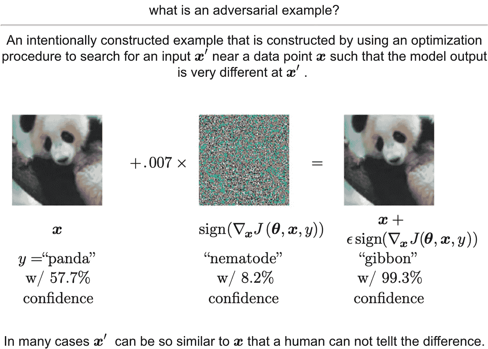
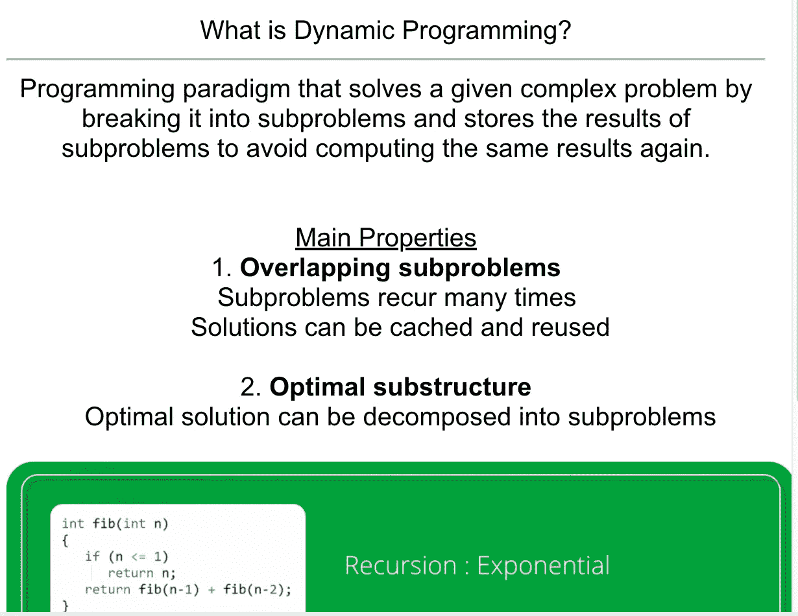
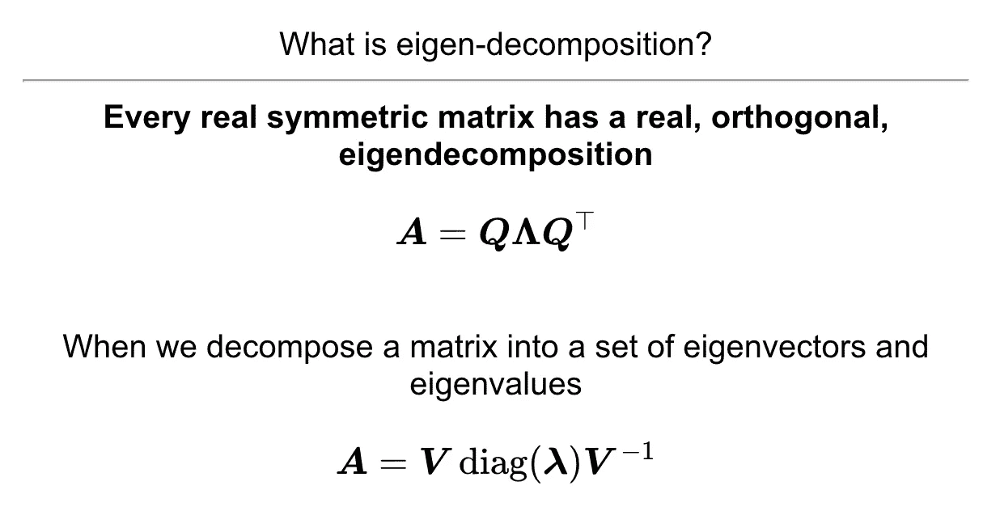
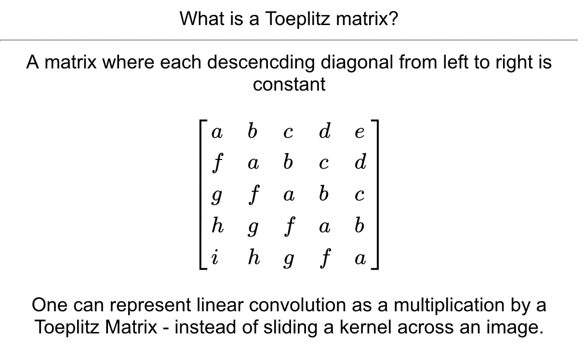

# 如何摧毁 DeepMind 研究测验

> 原文：<https://towardsdatascience.com/how-to-destroy-the-deepmind-research-quiz-90c9397c86db?source=collection_archive---------13----------------------->

DeepMind 是一家前沿的英国人工智能(AI)公司，旨在解决人工通用智能(AGI)。当他们的围棋程序 AlphaGo 击败了世界冠军 Lee Sedol 时，他们成了家喻户晓的名字。

在 [Unsplash](https://unsplash.com?utm_source=medium&utm_medium=referral) 上拍摄的 [ThisisEngineering RAEng](https://unsplash.com/@thisisengineering?utm_source=medium&utm_medium=referral)

# 小测验

注:我在 2019 年 6 月通过了研究小测验。从现在到那时，他们的采访内容可能已经改变了(不过我对此表示怀疑)。

DeepMind 的研究工程职位技术性很强。为了确保候选人有很强的技术背景，他们进行了一次**两小时的测验**。

测验由四部分组成:**计算机科学、数学、统计和机器学习**。问题的范围如此之广，这需要几乎包罗万象的知识。

准备小测验似乎让人不知所措。更糟糕的是，他们给出的准备材料清单包括两本教科书，三门在线课程，以及剑桥大学一年级数学和统计学课程的课堂笔记链接。

看两本厚厚的教材已经不现实了。在下面的部分，我会告诉你实际上需要做些什么来破坏这个测验。

# 准备

提交完学士论文后，我有一个月的时间准备小考。为了找出最有效的准备方式，我向在 DeepMind 工作的人和之前做过测试的人征求了意见。

我的大部分准备工作都集中在 Goodfellow 等人的[深度学习书籍](https://www.deeplearningbook.org/)上。我还看了 David Silver 的[强化学习(RL)课程](https://www.youtube.com/playlist?list=PLzuuYNsE1EZAXYR4FJ75jcJseBmo4KQ9-),但这并不是必需的，因为测验的 RL 部分是可选的。

我创建了一个 [Anki deck](https://apps.ankiweb.net/) 来帮助我记忆面试所需的一切。创建和记忆这个套牌让我对深度学习的基础有了深刻的欣赏和理解。

要获得 DeepMind Anki deck 的副本，请从我的 [Google Drive](https://drive.google.com/file/d/1r2kTnZnMZJRDByS_BETnLX7wxRFXmSma/view?usp=sharing) 下载。

我的 [DeepMind Anki 卡组](https://drive.google.com/file/d/1r2kTnZnMZJRDByS_BETnLX7wxRFXmSma/view?usp=sharing)中的示例卡

## 计算机科学

对于计算机科学的问题，我会建议你复习计算机科学学位的标准内容。

测验的这一部分要求具备标准计算机科学学位主题的知识，如线程、数据结构、死锁、排序算法、编程范例和网络。还是那句话，你只需要知道如何定义事物。因此，没有必要阅读整个 [CLRS](https://www.amazon.co.uk/Introduction-Algorithms-Thomas-H-Cormen/dp/0262033844) 。

来自[我的 DeepMind Anki Deck](https://drive.google.com/file/d/1r2kTnZnMZJRDByS_BETnLX7wxRFXmSma/view?usp=sharing) 的计算机科学卡示例

## 数学

数学问题侧重于线性代数、微积分和数值方法的概念。这一轮你还得手动微分或积分一个方程。所以，记得温习一下[链条规则](http://tutorial.math.lamar.edu/Classes/CalcI/DerivativeIntro.aspx)和[零件整合](http://tutorial.math.lamar.edu/Classes/CalcII/IntTechIntro.aspx)。

为了复习代数、微积分规则、三角恒等式，我推荐阅读拉马尔大学的[数学笔记](http://tutorial.math.lamar.edu/)并回答问题。笔记内容全面，制作精良。它们使得快速学习概念并付诸实践变得容易。

为了培养对线性代数概念的卓越直觉，我强烈推荐观看 3Blue1Brown 的《线性代数的本质》。有一个坚实的线性代数基础将使学习机器学习概念的数学变得容易得多。

来自[我的 DeepMind Anki 卡组](https://drive.google.com/file/d/1r2kTnZnMZJRDByS_BETnLX7wxRFXmSma/view?usp=sharing)的线性代数卡

## 统计学和机器学习

我与一位前 DeepMind 研究工程师交谈过，他们告诉我阅读深度学习的书籍。

按照他的建议，我读了这本书，并在卡片上加了一张卡片，用来回答任何可以被称为“是什么”的问题。

这一部分的问题从定义一个特定的矩阵及其属性到解释不同的架构如何工作。

DeepMind Anki 牌组中的一张牌

## 结论

在我为小测验学习的一个月里，我学到了很多。当我通过测验时，我很高兴。但是知道我对我的领域有了全新的理解，感觉好多了。

不幸的是，我没能通过最后一次面试(现场前)，但我在所有的面试中都有很好的经历。

我希望我的 Anki deck 或本文中的链接内容能帮助你在 DeepMind 的面试过程中取得成功。或者，任何其他基于机器学习的面试过程，你在未来的角色。

奥马尔·里德——你可以在 LinkedIn 和 T2 的 Twitter 上找到我。

## Reddit 资源

来自 Reddit 用户的[过去的问题](https://www.reddit.com/r/deepmind/comments/4bem0e/taking_the_research_engineer_quiz_in_the_next_2/d1pdjv7?utm_source=share&utm_medium=web2x)

Reddit 上的一般讨论