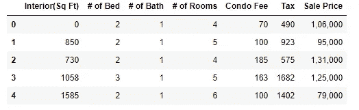
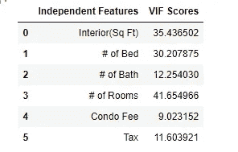
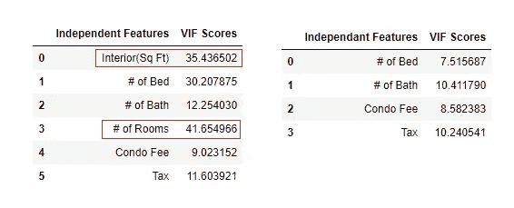
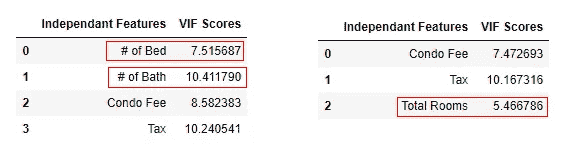

# 如何检测和处理多重共线性

> 原文：<https://towardsdatascience.com/how-to-detect-and-deal-with-multicollinearity-9e02b18695f1?source=collection_archive---------5----------------------->

## 关于识别和修复数值变量多重共线性的详细说明


照片由 Jaxon Lott 在 Unsplash 上拍摄

*多重共线性是需要排除的主要假设之一，以获得任何回归模型的更好估计* ✌️

在本文中，我将通过一个示例数据集来介绍多重共线性的影响、如何识别以及何时解决这个问题。

👉**什么是相关性？**

两个变量之间的相关性可以用范围在-1 到 1 之间的相关系数来衡量。如果值为 0，则两个变量是独立的，没有相关性。如果测量值非常接近这些值中的一个，则表示线性关系，并且彼此高度相关。这意味着一个变量的变化与其他变量的显著变化相关联。
相关性可以用[皮尔逊相关系数](https://en.wikipedia.org/wiki/Pearson_correlation_coefficient)和[斯皮尔曼秩序系数](https://en.wikipedia.org/wiki/Spearman's_rank_correlation_coefficient)来计算。

👉**什么是多重共线性？**

当回归分析中的独立变量之间存在高度相关性时，会发生多重共线性，这会影响对结果的整体解释。它降低了系数的功效，削弱了统计测量以信任 p 值来识别显著的独立变量。因此，我们无法检验自变量对因变量的个别解释。

👉**何时修复多重共线性？**

好消息是修复多重共线性并不总是强制性的。这完全取决于回归模型的主要目标。

多重共线性的程度会极大地影响 p 值和系数，但不会影响预测和拟合优度检验。如果您的目标是执行预测，并且没有必要理解自变量的重要性，则没有必要解决多重共线性问题。

👉**如何检验多重共线性？**

1.  **相关矩阵/相关图**
2.  **变动通货膨胀系数(VIF)**

*相关图可用于确定两个独立变量之间的相关性或双变量关系，而 VIF 用于确定一个独立变量与一组其他变量的相关性。因此，为了更好地理解，最好使用 VIF。*

VIF = 1 →不相关
VIF = 1 比 5 →中度相关
VIF > 10 →高度相关

让我们从代码开始…..

这是数据集[ [房屋销售](https://github.com/SushmithaPulagam/Fixing-Multicollinearity) ]的链接

数据集中的要素如下。销售价格是目标变量，其余为独立特征。



数据集的前几行

**用数值变量识别多重共线性**

现在我们将计算每个独立变量的 VIF 分数。

```
def vif_scores(df):
    VIF_Scores = pd.DataFrame()
    VIF_Scores["Independent Features"] = df.columns
    VIF_Scores["VIF Scores"] = [variance_inflation_factor(df.values,i) for i in range(df.shape[1])]
    return VIF_Scoresdf1 = df.iloc[:,:-1]
vif_scores(df1)
```



每个独立功能的 VIF

大多数变量的 VIF 分数都高于 10。如果我们使用此数据集构建回归模型，单个系数和 p 值将受到很大影响。我们将继续讨论如何解决这个问题。

**修复多重共线性—丢弃变量**

我们将考虑删除具有高 VIF 值的房间的特征*室内(平方英尺)*和 *#，因为相同的信息被其他变量捕获。此外，它还有助于减少数据集中的冗余。*

让我们比较一下去掉 VIF 值前后的 VIF 值。



突出显示的特征被移除并计算 VIF 分数

从上文中，我们可以注意到，在去掉高价值(*室内(平方英尺)*和*房间数量)【VIF 特征】后，其他变量的 VIF 得分也降低了。*

***修复多重共线性—组合变量***

*接下来，我们可以观察到床的数量和洗澡的数量可以合并为一个变量，这有助于我们从这两个变量中获取更多信息。*

```
*df5 = df4.copy()
df5['Total Rooms'] = df4.apply(lambda x: x['# of Bed'] + x['# of Bath'],axis=1)
X = df5.drop(['# of Bed','# of Bath'],axis=1)
vif_scores(X)*
```

**

*床的数量和浴室的数量组合成一个单一的功能房间总数*

*从上面，我们可以注意到所有三个变量(公寓费、税和总房间数)都达到了令人满意的 VIF 值，我们可以进一步建立回归模型。*

***总结***

*在本文中，我们学习了如何识别和修复回归分析中数值的多重共线性问题。这是一个迭代过程，我们还需要领域知识来决定对哪些变量采取适当的行动。还有其他技术，如 PCA 和正则化方法也可以解决这个问题。*

*请访问我的 GitHub 链接获取完整的[ [代码](https://github.com/SushmithaPulagam/Fixing-Multicollinearity)*

*感谢阅读，快乐学习！🙂*