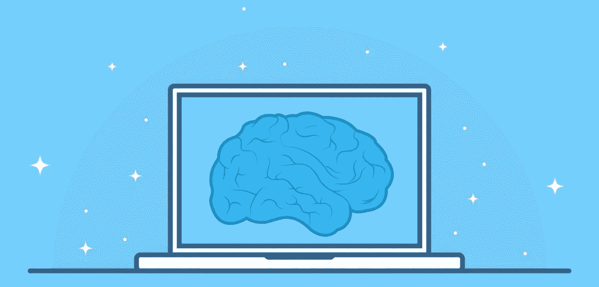
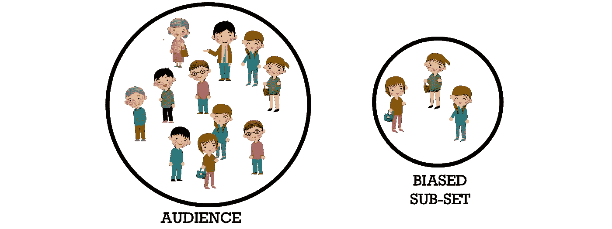
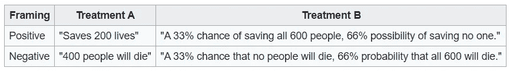
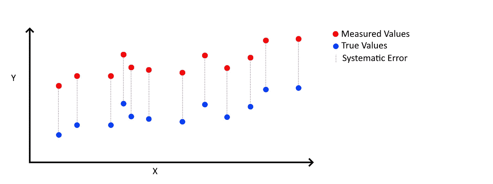
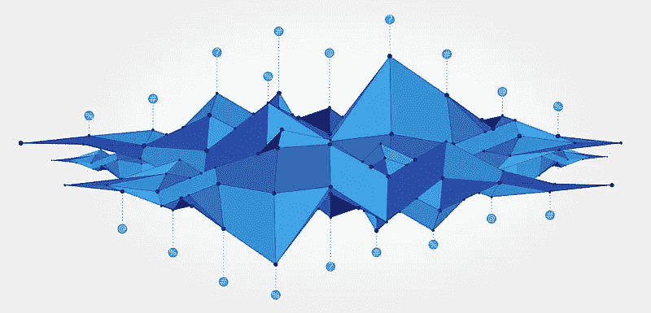
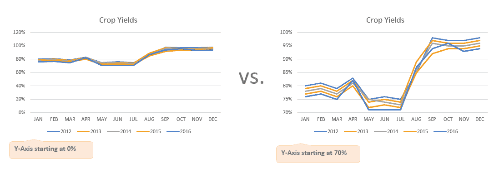
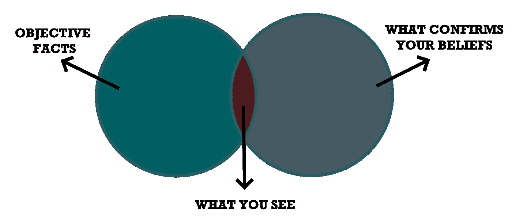
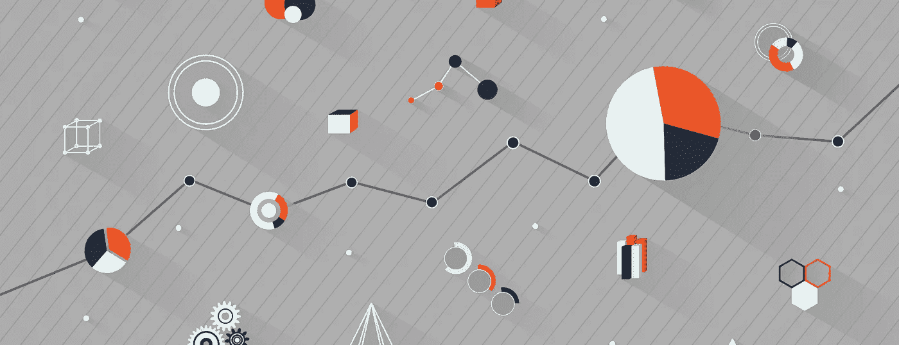
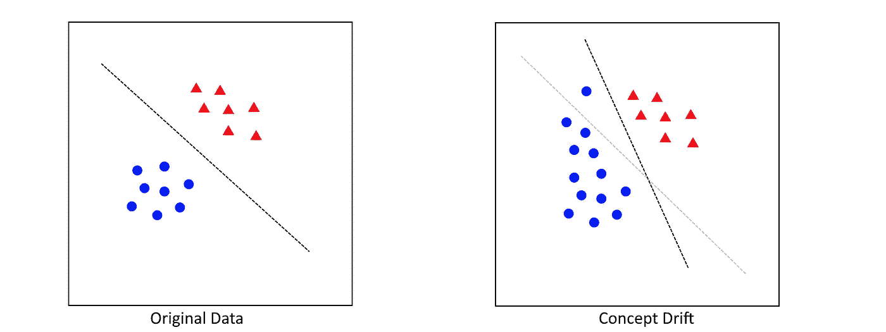

# 如何检测人工智能中的偏差

> 原文：<https://towardsdatascience.com/how-to-detect-bias-in-ai-872d04ce4efd?source=collection_archive---------17----------------------->

## 偏见

## 检测数据中常见的(认知)偏差

随着人工智能解决方案在我们的日常生活中变得更加根深蒂固，人工智能偏见在过去几年中一直是一个热门话题。作为一个转行做数据科学的心理学家，这个话题很贴近我的内心。

为了防止人工智能模型出现偏差，人们首先必须意识到各种偏差的存在。

> 在中，为了发现偏见，人们必须意识到它的存在。

为了做到这一点，本文将指导你在开发人工智能的不同阶段发现许多常见和不常见的偏见。这些阶段包括:

*   数据收集
*   数据预处理
*   数据分析
*   建模

希望了解你可能遇到的偏见将有助于你开发更少偏见的人工智能解决方案。

# 1.什么是偏见？

**偏见**被认为是对一个**想法**或**事情**的不成比例的倾向或偏见。偏见通常被认为是在人类的背景下，但它可以存在于许多不同的领域:

*   **统计数据** —例如，统计数据的系统失真
*   **研究**—例如，偏向于发表某些有意义的实验结果
*   **社会科学** —例如，对某些人群的偏见

在本文中，我们将结合(认知)偏见可能出现的几个领域，以了解偏见如何进入人工智能。

下面，我将介绍人工智能发展的常见阶段，并确定检测偏差的步骤。

# 2.数据收集

数据收集是你会发现偏见的第一个也是最常见的地方之一。最大的原因是数据通常是由人类收集或创建的，这使得错误、异常值和偏差很容易渗入数据中。

数据收集过程中发现的常见偏差:

*   `**Selection Bias**` —以样本不代表总体的方式选择数据

例如，在许多社会调查研究中，研究人员利用学生作为参与者来测试他们的假设。学生显然不能代表一般人群，可能会使研究结果产生偏差。

选择偏差

*   `**The Framing Effect**` —带有特定倾向的调查问题。

如下图所示，如果这个问题是正面的，人们更有可能拯救 200 条生命，相比之下有 33%的机会拯救所有人。

72%的参与者在积极的框架下选择了治疗 A(“拯救 200 条生命”)，当同样的选择出现在消极的框架下(“400 人会死”)时，这一比例下降到了 22%。

*   `**Systematic Bias**` —这是一个一致的、可重复的误差。

这通常是设备故障的结果。纠正这种错误很重要，因为错误很难检测。对机械或工艺的良好理解是必要的。

系统误差

*   `**Response Bias**` **—** 参与者对问题回答不准确或错误的一系列偏差。

问卷中经常出现回答偏差。由于这些都是由参与者填写的，人类的偏见很容易在数据中找到自己的位置。例如，`**Social Desirability Bias**`指出，人们很可能会在他们的反应中否认不受欢迎的特征。这可以通过强调好的行为或理解坏的行为来实现。类似地，`**Question Order Bias**`指出人们可能会根据问题的顺序不同地回答问题。

了解您如何设计收集流程会对您将要收集的数据类型产生重大影响，这一点很重要。如果不小心，你的数据会强烈偏向某些群体。任何由此产生的分析都可能是有缺陷的！

# 3.数据预处理

处理数据时，可以采取许多步骤来为分析做准备:

*   `**Outlier Detection**`

您通常希望移除异常值，因为它们可能会对某些分析产生不相称的影响。在所有人都在 20 到 30 岁之间的数据集中，年龄为 110 岁的人很可能不太能代表数据。

*   `**Missing Values**`

如何处理某些变量的缺失值会引入偏差。如果您要用平均值填充所有缺失的值，那么您是有目的地将数据推向平均值。这可能会让你偏向某些行为更接近平均值的群体。

*   `**Filtering Data**`

我见过很多次这种情况，数据被过滤得太多，几乎不能代表目标人群。这就介绍了，在某种程度上，`**Selection Bias**` 到你的数据。

# 4.数据分析

当开发一个人工智能解决方案时，最终的产品可能是一个模型或算法。然而，在数据分析中也很容易发现偏差。通常，我们在数据分析中会看到以下偏差:

*   `**Misleading Graphs**` —歪曲数据的扭曲图表，从而可能从中得出不正确的结论。

例如，在报告分析结果时，数据科学家可以选择从 0 开始绘制图表的 y 轴。虽然这不会在数据本身中引入偏差，但随着差异变得更加明显，可能会出现明显的`**Framing**` (见下图)。

如果 Y 轴从 0%开始，作物产量的差异似乎很小。然而，简单地将其更改为从 70%开始会导致看似不同的观点，而结果实际上是相同的。

如果你想了解更多关于误导性图表的影响，强烈推荐《[如何用统计数据撒谎](https://en.wikipedia.org/wiki/How_to_Lie_with_Statistics)》这本书！

*   `**Confirmation Bias**`——倾向于关注证实自己先入之见的信息。

假设你相信癌症和喝酒有很大的关系。当你进行分析时，你只是通过不考虑任何混淆变量来确认这个假设。

确认偏差

这可能看起来像一个极端的例子，你永远不会做的事情。但现实是，人类天生就有偏见，很难改变这一点。这种事发生在我身上的次数比我愿意承认的次数还要多！

# 5.建模

当谈到人工智能中的偏见时，人们通常指的是以某种方式偏向某一群人的人工智能系统。一个很好的例子是亚马逊创建的**雇佣算法** [，它显示了`**Gender Bias**`的决策。他们用于该算法的数据主要由担任技术职务的男性组成，这导致该算法倾向于将男性作为高潜力候选人。](https://www.reuters.com/article/us-amazon-com-jobs-automation-insight/amazon-scraps-secret-ai-recruiting-tool-that-showed-bias-against-women-idUSKCN1MK08G)

这是一个典型的`**Garbage-in-Garbage-out Phenomenon**` 的例子，你的人工智能解决方案和你使用的数据一样好。这就是为什么在开始数据建模之前**检测数据中的偏差**如此重要。

让我们来了解一下在创建预测模型时经常看到的几种偏见:

*   `**Bias/Variance Trade-Off**`——在**偏差**(模型的基本假设)和**方差**(使用不同数据时预测的变化)之间的权衡。

具有**高方差**的模型将过于关注训练数据，并且不能很好地概括。**高偏差**，另一方面，假设数据总是以相同的方式运行，这很少是真的。当增加你的偏差时，你通常会降低你的方差，反之亦然。因此，我们经常寻求平衡偏差和方差。

展示了偏差和方差之间权衡的影响。

*   `**Concept Drift**` —目标变量的统计特性随时间以不可预见的方式变化的现象。

假设您创建了一个模型，可以预测在线商店中客户的行为。这个模型开始时很棒，但是一年后它的性能就下降了。一年来，顾客的行为发生了变化。**客户行为**的概念已经改变，并对您的模型质量产生负面影响。

解决方案可以简单地是用新数据频繁地重新训练你的模型，以便与新的行为保持同步。然而，一个全新的模型可能是必要的。

随着时间的推移和新数据的添加，原始数据(左)与概念漂移(右)的对比。

*   `**Class Imbalance**`——(目标)类别出现频率的极度不平衡。

假设你想分类一张图片是包含一只猫还是一只狗。如果你有 1000 张狗的图片，只有 10 张猫的图片，那么就有一个`**Class Imbalance**`。

阶级不平衡的结果是模型可能偏向多数阶级。由于数据中的大多数图片都是狗的，因此模型只需要总是猜测“*狗*”就可以达到 **99%** **的准确性。**现实中，模型还没有学会猫和狗图片的区别。这可以通过选择正确的**验证措施**来补救(例如，平衡准确度或 F1 分数代替准确度)。

# 6.下一步是什么？

在阅读了你的人工智能解决方案中的所有这些潜在偏见之后，你可能会想:

> "但是我如何从我的解决方案中消除偏见呢？"—你

我认为要解决偏见，你需要了解它的来源。知道是成功的一半。之后，就要靠你自己想办法消除或处理这种特定的偏见了。例如，如果您发现问题源于数据中的选择偏差，那么最好添加额外的数据。如果类别不平衡使您的模型更偏向于多数群体，那么您可以研究重新采样的策略(例如，SMOTE)。

**注**:关于常见认知偏差的互动概述，请参见[这一](https://upload.wikimedia.org/wikipedia/commons/6/65/Cognitive_bias_codex_en.svg)惊人的可视化。

如果你和我一样，对人工智能、数据科学或心理学充满热情，请随时在 [LinkedIn](https://www.linkedin.com/in/mgrootendorst/) 上添加我。