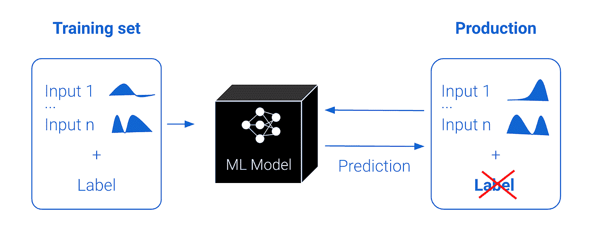
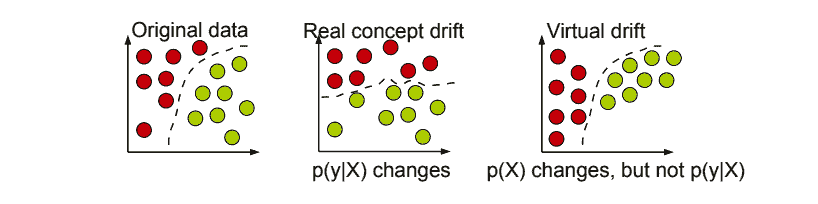
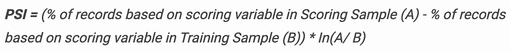
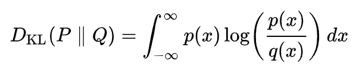
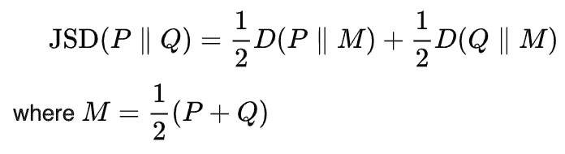
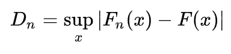
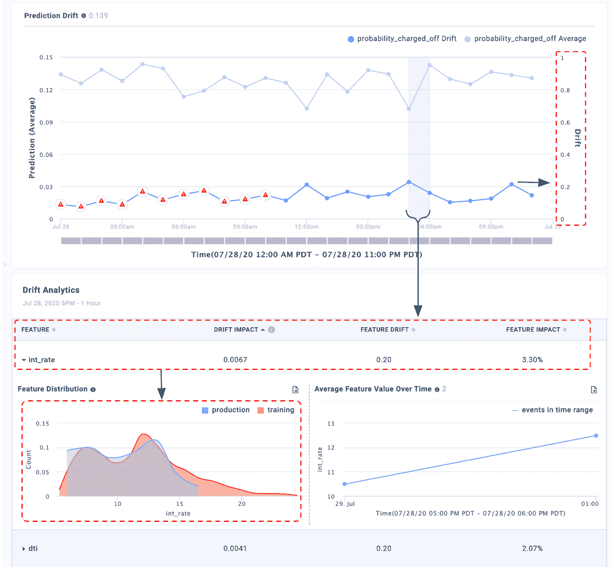

# 如何在 MLOps 监控中检测模型漂移

> 原文：<https://towardsdatascience.com/how-to-detect-model-drift-in-mlops-monitoring-7a039c22eaf9?source=collection_archive---------3----------------------->

[Adrià Tormo](https://unsplash.com/@tormius?utm_source=unsplash&utm_medium=referral&utm_content=creditCopyText) 在 [Unsplash](https://unsplash.com/photos/YEWvMidcKkg) 上拍摄的照片

人工智能在各行各业的采用率都在迅速上升。随着新冠肺炎的出现，消费者和企业对数字技术的采用在 T4 的八周时间内已经向前跨越了五年。然而，部署 ML 的复杂性阻碍了 AI 系统的成功。MLOps，特别是 ML 模型的生产面临的挑战与 DevOps 监控出现之前困扰软件的挑战相似。

# **ML 中的运营挑战**

与传统代码不同，ML 模型是独特的软件实体，由于部署后输入到模型中的数据的变化，其性能会随着时间而波动。因此，成功的人工智能部署需要持续的 ML 监控，以在持续的基础上重新验证其商业价值。

ML 团队可以使用模型性能指标，如 AUC、precision、recall 等。监控生产模型的实时性能。然而，这些指标需要这些实时预测的“基础事实”或标签。虽然标签在训练数据集中总是可用的，但是对于给定的用例，它们可能不总是在生产中可用。例如，当一个模型对贷款风险进行预测时，贷方将只知道贷款是否违约或在贷款期限内是否得到全额偿付。在没有这些输入的情况下，或者为了补充这些性能指标的可见性，监控生产特征和预测分布的变化可以用作性能问题的领先指标和故障排除工具。

已部署模型中的数据更改(图片由作者提供)

# **什么是漂移**

漂移是实体相对于基线的变化。数据漂移是模型漂移的基础，被定义为数据分布的变化。在生产 ML 模型的情况下，这是实时生产数据和基准数据集(可能是训练集)之间的变化，基准数据集代表模型打算执行的任务。由于现实世界的变化，随着时间的推移，生产数据可能偏离或偏离基线数据。预测值的漂移是概念漂移或数据完整性问题的一个很好的代理，并且可以通知模型重新训练节奏

**最大似然漂移的类型** 根据所比较的数据分布，可能有四种类型的漂移

1.  **概念漂移**或 P(Y|X)的变化是模型输入和输出之间实际关系的变化。概念漂移的一个例子是，当宏观经济因素使贷款风险更高，有资格获得贷款的标准更高。在这种情况下，以前被认为有信誉的收入水平不再有信誉。
2.  **预测漂移**或 P(Y hat 预测|X)的变化是模型预测的偏移。例如，当你的产品在更富裕的地区推出时，有更大比例的值得信赖的应用程序。您的模型仍然有效，但是您的企业可能还没有为这种情况做好准备
3.  **标签漂移**或 P(Y 地面真实值)的变化是模型输出或标签分布的变化
4.  **特征漂移**或 P(X)的变化是模型输入数据分布的变化。例如，所有申请人的收入增加了 5%，但经济基本面是一样的。

概念漂移本质上是真实决策边界和学习决策边界之间的差异。需要重新学习数据，以保持先前状态的错误率和准确性。如果地面实况标签可用并且足够实时，性能漂移是这种情况的最强指示器。在缺乏实时地面实况的情况下，预测和特征分布的漂移通常预示着世界上的重要变化。然而，与性能漂移不同，这些量可能会相对于精确建模的决策边界漂移(下面称为“虚拟漂移”)。在这种情况下，模型性能将保持不变。

参考文献:[概念漂移适应研究综述——Joao Gama 等](https://dl.acm.org/doi/10.1145/2523813)

**漂移的原因** 生产模型中出现漂移有多种原因。

1.当外部性导致数据分布发生真正的变化时。这可能需要具有更新的代表性训练集的新模型。

*   基本事实或输入数据分布的变化，如由于疫情、在新市场推出产品等而改变客户偏好。
*   有一个观念的转变。例如，竞争对手推出了一项新服务

2.当存在数据完整性问题时。这需要进一步的人体调查。

*   正确的数据在源处输入，但由于错误的数据工程而被错误地修改。例如，债务收入比值和年龄值在模型输入中互换。
*   来源处输入的数据不正确。例如，由于前端问题，网站表单接受将字段留空。

**如何计算数据漂移**
测量漂移有两种技术

1.  **统计**:这种方法使用统计指标。这种方法的一个关键优势是用户对这些指标的理解，这些指标已经在多个行业中使用，尤其是金融和银行业。它们还有一个额外的好处，就是实现起来更简单。

*   [*人口稳定指数*](https://www.listendata.com/2015/05/population-stability-index.html) ，流行于金融服务业，是衡量两个人口样本之间人口稳定性的指标。

人口稳定指数([参考](https://www.listendata.com/2015/05/population-stability-index.html))

*   [*kull back–lei bler*](https://en.wikipedia.org/wiki/Kullback%E2%80%93Leibler_divergence)*(或 KL)散度是衡量一个概率分布与第二个，参考概率分布如何不同的指标。*

**

*参考:[维基百科](https://en.wikipedia.org/wiki/Kullback%E2%80%93Leibler_divergence)*

*   *[*Jensen-Shannon*](https://en.wikipedia.org/wiki/Jensen%E2%80%93Shannon_divergence)(或 JS)散度是衡量两个概率分布之间相似性的一种方法。它基于 KL 散度，有一些显著的不同，包括它是对称的，并且它总是有一个有限的值。*

**

*参考:[维基百科](https://en.wikipedia.org/wiki/Jensen%E2%80%93Shannon_divergence)*

*   *[*Kolmogorov-Smirnov 检验*](https://en.wikipedia.org/wiki/Kolmogorov%E2%80%93Smirnov_test) (或 KS 检验)是连续(或不连续)一维概率分布相等的非参数检验，可用于比较样本与参考概率分布(单样本 K–S 检验)，或比较两个样本(双样本 K–S 检验)*

**

*参考:[维基百科](https://en.wikipedia.org/wiki/Kolmogorov%E2%80%93Smirnov_test)*

*2.**基于模型的**:这种方法使用一个模型来确定给定点或点群与参考基线之间的相似性。虽然使用基于 ML 的技术可以给出更准确的漂移图像，但是解释该技术的基础对于形成直觉来说可能是一个挑战。*

***如何识别漂移的原因***

*没有[正确的工具](https://blog.fiddler.ai/2020/07/announcing-ml-monitoring-capabilities/)来监控预测和特征漂移可能是乏味的。负责维护生产模型的数据科学家或 ML 工程师必须使用上述技术之一，不断将选定的实时流量窗口与基线进行比较。*

*捕捉到模型输出中的漂移后，下一步是确定哪些特征导致了漂移。很多时候，输入要素可能会漂移很多，但它可能不会在模型输出中造成有意义的漂移(即伪漂移)，因为该要素在模型中的重要性较低。识别漂移来源包括评估要素相对于其输入重要性的潜在漂移。*

*在 Fiddler，我们使用 JS-Divergence 和可解释的人工智能来帮助在几个步骤中识别和排除预测和特征漂移*

**

*确定数据漂移原因(作者截图)*

*   ***步骤 1** :快速识别实时模型输出中的预测漂移，与训练或基线集进行比较，用您在生产数据漂移阈值方面的领域知识来补充 JS-Divergence。*
*   ***步骤 2** :再次使用 JS-Divergence，向下钻取到所选的时间窗口，查看底层特征的漂移。使用可解释性查看漂移特征的特征重要性，并只关注那些有意义的影响，过滤掉虚假漂移。*
*   ***第三步**:比较数据分布，查看实际差异，围绕模型再训练的需要形成直觉。*
*   ***步骤 4** :进一步分析受影响的流量切片，了解漂移的性能*

*总之，数据变化可能是模型衰退的主要指标，因为 ML 模型是概率性的，并使用历史示例为高性能而训练。监控 ML 模型中的数据漂移有助于 ML 团队在生产中的性能问题上保持领先，可解释的 AI 通过提供强大的诊断工具来补充这一点，只需点击一下鼠标就可以找到任何可疑的时间片。*