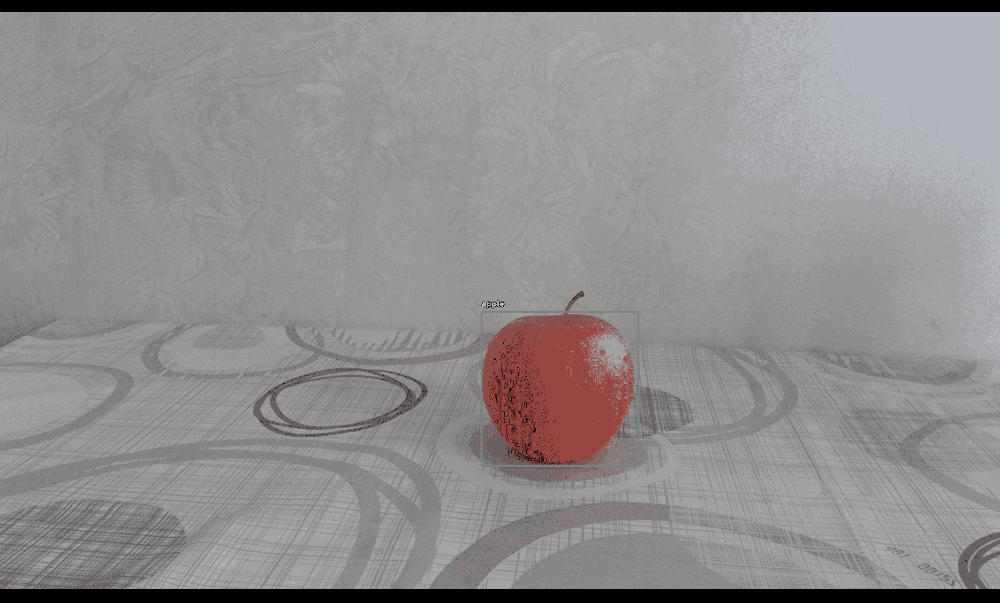
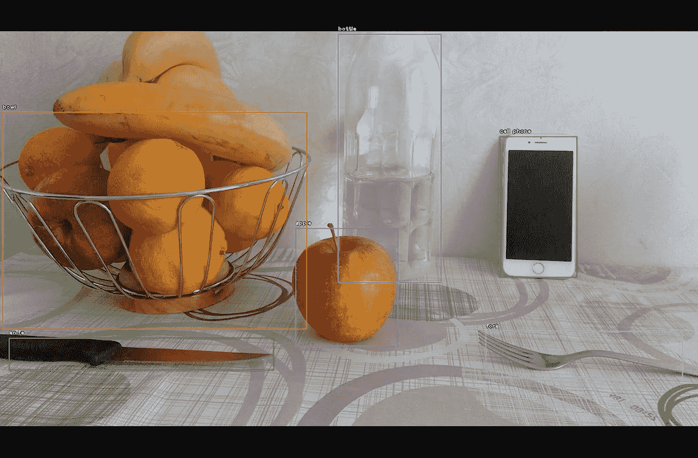
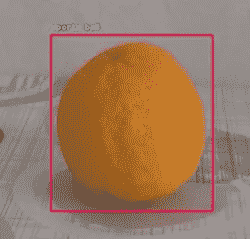
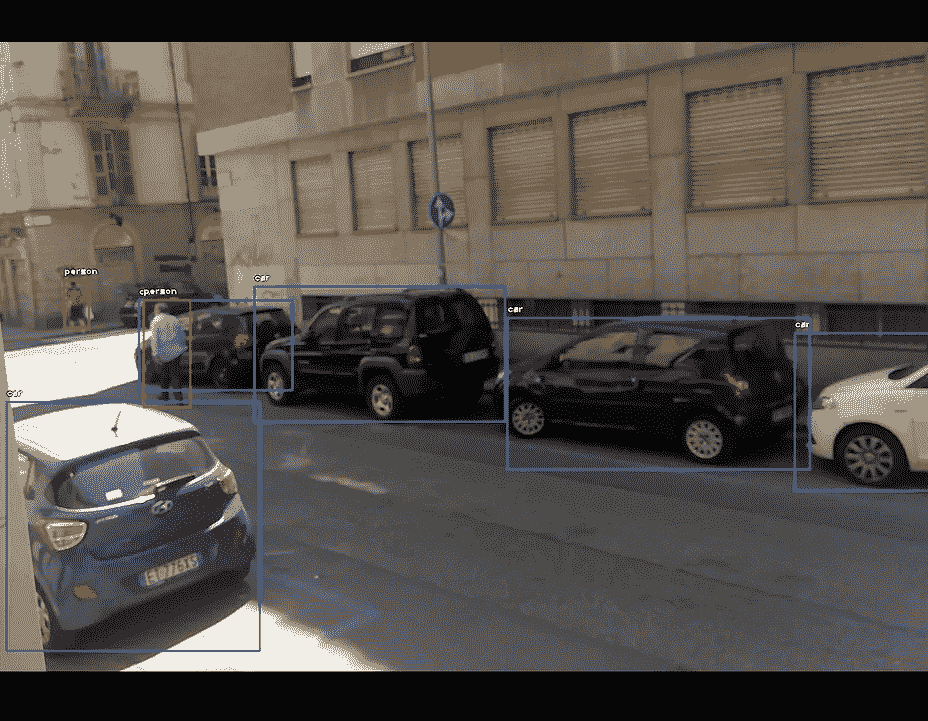
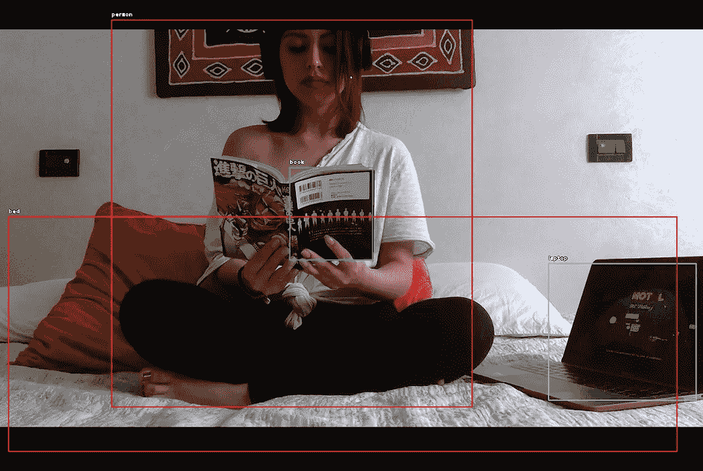

# 用 Python 和 YOLO 进行对象检测

> 原文：<https://towardsdatascience.com/how-to-detect-objects-with-your-webcam-82693c47bd8?source=collection_archive---------16----------------------->


## 使用网络摄像头的计算机视觉

## 摘要

在本文中，我将展示如何使用计算机视觉，并通过几行代码获得许多乐趣。



**计算机视觉**是人工智能领域，研究计算机如何从数字图像或视频中获得高层次的理解，以产生数字或符号信息。

计算机视觉的主要任务是图像分类和目标检测。第一种识别图像是关于什么的，并用标签对其进行分类。最好的例子是对狗和猫的照片进行分类。但是如果任务是数一张照片里有多少只狗和猫呢？这将是一个目标检测问题。**对象检测**处理在数字图像和视频中检测某类语义对象的实例。

[](https://pjreddie.com/darknet/yolo/)****(你只看一次)是最快的，因此也是使用最多的实时物体检测系统。基本上，它将单个神经网络应用于整个图像，将其划分为多个区域，然后网络预测每个区域的边界框和概率。在这篇文章中，我将使用一个预训练的 YOLO 模型来进行对象检测，因此，如果你想了解更多关于神经网络结构以及如何训练它，我建议阅读[原始论文](https://arxiv.org/abs/1506.02640)。****

## ****设置****

****有几种方法可以将预训练的模型用于计算机视觉，最流行的框架是 Tensorflow 和 Keras。不过我觉得 [**ImageAI**](https://imageai.readthedocs.io/en/latest/index.html) 对于我这种懒程序员来说是最方便的工具。这个包促进了深度学习和计算机视觉的使用，因为它提供了非常强大和简单的功能来执行对象检测和图像分类。****

****首先，我会**从[这里](https://github.com/OlafenwaMoses/ImageAI/releases/tag/1.0/)下载预先训练好的 YOLO** 的重量(文件“yolo.h5”)，并将该文件存储在我电脑的某个文件夹中。****

```
**modelpath = "mycomputer/myfolder/yolo.h5"**
```

****然后，我可以使用 ImageAI 非常容易地加载模型:****

```
**from **imageai** import Detectionyolo = Detection.**ObjectDetection**()
yolo.setModelTypeAsYOLOv3()
yolo.setModelPath(modelpath)
yolo.loadModel()**
```

****现在模型已经可以进行预测了，我们只需要数据。我将使用来自我的网络摄像头的实时视频流来为模型提供真实世界的图像。****

****你可以用 [OpenCV](https://docs.opencv.org/master/index.html) 包**访问你的设备摄像头**，它提供了一个视频捕捉对象，处理与打开和关闭网络摄像头相关的一切。****

```
**import **cv2**cam = cv2.**VideoCapture**(0) #0=front-cam, 1=back-cam
cam.set(cv2.CAP_PROP_FRAME_WIDTH, 1300)
cam.set(cv2.CAP_PROP_FRAME_HEIGHT, 1500)**
```

## ****预测****

****现在我们可以开始和 YOLO 一起玩了。该模型将用于逐帧预测摄像机捕捉到的图像，直到循环被中断。****

```
**while True: **## read frames**
    ret, img = cam.read() **## predict yolo**
    img, preds = yolo.**detectCustomObjectsFromImage**(input_image=img, 
                      custom_objects=None, input_type="array",
                      output_type="array",
                      minimum_percentage_probability=70,
                      display_percentage_probability=False,
                      display_object_name=True) **## display predictions**
    cv2.imshow("", img) **## press q or Esc to quit**   
    if (cv2.waitKey(1) & 0xFF == ord("q")) or (cv2.waitKey(1)==27):
        break**## close camera**
cam.release()
cv2.destroyAllWindows()**
```

********

****好玩吧。这个模型也做得很好，尽管它把一个橙子识别为一个“运动球”。****

********

****我使用的最小百分比概率为 0.70，这意味着只有当模型至少有 70%的把握时，我们才能检测到物体。降低该值会显示更多的对象，而增加该值可确保检测到精度最高的对象。****

****************

****我希望你喜欢它！如有问题和反馈，或者只是分享您感兴趣的项目，请随时联系我。****

> ****👉[我们来连线](https://linktr.ee/maurodp)👈****

> ****本文是 Python 系列 **CV 的一部分，参见:******

****[](https://pub.towardsai.net/image-classification-with-python-cnn-vs-transformers-fe509cbbc2d0) [## 用 Python 进行图像分类:CNN 与变形金刚

### 计算机视觉&用卷积神经网络、迁移学习、ViT、TensorFlow 和 HuggingFace 进行解释

pub.towardsai.net](https://pub.towardsai.net/image-classification-with-python-cnn-vs-transformers-fe509cbbc2d0) [](/document-parsing-with-python-ocr-75543448e581) [## 使用 Python 和 OCR 进行文档解析

### 使用计算机视觉从任何类型的文档中检测和提取文本、图形、表格

towardsdatascience.com](/document-parsing-with-python-ocr-75543448e581)****