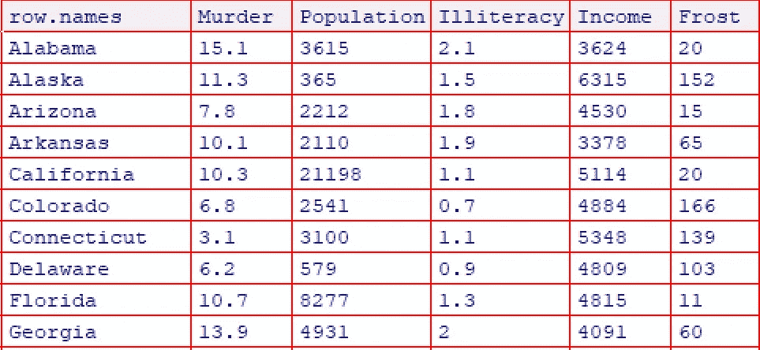
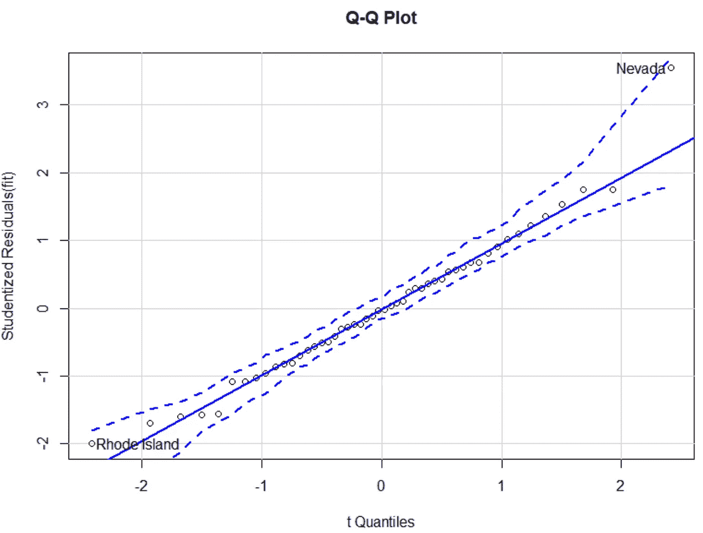
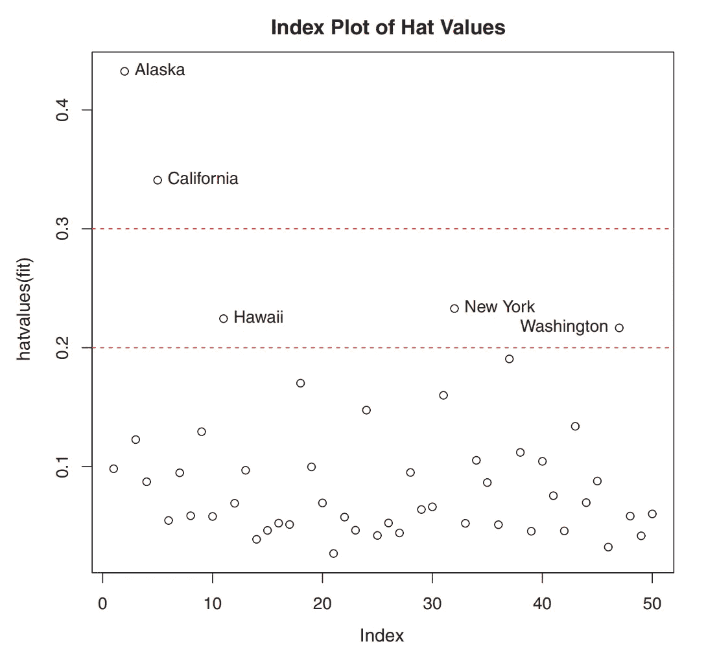
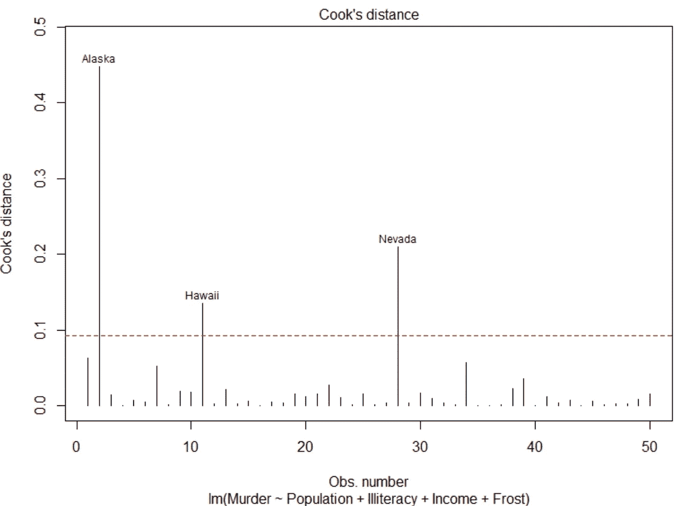
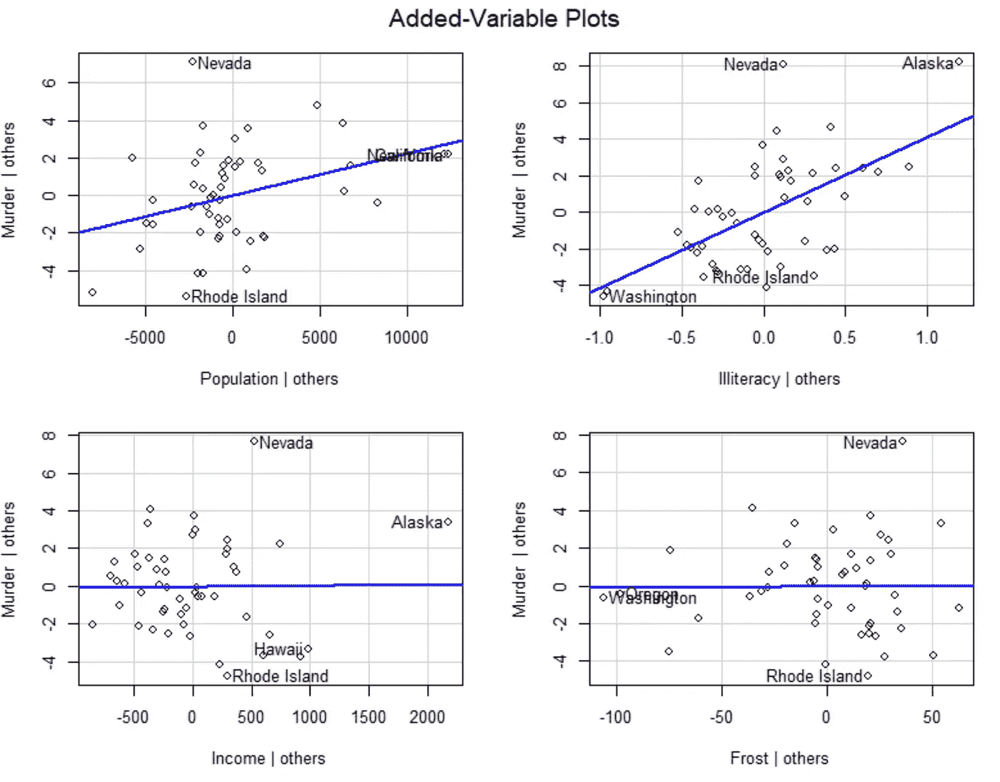
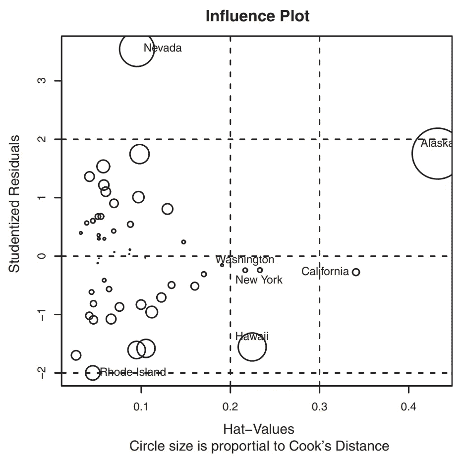

# 如何识别 R 回归模型上的异常观察值？

> 原文：<https://towardsdatascience.com/how-to-detect-unusual-observations-on-your-regression-model-with-r-de0eaa38bc5b?source=collection_archive---------6----------------------->


兰迪·法特在 [Unsplash](https://unsplash.com/s/photos/different?utm_source=unsplash&utm_medium=referral&utm_content=creditCopyText) 上的照片

在这篇文章中，我将讨论一些在回归分析中如何检测异常观察值的方法。作为一个分析师，你可能要考虑筛选不寻常的观察值，这将帮助你得到一个全面的回归模型。不寻常的观察结果需要进一步调查，要么是因为它们与其他观察结果不同，要么是因为它们对模型的结果产生了不成比例的影响。

我将回顾三种不同寻常的观察结果:

极端值

高杠杆观察

有影响的观察

为了便于说明，我将使用 R 样本数据(state.x77)。这个数据集为我们提供了美国 50 个州的人口数量、平均收入、文盲率、气温和谋杀率等信息。



来自 R 的 state.x77 样本数据

使用下面的代码，我想建立一个回归模型，该模型可以根据某些州的人口、收入、文盲率和温度来预测这些州的谋杀率。同样，我们将应用 [*汽车*](https://cran.r-project.org/web/packages/car/car.pdf) 包为我们的数据扯皮。

```
# How to Identify Unusual Observations in Regression?
# Created by Michaelino Mervisianoinstall.packages(“car”)
library(“car”)states <- as.data.frame(state.x77[,c(“Murder”, “Population”,”Illiteracy”, “Income”, “Frost”)])
View(states) fit <- lm(Murder ~ Population + Illiteracy + Income + Frost, data=states)
summary(fit)
```

从*总结*函数中，我们发现我们的模型确实是显著的，F 统计量的 p 值<为 0.05。从 t 检验中，我们还发现**文盲率**和**人口规模**对预测一个州的谋杀率有重要意义。接下来，我们将调查在我们的模型中是否有不寻常的观察

```
> summary(fit)Call:
lm(formula = Murder ~ Population + Illiteracy + Income + Frost, 
 data = states)Residuals:
 Min 1Q Median 3Q Max 
-4.7960 -1.6495 -0.0811 1.4815 7.6210Coefficients:
 Estimate Std. Error t value Pr(>|t|) 
(Intercept) 1.235e+00 3.866e+00 0.319 0.7510 
Population 2.237e-04 9.052e-05 2.471 0.0173 * 
Illiteracy 4.143e+00 8.744e-01 4.738 2.19e-05 ***
Income 6.442e-05 6.837e-04 0.094 0.9253 
Frost 5.813e-04 1.005e-02 0.058 0.9541 
 — -
Signif. codes: 0 ‘***’ 0.001 ‘**’ 0.01 ‘*’ 0.05 ‘.’ 0.1 ‘ ’ 1
Residual standard error: 2.535 on 45 degrees of freedom
Multiple R-squared: 0.567, Adjusted R-squared: 0.5285 
F-statistic: 14.73 on 4 and 45 DF, p-value: 9.133e-08
```

> **异常值**

回归模型不能很好地预测异常值。它们要么有非常大的正残差，要么有非常大的负残差。如果模型低估了响应值，那么它将由正残差表示。另一方面，如果模型高估了响应值，那么它将由负残差指示。

从我们的回归模型示例中，我们可以通过使用 Q-Q 图开始研究异常值观察。下面的代码有助于您绘制和发现潜在的异常值。内华达州(第 28 次观察)和罗德岛州(第 39 次观察)被检测为潜在的异常值。

```
> qqPlot(fit,labels=row.names(states), id.method=”identify”,
         simulate=TRUE, main=”Q-Q Plot”)
 Nevada Rhode Island 
 28          39
```



应用 *outlierTest* 函数帮助我们确认潜在的异常值是否确实是异常值。统计检验表明，内华达州不可否认地被检测为异常值，p 值= 0.048。

```
> outlierTest(fit)
       rstudent unadjusted p-value Bonferroni p
Nevada 3.542929         0.00095088     0.047544
```

Q-Q 图也证实了内华达有一个大的正残差。意味着我们的模型低估了这个州的谋杀率。你可以发现内华达州的谋杀率是 11.5%，而模型预测只有 3.9%。我们清楚地知道，与其他州相比，内华达州确实不同。

```
> states[“Nevada”,]
        Murder Population Illiteracy Income Frost
Nevada   11.5     590        0.5      5149   188> fitted(fit)[“Nevada”]
 Nevada 
3.878958
```

因此，您可以删除这个观察结果，并重新运行测试来查看是否存在其他异常值。作为一名分析师，你可能想知道为什么内华达州的谋杀率很高。也许你可以把这个问题发到 Quora 上，让我知道你是否有答案😉

> **高杠杆点**

当我们将其与其他预测值进行比较时，如果观察值类似于异常值，则它们将被视为高杠杆点。严格地说，它们具有不常见的预测值组合，而响应值对确定杠杆作用的影响较小。

您可以通过查看模型中估计的参数数量与样本大小的比率来计算高杠杆观察值。如果观察值的比率大于平均比率的 2 -3 倍，则该观察值被认为是高杠杆点。我个人喜欢用这个简单的函数来识别高杠杆的观测值。

```
highleverage <- function(fit) {
 p <- length(coefficients(fit))
 n <- length(fitted(fit))
 ratio <-p/n
 plot(hatvalues(fit), main=”Index Plot of Ratio”)
 abline(h=c(2,3)*ratio, col=”red”, lty=2)
 identify(1:n, hatvalues(fit), names(hatvalues(fit)))
}
highleverage(fit)
```



高杠杆点

上图显示阿拉斯加和加利福尼亚的比例最高。这意味着如果我们将这两种状态的预测值与其他状态进行比较，这两种状态是非常不寻常的。原因如下:

对于阿拉斯加来说，该州的收入比其他州高得多，但人口较少，气温较低。

对于加州来说，这个州的人口比其他州多得多，同时收入更高，气温也更高。

与其他 48 个州相比，这两个州确实很特别。有一点要记住，并非所有高杠杆的观察都是有影响力的观察。这将取决于他们是否是离群值。

> **有影响的观察**

对模型参数值具有不成比例影响的观察值可以被认为是有影响的观察值。例如，如果您删除一个观察，那么它会显著地改变您模型。那个单一的观察一定是有影响力的观察。因此，检查我们的数据是否包含有影响的点是很重要的。

根据我的经验，有两种有效的方法来识别有影响的观察结果:

**1。** **厨师的距离**

下面的代码提供了一种方法来计算截止值，并为我们的每次观察绘制库克距离。该图显示阿拉斯加、夏威夷和内华达是有影响的观察点。移除这 3 个状态将对我们的回归模型中的截距和斜率值产生重大影响。

```
cutoff <- 4/(nrow(states)-length(fit$coefficients)-2)
plot(fit, which=4, cook.levels=cutoff)
abline(h=cutoff, lty=2, col=”red”)
```



每次观察的库克距离图

我需要强调的是，上面的图确实有助于识别有影响的观察，但是它没有给出关于这些观察如何影响模型的额外信息。这就是为什么**增加的变量**图可以成为我们挖掘更多信息的一个选项。

**2。** **增加了可变地块**

附加变量图的工作原理是绘制每个预测变量与响应变量和其他预测变量的关系图。可以使用 *car* 包中的 *avPlots()* 函数轻松创建。

```
library(car) 
avPlots(fit, ask=FALSE, id.method=”identify”)
```

从下图中，每个图中的直线是该预测变量的实际回归系数。我们可以通过想象如果代表观察结果的点被移走，线会如何变化来观察有影响的观察结果的影响。



添加了变量图

现在，我们将把来自异常值、高杠杆和有影响的观察的所有信息合并到一个单一的信息图中。我个人发现 *influencePlot()* 是一个非常方便的函数来表示这些不寻常的观察问题。

```
library(car) 
influencePlot(fit, id.method=”identify”, main=”Influence Plot”, sub=”Circle size is proportional to Cook’s distance”)
```



影响图

上图方便地总结了我们的最终裁决。这是:

内华达州和罗德岛州是异常值。

加利福尼亚、华盛顿、纽约和夏威夷是**高杠杆观察点**

阿拉斯加是**有影响力的观测地**

我希望你发现这篇文章是有用的，并与他人分享

干杯，

米夏里诺·梅尔维西亚诺