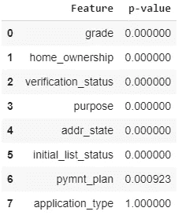
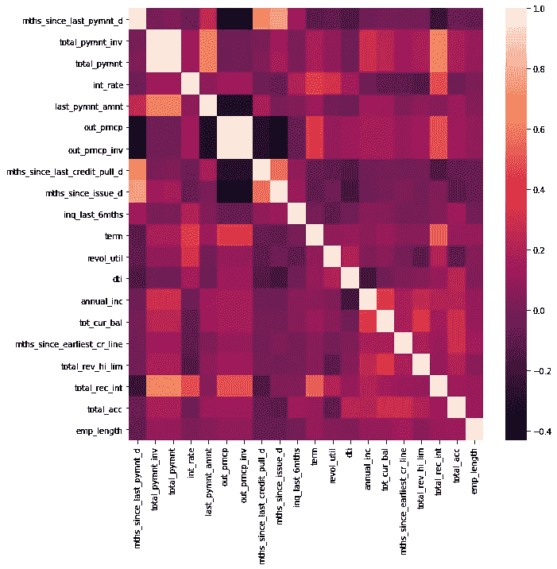
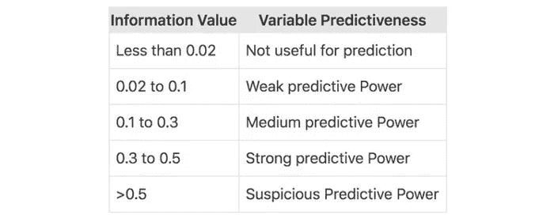
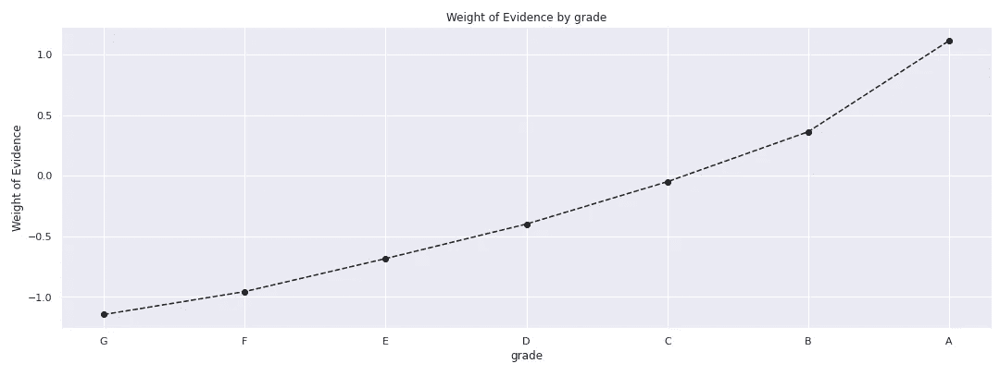
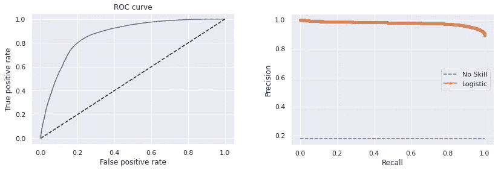
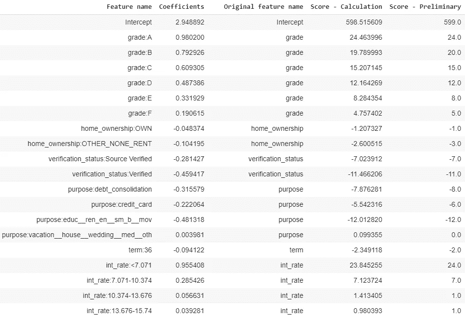
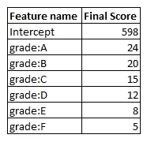

# 如何开发信用风险模型和记分卡

> 原文：<https://towardsdatascience.com/how-to-develop-a-credit-risk-model-and-scorecard-91335fc01f03?source=collection_archive---------0----------------------->

## 使用 Python 进行统计信用风险建模、违约概率预测和信用记分卡开发的演练

照片由来自 [Pexels](https://www.pexels.com/photo/art-artistic-blank-book-bindings-616849/?utm_content=attributionCopyText&utm_medium=referral&utm_source=pexels) 的 [Lum3n](https://www.pexels.com/@lum3n-44775?utm_content=attributionCopyText&utm_medium=referral&utm_source=pexels) 拍摄

我们都知道，并保持跟踪，我们的信用评分，不是吗？这个非常重要的数字从 20 世纪 50 年代就存在了，它决定了我们的信用度。我想我们都有一个基本的直觉，如何计算信用评分，或哪些因素影响它。参考[我以前的文章](https://medium.com/swlh/how-to-quantify-risk-and-creditworthiness-c76725bc2380)，了解更多关于信用评分的细节。

在本文中，我们将详细介绍用 Python 开发数据驱动的信用风险模型的步骤，以预测违约概率(PD)并为现有或潜在的借款人分配信用评分。我们将使用高度可解释、易于理解和实施的记分卡来确定信用评分，使计算信用评分变得轻而易举。

在进行这个案例研究时，我将假设自己具备 Python 知识，并对某些统计和信用风险概念有基本的理解。

我们有很多要讲的，所以让我们开始吧。

# 初步数据探索和分割

我们将使用 Kaggle 上提供的一个与美国 P2P 贷款机构 [Lending Club](https://www.lendingclub.com/) 发放的消费者贷款相关的[数据集](https://drive.google.com/file/d/1xaF743cmUgI5kc76I86AeZDE84SMkMnt/view?usp=sharing)。原始数据包括 2007 年至 2014 年间发放的超过 45 万笔消费贷款的信息，其中有近 75 个特征，包括当前贷款状态以及与借款人及其支付行为相关的各种属性。参考[数据字典](https://github.com/finlytics-hub/credit_risk_model/blob/master/Data%20Dictionary.xlsx)了解每列的详细信息。

这里解释的概念和总体方法也适用于公司贷款组合。

最初的数据研究揭示了以下内容:

*   18 个要素的缺失值超过 80%。考虑到缺失值的高比例，任何估算它们的技术都很可能导致不准确的结果
*   某些与信用风险无关的静态特征，如`id`、`member_id`、`url`、`title`
*   其他预期仅在借款人违约时填充的前瞻性特征，如`recoveries`、`collection_recovery_fee`。因为我们的目标是预测未来的违约概率，所以在我们的模型中包含这些特征是违反直觉的，因为这些特征在违约事件发生之前不会被观察到

我们将放弃上述所有功能。

## 识别目标变量

基于数据探索，我们的目标变量似乎是`loan_status`。快速看一下它的独特价值和它们所占的比例也证实了这一点。

图 1:默认值的分布

基于领域知识，我们将具有以下`loan_status`值的贷款归类为违约(或 0):

*   注销
*   默认
*   后期(31-120 天)
*   不符合信贷政策。状态:已关闭

所有其他值将被分类为好(或 1)。

## 数据分割

现在让我们将数据分成以下几组:训练(80%)和测试(20%)。我们将对训练测试执行重复的分层 k 折叠测试，以初步评估我们的模型，而测试集将保持不变，直到最终的模型评估。这种方法遵循最佳的模型评估实践。

上面的图 1 向我们展示了我们的数据，正如预期的那样，严重偏向于优质贷款。相应地，除了随机混合抽样之外，我们还将对训练/测试分割进行分层，以便测试集中的好贷款和坏贷款的分布与分割前数据中的分布相同。这是通过`train_test_split`功能的`stratify`参数实现的。

在任何数据清理或缺失值插补之前拆分我们的数据，可以防止任何数据从测试集泄漏到训练集，并导致更准确的模型评估。详情请参考[我之前的文章](/how-to-avoid-potential-machine-learning-pitfalls-a08781f3518e)。

到目前为止所做工作的代码片段如下:

# 数据清理

接下来是一些必要的数据清理任务，如下所示:

*   从`emp_length`列中删除文本(如年份)并将其转换为数字
*   对于所有带日期的列:将它们转换为 Python 的`datetime`格式，创建一个新列作为模型开发日期和相应日期特性之间的差异，然后删除原始特性
*   从`term`列中删除文本并将其转换为数字

我们将为上述每个任务定义助手函数，并将它们应用于训练数据集。拥有这些助手函数将帮助我们在测试数据集上再次执行这些相同的任务，而无需重复我们的代码。

# 特征选择

接下来，我们将执行特征选择，使用类别特征的卡方检验和数值特征的 ANOVA F 统计来确定最适合二元分类问题的特征。请参考[我以前的文章](/how-to-find-the-best-predictors-for-ml-algorithms-4b28a71a8a80)，了解关于这些特征选择技术的更多细节，以及为什么不同的技术被应用于分类变量和数值变量。

根据我们对分类特征的卡方检验，p 值按升序排列如下:

图 2:卡方检验的 p 值

为了简单起见，我们将只保留前四个特性，而去掉其余的。

34 个数值特征的方差分析 F 统计显示了从 23，513 到 0.39 的大范围 F 值。我们将保留前 20 个特性，并可能回来选择更多特性，以防我们的模型评估结果不够合理。

接下来，我们将计算所选的前 20 个数字特征的成对相关性，以检测任何潜在的多重共线性变量。这些成对相关的热图将两个特征(`out_prncp_inv`和`total_pymnt_inv`)识别为高度相关。因此，对于我们的模型，我们也将删除它们。

图 3:成对相关

接下来，我们将简单地将所有要删除的特性保存在一个列表中，并定义一个函数来删除它们。这些特征选择技术的代码如下:

# 一键编码和更新测试数据集

接下来，我们将创建四个最终分类变量的虚拟变量，并通过迄今为止应用于训练数据集的所有函数来更新测试数据集。

关于我们创建虚拟变量的方式，请注意以下几点:

*   我们将对所有变量使用特定的命名约定:原始变量名、冒号、类别名
*   一般来说，为了避免多重共线性，通过`pd.get_dummies`的`drop_first`参数去掉一个哑变量。但是，我们在这个阶段不会这样做，因为我们需要所有的虚拟变量来计算我们的类别的证据权重(WoE)和信息值(IV)——稍后会详细介绍。稍后，我们将为每个类别删除一个虚拟变量
*   我们也不会直接在我们的训练数据中创建虚拟变量，因为这样做会丢弃分类变量，这是我们进行 WoE 计算所需要的。因此，我们将创建虚拟变量的新数据框架，然后将其连接到原始训练/测试数据框架。

接下来，我们将通过传递到目前为止定义的所有函数来更新测试数据集。在创建虚拟变量之后，要特别注意重新索引更新的测试数据集。让我用一个实际的例子来解释一下。

考虑一个名为`grade`的分类特征，其在预分割数据中具有以下唯一值:A、B、C 和 D。假设 D 的比例非常低，并且由于训练/测试分割的随机性，在测试集中没有选择在`grade`类别中具有 D 的观测值。因此，`grade`在训练数据中的虚拟变量将是等级:A、等级:B、等级:C 和等级:D，但是等级:D 不会被创建为测试集中的虚拟变量。我们将无法在测试集上应用拟合的模型来进行预测，因为缺少模型预期呈现的特征。因此，我们重新索引测试集，以确保它与训练数据具有相同的列，任何缺少的列都添加 0 值。0 值非常直观，因为在任何测试样本中都不会观察到该类别。

# WoE 宁滨和特征工程

基于 WoE 为所有数字和分类变量创建新的分类特征是开发信用风险模型之前最关键的步骤之一，也是非常耗时的。GitHub 和其他地方提供了特定的定制 Python 包和函数来执行这个练习。然而，我更喜欢手动操作，因为它让我有更多的灵活性和对过程的控制。

## 但什么是悲哀和四？

证据权重(WoE)和信息价值(IV)用于特征工程和选择，并广泛用于信用评分领域。

WoE 是一种独立变量相对于目标变量的预测能力的度量。它衡量一个特定的特征在多大程度上可以区分目标类别，在我们的例子中，就是好客户和坏客户。

IV 根据我们的功能的相对重要性对它们进行排序。

根据 Baesens 等人和 Siddiqi 的研究，WOE 和 IV 分析使人们能够:

*   考虑每个变量对结果的独立贡献
*   检测线性和非线性关系
*   根据单变量预测强度对变量进行排序
*   可视化变量和二元结果之间的相关性
*   无缝比较连续变量和分类变量的强度，而不会产生虚拟变量
*   无缝处理缺失值，无需插补。(注意，我们到目前为止还没有估算任何缺失值，这就是原因。在 WoE 特征工程步骤中，缺失值将被指定为一个单独的类别)
*   评估缺失值的预测能力

**证据权重**

计算 WoE 公式如下:

正的 WoE 值意味着好客户的比例大于坏客户的比例，反之亦然。

**WoE 特征工程的步骤**

1.  计算分类变量的每个唯一值(bin)的权重，例如 grad:A、grad:B、grad:C 等。
2.  基于连续变量的分布和唯一观测值的数量，将连续变量归入离散的箱中，可能使用`pd.cut`(称为精细分类)
3.  计算连续变量的每个衍生箱的权重
4.  一旦为分类特征和数值特征的每个箱计算了权重，就按照以下规则组合箱(称为粗分类)

**与合并 WoE bins 相关的规则**

1.  每个箱应该具有至少 5%的观察值
2.  对于好的和坏的贷款，每个箱应该是非零的
3.  每个类别的悲哀应该是不同的。相似的组应该被聚集或组合在一起。这是因为有着相似悲哀的箱子有着几乎相同的好的或坏的贷款比例，意味着相同的预测能力
4.  WOE 应该是单调的，即随着仓的增加或减少
5.  缺失值被单独入库

上述规则已被普遍接受，并在学术文献中有详细记载。

**为什么离散化数字特征**

数值特征的离散化或宁滨通常不推荐用于机器学习算法，因为它经常导致数据丢失。然而，我们的最终目标是最终基于信用评分模型创建一个记分卡。通过按照记分卡标准对新的未经训练的观察(例如，来自测试数据集的观察)进行分类来利用记分卡。

考虑到我们没有对连续变量进行分类，那么我们将只有一个具有相应系数/权重的收入类别，并且所有未来的潜在借款人将在该类别中被给予相同的分数，而不管他们的收入如何。但是，如果我们将收入类别离散化为离散的类别(每个类别具有不同的权重),从而产生多个类别，则潜在的新借款人将根据其收入被分类到其中一个收入类别中，并相应地进行评分。

自 20 世纪 60 年代 FICO 首次开发商业记分卡以来，连续变量的 WoE 宁滨已成为一种既定的行业实践，并有大量文献支持它。将文献中的连续特征离散化的一些其他理由是:

*   考虑到高昂的货币和非货币错误分类成本，法律上通常要求记分卡易于被外行人解读(这是巴塞尔协议、几乎所有央行和各种贷款实体提出的要求)。这很容易通过没有任何连续变量的记分卡来实现，所有变量都是离散化的。高分或低分的原因很容易理解并向第三方解释。与更复杂的模型相比，所有这些都使得记分卡更容易获得最终用户的“认可”
*   记分卡的另一个法律要求是，它们应该能够区分低风险和高风险 observations⁴.WoE 宁滨负责这一点，因为 WoE 正是基于这一概念
*   单调性。宁滨算法期望以这样一种方式在条柱上划分输入数据集，即如果你从一个条柱沿同一方向走到另一个条柱，信用风险指标会发生单调变化，即如果你的收入发生变化，信用评分不会突然增加。这源于一个潜在的假设，即在全球非单调 relationship⁵的情况下，预测变量可以将较高的风险与较低的风险分开
*   逻辑回归模型的一个基本假设是所有特征与目标变量的对数优势(logit)具有线性关系。收入 38000 美元的人和收入 39000 美元的人有区别吗？很有可能不是，但是把收入当作一个连续变量来做这个假设。通过基于 WoE 进行分类，我们可以让我们的模型决定是否存在统计差异；如果没有，它们可以合并在同一个类别中
*   缺失值和异常值可以单独分类，也可以与最大或最小的条柱组合在一起-因此，无需假设来估算缺失值或处理异常值

**信息价值(四)**

IV 计算如下:

根据 Siddiqi 的说法，按照惯例，信用评分中 IV 的值解释如下:

**注意**当使用二元逻辑回归模型时，IV 仅作为特征选择和重要性技术有用。

## 我们数据的特征工程和 IV 计算

理论讲够了，现在让我们为我们的训练数据计算 WoE 和 IV，并执行所需的特征工程。我们将定义如下三个函数，每个函数用于:

*   计算并显示分类变量的 WoE 和 IV 值
*   计算并显示数值变量的 WoE 和 IV 值
*   将权重值绘制在箱柜上，以帮助我们可视化权重和组合相似的权重箱柜

应用于分类特征`grade`时，这两个函数的输出示例如下所示:

WoE 和 IV 值

悲哀情节

一旦我们计算并可视化了 WoE 和 IV 值，接下来是最繁琐的任务，即选择要组合的仓，以及是否丢弃给定 IV 的任何特征。到目前为止，我们剩下的入围功能将以下列方式之一进行处理:

*   给定离散和单调的 WoE 并且没有任何缺失值:`grade`、`verification_status`、`term`，不需要组合 WoE 箱或创建单独的缺失类别
*   将具有非常低观测值的 WoE 箱与相邻箱组合:`home_ownership`、`purpose`
*   将具有相似 WoE 值的 WoE 箱组合在一起，潜在地具有单独的缺失类别:`int_rate`、`annual_inc`、`dti`、`inq_last_6mths`、`revol_util`、`out_prncp`、`total_pymnt`、`total_rec_int`、`total_rev_hi_lim`、`mths_since_earliest_cr_line`、`mths_since_issue_d`、`mths_since_last_credit_pull_d`
*   忽略具有低或非常高 IV 值的特征:`emp_length`、`total_acc`、`last_pymnt_amnt`、`tot_cur_bal`、`mths_since_last_pymnt_d_factor`

请注意，对于带有异常值的某些数字特征，我们将在排除它们后计算并绘制 WoE，这些特征将被分配到它们自己的单独类别中。

一旦我们探索了我们的特性并确定了要创建的类别，我们将使用 sci-kit learn 的`[BaseEstimator](https://scikit-learn.org/stable/modules/generated/sklearn.base.BaseEstimator.html)`和`[TransformerMixin](https://scikit-learn.org/stable/modules/generated/sklearn.base.TransformerMixin.html)`类定义一个自定义的“transformer”类。像其他 sci-kit learn 的 ML 模型一样，这个类可以根据我们的要求在数据集上进行转换。这个类的另一个显著优势是，它可以作为 sci-kit learn 的`[Pipeline](https://scikit-learn.org/stable/modules/generated/sklearn.pipeline.Pipeline.html)`的一部分，使用重复分层 k-Fold 交叉验证来评估我们的训练数据。以这种结构化的方式使用管道将允许我们执行交叉验证，而不会在训练和测试折叠之间有任何潜在的数据泄漏。

请记住，到目前为止我们已经使用了所有的虚拟变量，因此我们还将使用自定义类为每个类别删除一个虚拟变量，以避免多重共线性。

与 WoE 和 IV 相关的三个函数和 transformer 类的代码如下:

# 模特培训

最后，我们来到了涉及一些实际机器学习的阶段。我们将在我们的训练集上拟合一个逻辑回归模型，并使用`[RepeatedStratifiedKFold](https://scikit-learn.org/stable/modules/generated/sklearn.model_selection.RepeatedStratifiedKFold.html)`对其进行评估。注意，我们已经将`LogisticRegression`类的`class_weight`参数定义为`balanced`。这将迫使逻辑回归模型使用成本敏感学习来学习模型系数，即，在模型训练期间惩罚假阴性多于假阳性。成本敏感学习对于不平衡数据集是有用的，这通常是信用评分的情况。参考[我以前的文章](/how-to-effectively-predict-imbalanced-classes-in-python-e8cd3b5720c4)了解不平衡分类问题的更多细节。

我们的评估指标将是受试者操作特征曲线下面积(AUROC)，这是一个广泛使用和接受的信用评分指标。RepeatedStratifiedKFold 将在保留类不平衡的同时拆分数据，并多次执行 k 倍验证。

在对我们的训练集执行 k-folds 验证并对 AUROC 感到满意后，我们将在整个训练集上拟合管道，并创建一个包含特征名称和从模型返回的系数的汇总表。

# 预测时间

这一切都归结为:应用我们训练的逻辑回归模型来预测测试集的违约概率，这种方法迄今为止还没有使用过(除了一般的数据清理和特征选择任务)。我们将把预测的违约概率与实际类别一起保存在一个单独的数据框架中。

接下来，我们将绘制 ROC 曲线，PR 曲线，并计算 AUROC 和 Gini。我们的 AUROC on 测试集得出 0.866，基尼系数为 0.732，两者都被认为是相当可接受的评估分数。我们的 ROC 和 PR 曲线大概是这样的:

测试集上预测和模型评估的代码是:

# 记分卡开发

我们的难题的最后一部分是创建一个简单、易于使用和实施的信用风险记分卡，它可以由任何外行人使用来计算个人的信用评分，给出关于他和他的信用历史的某些必需信息。

还记得在模型训练阶段创建的汇总表吗？我们将把我们从模型中遗漏的所有参考类别附加到它上面，系数值为 0，还有另一列用于原始特征名称(例如，`grade`代表`grade:A`、`grade:B`等)。).

然后，我们将确定记分卡应该给出的最低和最高分数。作为起点，我们将使用与 FICO 相同的分数范围:从 300 到 850。

逻辑回归模型为每个特征类别返回的系数然后通过简单的算术被缩放到我们的信用评分范围。这里的一个额外步骤是通过进一步缩放来更新模型截距的信用评分，该评分将被用作每次评分计算的起点。

在此阶段，我们的记分卡将如下所示(分数-初步列是计算分数的简单舍入):

根据您的情况，您可能需要手动调整随机类别的分数，以确保任何给定情况下的最小和最大可能分数保持在 300 和 850 之间。这里会涉及到一些尝试和错误。

## 计算测试集的信用分数

一旦我们有了最终的记分卡，我们就可以为测试集中的所有观察计算信用分数了。请记住，我们的训练集和测试集是虚拟变量的简单集合，用 1 和 0 表示观察值是否属于特定的虚拟变量。例如，在下图中，观察值 395346 的等级为 C，拥有自己的家，其验证状态为源已验证。

因此，在对我们的测试集进行某些调整后，信用分数是通过测试集和每个类别的最终分数之间的简单矩阵点乘来计算的。考虑上述观察结果，以及我们记分卡中截距和等级类别的以下最终得分:

直观地说，观察 395346 将从截距得分 598 开始，并由于属于等级:C 类别而获得 15 个附加分。类似地，观察 3766583 将被分配 598 加 24 的分数，因为其属于等级:A 类。我们将使用矩阵点乘跨所有特征类别自动进行这些计算。最终信用分数是适用于观察的每个特征类别的单独分数的简单总和。

## 设置贷款审批截止时间

那么，我们如何确定应该批准和拒绝哪些贷款呢？什么是理想的信用评分分界点，即信用评分高于该分界点的潜在借款人将被接受，而低于该分界点的借款人将被拒绝？这个分界点还应该在预期的贷款批准率和拒绝率之间达到一个微妙的平衡。

为了找到这个临界值，我们需要回到 ROC 曲线的概率阈值。请记住，ROC 曲线绘制了 0 到 1 之间所有概率阈值的 FPR 和 TPR。因为我们的目标是最小化 FPR，同时最大化 TPR，所以曲线的左上角概率阈值就是我们要寻找的。这个理想的阈值是使用[尤登 J 统计量](https://en.wikipedia.org/wiki/Youden%27s_J_statistic)计算出来的，这是 TPR 和 FPR 之间的一个简单差异。

在我们的例子中，理想的概率阈值是 0.187。所有预测概率高于此值的观察值都应归类为违约，反之亦然。起初，与更直观的概率阈值 0.5 相比，这个理想阈值似乎是违反直觉的。但是请记住，我们在拟合逻辑回归模型时使用了`class_weight`参数，该模型对假阴性的惩罚多于假阳性。

然后，我们计算这个阈值点的标度分数。如下面的代码示例所示，我们还可以根据 ROC 曲线计算每个阈值的信用评分以及预期的批准和拒绝率。这可以帮助企业根据他们的需求进一步手动调整评分截止值。

与记分卡开发相关的所有代码如下:

# 结论

好了，现在你有了—一个完整的工作 PD 模型和信用记分卡！完整的笔记本可以在 GitHub 上的[这里](https://github.com/finlytics-hub/credit_risk_model/blob/master/Credit_Risk_Model_and_Credit_Scorecard.ipynb)找到。如果需要澄清或有其他疑问，请随意使用它或发表评论。

一如既往，如果您想讨论任何与数据分析、机器学习、金融分析或财务分析相关的问题，请随时联系 [me](https://www.linkedin.com/in/asadmumtaz/) 。

下次见，摇滚起来！

# 参考

[证据权重和信息价值说明](https://www.listendata.com/2015/03/weight-of-evidence-woe-and-information.html)

[1] Baesens，b .，Roesch，d .，和 Scheule，H. (2016 年)。信用风险分析:SAS 中的测量技术、应用和实例。约翰·威利父子公司。

[2]n . Siddiqi(2012 年)。信用风险记分卡:开发和实施智能信用评分。约翰·威利父子公司。

[3]托马斯、埃德尔曼和克鲁克(2002 年)。信用评分及其应用。

[4] Mays，E. (2001 年)。信用评分手册。格兰莱克出版公司。

[5] Mironchyk，p .和 Tchistiakov，V. (2017 年)。信用风险建模的单调最优宁滨算法。