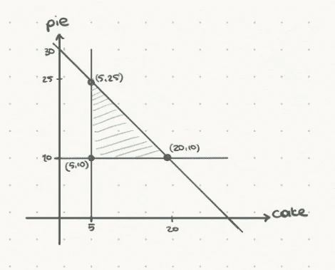
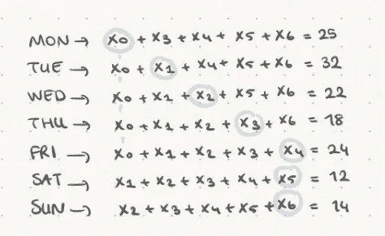
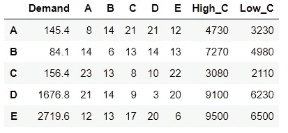
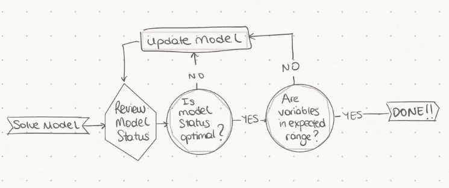

# 如何用 Python 开发优化模型

> 原文：<https://towardsdatascience.com/how-to-develop-optimization-models-in-python-1a03ef72f5b4?source=collection_archive---------7----------------------->

## 使用 Python 和 PuLP 的线性编程演练


[来源](https://unsplash.com/@chuttersnap)

在给定的情况下，如稀缺资源的分配，确定如何以最佳方式设计和操作系统，通常需要在决策中利用定量方法。[数学优化](https://en.wikipedia.org/wiki/Mathematical_optimization)是在特定情况下决定最佳行动的主要方法之一。它包括通过从允许的集合中系统地选择输入值并计算目标函数值来最大化或最小化真实函数。

优化的一些使用案例包括:

*   **产品计划和库存控制:**计划订单的发放，同时避免缺货和超出产能限制
*   **路线决策:**确定最具成本效益的路线的过程
*   **包装问题:**在不超出容量的情况下，确定包装方式，同时最小化自由空间
*   **资源计划:**确定每个项目和所需资源的数量
*   **排班:**如排班工人的班次
*   **选址问题:**在保证需求的同时，将运输成本降至最低的设施布局。

在本文中，我将演示一些优化问题的解决方案，利用线性编程，并使用 Python 中的 PuLP 库。

线性规划处理在决策变量上服从线性等式/不等式约束的情况下优化线性目标函数(例如最大利润或最小成本)的问题。

线性规划有三个组成部分:

1.  **决策变量:**决策者可以直接控制的变量。
2.  **目标函数:**以数学方式表达最大化或最小化数量的线性函数。
3.  **约束:**表示对决策变量的限制的等式或不等式的数学表达式。

让我们看一些例子。你可以查看我的 GitHub 上的 [Jupyter 笔记本](https://github.com/Idilismiguzel/Optimization/blob/master/LP-puLP.ipynb)来获得完整的分析。

# 1.资源计划示例

> 面包店每天都做蛋糕和馅饼。它可以在一天内制作总共 30 个项目，至少必须为其计划的客户制作 5 个蛋糕和 10 个馅饼。每个蛋糕的利润是 1.5 美元，每个馅饼的利润是 2 美元。应该生产多少才能使利润最大化？


[来源](https://www.pexels.com/photo/shelves-of-assorted-cake-in-a-bakeshop-2536967/)

这个例子很简单，意味着它不需要我们使用 PuLP 或 Python 的任何功能，但它是理解概念的一个很好的练习。

问题的目标函数是利润最大化:

> 最大利润= 1.5*C + 2*P

受以下限制:

> C >= 5，P >= 10，
> 
> 但是并不是所有的问题都像这个问题一样简单，如果我们想要计算复杂问题的每个决策变量的每个约束，我们可能会遇到严重的时间问题。😅

让我们看另一个例子:



面包店在一个月的每一天都制作蛋糕和馅饼。有:1 个烤箱，2 个面包机，1 个包装打包机，一个月只工作 22 天。蛋糕需要用烤箱烤 1 天，馅饼需要 0.5 天。每个面包师需要为蛋糕工作 0.5 天，为馅饼工作 2 天。包装工需要为蛋糕工作 1 天，为馅饼工作 0.5 天。每个蛋糕的利润是 15 美元，每个馅饼的利润是 12 美元。在给定的条件下，利润最大化应该生产多少？

为了解决这个问题使用纸浆，我们将遵循共同的建模过程。

1.导入纸浆并初始化模型:

> 在`LpProblem()`方法中，我们定义了问题名称和目标函数的含义，目标函数可以是“LpMaximize”或“LpMinimize”。

2.定义决策变量:

## 在`LpVariable()`方法中，我们为变量定义了一个名字，下界和上界的值，以及可以是‘整数’、‘二进制’或‘连续’的类别类型。因为我们想要一个整数值来表示蛋糕和馅饼的数量，所以我们选择 integer。

3.定义目标函数:

```
import pulp
from pulp import *model = LpProblem('Maximize Bakery Profits', sense= LpMaximize)
```

## 使用`+=`将目标函数添加到初始化的模型中

4.定义约束条件:

```
C = LpVariable('C', lowBound=0, upBound=None, cat='Integer')
P = LpVariable('P', lowBound=0, upBound=None, cat='Integer')
```

## 使用`+=`将约束添加到初始化的模型中。注意，约束不同于目标函数，因为它们在右边有(不)等式。

5.求解模型

```
model += 15 * C + 12 * P
```

## 调用求解方法`model.solve()`

检查解决方案的状态`LpStatus[model.status]`

```
model += 1 * C + 0.5 * P <= 30
model += 0.5 * C + 2 * P <= 60
model += 1 * C + 0.5 * P <= 22
```

## 打印优化的决策变量`C.varValue`

*   打印优化的目标函数`value(model.objective))`
*   2.调度示例
*   一家邮局正在招聘邮递员，要求连续工作 5 天，然后休息 2 天。目标是雇佣最少数量的工人，每天所需的邮递员数量估计为:星期一:25，星期二:32，星期三:22，星期四:18，星期五:24，星期六:12，星期日:14。雇佣邮递员的最低数量是多少？
*   为了解决这个问题，我们需要写下每天需要开始工作的工人数量的限制，例如:x_0 是星期一开始工作的工人数，x_1 是星期二开始工作的工人数，以此类推。这样做，我们可以从周一到周五存储 x_0，从周二到周六存储 x_1，因为他们需要连续工作 5 天。

```
#Results1
Optimal
Produce 8.0 Cake 
Produce 28.0 Pie 
456.0
```

# 模型约束的图示

> 状态:最优
> 工人 __0 = 7.0
> 工人 __1 = 7.0
> 工人 __2 = 0.0
> 工人 __3 = 0.0
> 工人 __4 = 10.0
> 工人 __5 = 0.0
> 工人 __6 = 8.0

正如解决方案所建议的，我们总共需要雇用 32 名邮递员，其中 7 名在星期一开始工作，另外 7 名在星期二，10 名在星期五，8 名在星期天。



3.位置问题示例

```
#Initialize model
model = LpProblem("Minimize Number of Workers", LpMinimize)#Define decision variables
days = list(range(7))
x = LpVariable.dicts('workers_', days, lowBound=0, upbound=None, cat='Integer')#Define model
model += lpSum([x[i] for i in days])# Define constraints
model += x[0] + x[3] + x[4] + x[5] + x[6] >= 25
model += x[0] + x[1] + x[4] + x[5] + x[6] >= 32
model += x[0] + x[1] + x[2] + x[5] + x[6] >= 22
model += x[0] + x[1] + x[2] + x[3] + x[6] >= 18
model += x[0] + x[1] + x[2] + x[3] + x[4] >= 24
model += x[1] + x[2] + x[3] + x[4] + x[5] >= 12
model += x[2] + x[3] + x[4] + x[5] + x[6] >= 14# Solve model
model.solve()#Print model status
print('Status:', LpStatus[model.status])#Print solution variables
for variable in model.variables():
    print ('{} = {}'.format(variable.name, variable.varValue))
```

假设您需要[优化一家制造公司在 5 个销售地点的供应链网络](https://www.amazon.com/Supply-Chain-Management-Strategy-Operation/dp/0133800202)，以最低的成本满足各个地点的需求。您可以决定每个地点的工厂规模，选项有低容量和高容量。一种可能性是在每个地区建立一个工厂，其优点是运输成本低，缺点是生产计划的规模要满足当地需求，不能利用规模经济。另一种可能性是建立一些具有规模经济优势的制造工厂，但需要较高的运输成本。给定每个位置的估计需求、从一个工厂到另一个工厂的可变运输成本、拥有工厂的固定成本(基于工厂规模)以及基于工厂规模的生产能力(低产能为 500，高产能为 1500)。你会如何用最小的成本解决这个问题？

[来源](https://www.pexels.com/photo/dirty-industry-stack-factory-2391/)

# 需求栏显示每个地点的估计需求

> 列 A 到 E 显示了从索引中的位置到列中的每个位置的运输成本(即，从工厂 B 到工厂 D 的运输成本是 14)


“高 C”和“低 C”列显示了在每个位置拥有高容量和低容量工厂的固定成本(即，在位置 E 拥有低容量工厂的固定成本为 6500 美元)



*   为了解决这个问题，我们首先需要初始化我们的模型和决策变量。有两个决策变量；
*   在工厂 I 生产并运送到工厂 j 的生产数量(连续变量)
*   生产工厂的生产能力(二进制变量:如果生产能力为 s 的位置 I 的工厂开放，则为 1；如果工厂关闭，则为 0)

约束条件包括:

1.  总产量必须等于总需求
2.  总产量可以小于或等于总生产能力

```
#Initialize model
model = LpProblem('Facility Location Problem', LpMinimize)#Define decision variables
loc = ['A', 'B', 'C', 'D', 'E']
size = ['Low_C','High_C']x = LpVariable.dicts('production_', [(i,j) for i in loc for j in loc], lowBound=0, upBound=None, cat='Continuous')
y = LpVariable.dicts('plant_', [(i,s) for s in size for i in loc], lowBound=None, upBound=None, cat='Binary')#Define model
model += (lpSum([fix_cost.loc[i,s] * y[(i,s)] for s in size for i in loc]) + lpSum([var_cost.loc[i,j] * x[(i,j)] for i in loc for j in loc]))
```

因为 solve()方法返回 1，所以解是最优的，我们可以打印结果。

1.  结果:
2.  从结果中可以看出，该模型建议在地点 C 开设一个低产能工厂，在地点 A、D 和 e 开设高产能工厂。地点 B 的需求建议由地点 C 提供。这样做，我们可以实现最小成本$58850.9。

```
# Define constraints
for j in loc:
    model += lpSum([x[(i, j)] for i in loc]) == demand.loc[j,'Demand']for i in loc:
    model += lpSum([x[i, j] for j in loc]) <= lpSum([capacity.loc[i,s] * y[i,s] for s in size])

# Solve
model.solve()
```

**对模型和解决方案进行健全性检查**

```
# Results for production quantities
[{'prod':'{} to {}'.format(i,j), 'quantity':x[(i,j)].varValue} 
     for i in loc for j in loc]# Results for plant capacities based on location
[{'lowCap':y[(i,size[0])].varValue, 'highCap':y[(i,size[1])].varValue}
     for i in loc]# Objective Value
print('Objective = ', value(model.objective))
```

工作流程图

```
prod    quantity
A to A     145.4
A to B       0.0
A to C       0.0
A to D       0.0
A to E    1219.6
B to A       0.0
B to B       0.0
B to C       0.0
B to D       0.0
B to E       0.0
C to A       0.0
C to B      84.1
C to C     156.4
C to D     176.8
C to E       0.0
D to A       0.0
D to B       0.0
D to C       0.0
D to D    1500.0
D to E       0.0
E to A       0.0
E to B       0.0
E to C       0.0
E to D       0.0
E to E    1500.0 lowCap  highCap
A     0.0      1.0
B     0.0      0.0
C     1.0      0.0
D     0.0      1.0
E     0.0      1.0Objective =  58850.9
```

一旦您调用了求解方法`model.solve()`并打印了解的状态`LpStatus[model.status]`，您可以收到以下结果。

# **最优:**模型和约束运行良好，解决方案可行。您可以通过检查变量是否在预期范围内来继续。



**不可行:**没有可行的解。您可以回过头来查看约束条件。

**无界:**意味着目标函数是无界的，并且趋于无穷大。你可以回头回顾一下目标函数。

1.  **未定义:**最优解可能存在，但可能没有找到。可以考虑复习一下模型。
2.  **未解决:**解决问题前的状态。可以考虑复习一下模型。
3.  如果模型状态为最佳，您可以继续并检查结果是否在预期范围内。如果是，那么模型就完成了。
4.  高级主题:敏感性分析
5.  如果您想要回答一些业务问题，例如如果需求增加一个单位，成本会增加多少，换句话说，需要多少利润来弥补这样的成本增加，您可以检查**双值**。如果您想了解约束条件是否有约束力，以及如果没有约束力，哪一个约束条件在未来需求增长的生产能力中有空间，您还可以检查每个约束条件的**松弛度**。

双值表示约束右侧每个单位变化的目标函数变化量。因此，如果地点 A 的需求增加 1 个单位，总成本将增加 8 美元，如果地点 B 的需求增加 1 个单位，总成本将增加 13 美元，依此类推。

# 每个限制的时差表示每个限制未使用的资源量。如果松弛值等于 0，则约束是绑定的，如果松弛值大于 0，则意味着它不是绑定的。在示例中，我们可以看到约束条件 C6 和 C8 没有约束力，这意味着它们没有充分利用其生产能力。在位置 A 有增加 135 产量的空间，在位置 C 有增加 82.7 产量的空间。

我希望您喜欢这些例子，并发现这篇文章对您的线性编程之旅很有用。

```
# Print Dual Value and Slack[{'name':name, 'dual value':c.pi, 'slack': c.slack}
for name, c in model.constraints.items()]name  dual value  slack
C1      8.0       -0.0
C2      13.0      -0.0
C3      8.0       -0.0
C4      10.0      -0.0
C5      12.0      -0.0
C6      0.0       135.0
C7      -7.0      -0.0
C8      0.0       82.7
C9      -7.0      -0.0
C10     -6.0      -0.0
```

*如果你喜欢这篇文章，你可以* [***在这里阅读我的其他文章***](https://medium.com/@idilismiguzel)**和* [***关注我上媒***](http://medium.com/@idilismiguzel/follow)*如果有任何问题或建议，请告诉我。✨**

**喜欢这篇文章吗？ [**成为会员求更！**](https://idilismiguzel.medium.com/membership)**

**I hope you enjoyed following the examples and found the article useful in your journey towards linear programming.**

***If you liked this article, you can*[***read my other articles here***](https://medium.com/@idilismiguzel)*and* [***follow me on Medium.***](http://medium.com/@idilismiguzel/follow)Let me know if you have any questions or suggestions.✨**

****Enjoy this article?** [**Become a member for more!**](https://idilismiguzel.medium.com/membership)**