# 如何用三个简单的步骤区分梯度下降目标函数

> 原文：<https://towardsdatascience.com/how-to-differentiate-gradient-descent-objective-function-in-3-simple-steps-b9d58567d387?source=collection_archive---------26----------------------->

## 拿起笔和纸

在 [Unsplash](https://unsplash.com?utm_source=medium&utm_medium=referral) 上拍摄的 [ThisisEngineering RAEng](https://unsplash.com/@thisisengineering?utm_source=medium&utm_medium=referral)

如今，我们可以了解通常为学术团体保留的领域。从*人工智能*到*量子物理学*，我们可以浏览互联网上的大量信息并从中受益。

然而，信息的可用性有一些缺点。我们需要意识到大量未经证实的来源，充满了事实错误(这是一个完全不同的讨论主题)。更重要的是，我们可以习惯于通过谷歌搜索来轻松获得答案。因此，我们经常认为它们是理所当然的，并在没有更好理解的情况下使用它们。

我们自己发现事物的过程是学习的一个重要部分。让我们参加这样一个实验，计算一个**线性回归**的**梯度下降**算法背后的导数。

# 一点点介绍

线性回归是一种统计方法，可以用来模拟变量之间的关系[1，2]。它由一个线性方程描述:

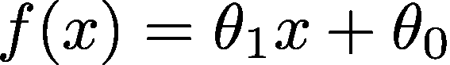

线方程(图片由作者提供)。

我们有两个参数*θ₀*和*θ₁*和一个*变量*x。有了数据点，我们可以找到最佳的参数来拟合我们的数据集线。

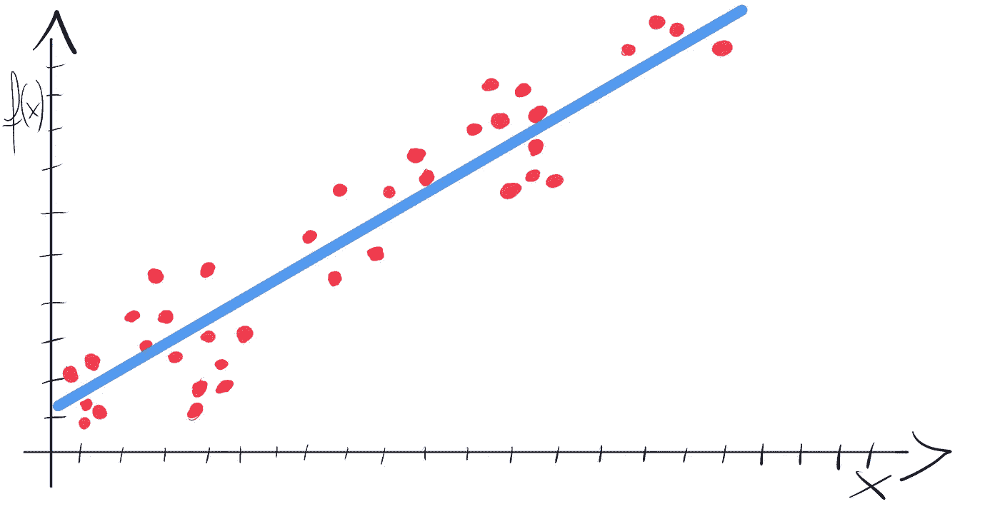

将直线拟合到数据集(图片由作者提供)。

好，现在梯度下降[2，3]。它是一种迭代算法，广泛用于机器学习(有许多不同的风格)。我们可以用它来自动找到我们生产线的最佳参数。

为此，我们需要优化由以下公式定义的目标函数:

线性回归目标函数(图片由作者提供)。

在这个函数中，我们迭代数据集中的每个点 *(xʲ，yʲ)* 。然后我们为 *xʲ* 计算一个函数 *f* 的值，以及当前的θ参数(*θ₀*、*θ₁*)。我们取一个结果，然后减去 yʲ。最后，我们将它平方并加到总和中。

然后在梯度下降公式(每次迭代更新*θ₀*和*θ₁*)中，我们可以在方程的右边找到这些神秘的导数:

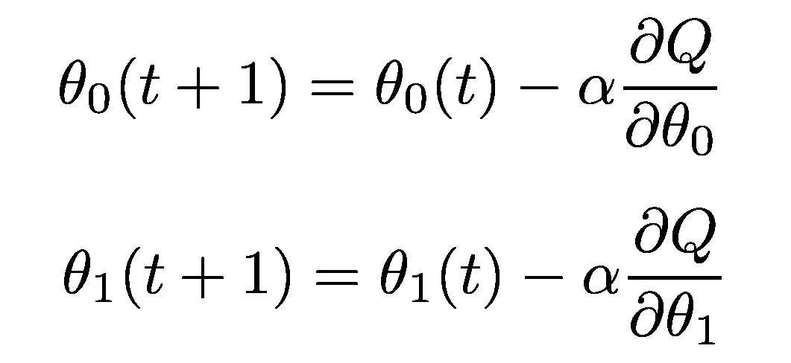

梯度下降公式(图片由作者提供)。

这些是目标函数*Q(θ)的导数。*有两个参数，需要计算两个导数，每个*θ*一个。让我们继续，用 3 个简单的步骤来计算它们。

# 第一步。链式法则

我们的目标函数是一个复合函数。我们可以认为它有一个*【外层】*功能和一个*【内层】*功能[1]。为了计算复合函数的导数，我们将遵循链式法则:

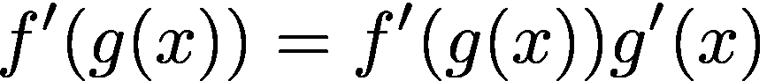

链式法则公式(图片由作者提供)。

在我们的例子中， *"outer"* 部分是关于将括号内的所有内容( *"inner function"* )提升到 2 次方。根据规则，我们需要将*“外部函数”*的导数乘以*“内部函数”*的导数。看起来是这样的:

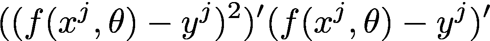

将链式法则应用于目标函数(图片由作者提供)。

# 第二步。权力规则

下一步是计算幂函数的导数[1]。让我们回忆一下一个导数幂律公式:

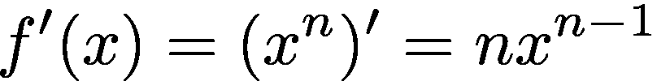

幂律公式(图片由作者提供)。

我们的*【外函数】*只是一个二次幂的表达式。所以我们把 *2* 放在整个公式之前，剩下的就不做了( *2 -1 = 1* ，表达式的一次幂就是那个表达式)。

在第二步之后，我们有:

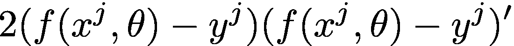

将幂法则应用于目标函数(图片由作者提供)。

我们还需要计算一个*【内函数】*(公式右侧)的导数。让我们进入第三步。

# 第三步。常数的导数

最后一条规则是最简单的。它用于确定常数的导数:

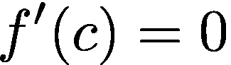

常数的导数(图片由作者提供)。

作为常数意味着，没有变化，常数的导数等于零[1]。例如*f’(4)= 0*。

记住这三条规则，让我们来分解一下*“内在功能”*:

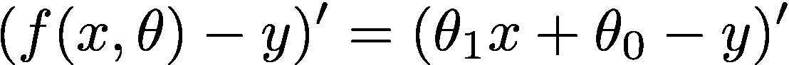

内函数导数(图片由作者提供)。

我们的梯度下降目标函数的棘手之处在于 *x* 不是一个变量。 *x* 和 *y* 是来自数据设定点的常数。当我们寻找我们生产线的最佳参数时，*θ₀*和*θ₁*是变量。这就是为什么我们计算两个导数，一个关于θ₀，一个关于θ₁.

让我们开始计算相对于*θ₀*的导数。这意味着*θ₁*将被视为常量。

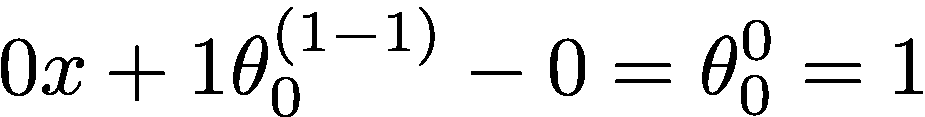

相对于*θ₀的内部函数导数(图片由作者提供)。*

你可以看到常数部分被设置为零。θ₀怎么了？因为它是一个一次幂的变量( *a =a* )，所以我们应用了幂法则。这导致*θ₀*被提升到零的幂。当我们将一个数提升到零的幂时，它等于 1 ( *a⁰=1* )。就是这样！我们对θ₀的导数等于 1。

最后，我们得到了关于θ₀:的整体导数

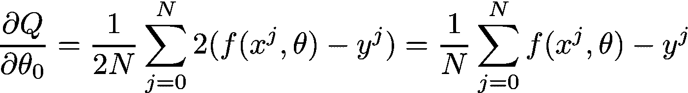

关于*θ₀的目标函数导数(图片由作者提供)。*

现在是时候计算关于θ₁的导数了。这意味着我们把θ₀视为一个常数。

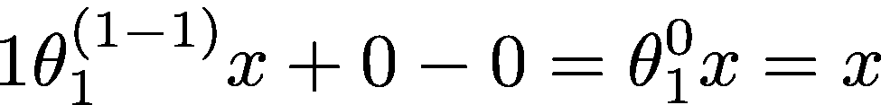

关于*θ₁*的内部函数导数

与前面的例子类似，*θ₁*被视为一个一次幂的变量。然后，我们应用了一个幂法则，它将*θ₁*减少到 1。然而*θ₁*乘以 *x* ，所以我们最终得到的导数等于*x*

关于*θ₁*的导数的最终形式如下:

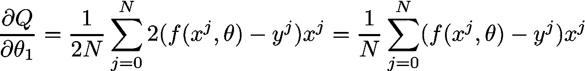

关于*θ₁的目标函数导数(图片由作者提供)。*

# 完全梯度下降配方

我们计算了梯度下降算法所需的导数！让我们把它们放在它们该在的地方:

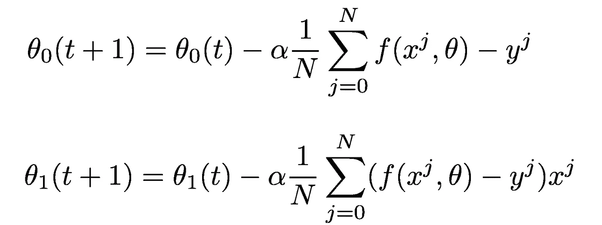

包含目标函数导数的梯度下降公式(图片由作者提供)。

通过做这个练习，我们对公式的起源有了更深的理解。我们并不把它当作我们在旧书中找到的魔咒，而是积极地经历分析它的过程。我们把这个方法分解成更小的部分，我们意识到我们可以自己完成计算，然后把它们放在一起。

时不时抓起笔和纸，解决一个问题。你可以找到一个你已经成功使用的公式或方法，并试图通过分解它来获得更深层次的洞察力。它会给你很大的满足感，激发你的创造力。

## 参考书目:

1.  K.a .斯特劳德，德克斯特 j .布斯，*工程数学*，ISBN:978–0831133276。
2.  Joel Grus，*从头开始的数据科学，第二版*，ISBN:978–1492041139
3.  乔希·帕特森，亚当·吉布森，*深度学习*，ISBN:978–1491914250