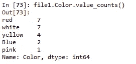
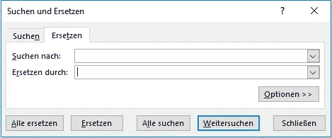

# 抛弃 Excel！Python 入门

> 原文：<https://towardsdatascience.com/how-to-ditch-excel-a-primer-to-python-c4a9c192e993?source=collection_archive---------27----------------------->

## 熊猫流行 excel 的一行程序


约瑟夫·陈(Joseph Chan)在 [Unsplash](https://unsplash.com?utm_source=medium&utm_medium=referral) 上拍摄的照片:Excel 是这位甜美的女士第一次实习时发明的

Excel 过去是，现在是，将来也永远是一个优秀的工具。它的精巧令人敬畏，优雅超越贝拉·哈迪德。自从 python 出现以来，人们很难忽视它提供的易用性和灵活性。该说的都说了，该做的都做了，继续前进仍然是最大的数据优势。因此，不管你是哪种类型的数据人，或者即使你只是偶尔使用它，习惯 python 也是值得的(它是免费的)。你会问为什么是 Python？

1.  如果能够超越就像组装宜家家具，那么能够 python 就像做木匠。你可以创造更多的奇迹。
2.  因为其他人都在这么做。
3.  用乔治·马洛里的话说，因为它就在那里。

让我们从一些基本功能开始。为了简单起见，我们只谈熊猫图书馆。启动 python 并执行以下操作:

```
import pandas as pd
```

之后，将所有文件读入文件名变量:

```
file1 = pd.read_excel(‘path/to/your/file1.xlsx’)
```

# Excel: VLOOKUP

**熊猫等同:**合并

使用 VLOOKUP，您可以尝试从另一个文件中的一个 excel 列中查找一个值。您将首先:

a.在所需的列上按字母顺序对两个文件进行排序

b.使用公式:

```
=VLOOKUP(A2, Area in columns, column to be returned,FALSE)
```

来获得输出。

熊猫的对等词是一个更简单、更容易理解的合并词。这与在所需的公共列上连接数据集是一样的。在将文件 1 和 2 作为文件 1 和文件 2 导入和读入后，它是一条语句:

```
file1 = file1.merge(file2[['columns', 'you', 'want', 'to' ,'return']], how=’left’,on=’common-column-to-look-for’)
```

瞧啊。

现在保存您的结果:

```
pd.to_excel('save/here/path/filename.xlsx')
```

# COUNTIF

**熊猫等值:** value_counts()

通常，您会希望计算一个列中某个元素的出现次数。在 excel 中，您可以这样做:

```
=COUNTIF(area-to-search,value-to-search-for)(#and drag it down)
```

接下来，您将删除重复项以获取值计数。

在 pandas 中，您可以使用下面的一个命令行程序来实现这一点:

```
file1[‘Column which needs counting’].value_counts()
```

瞧啊。



value_counts()结果

# 整齐

**pandas equivalent:**str . strip()

在大多数文件中，看不见的空白是一种真正的痛苦。在 excel 中，我们创建一个新列并应用公式

```
= TRIM('cell which needs trimming') #and drag it down
```

对熊猫来说，这又是一句俏皮话:

```
file1.column_that_needs_stripping = file1.column_that_needs_stripping.str.strip()
```

# 删除所有空间

**pandas equivalent:**str . replace(" "，"")

通常，修剪是不够的。整个列中都有不需要的空间。我习惯于在 excel 中选择列，搜索和替换空格。



Pandas 提供了一个简单的解决方案来替换列的所有字符串中的空格:

```
file1[‘column_to_delete_all_spaces’] = file1[‘column_to_delete_all_spaces’].str.replace(" ","")
```

# 串联

**熊猫等值:** +

字符串连接是 excel 中另一种流行的方法。假设您想要连接多个单元格，您可以在 excel 中这样做:

```
= CONCATENATE(Cell1,Cell2,Cell3,Cell4……)
```

找到每一个单元格并把它打下来真的很乏味。熊猫也为此提供了一个优雅的俏皮话，如下:

```
file1['new_column']= file1['first_col'] +’if_space_or_other_string_needed_here’+ file1['second_column']
```

# CountA

**熊猫当量:**。notnull()。总和( )

Excel 的 CountA 对选定区域中所有非零单元格进行计数，并返回所有包含某些值的单元格。

```
= COUNTA(range)
```

计算非零值的 pandas 等价的一行程序如下:

```
file1[‘column_to_count’].notnull().sum()
```

相反，如果您想获得所有为 null 的列值，您可以将 notnull 更改为 isnull，瞧！

```
file1[‘column_to_count’].isnull().sum()
```

# IFERROR

**熊猫等同:**菲尔娜( )

通过定义一个错误填充值，可以用 IFERROR 在 excel 中处理诸如零除法错误之类的错误。

```
= IFERROR(Formula that might have an error, “Value to return if error occurs”)
```

在 pandas 中，您可以通过使用 fillna()来完成这种错误处理

```
file1 = file1.fillna('Value_you_want_to_fill')
```

# 左/右

在 excel 中，您可以使用以下公式提取左侧 n 个数字或字母:

```
= LEFT(Cell, number of digits you want)
= RIGHT(Cell, number of digits you want)
```

与此相对应的熊猫如下。*将“:”符号读作直到或从:*

```
left_five_digits = file1['column'].str[:5]right_five_digits = file1['column'].str[-5:]
#the minus indicates 5 from the end, without minus, it means 5 from left
```

这些是我每天经常在 excel 中使用的函数，现在我经常在 python 中以惊人的速度使用它们。我希望这本书能激励你做出改变，因为每一秒都是值得的。