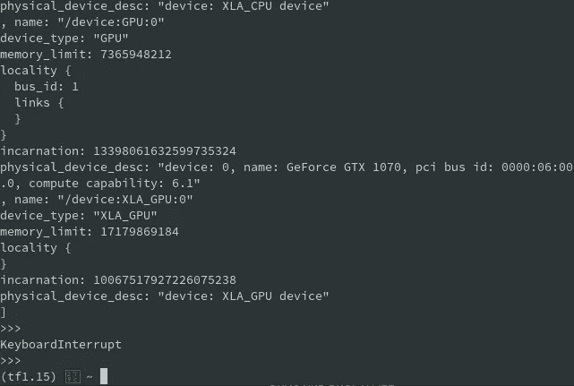

# 如何——抛弃 Ubuntu，转而使用 Arch Linux 作为深度学习工作站

> 原文：<https://towardsdatascience.com/how-to-ditching-ubuntu-in-favor-of-arch-linux-for-a-deep-learning-workstation-c7ffae120f32?source=collection_archive---------13----------------------->

# 我为什么要抛弃 Ubuntu？

你们中的大多数人可能在他们的工作站上使用 Ubuntu，这对于没有经验的用户来说很好。我在使用 Ubuntu 和 Tensorflow/CUDA 时遇到的一个问题是，处理 CUDA、cudnn、Tensorflow 等不同的驱动程序和版本是一件非常困难的事情。我不知道你，但一旦我有了一个工作 Tensorflow 1.15 或 2.0 环境，我通常不会再碰它，因为害怕弄乱这个神圣的配置。

使用不同的程序，如果能像使用 Google Colab 一样，在两个最常用的 TensorFlow 版本 1.15 和 2.0 之间进行切换，那就太好了，但是安装不同的 TensorFlow 版本通常会再次搞乱我的系统。

此外，Arch 一直在我的任务清单上，因为它是你能得到的最“准系统”的 Linux 发行版，这意味着与 Ubuntu 这样的“更高抽象”相比，你更接近于硬件。用他们自己的话说，Ubuntu 是为了“开箱即用，让新用户的安装过程尽可能简单”而构建的，而 Arch Linux 的座右铭是“定制一切”。与 Ubuntu 相比，更接近硬件拱门的方式要快得多(比 Windows 领先几英里)，代价是更多的终端使用。

当我在过去几周使用 Arch 时，RAM 的使用通常比 Ubuntu 少一半，安装机器学习包也很容易。我可以让 TensorFlow 1.15 和 2.0 一起工作，在 Anaconda 环境中切换版本。此外，该系统工作非常稳定，因为我使用的是 Linux 的 LTS(长期支持)内核，并且通常著名的 AUR(Arch 中的用户定制包)的更新比 Debian (Ubuntu)包提前一个月发布。

总而言之，我只能照原样推荐建立一个 Arch Linux 深度学习站:

1.  更快，像包会装超级快，深度学习超级增压，…
2.  更稳定
3.  与 Ubuntu 相比，更容易在 TensorFlow 版本之间切换。

我将把操作方法分成两部分，第一部分是“如何安装 Arch Linux”，第二部分是“如何安装深度学习工作站包”。

对于一般的[“如何安装 Arch Linux”，请阅读本文](https://www.datafortress.cloud/blog/howto-install-arch-linux-the-easy-way/)。

如果 Arch 目前太复杂，你可以试试 [Manjaro](https://https//manjaro.org/) ，它是 Arch 的一个用户友好版本，尽管我不能保证所有的包都一样工作，因为它们略有不同。总之，它应该是一样的。

我在考虑创建一个现成的安装映像(iso 或 img)，如果有足够多的人感兴趣，请在下面留下评论或给我发消息！

# 在新的 Arch Linux 安装上安装深度学习(TensorFlow、CUDA、CUDNN、Anaconda)设置

一旦你完成了拱门的安装(唷！)让我们先更改一些设置，让我们的系统工作得更稳定。

# 1.切换到最快的镜像

软件从所谓的“镜像”下载，镜像是包含所有 Arch 库的服务器。如果没有自动完成，可能会出现您的服务器尚未优化的情况。因此，我们将安装一个名为“reflector”的小工具来查找并保存速度最快的服务器

安装反射器，使用

> *须藤 pacman -S 反射器*

查找并下载最好的服务器

> *反射器–verbose-l 20-n 20–排序速率–save/etc/pacman . d/mirror list*

检查输出是否有意义，例如，域是否靠近您的位置。如果没有，您可以添加国家标签以获得更精确的结果，例如德国和奥地利:

> *reflector -c "AT，DE "-verbose-l 20-n 20-sort rate-save/etc/pacman . d/mirror list*

更新您的安装

> *须藤 pacman -Syyu*

# 2.改变桌面环境

如果你正在使用 Manjaro 或者选择了 Ubuntu 上的“Gnome”桌面环境，考虑改变它可能是值得的，因为众所周知 Gnome 比 Chrome 消耗更多的 RAM，而且我们的深度学习设置肯定需要 RAM。

如果你喜欢 Gnome，可以跳过这一步。另外，我可以推荐 Xfce 桌面，因为它是轻量级和丰富功能的良好结合。

下载 Xfce

> *sudo pacman-S xfc E4 xfc E4-goodies lxdm*

Lxdm 是一个显示管理器，允许您使用多个桌面。

注销当前会话，然后按 Alt + F2(如果无效，则按 Alt + F3)获得一个终端。首先禁用 Gnome，然后“激活”Xfce:

停用并卸载 gnome:

> *sudo systemctl 禁用 GDM
> sudo pacman-R gnome-extras*

激活 Xfce

> *sudo systemctl 使能 lxdm
> sudo systemctl 启动 lxdm*

如果新的 Xfce 桌面确实打开了，只需登录并浏览，如果没有，尝试重启(sudo 重启)。如果没有帮助，继续哭，在地板上打滚，然后给我发消息或评论。

# 3.安装 LTS(长期支持)Linux 内核以获得更好的稳定性

Arch 以非常接近当前的 Linux 内核而闻名，如果你总是想要最新的包和 Linux 特性，这是一个好主意，但如果你正在构建一个深度学习工作站，这是一个坏主意。

这就是为什么我转而使用 LTS 内核的原因，它基本上比新版的 Linux 内核获得了更多的支持，也更加稳定。

幸运的是，在 Arch 中切换内核非常容易。首先，我们将下载内核，然后告诉引导管理器选择哪个内核。

首先下载 LTS 内核:

> *sudo pacman-S Linux-lts Linux-lts-headers*

看看您当前的内核版本:

> *ls -lsha /boot*

一个内核应该被命名为 vmlinuz-linux.img 和 initramfs-linux.img(您当前的版本), LTS 的内核也是如此，末尾带有-lts。

如果您看到两个内核，现在可以删除旧的内核:

> *sudo pacman -R linux*

现在一个更高级的部分是你需要告诉你的引导装载程序选择哪个内核。问题是你用的是哪个 bootloader，但大多数情况下是 Grub。如果你遵循我的 Arch 安装教程，你的引导程序是 systemd-boot。

我的建议是尝试 Grub 的说明，如果不工作，继续其他的。

## 更改 LTS linux 内核的 Grub 引导加载程序

> *grub-mkconfig-o/boot/grub/grub . CFG*

如果您看到一个错误，继续下一个引导加载程序，否则重新启动(sudo 重新启动)。

## 更改 LTS linux 内核的 syslinux 引导加载程序

编辑配置文件:

> *sudo nano/boot/sys Linux/sys Linux . CFG*

只需将"-lts "添加到 vmlinuz-linux.img 和 initramfs-linux.img 中，它们就是 vmlinuz-linux-lts.img 和 initramfs-linux-lts.img

## 更改 LTS linux 内核的 systemd-boot 引导加载程序

如果你来自我的 Arch 安装指南，这是你的引导程序。

编辑配置文件:

> *sudo nano/boot/loader/entries/arch . conf*

只需将"-lts "添加到 vmlinuz-linux.img 和 initramfs-linux.img 中，它们就是 vmlinuz-linux-lts.img 和 initramfs-linux-lts.img

# 4.安装 yay，一个安装 AUR 软件包的简单方法

你应该更喜欢使用超快的 pacman 来安装大多数软件包，但是 Arch 的一个惊人之处在于用户创建了数百万个超级容易安装的自定义软件包。你基本上可以在这个回购里找到任何你能想到的方案。

安装 git SVC

> *sudo pacman-S git
> mkdir ~/tmp
> git 克隆*[*https://aur.archlinux.org/yay-git.git*](https://aur.archlinux.org/yay-git.git)*~/tmp/yay
> CD ~/tmp/yay
> makepkg-si*

现在你可以浏览 https://aur.archlinux.org/packages/所有的 AUR 套餐，或者直接输入:

> *yay -S【包装】*

来安装它。

# 5.最后，运行 TensorFlow 1.15 和 2.0 的真实 cuda、cudnn、anaconda 安装

安装 Nvidia 驱动程序，cuda，cudnn 与一个简单的命令

> *sudo pacman-S NVIDIA NVIDIA-utils cuda cud nn*

这需要一些时间，所以喝杯咖啡或者继续下一步

下载 Anaconda，我喜欢 Miniconda:

> *wget*[*https://repo . anaconda . com/miniconda/miniconda 3-latest-Linux-x86 _ 64 . sh*](https://repo.anaconda.com/miniconda/Miniconda3-latest-Linux-x86_64.sh)*~/*

使其可执行并安装

> *cd ~/
> chmod +x ./Miniconda*。sh
> 。/Miniconda*。sh*

一切都保持默认。

> *来源。/bash_profile*

重启你的系统

> *sudo 重启*

安装 tensorflow

现在是决定 TensorFlow 用于 CPU 还是 GPU 的时候了。我将继续使用 GPU 选项，但如果您想运行 CPU 版本，只需从包名中删除“-gpu”即可。

为 Tensorflow 2.0 创建一个 anaconda 环境

> *conda create–name TF 2.0
> conda activate TF 2.0
> conda install pip
> conda install tensor flow-GPU pandas numpy*

搞定了。现在用以下命令检查结果:

> *python
> 从 tensorflow.python.client 导入 device _ lib
> device _ lib . list _ local _ devices()*

如果结果显示这样的设备名称，您就完成了！

2018–05–01 05:25:25.929575:I tensor flow/core/common _ runtime/GPU/GPU _ device . cc:1356]找到具有属性的设备 0:名称:GeForce GTX 3080 10GB 主要:…

为 Tensorflow 1.15 创建一个 anaconda 环境

> *conda deactivate
> conda create–name TF 1.15
> conda activate TF 1.15
> conda install pip python = = 3.7
> conda install tensor flow-GPU = = 1.15*

并再次检查是否一切正常，您的 gpu 是否被识别:

> *python
> 从 tensorflow.python.client 导入 device _ lib
> device _ lib . list _ local _ devices()*

# 6.在一台设备上切换 TensorFlow 1.15 和 TensorFlow 2.0！

只是梦想成真在我看来，只要选择 1.15 版本与

> *康达激活 tf1.15*

和 TensorFlow 2.0 版本

> *康达激活 tf2.0*