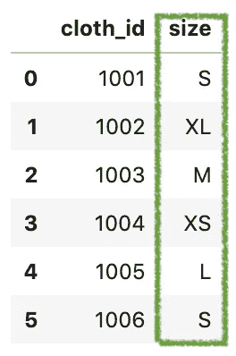
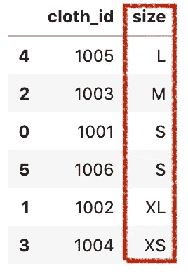
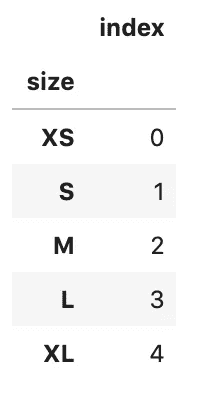
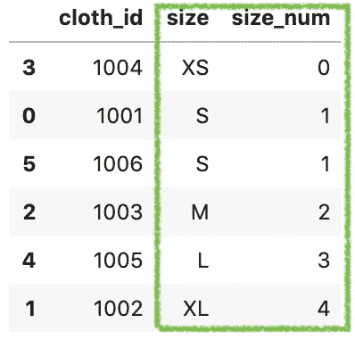
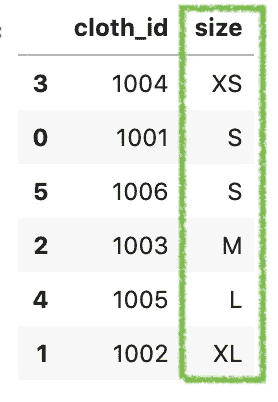
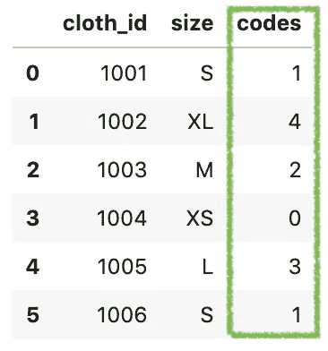
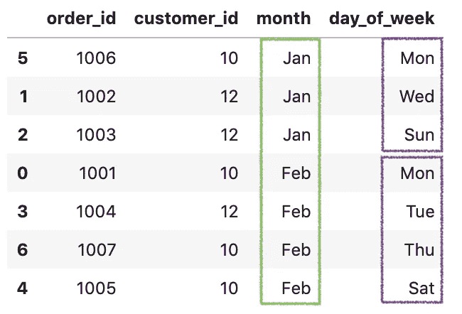
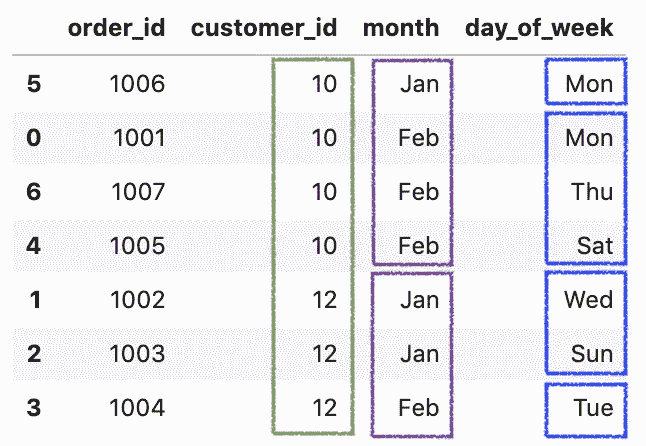

# 如何对熊猫数据帧进行自定义排序

> 原文：<https://towardsdatascience.com/how-to-do-a-custom-sort-on-pandas-dataframe-ac18e7ea5320?source=collection_archive---------1----------------------->

## 你应该知道的一些最有用的熊猫把戏


照片由[印尼 UX](https://unsplash.com/@uxindo?utm_source=unsplash&utm_medium=referral&utm_content=creditCopyText)在 [Unsplash](https://unsplash.com/s/photos/sorting?utm_source=unsplash&utm_medium=referral&utm_content=creditCopyText) 上拍摄

Pandas DataFrame 有一个内置的方法`sort_values()`来根据给定的变量对值进行排序。该方法本身使用起来相当简单，但是它不适用于自定义排序，例如，

*   t 恤尺码:`XS`、`S`、`M`、`L`、`XL`
*   月份:`Jan`、`Feb`、`Mar`、`Apr`、…。等等
*   星期几:`Mon`、`Tue`、`Wed`、`Thu`、`Fri`、`Sat`和`Sun`。

在这篇文章中，我们将看看如何对熊猫数据帧进行自定义排序。

请查看我的 [Github repo](https://github.com/BindiChen/machine-learning/blob/master/data-analysis/017-pandas-custom-sort/pandas-custom-sort.ipynb) 获取源代码

# 看看这个问题

假设我们有一个关于服装店的数据集:

```
df = pd.DataFrame({
    'cloth_id': [1001, 1002, 1003, 1004, 1005, 1006],
    **'size': ['S', 'XL', 'M', 'XS', 'L', 'S'],**
})
```



作者制作的数据

我们可以看到，每块布料都有一个 ***尺寸*** 值，数据应该按以下顺序排序:

*   `XS`特大号
*   `S`用于小型
*   `M`为中等
*   `L`为大号
*   `XL`特大号

但是，调用`sort_values('size')`时会得到如下输出。



输出不是我们想要的，但在技术上是正确的。在幕后，`sort_values()`是按照数字数据的数字顺序或对象数据的字符字母顺序对值进行排序。

以下是两种常见的解决方案:

1.  为自定义排序创建新列
2.  使用`CategoricalDtype`将数据转换为有序的类别类型

# 为自定义排序创建新列。

在这个解决方案中，需要一个映射数据帧来表示自定义排序，然后根据映射创建一个新列，最后我们可以根据新列对数据进行排序。让我们借助一个例子来看看这是如何工作的。

首先，让我们创建一个映射数据帧来表示自定义排序。

```
df_mapping = pd.DataFrame({
    **'size': ['XS', 'S', 'M', 'L', 'XL'],**
})sort_mapping = df_mapping.**reset_index().set_index('size')**
```



用于自定义排序的映射数据框架

之后，使用来自`sort_mapping`的映射值创建一个新列 ***size_num*** 。

```
df['**size_num**'] = df['size'].**map(sort_mapping['index'])**
```

最后，按新列 ***size_num*** 对值进行排序。

```
df.sort_values('**size_num**')
```



使用排序映射数据框架进行自定义排序

这当然有助于我们的工作。但是它创建了一个备用列，在处理大型数据集时效率可能会降低。

我们可以使用`CategoricalDtype`更有效地解决这个问题。

# 使用`CategoricalDtype`将数据转换为有序的类别类型

`CategoricalDtype`是一种具有类别和有序性的分类数据类型[1]。这对于创建自定义排序非常有用[2]。让我们借助一个例子来看看这是如何工作的。

首先，让我们进口`CategoricalDtype`。

```
from pandas.api.types import **CategoricalDtype**
```

然后，创建一个定制的类别类型`cat_size_order`,用

*   第一个参数设置为`['XS', 'S', 'M', 'L', 'XL']`为布料尺寸的唯一值。
*   这个变量的第二个参数`ordered=True`将被视为有序分类。

```
**cat_size_order** = CategoricalDtype(
    **['XS', 'S', 'M', 'L', 'XL']**, 
    **ordered=True**
)
```

之后，调用`astype(cat_size_order)`将尺寸数据转换为自定义类别类型。通过运行`df['size']`，我们可以看到 ***大小*** 列已经被转换为带有顺序`[XS < S < M < L < XL]`的类别类型。

```
>>> df['size'] = df['size']**.astype(cat_size_order)**
>>> df['size']0     S
1    XL
2     M
3    XS
4     L
5     S
Name: size, **dtype: category**
**Categories (5, object): [XS < S < M < L < XL]**
```

最后，我们可以调用相同的方法对值进行排序。

```
df.**sort_values('size')**
```



这个好用多了。让我们来看看在引擎盖下到底发生了什么。

## 用序列查看类别`codes`属性。`cat`访问器

现在 ***size*** 列已经被转换为 **category** 类型，我们可以使用`[Series.cat](https://pandas.pydata.org/pandas-docs/stable/reference/api/pandas.Series.cat.html)`访问器来查看分类属性。在引擎盖下，它使用[类别代码](https://pandas.pydata.org/pandas-docs/stable/reference/api/pandas.Categorical.codes.html)来表示有序分类中的位置。

让我们创建一个新列 ***代码*** ，这样我们就可以并排比较 ***大小*** 和 ***代码*** 值。

```
df['codes'] = df['size']**.cat.codes**
df
```



我们可以看到`XS`、`S`、`M`、`L`、`XL`分别有一个代码`0`、`1`、`2`、`3`、`4`、`5`。代码是实际值在**类别**类型中的位置。通过运行`df.info()`，我们可以看到 ***代码*** 为 **int8** 。

```
>>> df.info()<class 'pandas.core.frame.DataFrame'>
RangeIndex: 6 entries, 0 to 5
Data columns (total 3 columns):
 #   Column    Non-Null Count  Dtype   
---  ------    --------------  -----   
 0   cloth_id  6 non-null      int64   
 1   size      6 non-null      category
 **2   codes     6 non-null      int8   ** 
dtypes: category(1), int64(1), int8(1)
memory usage: 388.0 bytes
```

# 按多个变量排序

接下来，让我们把事情变得复杂一点。这里，我们将通过多个变量对数据帧进行排序。

```
df = pd.DataFrame({
    'order_id': [1001, 1002, 1003, 1004, 1005, 1006, 1007],
    'customer_id': [10, 12, 12, 12, 10, 10, 10],
    'month': ['Feb', 'Jan', 'Jan', 'Feb', 'Feb', 'Jan', 'Feb'],
    'day_of_week': ['Mon', 'Wed', 'Sun', 'Tue', 'Sat', 'Mon', 'Thu'],
})
```

类似地，让我们创建两个自定义类别类型`cat_day_of_week`和`cat_month`，并将它们传递给`astype().`

```
**cat_day_of_week** = CategoricalDtype(
    ['Mon', 'Tue', 'Wed', 'Thu', 'Fri', 'Sat', 'Sun'], 
    ordered=True
)**cat_month** = CategoricalDtype(
    ['Jan', 'Feb', 'Mar', 'Apr'], 
    ordered=True,
)df['day_of_week'] = df['day_of_week'].astype(**cat_day_of_week**)
df['month'] = df['month'].astype(**cat_month**)
```

要按多个变量排序，我们只需将一个列表传递给`sort_values()`即可。例如，按 ***月*** 和 ***星期几*** 排序。

```
df.sort_values(**['month', 'day_of_week']**)
```



按 ***月*** 和 ***星期几*** 排序。

并按 ***客户 _ id******月份*** 和 ***星期 _ 日*** 排序。

```
df.sort_values(**['customer_id', 'month', 'day_of_week']**)
```



按 ***customer_id*** 、 ***月*** 和 ***日 _ 周 _ 日*** 排序。

# 好了

感谢阅读。

请在我的 Github 上查看[笔记本的源代码。](https://github.com/BindiChen/machine-learning/blob/master/data-analysis/017-pandas-custom-sort/pandas-custom-sort.ipynb)

如果你对机器学习的实用方面感兴趣，请继续关注。

## 你可能会对我的其他一些熊猫文章感兴趣:

*   [使用 Numpy select()和 where()方法在 Pandas 上创建条件列](/creating-conditional-columns-on-pandas-with-numpy-select-and-where-methods-8ee6e2dbd5d5)
*   [何时使用 Pandas transform()函数](/when-to-use-pandas-transform-function-df8861aa0dcf)
*   [Pandas 中应用()和转换()的区别](https://medium.com/@bindiatwork/difference-between-apply-and-transform-in-pandas-242e5cf32705)
*   [使用熊猫方法链接提高代码可读性](https://medium.com/@bindiatwork/using-pandas-method-chaining-to-improve-code-readability-d8517c5626ac)
*   [在熊猫数据帧中处理日期时间](/working-with-datetime-in-pandas-dataframe-663f7af6c587)
*   [熊猫阅读 _csv()你应该知道的招数](https://medium.com/@bindiatwork/all-the-pandas-read-csv-you-should-know-to-speed-up-your-data-analysis-1e16fe1039f3)
*   [用 Pandas read_csv()](/4-tricks-you-should-know-to-parse-date-columns-with-pandas-read-csv-27355bb2ad0e) 解析日期列应该知道的 4 个技巧

更多可以从我的 [Github](https://github.com/BindiChen/machine-learning) 中找到

# 参考

*   【1】[熊猫。CategoricalDtype API](https://pandas.pydata.org/pandas-docs/stable/reference/api/pandas.CategoricalDtype.html)
*   [2] [熊猫分类分类类型](https://pandas.pydata.org/pandas-docs/stable/user_guide/categorical.html#categorical-categoricaldtype)教程