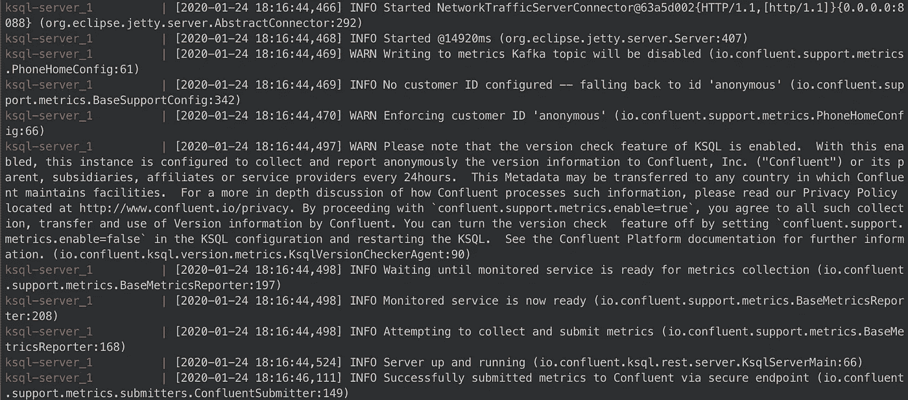

# 如何使用 Jupyter 笔记本、Kafka 和 NLTK 进行实时情感分析

> 原文：<https://towardsdatascience.com/how-to-do-a-sentiment-analysis-in-realtime-using-the-jupyter-notebook-kafka-and-nltk-4470aa8c3c30?source=collection_archive---------25----------------------->

## 关于将 Kafka 的流数据处理到 Jupyter 笔记本的教程

在本文中，我们将讨论如何使用 Jupyter 笔记本对来自 Kafka 集群的数据进行情感分析。

我们将使用:

*   kafka: 我们将使用 kafka 的融合版本作为我们的流媒体平台
*   ksql: 这是一项来自 confluent 的技术，它让我们能够在 kafka 的基础上创建表，并使我们能够实时运行 sql 查询。很酷吧？
*   **jupyter 笔记本**:我们运行分析的环境
*   **docker compose:** 我们将使用它在本地创建我们自己的 kafka 集群
*   **NLTK:** 使用 [vader](http://comp.social.gatech.edu/papers/icwsm14.vader.hutto.pdf) 算法的 python 情感分析库

**TL；DR:整个项目代码在**[**Github**](https://github.com/BogdanCojocar/medium-articles/tree/master/jupyter_kafka)**上。**


Pexels.com

## 步骤 1:运行 docker compose

在第一步中，我们需要运行 docker compose 来创建我们的 kafka 集群。这将运行一堆 docker 容器，这些容器将创建集群的各种元素，如 zookeeper、brokers、topics、ksql。

现在简单地说，kafka 是一个分布式流媒体平台，能够处理大量的消息，这些消息被组织成主题。为了能够并行处理一个主题，必须将它分成多个分区，来自这些分区的数据存储在称为代理的独立机器中。最后，zookeeper 用于管理集群中代理的资源。这是卡夫卡经典版本中的元素。合流平台增加了 ksql 作为查询引擎。

在项目的根目录下运行`docker-compose up`将会创建集群。如果一切运行成功，您应该会看到类似下图的内容。



服务将在端口`8088`上运行，kafka 代理将在端口`9092`上可用。我们需要这些信息从朱庇特联系到卡夫卡。当你完成集群上的工作时，你可以通过运行`docker-compose down.`来停止所有的容器

## 步骤 2:安装附加的依赖项

我们正在使用一些以前可能没有用过的 python 包，因此我们需要安装它们。在项目的根，我们有一个`requirements.txt`文件。要安装它，请在控制台中运行以下命令:

```
pip install -r requirements.txt
```

## 第三步:运行卡夫卡制作程序

为了能够实时消费数据，我们首先必须将一些消息写入 kafka。我们将使用 python 中的`confluent_kafka`库来编写一个生产者:

我们将发送一些非常简单的`JSON`消息`{ 'data' : value }`，其中 value 是预定义列表中的一个句子。对于每条消息，我们写入队列，我们还需要分配一个键。我们将根据`uuid`随机分配一个，以在集群中实现良好的分布。最后，我们还运行一个`flush`命令来确保所有的消息都被发送出去。

一旦我们运行`confluent_kafka_producer`，我们应该会收到一个日志，告诉我们数据已经正确发送:

```
we’ve sent 6 messages to 127.0.0.1:9092
```

## 步骤 4:创建 ksql 表

接下来，我们需要创建 ksql 客户端，它将帮助我们运行该接口的所有命令:

```
client = KSQLAPI(url='[http://localhost:8088'](http://localhost:8088'), timeout=60)
```

我们现在可以创建一个用于查询数据的表:

```
client.create_table(table_name='test_data',
                   columns_type=['data varchar'],
                   topic='test',
                   value_format='JSON',
                   key='data')
```

与我们的`JSON`消息类似，该表只有一个名为 data 的字段，类型为`varchar`，适合我们的字符串句子。

一旦我们运行了表创建命令，我们就可以通过检查我们有哪些可用的 ksql 表来检查一切是否运行成功:

```
client.ksql('show tables')
```

我们应该能够看到我们创建的那个:

```
[{'@type': 'tables',
  'statementText': 'show tables;',
  'tables': [{'format': 'JSON',
    'isWindowed': False,
    'name': 'TEST_DATA',
    'topic': 'test',
    'type': 'TABLE'}]}]
```

## 第五步:从卡夫卡那里获得一些结果，并应用情感分析

我们现在可以在 kafka 上运行`SQL`查询。让我们从它那里得到最新的 5 条消息:

```
res = client.query('select * from test_data limit 5')
```

为了能够更容易地处理这些数据，我们对其进行解析，并将其存储到一个字典中:

```
def parse_results(res):
    res = ''.join(res)
    res = res.replace('\n', '')
    res = res.replace('}{', '},{')
    res = '[' + res + ']'
    return json.loads(res)res_dict = parse_results(res)
```

最后，我们可以对这 5 个句子运行我们的情感分析算法。如前所述，我们将使用来自`NLTK`的预训练`vader`算法:

```
def apply_sent(res):
    sent_res = []
    for r in res:
        sid = SentimentIntensityAnalyzer()
        try:
            sent_res.append(sid.polarity_scores(r['row']['columns'][2]))
        except TypeError:
            print('limit reached')
    return sent_ressend_res = apply_sent(res_dict)
```

我们将`TypeError`视为已经到达消息列表末尾的信号。我们可以想象结果:

```
[{'compound': 0.6369, 'neg': 0.0, 'neu': 0.323, 'pos': 0.677},
 {'compound': 0.6249, 'neg': 0.0, 'neu': 0.423, 'pos': 0.577},
 {'compound': -0.5423, 'neg': 0.467, 'neu': 0.533, 'pos': 0.0},
 {'compound': 0.0, 'neg': 0.0, 'neu': 1.0, 'pos': 0.0},
 {'compound': 0.4215, 'neg': 0.0, 'neu': 0.517, 'pos': 0.483}]
```

每行代表一个句子的结果，情绪可以是积极的、中性的或消极的。就是这个！我们可以看到，只需几个步骤，我们就可以在 Jupyter notebook 中处理和分析实时数据，这种环境对于数据科学家来说很容易使用。