# 如何在 R 中一次对多个变量进行 t 检验或方差分析

> 原文：<https://towardsdatascience.com/how-to-do-a-t-test-or-anova-for-many-variables-at-once-in-r-and-communicate-the-results-in-a-6defaa712e5?source=collection_archive---------8----------------------->

## 了解如何在 R 中一次比较多个变量的样本，并以更好的方式交流结果


Teemu Paananen 拍摄的照片

# 介绍

作为我在比利时一所大学担任助教的一部分，学生们经常要求我帮助他们完成硕士论文的统计分析。

一个常见的问题是如何根据几个[定量连续](https://www.statsandr.com/blog/variable-types-and-examples/#continuous)变量来比较各组患者。我们大多数人都知道:

*   要比较两组，应使用[学生的 t 检验](https://www.statsandr.com/blog/student-s-t-test-in-r-and-by-hand-how-to-compare-two-groups-under-different-scenarios/)和 [1](https://www.statsandr.com/blog/how-to-do-a-t-test-or-anova-for-many-variables-at-once-in-r-and-communicate-the-results-in-a-better-way/#fn1)
*   要比较三组或更多组，应进行 [ANOVA](https://www.statsandr.com/blog/anova-in-r/)

这两个测试是非常基本的，并且在网上和统计学教科书中有广泛的记载，所以困难不在于如何进行这些测试。

过去，我通常按照以下三个步骤进行分析:

1.  绘制说明分组分布情况的箱线图(如果我想使用`[{ggplot2}](https://www.statsandr.com/blog/graphics-in-r-with-ggplot2/)` [包](https://www.statsandr.com/blog/graphics-in-r-with-ggplot2/)，请使用`boxplot()`函数或感谢`[{esquisse}](https://www.statsandr.com/blog/rstudio-addins-or-how-to-make-your-coding-life-easier/#esquisse)` [R Studio 插件](https://www.statsandr.com/blog/rstudio-addins-or-how-to-make-your-coding-life-easier/#esquisse)
2.  根据要比较的组数进行 t 检验或 ANOVA(分别使用`t.test()`和`oneway.test()`功能进行 t 检验和 ANOVA)
3.  对每个变量重复步骤 1 和 2

只要只有几个变量需要测试，这是可行的。尽管如此，大多数学生来找我，要求不是对一两个变量进行这种测试，而是对多个变量进行测试。因此，当有不止一个变量需要测试时，我很快意识到我在浪费时间，必须有一种更有效的方法来完成这项工作。

***注意*** *:您必须非常小心在执行多重测试时可能出现的* [*多重测试*](https://statsandr.com/blog/anova-in-r/#issue-of-multiple-testing) *(也称为多重性)的问题。简而言之，当进行大量的统计测试时，一些会有*PP*-值小于 0.05，这完全是偶然的，即使所有的零假设事实上都是真的。这就是所谓的多重测试。您可以通过使用 Bonferroni 校正等方法来解决这个问题。Bonferroni 校正是一种简单的方法，它允许进行许多 t 检验，同时仍然确保保持总体置信水平。为此，您可以使用* α = 0.05m *而不是使用标准阈值* α=5α=5 *%作为显著性水平，其中* m *是 t 检验的次数。例如，如果您用期望的* α = 0.05 *进行 20 次 t 检验，Bonferroni 修正意味着当*PP*-值小于* α = 0.05 / 20 = 0.0025 *时，您将拒绝每个单独检验的零假设。*

还要注意，没有普遍接受的方法来处理多重比较的问题。通常，你应该选择一个你的听众熟悉的或者你的研究领域中的*p*-价值调整措施。Bonferroni 校正易于实现。然而，如果您有大量的测试要执行，这是不合适的(假设您想要进行 10，000 次 t-测试，一个*p*-值必须小于 0.05 / 10000 = 0.000005 才是有效的)。更强大的方法也是使用 Benjamini-Hochberg 或 Holm 程序来调整错误发现率( [McDonald 2014](https://statsandr.com/blog/how-to-do-a-t-test-or-anova-for-many-variables-at-once-in-r-and-communicate-the-results-in-a-better-way/#ref-mcdonald2014multiple) )。

另一种选择是使用多变量方差分析(MANOVA)。当因变量相关时，这尤其有用。因变量之间的相关性为 MANOVA 提供了以下优势:

*   **识别几个因变量之间的模式**:自变量可以影响因变量之间的关系，而不是影响单个因变量。
*   **解决多重测试的问题**:使用 MANOVA，错误率等于显著性水平(不需要*p*-值调整方法)。
*   **更大的统计功效**:当因变量相关时，MANOVA 可以识别出 ANOVA 检测不到的太小的效应。

本文旨在从技术角度**展示一种执行多重 t 检验和 ANOVA 的方法**(如何在 R 中实现)。关于使用哪种调整方法或是否有更合适的模型来拟合数据的讨论超出了本文的范围(因此请务必理解使用下面的代码进行您自己的分析的含义)。在解释结果之前，确保测试方差分析的[假设](https://statsandr.com/blog/anova-in-r/#underlying-assumptions-of-anova)。

# 一次执行多项测试

因此，我写了一段代码，通过绘制箱线图并一次对几个变量进行测试来自动化这个过程。下面是我使用的代码，用`iris`数据集说明了这个过程。`Species`变量有 3 个级别，所以让我们删除一个，然后画一个箱线图，并对所有 4 个连续变量同时应用 t-test。注意，我们想要测试的连续变量是`iris`数据集中的变量 1 到 4。

```
dat <- iris# remove one level to have only two groups
dat <- subset(dat, Species != "setosa")
dat$Species <- factor(dat$Species)# boxplots and t-tests for the 4 variables at once
for (i in 1:4) { # variables to compare are variables 1 to 4
  boxplot(dat[, i] ~ dat$Species, # draw boxplots by group
    ylab = names(dat[i]), # rename y-axis with variable's name
    xlab = "Species"
  )
  print(t.test(dat[, i] ~ dat$Species)) # print results of t-test
}
```

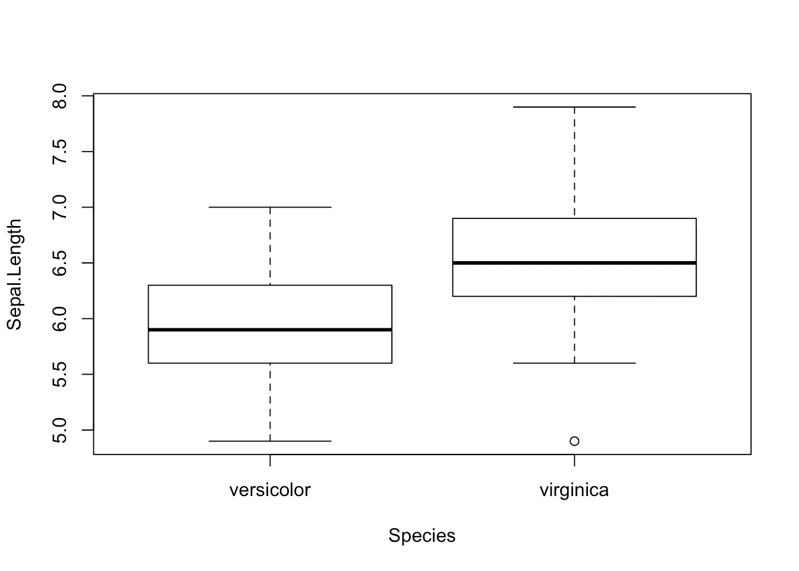

```
## 
##  Welch Two Sample t-test
## 
## data:  dat[, i] by dat$Species
## t = -5.6292, df = 94.025, p-value = 1.866e-07
## alternative hypothesis: true difference in means is not equal to 0
## 95 percent confidence interval:
##  -0.8819731 -0.4220269
## sample estimates:
## mean in group versicolor  mean in group virginica 
##                    5.936                    6.588
```

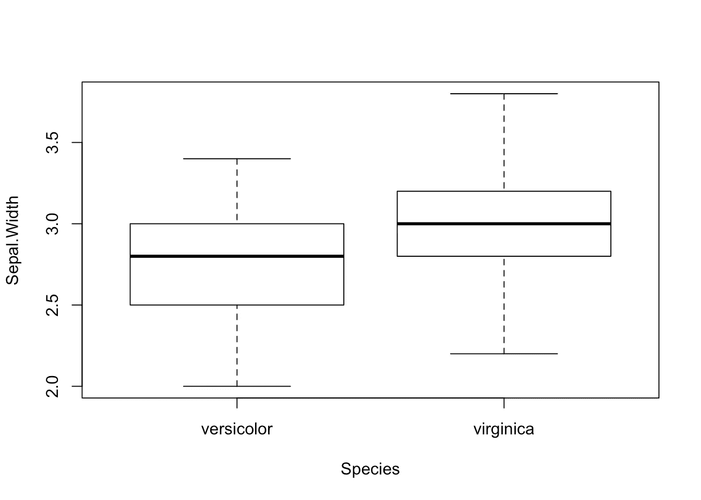

```
## 
##  Welch Two Sample t-test
## 
## data:  dat[, i] by dat$Species
## t = -3.2058, df = 97.927, p-value = 0.001819
## alternative hypothesis: true difference in means is not equal to 0
## 95 percent confidence interval:
##  -0.33028364 -0.07771636
## sample estimates:
## mean in group versicolor  mean in group virginica 
##                    2.770                    2.974
```

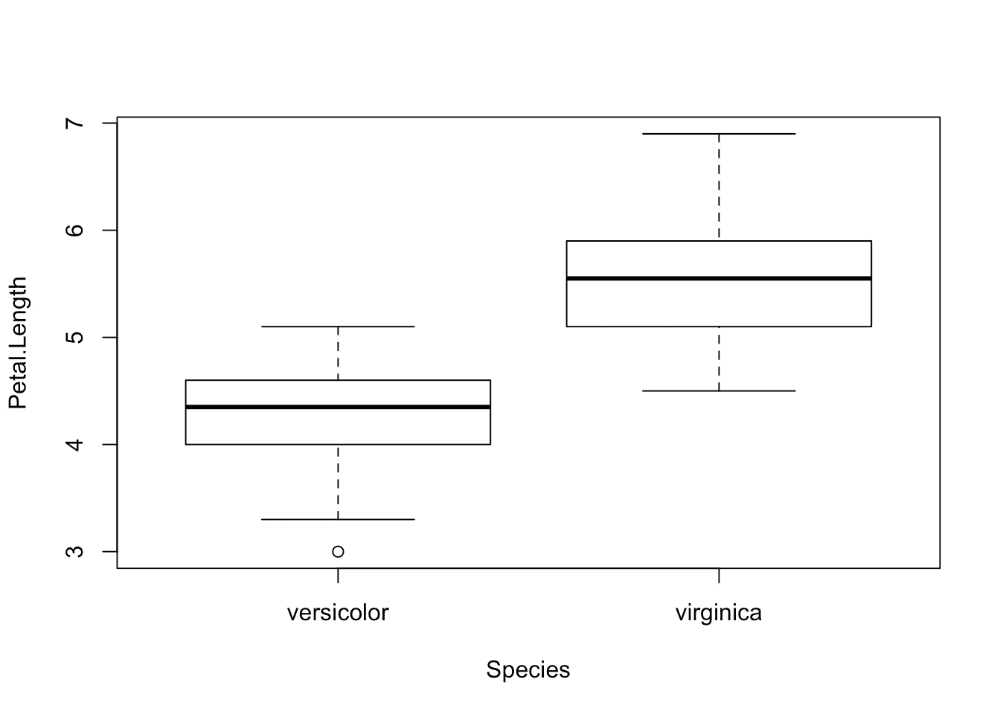

```
## 
##  Welch Two Sample t-test
## 
## data:  dat[, i] by dat$Species
## t = -12.604, df = 95.57, p-value < 2.2e-16
## alternative hypothesis: true difference in means is not equal to 0
## 95 percent confidence interval:
##  -1.49549 -1.08851
## sample estimates:
## mean in group versicolor  mean in group virginica 
##                    4.260                    5.552
```

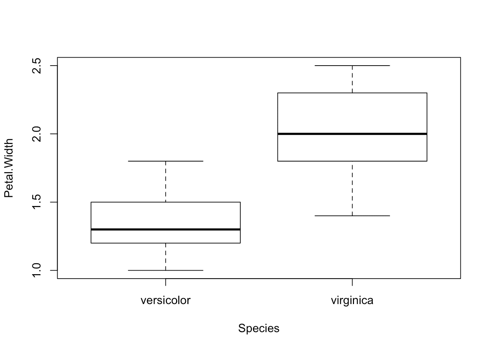

```
## 
##  Welch Two Sample t-test
## 
## data:  dat[, i] by dat$Species
## t = -14.625, df = 89.043, p-value < 2.2e-16
## alternative hypothesis: true difference in means is not equal to 0
## 95 percent confidence interval:
##  -0.7951002 -0.6048998
## sample estimates:
## mean in group versicolor  mean in group virginica 
##                    1.326                    2.026
```

正如您所看到的，上面的代码画了一个箱线图，然后一次性打印出每个连续变量的测试结果。

在过去的某个时候，我甚至编写代码来:

1.  画一个箱线图
2.  检验方差的相等性(感谢 Levene 的检验)
3.  根据方差是相等还是不相等，应用适当的检验:如果方差不相等，则应用韦尔奇检验，如果方差相等，则应用学生的 t 检验(参见关于两个样本的不同版本的 [t 检验的更多详细信息](https://www.statsandr.com/blog/student-s-t-test-in-r-and-by-hand-how-to-compare-two-groups-under-different-scenarios/))
4.  一次对所有连续变量应用步骤 1 至 3

我有一个类似的 ANOVA 代码，以防我需要比较两个以上的组。

代码相对来说做得不错。事实上，由于这段代码，我能够以自动化的方式测试几个变量，因为它可以一次比较所有变量的组。

从一个项目到另一个项目，我必须改变的唯一事情是，我需要修改分组变量的名称和要测试的连续变量的编号(上面代码中的`Species`和`1:4`)。

# 简明易懂的结果

# t 检验

尽管它运行得很好，并且只需稍加修改就可以应用于不同的项目，但我仍然对另一点不满意。

精通统计学和 R 的人可以毫无困难地阅读和解释 t 检验的输出。然而，正如您在自己的统计项目中可能已经注意到的，大多数人不知道在结果中寻找什么，当他们在一个文档中看到如此多的图表、代码、输出、结果和数值时，有时会有点困惑。他们很容易被大量的信息淹没。

在我的旧 R 程序中，当我必须向我的学生解释 R 输出以便他们能够正确解释结果时，我通过自动化 t-tests 和 ANOVA 过程节省的时间就(部分)损失了。虽然大多数时候它只是简单地指出在输出中寻找什么(例如，*p*-值)，但我仍然损失了相当多的时间，因为在我看来，这些输出对于大多数实际应用来说太详细了。换句话说，太多的信息似乎让许多人感到困惑，所以我仍然不相信这是向非科学家分享统计结果的最佳方式。

当然，他们向我寻求统计建议，所以他们期望得到这些结果，我需要给他们问题和假设的答案。尽管如此，我还是想找到一种更好的方法，用最少的信息将这些结果传达给这种类型的观众。不多也不少。

在网上花了很长时间试图找出一种以更简洁和可读的方式呈现结果的方法后，我发现了`[{ggpubr}](https://cran.r-project.org/web/packages/ggpubr/index.html)` [包](https://cran.r-project.org/web/packages/ggpubr/index.html)。该软件包允许在基于 ggplot2 的图形上直接显示所使用的测试和测试的*p*-值。它还有助于为非高级统计受众创建可供出版的图表。

在对最初的代码(在这篇[文章](http://www.sthda.com/english/articles/24-ggpubr-publication-ready-plots/76-add-p-values-and-significance-levels-to-ggplots/)中可以找到)进行了许多改进和修改之后，我终于想出了一个相当稳定和健壮的过程，可以一次对多个变量进行 t 检验和 ANOVA，更重要的是，使结果简明易懂，任何人(无论是否是统计学家)都可以读懂。

一张图胜过千言万语，所以下面是与上一节完全相同的测试，但这次是用我新的 R 例程:

```
library(ggpubr)# Edit from here #
x <- which(names(dat) == "Species") # name of grouping variable
y <- which(names(dat) == "Sepal.Length" # names of variables to test
| names(dat) == "Sepal.Width"
| names(dat) == "Petal.Length"
| names(dat) == "Petal.Width")
method <- "t.test" # one of "wilcox.test" or "t.test"
paired <- FALSE # if paired make sure that in the dataframe you have first all individuals at T1, then all individuals again at T2
# Edit until here # Edit at your own risk
for (i in y) {
  for (j in x) {
    ifelse(paired == TRUE,
      p <- ggpaired(dat,
        x = colnames(dat[j]), y = colnames(dat[i]),
        color = colnames(dat[j]), line.color = "gray", line.size = 0.4,
        palette = "npg",
        legend = "none",
        xlab = colnames(dat[j]),
        ylab = colnames(dat[i]),
        add = "jitter"
      ),
      p <- ggboxplot(dat,
        x = colnames(dat[j]), y = colnames(dat[i]),
        color = colnames(dat[j]),
        palette = "npg",
        legend = "none",
        add = "jitter"
      )
    )
    #  Add p-value
    print(p + stat_compare_means(aes(label = paste0(..method.., ", p-value = ", ..p.format..)),
      method = method,
      paired = paired,
      # group.by = NULL,
      ref.group = NULL
    ))
  }
}
```

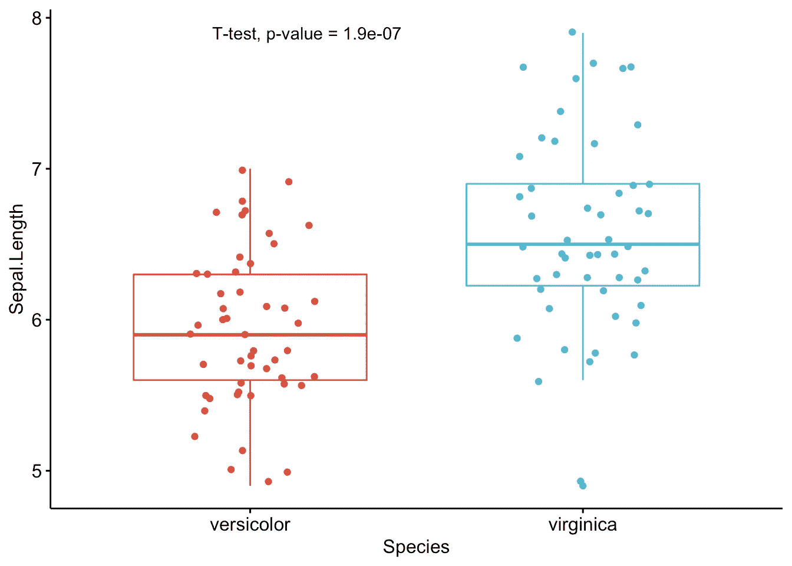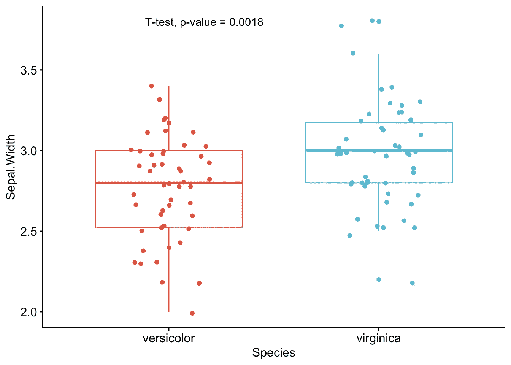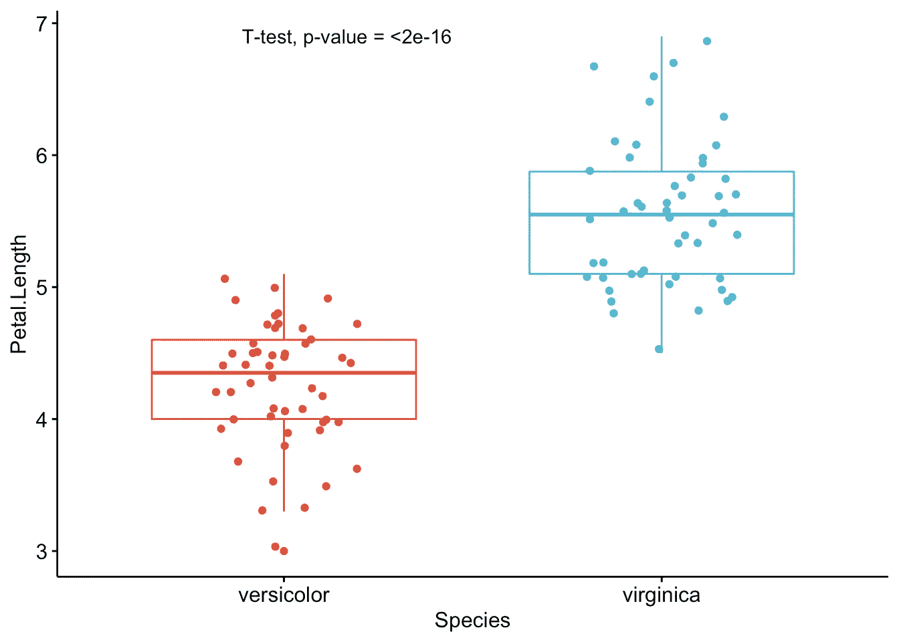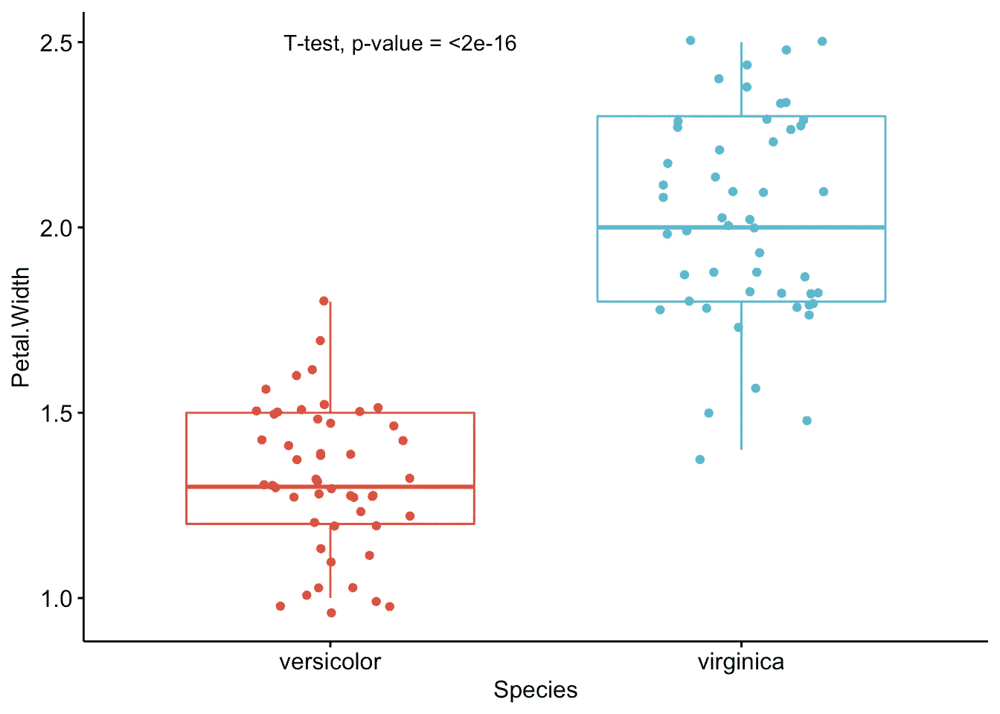

从上面的图表中可以看出，每个变量只显示了最重要的信息:

*   借助箱线图对各组进行直观比较
*   统计测试的名称
*   测试的*p*-值

当然，专家可能对更高级的结果感兴趣。然而，这个简单而完整的图表，包括了测试的名称和 p 值，提供了所有必要的信息来回答这个问题:“组是不同的吗？”。

根据我的经验，我注意到学生和专业人士(尤其是那些来自科学背景不太好的人)对这些结果的理解要远远好于上一节中给出的结果。

对于您自己的项目，唯一需要修改的代码行是分组变量的名称(上面代码中的`Species`)、您想要测试的变量的名称(`Sepal.Length`、`Sepal.Width`等)。)、 [2](http://127.0.0.1:4321/blog/how-to-do-a-t-test-or-anova-for-many-variables-at-once-in-r-and-communicate-the-results-in-a-better-way/#fn2) 是否要应用 t 检验(`t.test`)或 Wilcoxon 检验(`wilcox.test`)以及样本是否配对(`FALSE`如果样本独立，`TRUE`如果配对)。

基于这些图表，即使对于非专家来说，也很容易解释结果并得出结论`versicolor`和`virginica`物种在所有 4 个变量方面存在显著差异(因为所有的*p*-值< 0.05/4 = 0.0125(请注意，Bonferroni 校正用于避免多重测试的问题，因此我们将通常的α水平除以 4，因为有 4 个 t 测试))。

# 其他 p 值校正方法

如果您想使用另一种*p*-值调整方法，您可以使用`p.adjust()`功能。以下是上面找到的原始*p*-值，以及从主要调整方法中得出的*p*-值(以数据框形式显示):

```
raw_pvalue <- numeric(length = length(1:4))
for (i in (1:4)) {
  raw_pvalue[i] <- t.test(dat[, i] ~ dat$Species,
    paired = FALSE,
    alternative = "two.sided"
  )$p.value
}df <- data.frame(
  Variable = names(dat[, 1:4]),
  raw_pvalue = round(raw_pvalue, 3)
)df$Bonferroni <-
  p.adjust(df$raw_pvalue,
    method = "bonferroni"
  )
df$BH <-
  p.adjust(df$raw_pvalue,
    method = "BH"
  )
df$Holm <-
  p.adjust(df$raw_pvalue,
    method = "holm"
  )
df$Hochberg <-
  p.adjust(df$raw_pvalue,
    method = "hochberg"
  )
df$Hommel <-
  p.adjust(df$raw_pvalue,
    method = "hommel"
  )
df$BY <-
  round(p.adjust(df$raw_pvalue,
    method = "BY"
  ), 3)
df##       Variable raw_pvalue Bonferroni    BH  Holm Hochberg Hommel    BY
## 1 Sepal.Length      0.000      0.000 0.000 0.000    0.000  0.000 0.000
## 2  Sepal.Width      0.002      0.008 0.002 0.002    0.002  0.002 0.004
## 3 Petal.Length      0.000      0.000 0.000 0.000    0.000  0.000 0.000
## 4  Petal.Width      0.000      0.000 0.000 0.000    0.000  0.000 0.000
```

无论*p*-值调整方法如何，这两个物种对于所有 4 个变量都是不同的。注意，调整方法应在查看结果之前选择，以避免根据结果选择方法。

下面的另一个功能允许一次执行多个学生 t 检验或 Wilcoxon 检验，并选择*p*-值调整方法。该函数还允许指定样本是否成对，以及方差是否相等。(代码改编自马克·怀特。)

```
t_table <- function(data, dvs, iv,
                    var_equal = TRUE,
                    p_adj = "none",
                    alpha = 0.05,
                    paired = FALSE,
                    wilcoxon = FALSE) {
  if (!inherits(data, "data.frame")) {
    stop("data must be a data.frame")
  } if (!all(c(dvs, iv) %in% names(data))) {
    stop("at least one column given in dvs and iv are not in the data")
  } if (!all(sapply(data[, dvs], is.numeric))) {
    stop("all dvs must be numeric")
  } if (length(unique(na.omit(data[[iv]]))) != 2) {
    stop("independent variable must only have two unique values")
  } out <- lapply(dvs, function(x) {
    if (paired == FALSE & wilcoxon == FALSE) {
      tres <- t.test(data[[x]] ~ data[[iv]], var.equal = var_equal)
    } else if (paired == FALSE & wilcoxon == TRUE) {
      tres <- wilcox.test(data[[x]] ~ data[[iv]])
    } else if (paired == TRUE & wilcoxon == FALSE) {
      tres <- t.test(data[[x]] ~ data[[iv]],
        var.equal = var_equal,
        paired = TRUE
      )
    } else {
      tres <- wilcox.test(data[[x]] ~ data[[iv]],
        paired = TRUE
      )
    } c(
      p_value = tres$p.value
    )
  }) out <- as.data.frame(do.call(rbind, out))
  out <- cbind(variable = dvs, out)
  names(out) <- gsub("[^0-9A-Za-z_]", "", names(out)) out$p_value <- ifelse(out$p_value < 0.001,
    "<0.001",
    round(p.adjust(out$p_value, p_adj), 3)
  )
  out$conclusion <- ifelse(out$p_value < alpha,
    paste0("Reject H0 at ", alpha * 100, "%"),
    paste0("Do not reject H0 at ", alpha * 100, "%")
  ) return(out)
}
```

应用于我们的数据集，没有针对 *p* 值的调整方法:

```
result <- t_table(
  data = dat,
  c("Sepal.Length", "Sepal.Width", "Petal.Length", "Petal.Width"),
  "Species"
)result##       variable p_value      conclusion
## 1 Sepal.Length  <0.001 Reject H0 at 5%
## 2  Sepal.Width   0.002 Reject H0 at 5%
## 3 Petal.Length  <0.001 Reject H0 at 5%
## 4  Petal.Width  <0.001 Reject H0 at 5%
```

使用霍尔姆(1979)的调整方法:

```
result <- t_table(
  data = dat,
  c("Sepal.Length", "Sepal.Width", "Petal.Length", "Petal.Width"),
  "Species",
  p_adj = "holm"
)result##       variable p_value      conclusion
## 1 Sepal.Length  <0.001 Reject H0 at 5%
## 2  Sepal.Width   0.002 Reject H0 at 5%
## 3 Petal.Length  <0.001 Reject H0 at 5%
## 4  Petal.Width  <0.001 Reject H0 at 5%
```

同样，使用霍尔姆的调整方法，我们得出结论，在 5%的显著性水平上，这两个物种在所有 4 个变量方面彼此显著不同。

# 方差分析

下面同样的过程用一个方差分析。注意，这次我们重新加载数据集`iris`以包括所有三个`Species`:

```
dat <- iris# Edit from here
x <- which(names(dat) == "Species") # name of grouping variable
y <- which(names(dat) == "Sepal.Length" # names of variables to test
| names(dat) == "Sepal.Width"
| names(dat) == "Petal.Length"
| names(dat) == "Petal.Width")
method1 <- "anova" # one of "anova" or "kruskal.test"
method2 <- "t.test" # one of "wilcox.test" or "t.test"
my_comparisons <- list(c("setosa", "versicolor"), c("setosa", "virginica"), c("versicolor", "virginica")) # comparisons for post-hoc tests
# Edit until here # Edit at your own risk
for (i in y) {
  for (j in x) {
    p <- ggboxplot(dat,
      x = colnames(dat[j]), y = colnames(dat[i]),
      color = colnames(dat[j]),
      legend = "none",
      palette = "npg",
      add = "jitter"
    )
    print(
      p + stat_compare_means(aes(label = paste0(..method.., ", p-value = ", ..p.format..)),
        method = method1, label.y = max(dat[, i], na.rm = TRUE)
      )
      + stat_compare_means(comparisons = my_comparisons, method = method2, label = "p.format") # remove if p-value of ANOVA or Kruskal-Wallis test >= alpha
    )
  }
}
```

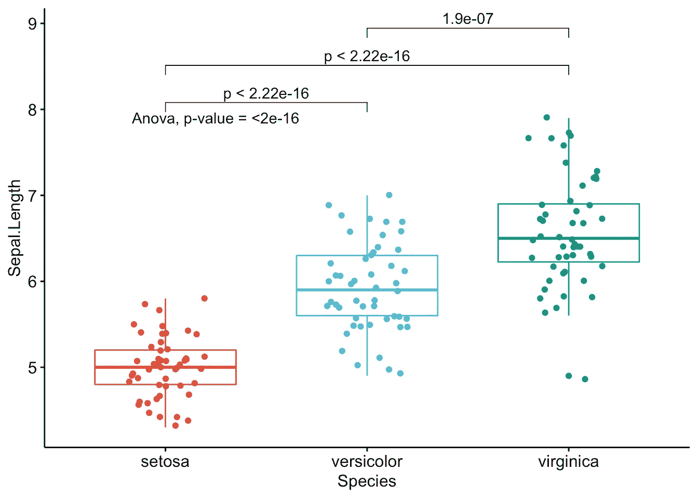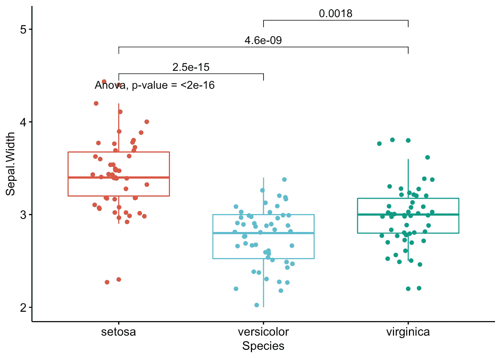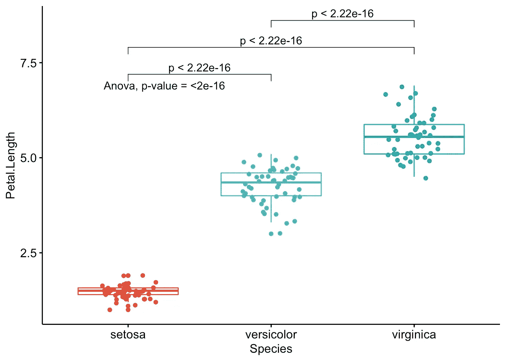

就像 t 检验的改进程序一样，我注意到学生和非专业人士理解以这种方式呈现的方差分析结果比默认的 R 输出要容易得多。

每个变量一张图，很容易看出所有物种在所有 4 个变量方面彼此不同。

如果您想对您的数据应用相同的自动化过程，您将需要修改分组变量的名称(`Species`)、想要测试的变量的名称(`Sepal.Length`等。)，是否要执行 ANOVA ( `anova`)或 Kruskal-Wallis 检验(`kruskal.test`)，并最终指定事后检验的比较。 [3](https://www.statsandr.com/blog/how-to-do-a-t-test-or-anova-for-many-variables-at-once-in-r-and-communicate-the-results-in-a-better-way/#fn3)

# 更进一步

正如我们已经看到的，这两个改进的 R 例程允许:

1.  对少量或大量的变量进行 t 检验和 ANOVA，只对代码进行微小的修改。我基本上只需要替换变量名和我想使用的测试名。测试一个或几个变量几乎需要相同的时间，因此与一次测试一个变量相比，这是一个很大的改进
2.  以一种更恰当、更干净的方式分享测试结果。这是可能的，因为有一张图显示了各组的观察结果以及该图中包含的适当测试的 *p* 值。当向更广泛的受众或来自不同背景的人传达结果时，这一点尤为重要。

然而，就像我的大多数 R 例程一样，这两段代码仍然是一个正在进行的工作。以下是我一直在思考的一些附加功能，这些功能可以在未来添加，以使比较两个或更多组的过程更加优化:

*   增加通过数据框中的编号选择变量的可能性。目前，只有通过他们的名字才能做到。这将允许进一步自动化这个过程，因为我们可以简单地输入`4:25`(例如测试变量 4 到 25)，而不是一个接一个地输入所有的变量名。
*   增加选择一种*p*-值调整方法的可能性。目前，原始的*p*-值显示在图表中，之后我会手动调整它们。
*   当比较两个以上的组时，目前只能应用 ANOVA 或 Kruskal-Wallis 检验。一个主要的改进将是增加执行重复测量 ANOVA 的可能性(即，当样本相关时的 ANOVA)。目前已经可以用两个配对的样本进行 t 检验，但还不能用两个以上的组进行同样的检验。
*   在比较 2 个以上组时，另一个不太重要(但仍然很好)的特征是仅在 ANOVA 或 Kruskal-Wallis 检验的无效假设被拒绝的情况下自动应用事后检验(因此，当至少有一个组与其他组不同时，因为如果相等组的无效假设没有被拒绝，我们不应用事后检验)。目前，我根据 ANOVA 或 Kruskal-Wallis 测试的全局 *p* 值，手动添加或删除显示事后测试的 *p* 值的代码。

我将在未来尝试添加这些功能，或者如果{ggpubr}包的作者在包含这些功能时需要帮助，我将很乐意提供帮助(我希望他会看到这篇文章！).

最后但同样重要的是，一些读者可能会对以下软件包感兴趣:

*   如果你想在图表上报告统计结果，我建议你检查`[{ggstatsplot}](https://indrajeetpatil.github.io/ggstatsplot/)` [包](https://indrajeetpatil.github.io/ggstatsplot/)，特别是`[ggbetweenstats()](https://indrajeetpatil.github.io/ggstatsplot/articles/web_only/ggbetweenstats.html)`函数。该功能允许在多组或多种条件下比较连续变量。请注意，图表上显示了许多不同的统计结果，不仅仅是测试名称和 *p* 值。然而，为了结合可视化和可靠的统计分析的优点，在图表中包含测试结果仍然是非常方便的。
*   `[{compareGroups}](https://cloud.r-project.org/web/packages/compareGroups/index.html)` [包](https://cloud.r-project.org/web/packages/compareGroups/index.html)也提供了一个比较组的好方法。它配有一个真正完整的闪亮应用程序，可用于:

```
# install.packages("compareGroups")
library(compareGroups)
cGroupsWUI()
```

感谢阅读。我希望这篇文章能帮助你同时对多个变量进行 t 检验和方差分析，并使结果更容易被非科学家阅读和解释。了解更多有关比较两个样本的 [t-test](https://www.statsandr.com/blog/student-s-t-test-in-r-and-by-hand-how-to-compare-two-groups-under-different-scenarios/) 或比较三个或更多样本的 [ANOVA](https://www.statsandr.com/blog/anova-in-r/) 的信息。

和往常一样，如果您有与本文主题相关的问题或建议，请将其添加为评论，以便其他读者可以从讨论中受益。

**相关文章:**

*   [新冠肺炎冠状病毒前 7 名资源](https://www.statsandr.com/blog/top-r-resources-on-covid-19-coronavirus/)
*   [如何手动执行单样本 t 检验，并对一个平均值进行 R:检验](https://www.statsandr.com/blog/how-to-perform-a-one-sample-t-test-by-hand-and-in-r-test-on-one-mean/)
*   [每个数据科学家都应该知道的概率中的 9 个概念和公式](https://www.statsandr.com/blog/the-9-concepts-and-formulas-in-probability-that-every-data-scientist-should-know/)
*   [学生的 R 和手工 t 检验:如何在不同场景下比较两组](https://www.statsandr.com/blog/student-s-t-test-in-r-and-by-hand-how-to-compare-two-groups-under-different-scenarios/)
*   [R 中的相关图:如何突出显示数据集中最相关的变量](https://www.statsandr.com/blog/correlogram-in-r-how-to-highlight-the-most-correlated-variables-in-a-dataset/)

# 参考

霍尔姆，斯图。1979."一个简单的顺序拒绝多重测试程序."*斯堪的纳维亚统计杂志*。JSTOR，65–70 岁。

麦当劳，J.H. 2014。生物统计手册(第 3 版。).马里兰州巴尔的摩斯巴基出版社。

1.  理论上，ANOVA 也可以用于比较两组，因为它与学生的 t 检验相比会给出相同的结果，但在实践中，我们使用学生的 t 检验来比较两个样本，ANOVA 来比较三个或更多样本。 [↩](https://www.statsandr.com/blog/how-to-do-a-t-test-or-anova-for-many-variables-at-once-in-r-and-communicate-the-results-in-a-better-way/#fnref1)
2.  不要忘记用`|`分隔你想要测试的变量。 [↩](https://www.statsandr.com/blog/how-to-do-a-t-test-or-anova-for-many-variables-at-once-in-r-and-communicate-the-results-in-a-better-way/#fnref2)
3.  事后检验只是用来指特定类型的统计检验的名称。事后测试包括 Tukey HSD 测试、Bonferroni 校正、Dunnett 测试等。即使 ANOVA 或 Kruskal-Wallis 测试可以确定是否至少有一个组与其他组不同，它也不允许我们得出**哪些**彼此不同的结论。为此，有一些事后测试，在对多重比较进行调整后，将所有组两两进行比较，以确定哪些组是不同的。具体来说，在 ANOVA 或 Kruskal-Wallis 检验显示至少有一个组不同之后，对每一对可能的组进行事后检验(因此这种检验的名称为“post”)。无效假设和替代假设以及对这些测试的解释类似于学生对两个样本的 t 检验。 [↩](https://www.statsandr.com/blog/how-to-do-a-t-test-or-anova-for-many-variables-at-once-in-r-and-communicate-the-results-in-a-better-way/#fnref3)

*原载于 2020 年 3 月 19 日*[*【https://statsandr.com】*](https://statsandr.com/blog/how-to-do-a-t-test-or-anova-for-many-variables-at-once-in-r-and-communicate-the-results-in-a-better-way/)*。*