# 如何在 Azure Cosmos DB 中对图形数据进行高级分析

> 原文：<https://towardsdatascience.com/how-to-do-advanced-analytics-on-graph-databases-in-azure-cosmos-db-f0a83b4cb5c4?source=collection_archive---------32----------------------->

## 学习使用 Gremlin 在 Cosmos DB 中编写图形数据，然后使用 GraphFrames 读取/分析 Azure Databricks 中的数据。

# 0.介绍

Azure Cosmos DB 是一个完全托管的多数据库服务。它使您能够在全球范围内构建高度响应的应用程序。作为 Cosmos DB 的一部分，graph 数据库支持 Gremlin。由于 Cosmos DB 针对快速处理进行了优化( [OLTP](https://en.wikipedia.org/wiki/Online_transaction_processing) )，[遍历限制](https://docs.microsoft.com/en-us/azure/cosmos-db/gremlin-limits#limits)可能适用于繁重的分析工作负载( [OLAP](https://en.wikipedia.org/wiki/Online_analytical_processing) )。在这种情况下，Azure Databricks 和 GraphFrames 可以用作高级分析的替代方法，参见下面的架构。

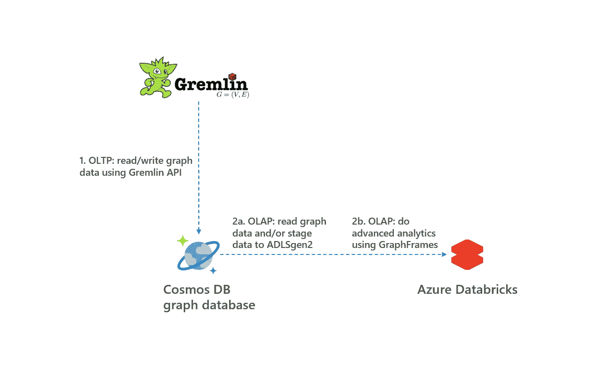

0.建筑(作者图片)

在博客的剩余部分，完成了以下工作:

*   OLTP:使用 Gremlin API 和 Python 将图形数据写入 Cosmos DB
*   OLAP:从 Cosmos DB 读取数据，分析 Azure Databricks 中的数据

最后，在最后一章中得出结论。

# 1.OLTP:使用 Gremlin API 将数据写入 Cosmos DB

在本章中，Gremlin API 和 Python 将用于向 Cosmos DB 写入数据。因为 Azure Databricks 将在下一章中用于 OLAP，所以 Azure Databricks 集群也用于使用 Gremlin API 将数据写入 Cosmos DB。然而，任何 Python3 环境都可以用来将数据写入 Cosmos DB，例如 Visual Code、PyCharm 或 Azure 函数。执行以下步骤:

*   1.1.安装必备组件
*   1.2.在 Azure 数据块中安装 Gremlin Python 库
*   1.3.获取并运行笔记本

另请参见下面的架构。

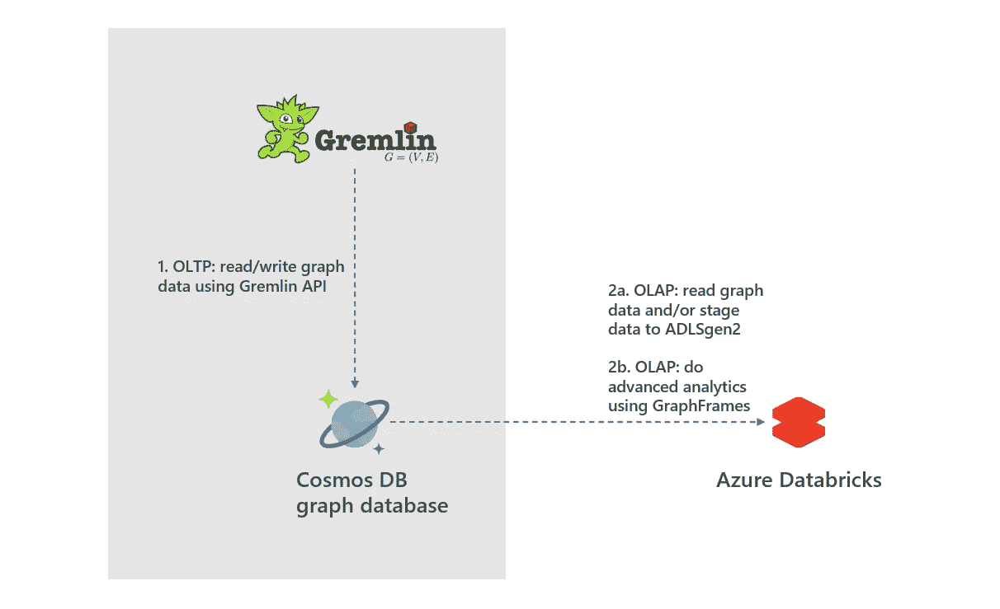

1.OLTP:使用 Gremlin API 将数据写入 Cosmos DB(图片由作者提供)

## 1.1.安装必备组件

需要安装以下先决条件:

*   [Azure 数据块](https://docs.microsoft.com/nl-nl/azure/azure-databricks/quickstart-create-databricks-workspace-portal?toc=/azure/databricks/toc.json&bc=/azure/databricks/breadcrumb/toc.json#step-2-create-a-databricks-workspace)
*   [带 Gremlin API 的 Cosmos DB](https://docs.microsoft.com/nl-nl/azure/cosmos-db/create-graph-gremlin-console#create-a-database-account)

在 Cosmos DB 中创建数据库和图形时，可以使用/name 作为分区键。将 PeopleDB 作为数据库的名称，将 friends 作为图形的名称，请参见下文。

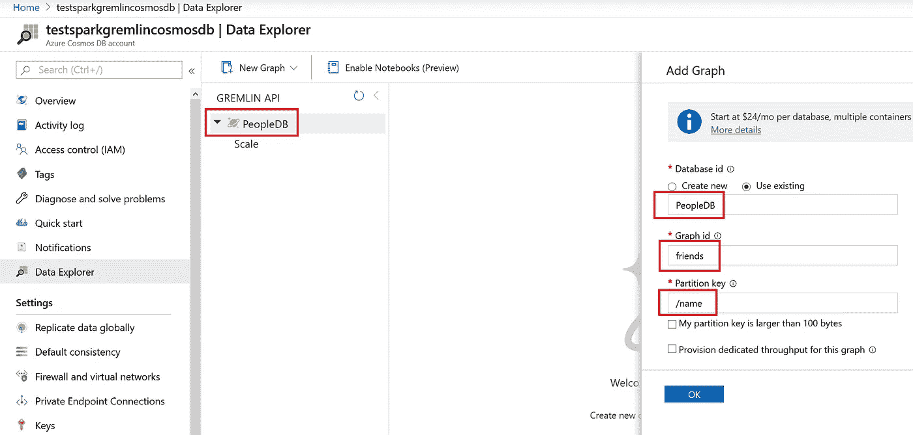

1.1./name 作为朋友图和 PeopleDB 数据中的分区键(图片由作者提供)

## 1.2.在 Azure 数据块中安装 Gremlin Python 库

启动 Azure Databricks 工作区并转到群集。使用 Databricks 运行时版本 6.4 创建一个新集群，并且只有一个工作节点，另请参见下文。

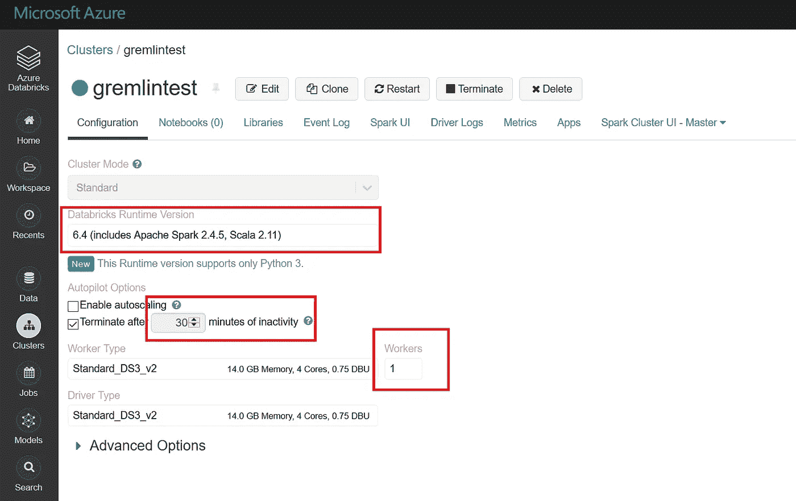

1.2a .创建数据块集群(图片由作者提供)

随后，转到您的集群并单击安装库。然后选择 Pypi 并搜索 gremlinpython，然后单击 install，另见下文。

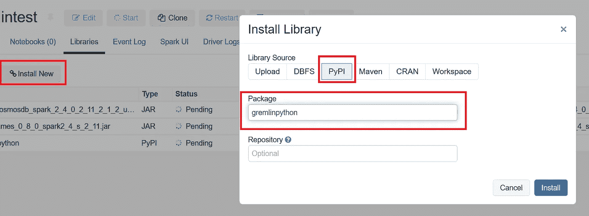

1.2b .在集群上安装 gremlinpython 库(图片由作者提供)

## 1.3.获取并运行笔记本

转到您的 Azure Databricks 工作区，右键单击，然后选择导入。在单选按钮中，选择使用 URL 导入以下笔记本:

```
[https://raw.githubusercontent.com/rebremer/cosmosdb-databricks-olap/master/insert_data_CosmosDB_OLTP_Python_Gremlin.py](https://raw.githubusercontent.com/rebremer/cosmosdb-databricks-olap/master/insert_data_CosmosDB_OLTP_Python_Gremlin.py)
```

笔记本导入后，您需要更改您的 Cosmos DB 端点的 URL 和您的 Cosmos DB 密钥，这可以在门户中找到，也请参见下文。

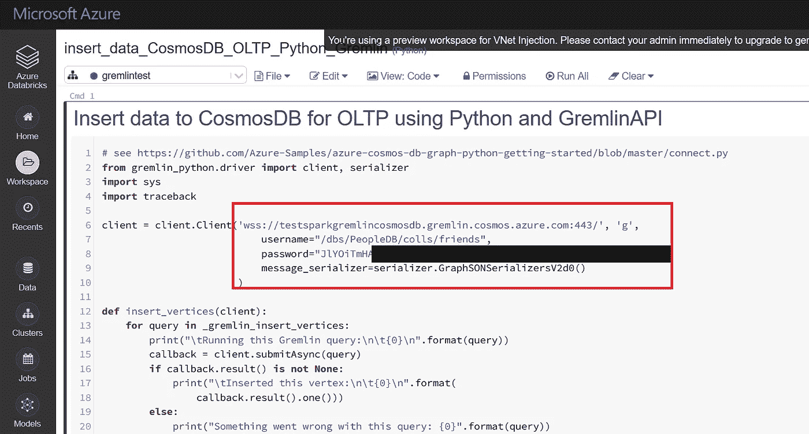

1.3a .使用 gremlin API 写入 Cosmos DB 的笔记本(图片由作者提供)

现在选择运行笔记本，数据将被写入 Cosmos DB。验证数据是否存在，另见下文。

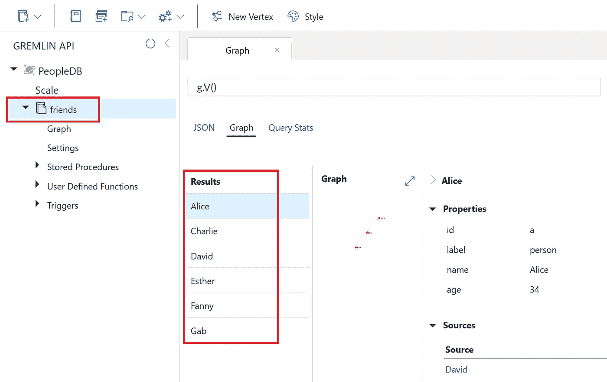

1.3b . Cosmos DB 中的数据(图片由作者提供)

在本章中，使用 Gremlin API、Python 和 Azure Databricks 添加了图形数据。在下一章中，将对数据进行分析，其中重复使用了 Databricks 集群。

# 2.OLAP:获取数据，用 Azure Databricks 进行分析

在本章中，数据是从 Cosmos DB 中检索的，并在 Azure Databricks 中使用 GraphFrames 进行分析。在这种情况下，数据直接从 Azure Databricks 中的 Cosmos DB 读取。由于 Cosmos DB 通常用作 OLTP，因此可能需要首先在 ADLSgen2 中暂存数据，以最小化 Cosmos DB 上的负载，防止在需要大量数据加载时超时，并节省成本。然而，为了简单起见，在这篇博客中，数据直接从 Cosmos DB 读取到 Azure Databricks。执行以下步骤:

*   2.1.在 Azure 数据块中安装 Cosmos DB 和 GraphFrames 库
*   2.2.获取并运行笔记本

另请参见下面的架构。

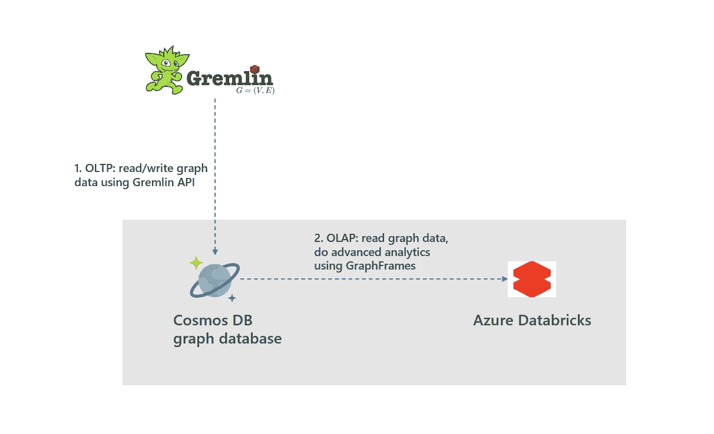

2.OLAP:从 Cosmos DB 获取图形数据，并使用 GraphFrames 进行分析(图片由作者提供)

## 2.1.在 Azure 数据块中安装 Cosmos DB 和 GraphFrames 库

Cosmos DB 连接器和 GraphFrames 需要作为 jar 文件安装到上一章创建的集群中。使用此[链接](https://github.com/Azure/azure-cosmosdb-spark#working-with-the-connector)下载最新的 uber Cosmos DB 连接器到您的桌面。随后，转到 your Azure Databricks 集群并单击安装库。然后选择 jar 并放下 Jar 文件，也见下文。

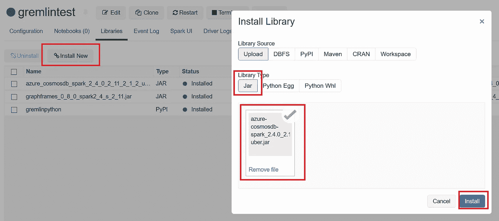

2.1a .将 Cosmos DB 连接器安装到集群(图片由作者提供)

随后，使用这个[链接](https://spark-packages.org/package/graphframes/graphframes)下载最新的 GraphFreams，并将其安装在与 Cosmos DB 连接器相同的 was 中。验证所有库是否安装正确，另请参见下文。

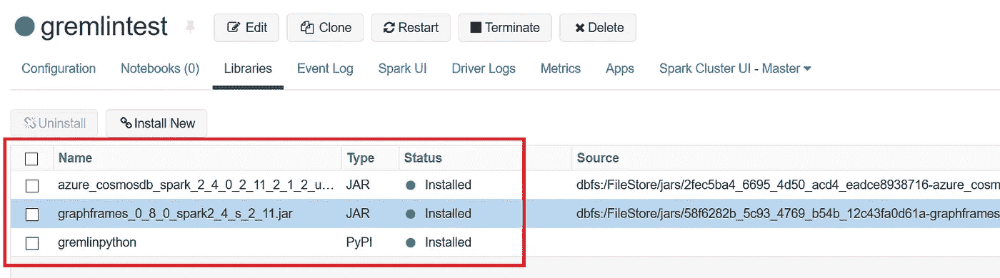

2.1b .库安装正确(图片由作者提供)

## 2.2.获取并运行笔记本

转到您的 Azure Databricks 工作区，右键单击，然后选择导入。在单选按钮中，选择使用 URL 导入以下笔记本:

```
[https://raw.githubusercontent.com/rebremer/cosmosdb-databricks-olap/master/get_data_cosmosDB_OLAP_Scala_GraphFrames.scala](https://raw.githubusercontent.com/rebremer/cosmosdb-databricks-olap/master/get_data_cosmosDB_OLAP_Scala_GraphFrames.scala)
```

笔记本导入后，您需要更改您的 cosmos DB 端点的 URL 和您的 Cosmos DB 密钥，这可以在门户中找到，也请参见下文。最后你可以运行笔记本了。在最后一个单元格中，您可以找到标签传播算法的结果，这是在社区检测中使用的，也请参见下文。

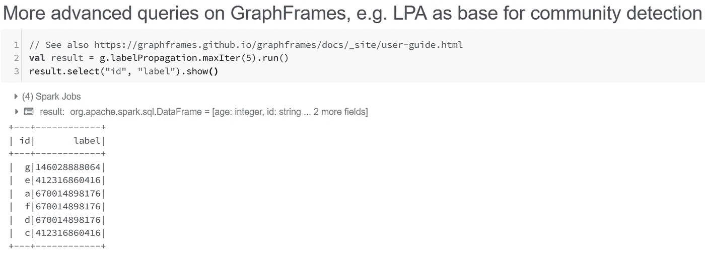

2.2.Azure Databricks 中图形的更高级查询(图片由作者提供)

# 3.结论

[Cosmos DB](https://docs.microsoft.com/en-us/azure/cosmos-db/introduction) 是 Azure 中的多模型数据库服务，支持图形数据库。由于 Cosmos DB 针对 OLTP 进行了优化，因此[遍历限制](https://docs.microsoft.com/en-us/azure/cosmos-db/gremlin-limits#limits)可能适用于繁重的 OLAP 工作负载。在这种情况下，Azure Databricks 和 GraphFrames 可以用作高级分析的替代方法，参见下面的架构。


3.建筑(作者图片)