# 如何进行探索性数据分析

> 原文：<https://towardsdatascience.com/how-to-do-exploratory-data-analysis-e8bfa7db69d9?source=collection_archive---------20----------------------->

## 从数据中获取洞察力的实用分步指南

探索性数据分析(EDA)通常是任何数据科学项目的第一步，在建立任何机器学习模型之前进行。它的目标是看一看我们获得的原始数据，探索它，并从中收集见解，这不仅可以帮助我们事后改进我们的模型，还可以提供从这些数据中得出的相关业务信息。

*在这篇文章中，我们将在真实的数据集上进行广泛的 EDA，以了解可以做什么，如何做，并练习我们的技能。探索性数据分析主要是通过标绘不同的图表，从中推导出相关信息。虽然这看起来很容易，但是知道什么时候使用我们所掌握的每一个可视化工具，以及显示可用信息的最佳实践是很重要的。*

同样重要的是，我们要学会如何深入了解我们的数据，这样我们就可以用它来讲述一个故事，吸引我们的听众，并提供有价值的、有用的信息。

*为此，我们将使用真实的公共数据集，并涵盖我们将用于对其进行初步数据分析的所有不同步骤，同时解释我们使用的每个绘图工具的优势和劣势。我们走吧！*

# 数据:UCI 银行营销数据集

与[平面图标](https://www.flaticon.com/)不一致

我们将使用的数据集是公开可用的 **'** [***银行营销数据集***](https://archive.ics.uci.edu/ml/datasets/Bank+Marketing)***'***，来自 UCI 机器学习资源库，它是机器学习社区用来测试其算法的数据库、领域理论和数据生成器的集合。

该数据与一家葡萄牙银行机构的直接营销活动相关。这些营销活动是基于电话。在前面的存储库中，您可以找到所有变量的描述。让我们使用三个简单的 pandas 函数快速查看数据包含的内容:

*   **Head:** 使用 head pandas 方法可以让我们看到数据的前 5 行。通过这样做，我们可以快速地看到我们拥有的变量，它们的一些可能的值，以及它们是否是数字的。

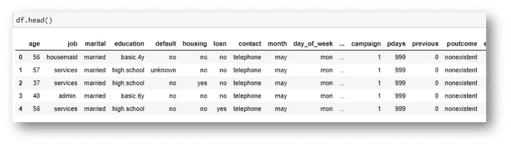

给定数据集上 pandas.head()函数的输出

*   Info 方法是另一种快速获取相关信息的方法。使用它，我们可以看到我们有多少数据点和特征，以及这些特征的数据类型，以及它们是否有任何缺失值。

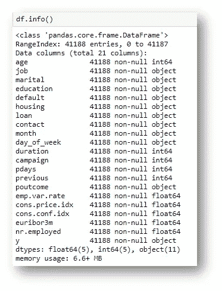

给定数据集上 pandas.info()函数的输出

*   **Describe:**Describe 函数主要用于获取数据集的数值变量的信息。您可以看到这些变量的平均值、最大值和最小值，以及它们的标准偏差。从这里已经可以了解到一些很酷的信息。

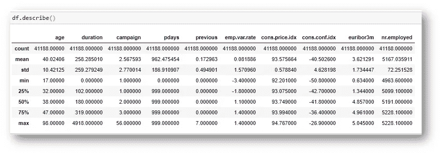

给定数据集上 pandas.describe()函数的输出

好了，现在我们已经做了一个快速的描述性分析，让我们继续我们来这里的目的:**剧情**，如何用它们讲故事并获得相关信息。

# 探索性数据分析:地块和更多地块

来自[平板图标](https://www.flaticon.com/)的图标

在对 Pandas 进行快速分析以查看数据点的数量和我们拥有的要素的数量，以及它们的类型和缺失值的数量之后，我们很快就了解了我们正在处理的数据的大小、其复杂性以及我们需要完成的填充这些缺失值的工作。现在，我们将开始分析的可视化部分。

在下面的分析中，我们将一步一步地铺平道路，从最初对数据的无知到对数据的深入了解，形成足以回答最相关问题的理解。沿着这条路，我们将使用不同种类的图，每一种都将使用一个具体的例子来解释，涵盖了使用每一种图的最佳实践。

我们将**从分析目标变量**开始。在我们的数据的情况下，这个变量被清楚地定义，并且因为它是一个二元分类任务，我们已经有了它应该看起来像什么的想法。我们将使用条形图来完成这项工作。让我们来看看！

## 条形图:可视化与不同类别相关的数量

来自[平面图标](https://www.flaticon.com/free-icon/bar-chart_386979)的图标

**条形图**表示一个轴上的数值和另一个轴上的不同类别。它们通常用于比较不同组或类别之间的单个数值。在下面的例子中，我们比较了不同类别的目标变量的样本比例。

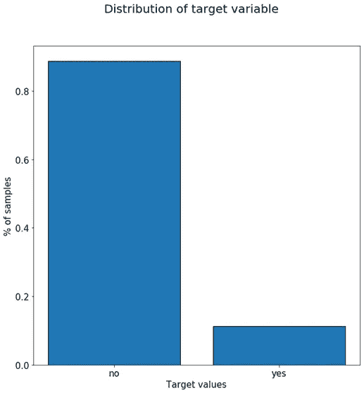

显示目标变量分布的条形图

从前面的图中我们可以看到，超过 85%的样本具有“*否*的目标值，大约 12%的样本具有“*是*的值。这个初始图让我们了解了客户对我们的营销活动的反应(大多数人拒绝)，也告诉我们，如果我们计划在使用它之后训练一个机器学习模型，我们可能需要重新平衡数据集。一个情节和两条非常有价值的信息。

让我们继续看看条形图和良好实践的其他用途。如果我们探索一个具有更多类别的变量，例如'*教育*'变量，我们会得到如下图:

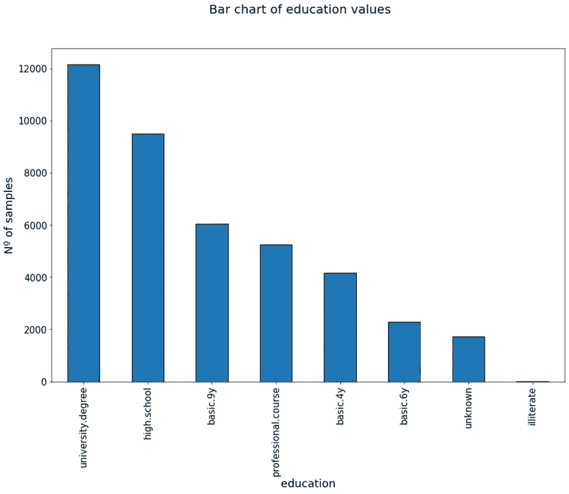

“教育”变量类别的样本数量垂直条形图

从这幅图中我们可以看出，大多数目标人物都有大学学位，很少有人是文盲。当创建这样的图时，它有助于从最高值到最低值排列类别，因为它使可视化更加清晰。在本例中，我们也包括了 N 个样本的绝对值，而不是之前*目标*变量示例中的百分比。如果我们知道数据点的数量(在这种情况下是联系的人)，那么包括百分比值是最有帮助的。如果没有，最好包含绝对的。

从上图中可以注意到一件事，那就是阅读变量不同类别的名称并不容易。为了解决这个问题，我们可以将这些标签旋转 45 度，或者切换到水平条形图，如下图所示。

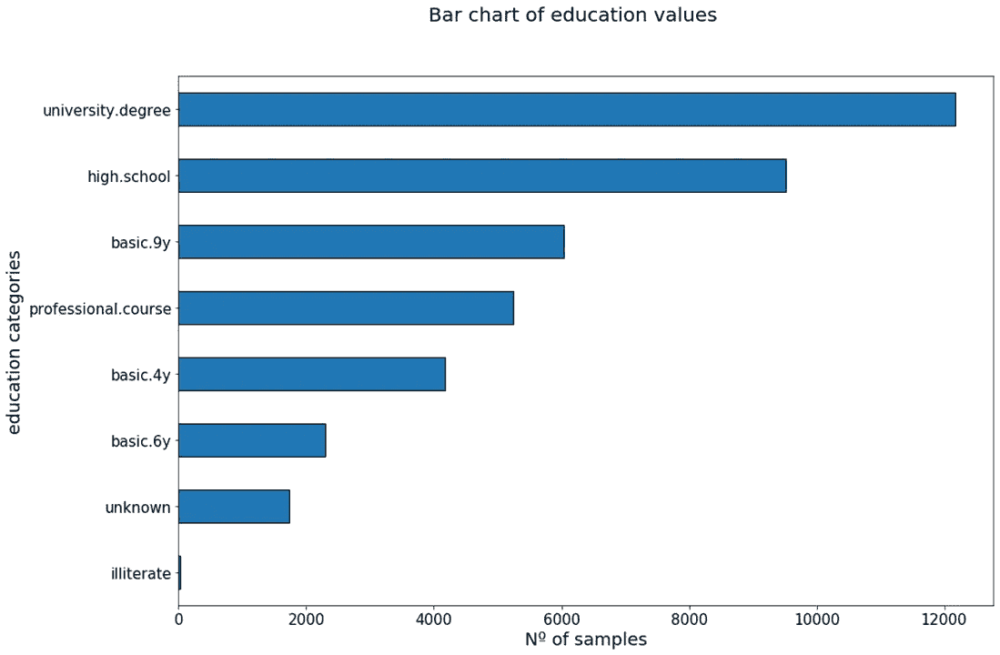

“教育”变量类别的样本数量的水平条形图

现在我们可以很容易地阅读标签。还要注意给图加一个小标题是多么重要，这样我们就可以很容易地看到我们在谈论什么，也可以适当地给轴命名。在第一个教育变量的例子中，标有“ *education* ”的轴实际上显示了该变量的不同类别。在水平条形图中，该标签已被正确修改为*“教育类别*”。

让我们看完与' *job* '变量对应的一些条形图，它告诉我们受影响的客户所属的工作类别。

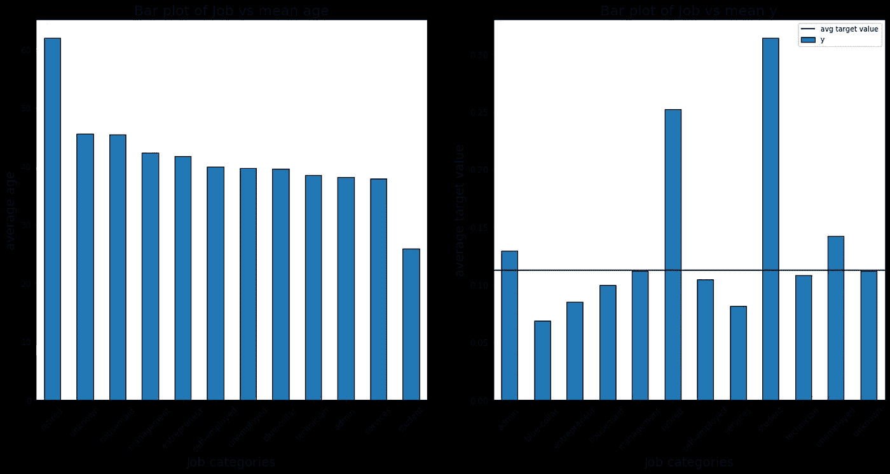

工作变量的条形图

左边的柱状图代表了每个工作类别的平均年龄。从中我们可以看到一些显而易见的东西:退休人员的平均年龄最高，而学生的平均年龄最低。

然而，右边的图表更有趣。它反映了每个工作类别相对于我们的目标变量的行为。正如我们之前看到的，对于我们抛出的营销活动，大约 12%是我们的平均接受率。这在图上用水平黑线表示。每列的高度代表被评估变量的每个类别的平均接受率。正如我们所见，学生是最有可能接受我们活动的客户，因为他们的接受率是标准接受率的两倍以上。相反，蓝领工人是最不可能接受的，只有平均接受率的一半。我们是否应该调整我们的活动来增加这类客户的数量？

下图显示了代表目标人员婚姻状况的*婚姻*变量的相同曲线:

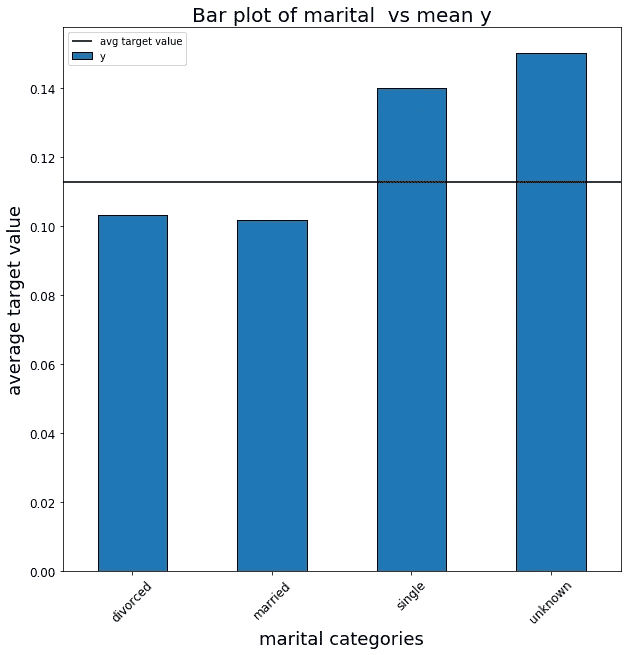

婚姻变量目标分析条形图

正如我们所见，单身人士比已婚或离异人士更有可能对我们的营销活动做出积极反应。这可能是因为他们更年轻，属于学生类别，正如我们之前看到的那样，他们的录取率也很高。我将把这个进一步的调查留给最好奇的读者。

***条形图概要:*** *条形图最常用于比较不同类别或组之间的单个变量值。当使用条形图比较不同的类别时，避免显示很长的类别列表，按高度对列进行排序，当 x 标签很长时，考虑使用水平条形图。*

我们现在不会太担心颜色，但它们对于区分不同的类别和使情节更加清晰也很重要。

## 散点图:数值变量之间的关系

来自[平面图标](https://www.flaticon.com/search?word=Scatter%20plot)的图标

**散点图**用于确定两个数值变量之间的关系。它们可以帮助查看两个变量之间是否存在直接关系(例如，正线性关系或负线性关系)。此外，它们可以帮助我们检测我们的数据是否有异常值。如果变量不遵循任何类型的关系，我们可以考虑对它们中的一个进行转换，比如将其转换为对数。

如果数据没有任何直接关系，可视化散点图可以帮助我们看到一些信息，否则会被隐藏。让我们看看下面的例子，它绘制了变量*年龄*和*持续时间*的散点图。

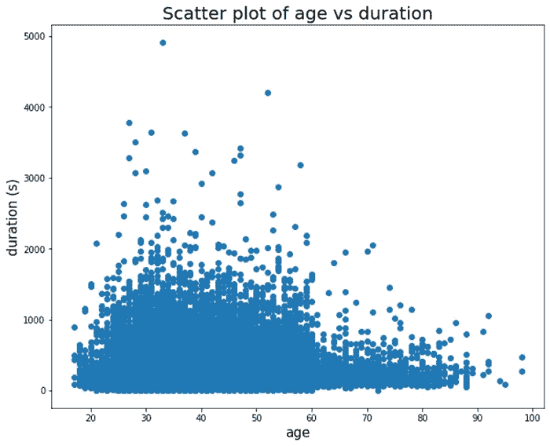

年龄与持续时间散点图

从这个图中我们可以看到各种各样的事情:首先，很少有客户保持通话超过 2000 秒。此外，似乎随着年龄的增长，人们的耐心越来越差，挂电话的速度也越来越快。

不幸的是，在这个数据集中没有很多连续的数值，所以我们看不到散点图的更多真实例子。然而，假设我们有一个数据集，包含人们的体重、身高、年龄、性别、职业等特征。如果我们绘制一个身高与体重的散点图，我们可能会看到如下关系

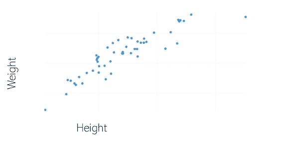

自制身高体重散点图

正如我们所见，这两个变量之间的关系是线性的，正如我们可能预期的那样:个子高的人体重也更重。这再次强调了散点图在寻找两个数值变量之间的关系时非常有用。

在散点图的最后，让我们看看一些好的实践。首先，只有当数值变量是连续的或者可能的值范围很大时，创建数值变量的散点图才有意义。让我们通过下面的例子来看看为什么会这样:

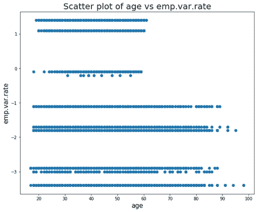

年龄与就业变化率的散点图

它显示了*年龄*变量与*就业变化率*的散点图，即就业变化率。尽管这个变量是数字，但它只有 10 个可能的值，所以我们可以看到这个图并不是很有说明性。

***散点图总结:*** *散点图是一种很好的方式来可视化两个连续数值变量之间的关系。当变量尽管是数字，但值的范围非常有限时，请避免使用它们。*

## 箱线图:平均值、方差和异常值

来自[平面图标](https://www.flaticon.com/search?word=box%20plot)的方框图图标

**箱线图**是从数值变量中获取信息的另一种方式。具体来说，它们允许我们查看中值、标准差和方差，还可以探索给定变量的值是否有异常值。让我们先看看箱线图给我们的信息，然后从我们的数据集中找到具体的例子。

箱线图向我们展示了我们正在研究的数据变量的中值，它代表了中间数据点的位置。上下四分位数分别代表数据的 75%和 25%。上限和下限显示了数据的最大值和最小值。最后，它也代表离群值。下图显示了一个标准的箱线图。

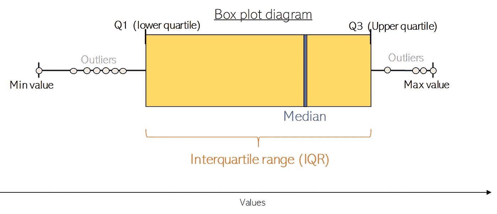

箱线图

让我们看看这些图表能告诉我们关于我们的数据集的两个真实的数字变量，*年龄*和*持续时间*。

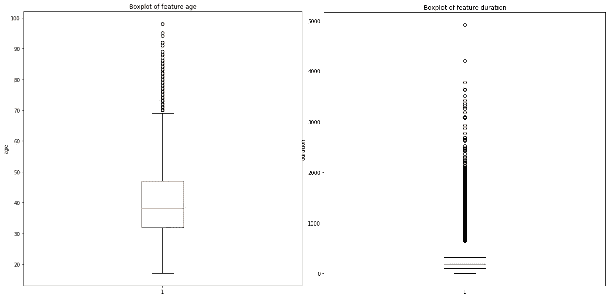

数据集的年龄(左)和持续时间(右)变量的箱线图

上图向我们展示了几件事。首先，从右边的一个(*持续时间变量*)我们可以看到，通话时间通常很短，是大约 300 秒持续时间的中间观察值。我们还可以看到，上四分位数和下四分位数接近中值，异常值会传播到非常高的持续时间长度。

从左边的一个(*年龄变量*)我们可以看到，我们拥有的所有异常值(超出变量的可接受或正常值范围的值)都超过了顶部:我们不时地接触不寻常的老年人。这可能符合我们的营销策略，也可能是我们必须检查的事情。如果我们想获得没有任何年龄异常值的数据视图，我们可以使用年龄变量进行过滤，并保持任何低于 Q3(大约 70 岁)的数据，然后分析我们得到的结果。

***箱线图总结:*** *箱线图可以让我们快速看到我们数值变量的统计值，无缝检测是否有异常值，而不需要执行复杂的算法。*

## 直方图:数值变量的条形图

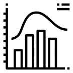

来自[平面图标](https://www.flaticon.com/free-icon/histogram_2289274?term=Histogram&page=1&position=9)的直方图图标

**直方图**向我们展示了一个数字变量的频率分布。它为此类变量的值构建不同的范围组，称为*箱*，并告诉我们每个箱*内的数据量。核密度估计*图是从直方图构建的，正如我们在将仓的数量设置为非常高的值*时可以看到的。*因此，直方图可用于查看变量是否遵循正态分布，如果遵循正态分布，其偏斜程度如何。我们可以在下图中看到这一点。

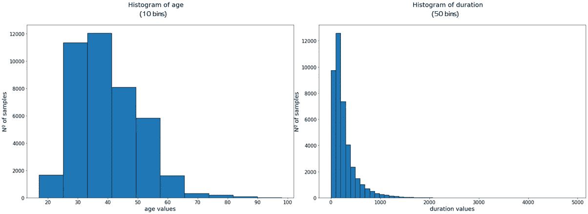

年龄和持续时间变量的直方图具有不同数量的条柱。

*年龄*值的直方图告诉我们，它可能遵循一个正态分布，有点偏左，同样的情况可能发生在*持续时间*上。正如你所看到的，我们包括的箱越多，我们的图看起来就越像一个适当的分布。如果我们增加*年龄*变量的箱数，我们会得到如下结果:

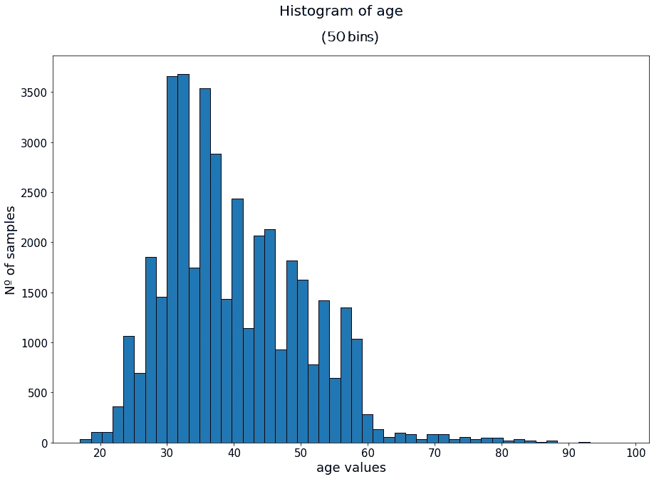

年龄变量的 50 格直方图。

现在，我们可以更清楚地看到分布的形状，右边是一条长尾巴。

变量不必遵循特定的分布，就像我们在下面的示例中看到的那样，使用 *euribor3m* 变量，它表示 3 个月的 euribor 利率。

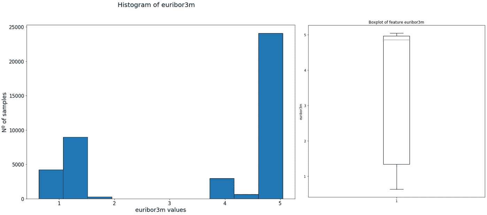

euribor3m 变量的直方图和箱线图。

从直方图中我们可以看到，变量并不遵循特定的分布，但大多数样本的值都接近 5，这可以从箱线图中提取的中值得到证实。

***直方图总结:*** *直方图就像是数值变量的条形图，其中变量的值被划分在一系列称为 bin 的范围内。它们允许我们看到某个变量的分布，并且当我们增加箱的数量时，它们更好地逼近这个分布。*

## 热图:作为可视化工具的颜色

**热图**获取一个数据网格(例如矩阵或表格),并使用不同的色阶来显示网格或表格中每个单元格的值。作为一种可视化工具，他们使用颜色就像条形图使用宽度和高度一样。

在数据分析中，它们可用于显示变量数值之间的相关性，如下图所示。

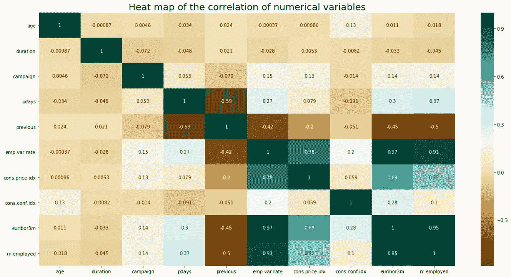

使用热图可视化我们数据的关联矩阵

使用这个矩阵，我们可以看到是否有任何相关的变量，发现我们可能想要深入研究的两者之间的有趣关系，或者我们可以使用它作为一种方法来删除变量，这些变量不会为我们的数据添加任何额外的信息来构建机器学习模型，作为一个特征选择步骤。

在图表上，每个单元格代表两个变量之间的相关性，值从深棕色(强负相关)到深蓝/绿色(强正相关)，中间较浅的颜色代表较弱的相关性。这给了我们一个快速发现相关变量的方法。

从上图中我们可以看到 *euribor3m* 和 *nr.employed* 变量具有非常高的相关性。我们可以通过绘制两者的散点图来证实这一点:

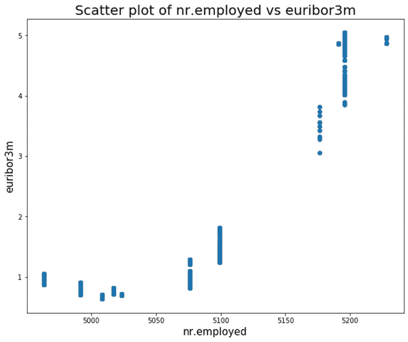

就业人数与欧洲银行同业拆放利率的散点图

看起来这些变量确实有很强的线性关系，应该做进一步的调查以了解为什么会这样。

# 结论

至此，我们已经解释完了 EDA 上这篇帖子的所有情节。还有其他像折线图和饼图这样的图，可以添加，但是，它们非常简单，我们大多数人都知道它们是如何工作的，不需要解释。

使用所涵盖的可视化工具来分析我们的数据的不同变量及其关系，可以获得许多有用的信息，这些信息对于最初的业务观点和建模后的观点都是有用的。

我们还总结了一些绘图的最佳实践:重要的是，我们知道何时使用我们所掌握的每一个可视化工具，以及如何仔细优化我们在这些图中显示的内容。

最后，不仅仅要有绘图能力也很重要:我们必须能够阅读这些图并从中提取有用的信息；从中得不到任何东西的阴谋对任何人都没有帮助。

如果你想要这篇文章中任何情节的代码，请随时留下评论，我会发给你。

# 额外资源

如果你想更深入地挖掘和发展对 EDAR 更深刻的实践和理论知识，请查阅以下资源。

*   [自然语言处理的探索性数据分析。](https://neptune.ai/blog/exploratory-data-analysis-natural-language-processing-tools)
*   [评《Python 用于数据分析》一书](https://howtolearnmachinelearning.com/books/data-analysis-books/python-for-data-analysis/)
*   [为自己的数据分析项目设置数据集。](https://howtolearnmachinelearning.com/datasets/)

就这些，我希望你喜欢这个帖子。请随时在 Twitter 上关注我。还有，你可以在这里 看看我关于数据科学、统计学、机器学习的帖子[**。好好读！此外，要获得关于数据科学和机器学习的更多资源，请查看这个包含书籍、课程和教程的令人敬畏的资源库**](https://medium.com/@jaimezornoza)***。***

*干杯！*