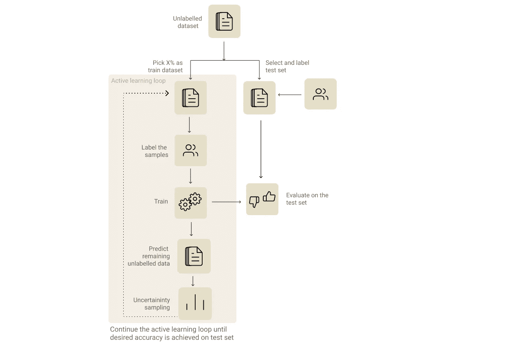
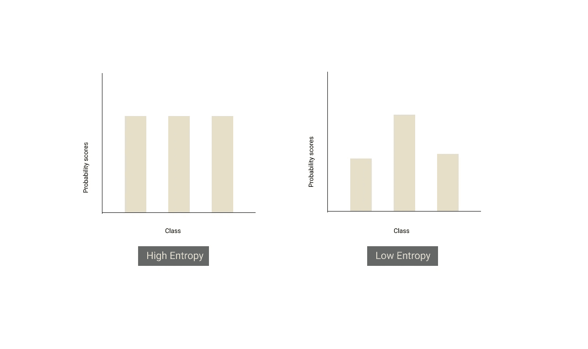

# 如何用更少的数据做更多的事？—主动学习

> 原文：<https://towardsdatascience.com/how-to-do-more-with-less-data-active-learning-240ffe1f7cb9?source=collection_archive---------39----------------------->

照片由 [Unsplash](https://unsplash.com?utm_source=medium&utm_medium=referral) 上的 [Prateek Katyal](https://unsplash.com/@prateekkatyal?utm_source=medium&utm_medium=referral) 拍摄

如果机器学习项目是冰山，那么水下的部分就是项目中的标签和其他数据工作。好消息是像迁移学习和主动学习这样的技术可以帮助减少这种努力。

主动学习已经成为 ML 行业从业者工具箱的一部分有一段时间了，但很少在任何数据科学/ ML 课程中涉及。阅读罗伯特·芒罗的书[人类在回路中的机器学习](https://www.manning.com/books/human-in-the-loop-machine-learning)，帮助我将一些(并帮助我学习了许多)主动学习概念正式化，这些概念我一直在我的 ML 项目中直观地使用。

本文的目的是向您介绍一种简单的主动学习方法，称为“熵的不确定性采样”，并通过一个例子展示它的实用性。为了进行演示，我使用了主动学习，仅利用实际训练数据集的**23%**([ATIS 意图分类数据集](https://www.kaggle.com/hassanamin/atis-airlinetravelinformationsystem#))来获得与在 100%的数据集上进行训练相同的结果。

太好奇了？直接跳到[演示](https://colab.research.google.com/drive/1BsTuFK8HcXS5WWlOCS1QHgvHRf2FK6aD?usp=sharing)。想先了解一下它的工作原理？请继续阅读。

# **什么是主动学习？**

主动学习——模型从失败的预测中学到的比正确的预测多。图片提供— [giphy](https://giphy.com/gifs/julie-uswnt-carli-lloyd-us-soccer-l3nWlEkpv5cIqe0QU/links)

主动学习是指优先根据标签上的例子训练我们的模型，这些例子可以给我们带来最大的收益，而不是根据“学习信号”很少的例子。一个示例的学习信号的估计是使用来自模型的反馈来完成的。

这类似于老师问学生她不清楚的概念，并优先考虑那些概念，而不是教授所有的课程。

由于主动学习是一个迭代的过程，你必须经历多轮培训。主动学习的步骤包括:

主动学习过程

# **1。识别并标记您的评估数据集。**

不言而喻，选择评估集是任何机器学习过程中最重要的一步。当涉及到主动学习时，这变得更加重要，因为这将是我们在迭代标记过程中模型性能改善程度的衡量标准。此外，它还帮助我们决定何时停止迭代。

直接的方法是随机分割未标记的数据集，并从分割的数据集中选取您的评估集。但是基于复杂性或业务需求，拥有多个评估集也是好的。例如，如果您的业务需要表明情绪分析模型应该能够很好地处理讽刺，您可以有两个独立的评估集—一个用于一般的情绪分析，另一个用于讽刺特定的样本。

# 2.**识别并标记你的初始训练数据集。**

现在选取 X%的未标记数据集作为初始训练数据集。X 的值可以根据模型和方法的复杂性而变化。选择一个对于多次迭代来说足够快的值，并且对于模型的初始训练来说足够大的值。如果您采用迁移学习方法，并且数据集的分布接近基础模型的预训练数据集，那么较低的 X 值足以启动该过程。

避免初始训练数据集中的类别不平衡也是一个很好的实践。如果是 NLP 问题，您可以考虑基于关键字的搜索来识别来自特定类别的样本，以标记和维护类别平衡。

# 3.**训练迭代**

现在我们已经有了初始的训练和评估数据集，我们可以继续进行第一次训练迭代。通常，人们不能通过评估第一个模型来推断太多。但是这一步的结果可以帮助我们看到预测在迭代过程中是如何改进的。使用该模型来预测剩余未标记样本的标签。

# 4.**选择上一步中要标记的样本子集。**

这是一个至关重要的步骤，在这一步中，您可以选择具有最多学习信号的样本进行标记过程。有几种方法可以着手做这件事(如书中所解释的)。为了简洁起见，我们将看到我认为最直观的方法——基于熵的不确定性采样。

**基于熵的不确定性采样:**

不确定性采样是一种挑选模型最不确定/混淆的样本的策略。有几种方法可以计算不确定度。最常见的方法是使用神经网络最后一层的分类概率(softmax)值。

如果没有明确的赢家(即所有的概率几乎相同)，这意味着模型对样本是不确定的。熵正好给了我们一个度量。如果所有类别之间有联系，则分布的熵将会很高，如果类别中有明显的赢家，则分布的熵将会很低。

根据模型对未标记数据集的预测，我们应该按照熵的降序对样本进行排序，并挑选大约 Y%的顶级样本进行注释。

# **5。冲洗&重复:**

我们需要将本次迭代中的训练数据集附加上我们标记的新样本，并重复步骤 3 中的过程，直到我们在评估集上达到所需的性能或我们的评估性能稳定水平。

# **演示**

为了实验和演示，我们将使用 [ATIS 意图分类数据集](https://www.kaggle.com/hassanamin/atis-airlinetravelinformationsystem)。让我们认为训练数据集是未标记的。我们从随机抽取 5%的带标签的训练数据集进行第一次迭代开始。在每次迭代结束时，我们使用基于熵的不确定性采样来挑选前 10%的样本，并在下一次迭代中使用它们的标签(模拟真实世界中的标注过程)进行训练。

为了在主动学习的每次迭代中评估我们的模型，我们还从数据集中提取测试集，因为测试集中的数据已经被标记。

演示和代码可在下面的笔记本中找到:

 [## 谷歌联合实验室

colab.research.google.com](https://colab.research.google.com/drive/1BsTuFK8HcXS5WWlOCS1QHgvHRf2FK6aD?usp=sharing) 

**参考文献:**

1.  戴维·刘易斯和威廉·盖尔。1994.一种训练文本分类器的顺序算法。94 年，[https://arxiv.org/pdf/cmp-lg/9407020.pdf](https://arxiv.org/pdf/cmp-lg/9407020.pdf)
2.  [人类在回路中的机器学习](https://www.manning.com/books/human-in-the-loop-machine-learning)由[罗伯特·芒罗](http://www.robertmunro.com/)

感谢 Sriram Pasupathi 付出了比我写这篇文章更多的努力来校对这篇文章🙏

**附:我非常高兴听到您对这篇文章的反馈，这也将推动我撰写“如何用更少的数据做更多的事”系列的其他文章，请评论您的反馈或在**[**@ logesh _ umapathi**](https://twitter.com/logesh_umapathi)**给我发 DM。**👋