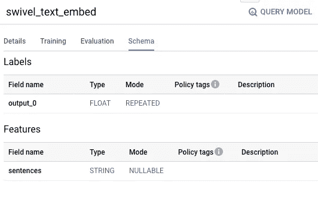
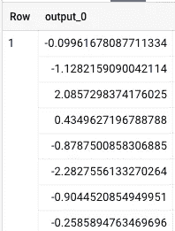
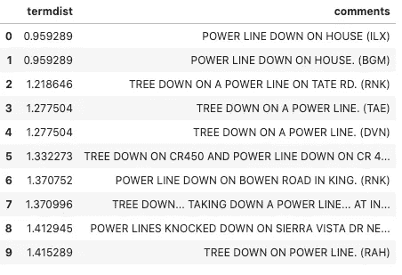
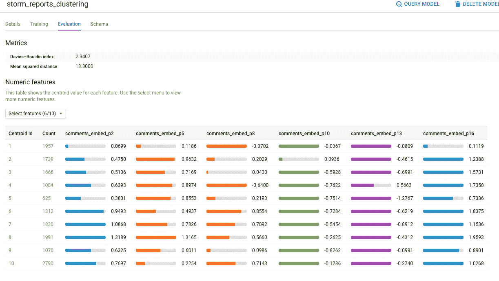
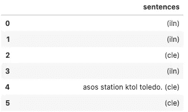
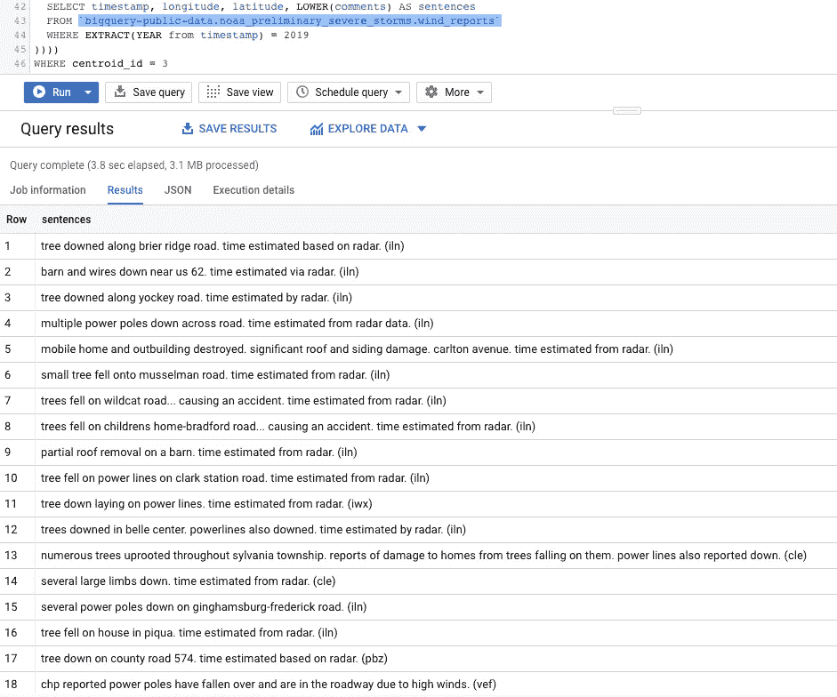

# 如何在 BigQuery 中进行文本相似性搜索和文档聚类

> 原文：<https://towardsdatascience.com/how-to-do-text-similarity-search-and-document-clustering-in-bigquery-75eb8f45ab65?source=collection_archive---------9----------------------->

## 在 BigQuery 中使用文档嵌入进行文档相似性和聚类任务

BigQuery 提供了加载 TensorFlow SavedModel 并执行预测的能力。这个功能是在数据仓库上添加基于文本的相似性和聚类的一个很好的方式。

接着从 GitHub 中的 [my notebook 复制粘贴查询。你可以在 BigQuery 控制台或人工智能平台 Jupyter 笔记本中尝试这些查询。](https://github.com/GoogleCloudPlatform/bigquery-oreilly-book/blob/master/09_bqml/text_embeddings.ipynb)


文本嵌入对于文档相似性和聚类任务是有用的。图片来自 [Pixabay](https://pixabay.com/?utm_source=link-attribution&utm_medium=referral&utm_campaign=image&utm_content=1151405) 的 [kerttu](https://pixabay.com/users/kerttu-569708/?utm_source=link-attribution&utm_medium=referral&utm_campaign=image&utm_content=1151405)

## 风暴报告数据

作为一个例子，我将使用一个由“风暴观察者”打电话到国家气象局的风报告组成的数据集。这是 BigQuery 中的公共数据集，可以按如下方式查询:

```
SELECT 
  EXTRACT(DAYOFYEAR from timestamp) AS julian_day,
  ST_GeogPoint(longitude, latitude) AS location,
  comments
FROM `bigquery-public-data.noaa_preliminary_severe_storms.wind_reports`
WHERE EXTRACT(YEAR from timestamp) = 2019
LIMIT 10
```

结果看起来像这样:


假设我们想要构建一个 SQL 查询来搜索看起来像“一个家庭的电源线断了”的评论。

步骤:

*   加载一个机器学习模型，创建一些文本的嵌入(本质上是一个紧凑的数字表示)。
*   使用该模型来生成我们的搜索词的嵌入。
*   使用该模型生成风报表中每个注释的嵌入。
*   寻找两个嵌入彼此接近的行。

## 将文本嵌入模型加载到 BigQuery

[TensorFlow Hub](https://tfhub.dev/) 有很多文本嵌入模型。为了获得最佳结果，您应该使用一个模型，该模型已根据与您的数据集相似的数据进行了训练，并且具有足够数量的维度以捕捉文本的细微差别。

对于这个演示，我将使用在 Google News 上训练过的有 20 个维度的[旋转](https://tfhub.dev/google/tf2-preview/gnews-swivel-20dim/1)嵌入(也就是说，它相当粗糙)。这对我们需要做的事情来说已经足够了。

Swivel 嵌入层已经以 TensorFlow SavedModel 格式提供，因此我们只需下载它，从 tarred、gzipped 文件中提取它，并将其上传到 Google 云存储:

```
FILE=swivel.tar.gz
wget --quiet -O tmp/swivel.tar.gz  [https://tfhub.dev/google/tf2-preview/gnews-swivel-20dim/1?tf-hub-format=compressed](https://tfhub.dev/google/tf2-preview/gnews-swivel-20dim/1?tf-hub-format=compressed)
cd tmp
tar xvfz swivel.tar.gz
cd ..
mv tmp swivel
gsutil -m cp -R swivel gs://${BUCKET}/swivel
```

一旦模型文件在 GCS 上，我们可以将它作为 ML 模型加载到 BigQuery 中:

```
CREATE OR REPLACE MODEL advdata.swivel_text_embed
OPTIONS(model_type='tensorflow', model_path='gs://BUCKET/swivel/*')
```

## 尝试在 BigQuery 中嵌入模型

要在 BigQuery 中试用这个模型，我们需要知道它的输入和输出模式。这些将是导出时 Keras 层的名称。我们可以通过转到 BigQuery 控制台并查看模型的“Schema”选项卡来获得它们:



让我们通过获得一个著名的 August 演讲的嵌入来尝试这个模型，将输入文本作为句子调用，并且知道我们将获得一个名为 output_0 的输出列:

```
SELECT **output_0** FROM
ML.PREDICT(MODEL advdata.swivel_text_embed,(
SELECT "Long years ago, we made a tryst with destiny; and now the time comes when we shall redeem our pledge, not wholly or in full measure, but very substantially." AS **sentences**))
```

结果有 20 个数字，如下所示:



## 文档相似性搜索

定义一个函数来计算一对嵌入之间的欧几里德平方距离:

```
CREATE TEMPORARY FUNCTION td(a ARRAY<FLOAT64>, b ARRAY<FLOAT64>, idx INT64) AS (
   (a[OFFSET(idx)] - b[OFFSET(idx)]) * (a[OFFSET(idx)] - b[OFFSET(idx)])
);CREATE TEMPORARY FUNCTION term_distance(a ARRAY<FLOAT64>, b ARRAY<FLOAT64>) AS ((
   SELECT SQRT(SUM( td(a, b, idx))) FROM UNNEST(GENERATE_ARRAY(0, 19)) idx
));
```

然后，计算我们的搜索词的嵌入:

```
WITH search_term AS (
  SELECT output_0 AS term_embedding FROM ML.PREDICT(MODEL advdata.swivel_text_embed,(SELECT "power line down on a home" AS sentences))
)
```

并计算每个评论的嵌入和搜索词的 term_embedding 之间的距离(如上):

```
SELECT
  term_distance(term_embedding, output_0) AS termdist,
  comments
FROM ML.PREDICT(MODEL advdata.swivel_text_embed,(
  SELECT comments, LOWER(comments) AS sentences
  FROM `bigquery-public-data.noaa_preliminary_severe_storms.wind_reports`
  WHERE EXTRACT(YEAR from timestamp) = 2019
)), search_term
ORDER By termdist ASC
LIMIT 10
```

结果是:



还记得我们搜索了“家里的电线坏了”吗？请注意，最上面的两个结果是“house 上的 power line down”——文本嵌入有助于识别 home 和 house 在此上下文中是相似的。下一组最佳匹配都是关于电力线的，这是我们搜索词中最独特的一对词。

## 文档聚类

文档聚类包括使用嵌入作为聚类算法(如 K-Means)的输入。我们可以在 BigQuery 中实现这一点，为了让事情变得更有趣，我们将使用位置和日期作为聚类算法的附加输入。

```
CREATE OR REPLACE MODEL advdata.storm_reports_clustering
OPTIONS(model_type='kmeans', NUM_CLUSTERS=10) ASSELECT
  arr_to_input_20(output_0) AS comments_embed,
  EXTRACT(DAYOFYEAR from timestamp) AS julian_day,
  longitude, latitude
FROM ML.PREDICT(MODEL advdata.swivel_text_embed,(
  SELECT timestamp, longitude, latitude, LOWER(comments) AS sentences
  FROM `bigquery-public-data.noaa_preliminary_severe_storms.wind_reports`
  WHERE EXTRACT(YEAR from timestamp) = 2019
))
```

嵌入(output_0)是一个数组，但 BigQuery ML 当前需要命名输入。解决方法是将数组转换为结构:

```
CREATE TEMPORARY FUNCTION arr_to_input_20(arr ARRAY<FLOAT64>)
RETURNS 
STRUCT<p1 FLOAT64, p2 FLOAT64, p3 FLOAT64, p4 FLOAT64,
       p5 FLOAT64, p6 FLOAT64, p7 FLOAT64, p8 FLOAT64, 
       p9 FLOAT64, p10 FLOAT64, p11 FLOAT64, p12 FLOAT64, 
       p13 FLOAT64, p14 FLOAT64, p15 FLOAT64, p16 FLOAT64,
       p17 FLOAT64, p18 FLOAT64, p19 FLOAT64, p20 FLOAT64>AS (
STRUCT(
    arr[OFFSET(0)]
    , arr[OFFSET(1)]
    , arr[OFFSET(2)]
    , arr[OFFSET(3)]
    , arr[OFFSET(4)]
    , arr[OFFSET(5)]
    , arr[OFFSET(6)]
    , arr[OFFSET(7)]
    , arr[OFFSET(8)]
    , arr[OFFSET(9)]
    , arr[OFFSET(10)]
    , arr[OFFSET(11)]
    , arr[OFFSET(12)]
    , arr[OFFSET(13)]
    , arr[OFFSET(14)]
    , arr[OFFSET(15)]
    , arr[OFFSET(16)]
    , arr[OFFSET(17)]
    , arr[OFFSET(18)]
    , arr[OFFSET(19)]    
));
```

生成的十个集群可以在 BigQuery 控制台中可视化:



集群#1 中的评论看起来像什么？该查询是:

```
SELECT sentences 
FROM ML.PREDICT(MODEL `ai-analytics-solutions.advdata.storm_reports_clustering`, 
(
SELECT
  sentences,
  arr_to_input_20(output_0) AS comments_embed,
  EXTRACT(DAYOFYEAR from timestamp) AS julian_day,
  longitude, latitude
FROM ML.PREDICT(MODEL advdata.swivel_text_embed,(
  SELECT timestamp, longitude, latitude, LOWER(comments) AS sentences
  FROM `bigquery-public-data.noaa_preliminary_severe_storms.wind_reports`
  WHERE EXTRACT(YEAR from timestamp) = 2019
))))
WHERE centroid_id = 1
```

结果显示，这些大多是简短的、没有信息的评论:



第三组怎么样？这些报道大部分好像都和雷达验证有关！！！



尽情享受吧！

## 链接

[TensorFlow Hub](https://tfhub.dev/) 有几种文本嵌入模型。你不必使用[旋转](https://tfhub.dev/google/tf2-preview/gnews-swivel-20dim/1)，虽然旋转是一个很好的通用选择。

完整的问题在 GitHub 上的[我的笔记本里。你可以在 BigQuery 控制台或人工智能平台 Jupyter 笔记本中尝试这些查询。](https://github.com/GoogleCloudPlatform/bigquery-oreilly-book/blob/master/09_bqml/text_embeddings.ipynb)