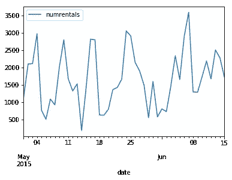
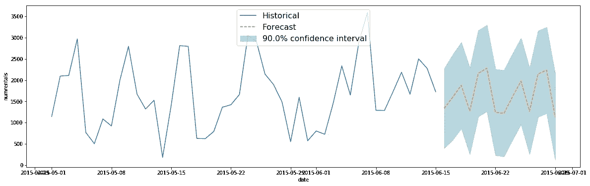
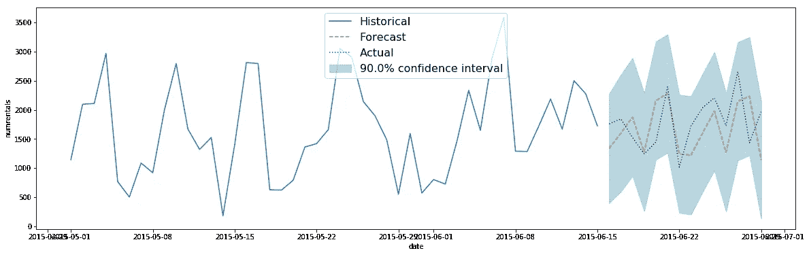
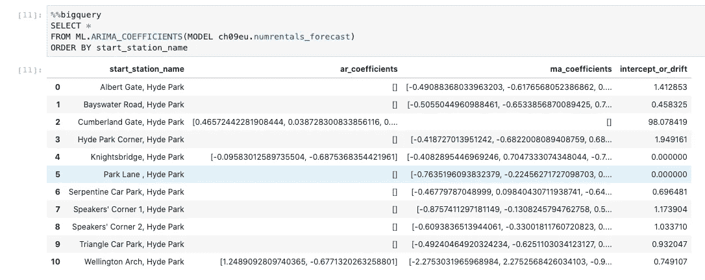
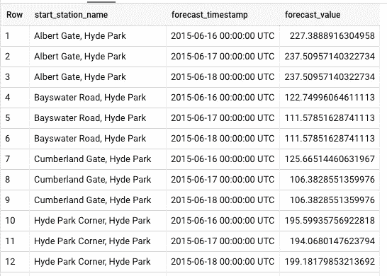
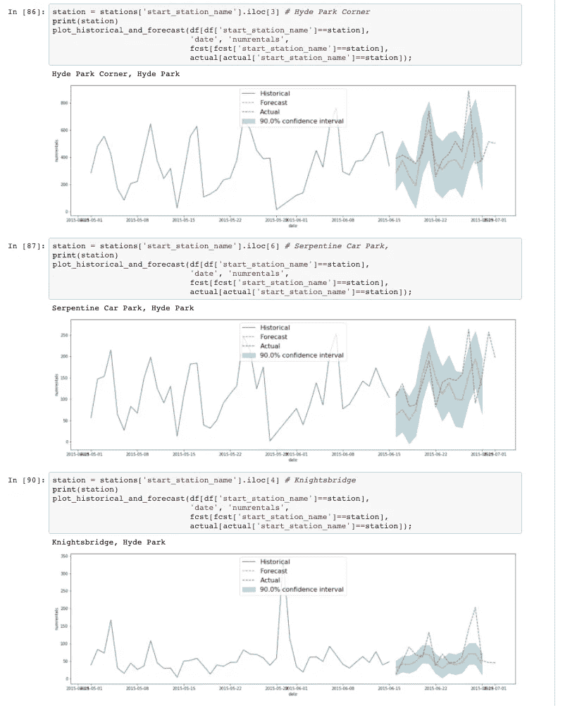
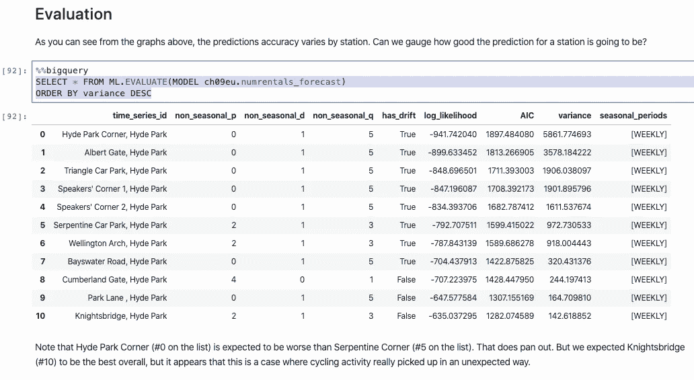

# 如何在 BigQuery 中进行时间序列预测

> 原文：<https://towardsdatascience.com/how-to-do-time-series-forecasting-in-bigquery-af9eb6be8159?source=collection_archive---------21----------------------->

## 使用 BigQuery ML 中的 ARIMA 模型进行需求预测

让我们根据过去的六周，对海德公园的一个自行车站开始的自行车租赁数量进行两周预测。

## 收集培训数据

与任何机器学习问题一样，第一步是收集训练数据并探索它。假设我们有截至 2015 年 6 月中旬的租赁数据，我们希望预测这个月的剩余时间。我们可以使用以下工具收集过去 6 周的数据:

```
SELECT
   CAST(EXTRACT(date from start_date) AS TIMESTAMP) AS date
   , COUNT(*) AS numrentals
FROM
  `bigquery-public-data`.london_bicycles.cycle_hire
WHERE start_station_name LIKE '%Hyde%'  -- all stations in Hyde Park
GROUP BY date
HAVING date BETWEEN '2015-05-01' AND '2015-06-15'
ORDER BY date
```

绘制该图时，我们看到一种每周趋势，即周末租金上涨:



史料

## 火车 ARIMA 模型

我们可以使用这些数据来训练 ARIMA 模型，告诉 BigQuery 哪一列是数据列，哪一列是时间戳列:

```
CREATE OR REPLACE MODEL ch09eu.numrentals_forecastOPTIONS(model_type='ARIMA',
        time_series_data_col='numrentals',
        time_series_timestamp_col='date') ASSELECT
   CAST(EXTRACT(date from start_date) AS TIMESTAMP) AS date
   , COUNT(*) AS numrentals
FROM
  `bigquery-public-data`.london_bicycles.cycle_hire
WHERE start_station_name LIKE '%Hyde%'  -- all stations in Hyde Park
GROUP BY date
HAVING date BETWEEN '2015-05-01' AND '2015-06-15'
```

一旦模型被训练，我们就可以使用 ML 来评估它。评估()并使用 ML 查看 ARIMA 系数。ARIMA 系数()。

## 预测

我们可以预测未来 14 天每天的租赁数量，并使用以下公式获得第 90 个百分位数的置信界限:

```
SELECT * FROM ML.FORECAST(MODEL ch09eu.numrentals_forecast, 
                  STRUCT(14 AS horizon, 0.9 AS confidence_level))
```

历史、预测和置信界限可以用以下公式绘制:

```
import matplotlib.pyplot as plt
import pandas as pd
def plot_historical_and_forecast(input_timeseries, forecast_output, timestamp_col_name, data_col_name):
  plt.figure(figsize=(20,6))
  plt.plot(input_timeseries[timestamp_col_name], input_timeseries[data_col_name], label = 'Historical')
  plt.xlabel(timestamp_col_name)
  plt.ylabel(data_col_name)forecast_output['forecast_timestamp'] = pd.to_datetime(forecast_output['forecast_timestamp'])
  x_data = forecast_output['forecast_timestamp']
  y_data = forecast_output['forecast_value']
  confidence_level = forecast_output['confidence_level'].iloc[0] * 100
  low_CI = forecast_output['confidence_interval_lower_bound']
  upper_CI = forecast_output['confidence_interval_upper_bound']# Plot the data, set the linewidth, color and transparency of the
  # line, provide a label for the legend
  plt.plot(x_data, y_data, alpha = 1, label = 'Forecast', linestyle='--')
  # Shade the confidence interval
  plt.fill_between(x_data, low_CI, upper_CI, color = '#539caf', alpha = 0.4, label = str(confidence_level) + '% confidence interval')
  # Display legend
  plt.legend(loc = 'upper center', prop={'size': 16})plot_historical_and_forecast(df, fcst, 'date', 'numrentals')
```

这会产生:



历史数据和预测数据

但这与 6 月下旬实际发生的情况相比有多好呢？我们可以提取这些天的数据，并与预测时间序列进行比较:



历史、预测和实际发生的情况。

很酷，是吧？

## 预测一系列

到目前为止，我一直在预测海德公园所有自行车站的总出租量。我们如何预测每个加油站的租赁量？使用时间序列标识列:

```
CREATE OR REPLACE MODEL ch09eu.numrentals_forecast
OPTIONS(model_type='ARIMA',
        time_series_data_col='numrentals',
        time_series_timestamp_col='date',
        **time_series_id_col='start_station_name'**) AS
SELECT
   **start_station_name**
   , CAST(EXTRACT(date from start_date) AS TIMESTAMP) AS date
   , COUNT(*) AS numrentals
FROM
  `bigquery-public-data`.london_bicycles.cycle_hire
WHERE start_station_name LIKE '%Hyde%'  -- all stations in Hyde Park
GROUP BY start_station_name, date
HAVING date BETWEEN **'2015-01-01'** AND '2015-06-15'
```

请注意，我现在不是在 45 天内(5 月 1 日至 6 月 15 日)进行系列训练，而是在更长的时间内进行训练。这是因为总体时间序列比单个站点的时间序列更平滑，也更容易预测。因此，我们必须向模型展示一条更长的趋势线。

现在，这个模型不是一个 ARIMA 模型，而是一个独立的 ARIMA 模型。的确，在做:

```
SELECT * 
FROM ML.ARIMA_COEFFICIENTS(MODEL ch09eu.numrentals_forecast)
ORDER BY start_station_name
```

为每个起点站名称提供一组单独的系数:



注意一些有趣的事情——每个站点都有不同复杂度的 ARIMA 模型！在引擎盖下，BigQuery ML 进行自动超参数调优。虽然该模型被称为“ARIMA”，但底层算法实际上包括[相当多的华而不实的功能](https://cloud.devsite.corp.google.com/bigquery-ml/docs/reference/standard-sql/bigqueryml-syntax-create-time-series#whats_inside_a_time_series_model)，包括异常检测、假日效应建模(用户需要指定假日区域)、季节性检测/建模和趋势建模。另外，不同的时间序列是并行训练的。

当我们进行预测时，我们将获得每个站和时间戳的预测:

```
SELECT 
  start_station_name,
  forecast_timestamp, forecast_value
FROM ML.FORECAST(MODEL ch09eu.numrentals_forecast, 
                  STRUCT(3 AS horizon, 0.9 AS confidence_level))
ORDER By start_station_name, forecast_timestamp
```

为每个站点生成一个时间序列预测:



GitHub 上的[满满的笔记本里有各站的预报图。](https://github.com/GoogleCloudPlatform/bigquery-oreilly-book/blob/master/blogs/bqml_arima/bqml_arima.ipynb)



模型评估可能有助于您预测哪个站的模型更好(季节性校正方差越低，预测就越容易，因此，模型应该越好-此处不能使用 AIC，因为不同时间序列的 AIC 不具有可比性):

```
SELECT * FROM ML.EVALUATE(MODEL ch09eu.numrentals_forecast)
ORDER BY **variance** DESC
```

基于这些结果，我们预计海德公园角的预测是最差的，骑士桥是最好的:



尽情享受吧！

## 后续步骤

1.  在 GitHub 上浏览[完整笔记本。](https://github.com/GoogleCloudPlatform/bigquery-oreilly-book/blob/master/blogs/bqml_arima/bqml_arima.ipynb)
2.  要了解更多关于 BigQuery ML 的内容，请阅读 [BigQuery:权威指南的第 9 章。](https://www.amazon.com/Google-BigQuery-Definitive-Warehousing-Analytics/dp/1492044466)这本书会定期更新这些博客文章，这样它就保持了权威性。

*感谢 Xi·程和阿米尔·霍玛蒂的有益建议*