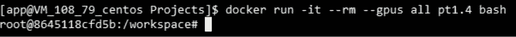
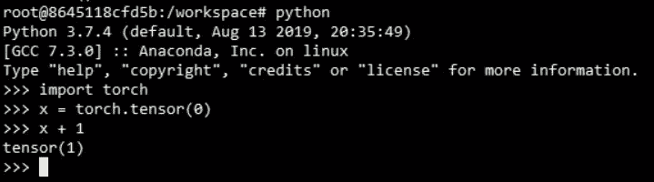
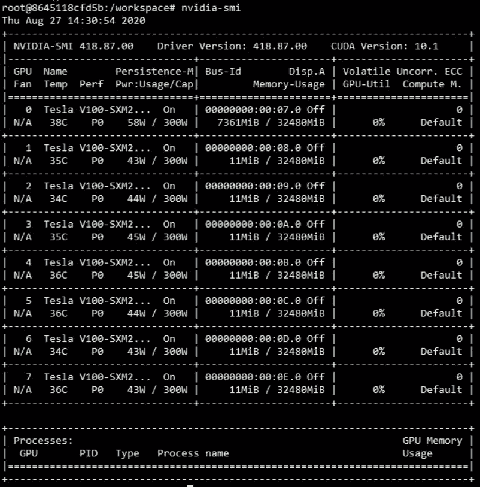
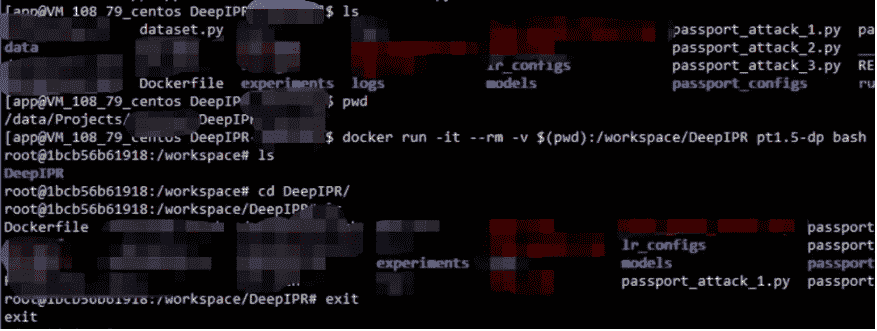
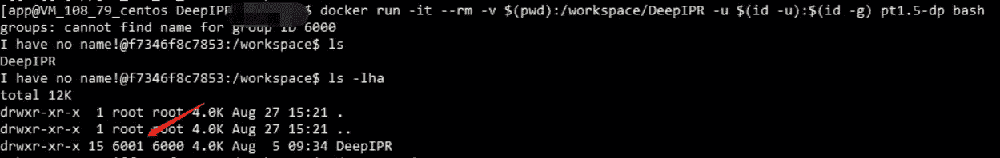
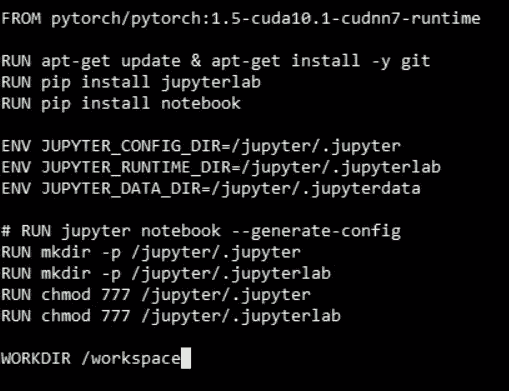
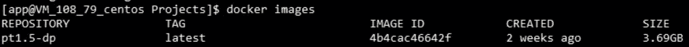

# 如何为你的计算机科学研究项目“Docker”？

> 原文：<https://towardsdatascience.com/how-to-docker-for-your-computer-science-research-project-the-minimal-guide-for-using-docker-2ecd3e9280ac?source=collection_archive---------29----------------------->

## docker 使用指南。

当所有人都在讨论 dockers，谈论你的项目 dockerize 有多好的时候，因为它就像一个隔离的环境，人们可以直接运行你的 docker 映像，而不需要设置依赖关系。

我目前正在进行深度学习研究，我的老板让我将我的研究项目放入 docker。所以我花了一些时间去理解 docker 是什么，以及如何在最小理解的情况下使用它。

这是一个最低限度的理解，因此它可能不是使用 docker 的正确方式，但我发现它适合我作为一名研究人员的用法，所以我决定分享它！

## 什么是码头工人？

我是以我的经验来解释，而不是从谷歌的定义来解释。如果你知道什么是虚拟机，它就像你当前电脑中另一台电脑(如 ubuntu)的模拟器。Docker 就像一个类似的，只是它是一个更快更好的虚拟机(内心深处是相当不同和复杂的)。这是一个孤立的环境，一台新电脑！

## 如何安装？

这个网站对于在你的 Ubuntu[https://phoenix nap . com/kb/how-to-install-docker-on-Ubuntu-18-04](https://phoenixnap.com/kb/how-to-install-docker-on-ubuntu-18-04)中安装 docker 有非常明确的说明。安装后，尝试运行“docker - version ”,如果显示输出，则说明您已成功安装！

## 我想在不安装任何包的情况下使用 docker！

我在所有项目中使用 docker 的原因是，我不需要在新电脑中设置 CUDA(如你所知，CUDA 非常复杂，我曾几次搞砸我的 ubuntu)。当然，有些时候我懒得安装依赖项，docker 最适合我！

如果你现在正在研究深度学习，你很可能会使用 PyTorch 或 Tensorflow。

没有 docker，可能需要安装 Anaconda3，python3，new ubuntu，设置 CUDA，pip install，conda install。但是用 docker，你需要做的只是两个命令。

> docker pull pytorch/pytorch:最新#将下载“镜像”,或者您可以在安装环境时获得它
> docker run-it-RM-GPU all py torch/py torch bash

如果面临“权限错误”，就用 sudo 运行，因为我已经设置了不带 sudo 的 running docker。

这是运行命令后的界面(我用名称“pt1.4”标记了原始图像)

现在你已经进入了“虚拟机”(它被称为“容器”，每当我谈到“容器”，它意味着我在谈论这个“虚拟机”)，注意到你是这个容器中的“root”，稍后我将谈论如何摆脱“root”。

在这个“虚拟机”里，你可以像正常的 ubuntu 环境一样做任何事情。

其他版本的 pytorch 可以参考 Dockerhub 中的 pytorch 资源库:[https://hub.docker.com/r/pytorch/pytorch](https://hub.docker.com/r/pytorch/pytorch)

如果想要 tensorflow 版本(也可能是特定库版本)，只需尝试谷歌“dockerhub tensorflow”或“docker pull tensorflow”，或者在 dockerhub 中搜索即可。

如果你想知道那是什么-it 和- rm，“-i”是交互的，“-t”是 TTY(类似于显示实时标准输出，你可以查看 docker 文档了解实际含义)，“- rm”是它会在你退出 docker 后删除“容器”(就像从存储中删除你的虚拟机，如果你已经熟悉 docker，你可以不用这个命令运行)。

最新的 docker 非常方便，你不必设置英伟达的东西。“-GPU ALL”是告诉 docker 你想把所有的 GPU 设备都映射到这个容器。如果您只想将 GPU 0 和 GPU 1 映射到这个容器中，您可以使用“-GPU \ " device = 0，1”运行，请注意，我使用\" \ "是因为它是单个设备的 docker 语法。

如果你想知道为什么 GPU 内存用了 7GB 却看不到其他进程，那是因为那些进程不在这个容器里。该容器在您的原始计算机中是独立的，并与其他容器隔离

## 将文件夹装入 Docker 容器

> docker run-it-RM-GPU all-v/path/to/my/code:/path/in/docker-v/datasets:/data mypytorch bash

对于您想要“挂载”到容器中的每个文件夹，您需要在上面的命令中添加“-v”和“/pathA:/pathB”。然后你的文件夹“/A”将被挂载(或映射)到容器中的“/B”中

DeepIPR 是我的项目之一【https://kamwoh.github.io/DeepIPR/ 

正如您从上面看到的，原始文件夹路径是“/data/Projects……”，然后我用命令“-v”将它挂载到容器中。在容器中，我挂载的文件夹在“/workspace/DeepIPR”中。注意:在挂载的文件夹中创建的所有文件都将出现在原始文件夹中。

## 记住用-u $(id -u):$(id -g)运行

在我知道这个命令之前，我通常只是运行 docker，将我的文件夹映射到容器的文件夹中，如下所示

> docker run-it-RM-v/path/to/my/code:/path/in/docker-u $(id-u):$(id-g)mypytorch bash

如果不使用“-u”运行也没关系，但是由/path/to/my/code 中的容器创建的新文件夹将成为“根”访问。完成这一步后，在容器中挂载的文件夹中创建的新文件夹将再次成为您自己的用户名。你会看到“我没有名字”，不过没关系，不会影响任何用法，忽略就是因为我们没有设置好 docker(更高级的部分)

请注意，6001 和 6000 是原始计算机环境的用户和组 id

## 直接运行您的代码

我的 DevOps 朋友告诉我，我使用 docker 的方式不对，使用“bash”命令有点难看(所有程序员都喜欢处理他们代码的优雅方式)。

在图像名称后的参数之后是将在容器中运行的命令。所以你可以像这样跑

> docker run-it-RM-v/path/to/my/code:/path/in/docker-GPU all mypy torch python/path/in/docker/xxxx . py

## 简单 Dockerfile 文件

如果您需要安装一个原始 docker 映像没有的额外的包。

比如你拉的 PyTorch 图片，不包含“jupyter notebook”。您可以创建自己的 docker 文件。(您会注意到一些“dockerized”的 github 项目有一个名为“Dockerfile”的文件)

这个 Dockerfile 基本上就像一个设置你的映像的设置脚本(映像就像 ISO 文件，容器就像我们用 ISO 文件运行的内容)。比如你如何设置你的新 ubuntu 环境。

记得把你的文件存为“Dockerfile”！！

从 xxxxx 开始，它是您要在其上构建的基础映像。

运行 xxxxx，它在映像构建期间运行命令。对于 apt-get，你必须小心，如果你想在安装其他包之前更新 apt-get，你必须运行&就像我上面显示的那样，否则 docker 会在你用这个 docker 文件构建的第**秒**跳过它。

ENV xxxxx，用于设置环境变量

你会注意到，每当我进入容器时，我都在“/workspace”中，这就是 WORKDIR 的作用。为您设置默认位置。

你会觉得奇怪，为什么我要为 jupyter 设置 chmod 777，这是我面临的权限错误，希望这个技巧可以帮助解决你面临的问题。(当然不是优雅的方式)

而且可以用自己的名字打造自己的 docker。

> DOCKER_BUILDKIT=1 docker 构建标记 imagename。

" DOCKER_BUILDKIT=1 "使 DOCKER 以更快的方式构建图像(可能是关于缓存的东西)，"- tag "后面的参数是图像名称，不要忘记那个点。"，表示当前目录中的“Dockerfile”。

建立自己的图像后，您可以使用“docker 图像”来检查它

## 结论

如果你想在这篇文章中更多地了解 docker

在这篇文章中，我实际上也跳过了许多有用的 docker 快捷方式，但我认为这些在这篇文章中相当复杂(至少在我第一次使用 docker 时是如此)。你可能会觉得设置 docker 很麻烦，但是相信我，麻烦只有一次。Docker 相当方便，因为你不需要在新电脑上重新设置。如果你真的需要了解更多关于 docker 或者真正优雅的使用 ocker 的方法，你应该谷歌一下 docker cheatsheet 或者别的什么。这篇文章是关于 docker 用法的最基本的理解。感谢阅读！！

## 额外收获:你可以参考的备忘单

我想在这篇文章之后，你应该有一个直观的认识，阅读下面的小抄对你来说应该不再是一个问题了！！

1.  [https://www.docker.com/sites/default/files/d8/2019-09/docker-cheat-sheet.pdf](https://www.docker.com/sites/default/files/d8/2019-09/docker-cheat-sheet.pdf)
2.  [https://github.com/wsargent/docker-cheat-sheet](https://github.com/wsargent/docker-cheat-sheet)
3.  [http://dockerlabs.collabnix.com/docker/cheatsheet/](http://dockerlabs.collabnix.com/docker/cheatsheet/)
4.  [https://phoenixnap.com/kb/list-of-docker-commands-cheat-sheet](https://phoenixnap.com/kb/list-of-docker-commands-cheat-sheet)