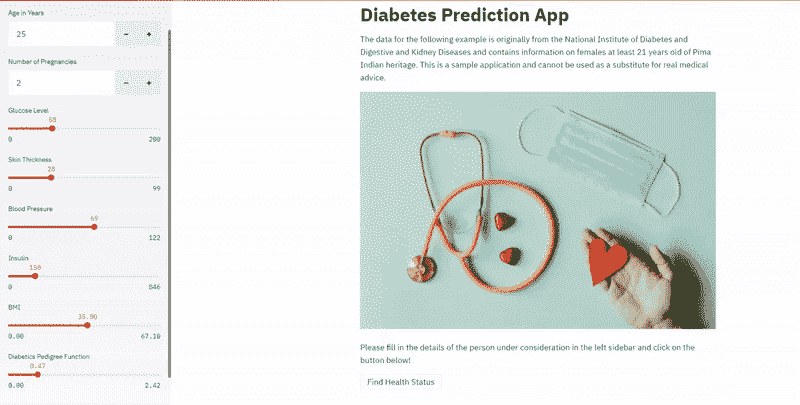

# 如何对任何机器学习应用进行分类

> 原文：<https://towardsdatascience.com/how-to-dockerize-any-machine-learning-application-f78db654c601?source=collection_archive---------20----------------------->

## [实践教程](https://towardsdatascience.com/tagged/hands-on-tutorials)

## 我用这三个简单的步骤反复做这件事。


用集装箱装运，模特们！(图片由[安迪李](https://unsplash.com/@andasta?utm_source=medium&utm_medium=referral)在 [Unsplash](https://unsplash.com?utm_source=medium&utm_medium=referral) 上拍摄)

一个月后，作为一名刚毕业的大学生，我们人工智能创业公司的创始人走到我面前，问我，“Arunn，我想让你成为 Docker 方面的专家。你需要多长时间？” 。不确定 Docker 是什么，但又无法闪避问题，最终我回复了， ***“两周，1 次冲刺”。***

我的经理也在附近，他试图打断我来救我，但我已经造成了伤害，我所能做的就是接下来的两个星期。

回想起来，我从来都不是专家(*现在也不是！但是我学到了足够做需要做的事情。在这篇文章中，我将告诉你什么才足以对任何机器学习 web 应用程序进行 dockerize。*

# Docker 是什么？

**Docker** 是一个通过使用容器来创建、部署和运行应用程序的工具。一个**容器**是一个标准化的软件单元，简单来说——除了打包的应用程序代码、必需的库和其他依赖项之外，什么都没有。一个 **Docker 镜像**是一个可执行的软件包，包括运行一个应用程序所需的一切，并在运行时成为一个**容器**。

当我试图理解 Docker 时，它是许多新的技术术语。但这个想法其实很简单。

想象一下你得到了一台新的迷你 Ubuntu 机器。然后你在它上面安装一些包。然后在其上添加一些代码。最后，您执行代码来创建应用程序。所有这一切都发生在你现有的装有你所选择的操作系统的机器上。你所需要的就是在里面安装 Docker。

如果您的机器上没有安装 Docker，请在此处找到[说明来设置 Docker](https://docs.docker.com/get-docker/) 。

# 为什么 Docker 面向数据科学家？

我明白了。你在数据科学领域。你觉得 DevOps 的人能搞定 Docker 吗？你老板没让你成为专家(*不像我！)*。

你觉得其实不需要了解 Docker。

那不是真的，让我告诉你为什么。

> “不知道为什么它不能在你的机器上工作，但它能在我的机器上工作。要不要我看看？”

在你的工作场所听过这些话吗？一旦你(和你的团队)理解了 Docker，没有人会再说出那些话。事实上，你的代码可以在 Ubuntu、Windows、AWS、Azure、Google Cloud 或任何地方流畅运行。

**你构建的应用程序在任何地方都是可复制的。**

您将更快地启动环境，并以正确的方式分发您的应用程序，并且您将节省大量时间。你将(最终)成为一名拥有软件工程最佳实践的数据科学家。

# 三个简单的步骤

正如我所承诺的，我已经将这个过程简化为 3 个简单的步骤。这里让我们使用一个糖尿病预测应用程序的用例，它可以根据诊断方法预测糖尿病的发作。这将让您了解我们如何在真实的用例场景中实现容器化。

我强烈推荐您阅读[这篇文章，在这篇文章中，我们使用 Streamlit 一步一步地从头开始构建这个机器学习应用程序。](https://medium.com/towards-artificial-intelligence/how-i-build-machine-learning-apps-in-hours-a1b1eaa642ed?source=friends_link&sk=66a5df0a2570e1cf0f12211f3b4f2fc2)



作者制作的糖尿病预测应用的截屏

请看一下[这个 GitHub 库，以及完整的实现](https://github.com/arunnthevapalan/diabetes-prediction-app)和示例。现在我们知道了背景，让我们开始我们的 3 个步骤吧！

## 1.定义环境

第一步是确保应用程序正常运行所需的确切环境。有许多方法可以做到这一点，但最简单的一个想法是为项目定义`requirements.txt`文件。

请查看您的代码中使用的所有库，并在名为`requirements.txt`的文本文件中列出它们。列出库的确切版本是一个很好的做法，当您在环境的终端上运行`pip freeze`时就可以找到。我的糖尿病预测示例的[需求](https://github.com/arunnthevapalan/diabetes-prediction-app/blob/master/requirements.txt)文件如下所示，

```
joblib==0.16.0
numpy==1.19.1
pandas==1.1.0
pandas-profiling==2.8.0
scikit-learn==0.23.2
streamlit==0.64.0
```

## 2.编写 Dockerfile 文件

这里的想法是我们试图创建一个名为`Dockerfile`的文件，它可以用来构建我们的应用程序运行所需的虚拟环境。请将它视为我们在任何系统之上构建所需环境的指导手册！

让我们为手头的例子编写 docker 文件，

```
FROM python:3.7
EXPOSE 8501
WORKDIR /app
COPY . .
RUN pip install -r requirements.txt
CMD streamlit run app.py
```

就是这样。6 行代码。一切按顺序进行。每一行都建立在前一行之上。我们来剖析一下台词。

1.  每个 Dockerfile 都必须从 命令的 ***开始。从*** 跟随 ***的必须是已经存在的映像(或者在您的机器上，或者来自[docker hub 库](https://hub.docker.com/search?type=image))。因为我们的环境是基于 python 的，所以我们使用`python:3.7`作为我们的基本映像，并最终使用这个 docker 文件创建一个新映像。***
2.  Streamlit 在默认端口 8501 上运行。因此，为了让应用程序运行，公开特定的端口非常重要。为此我们使用 ***曝光*** 命令。
3.  ***工作目录*** 设置应用程序的工作目录。其余的命令将从此路径执行。
4.  这里的 ***复制*** 命令将所有的文件从你的 Docker 客户端的当前目录复制到镜像的工作目录。
5.  ***运行*** 命令确保我们在`requirements.txt`中定义的库被正确安装。
6.  ***CMD*** 指定启动时在容器内运行什么命令。因此`streamlit run app.py`确保了容器一启动，Streamlit 应用就会运行。

编写 Docker 文件需要一些练习，除非你花很多时间使用 Docker，否则你不可能掌握所有可用的命令。我建议熟悉一些基本命令，并参考 docker 的官方文档了解其他信息。

## 3.建立形象

既然我们已经定义了 Dockerfile，那么是时候构建它并创建一个映像了。这个想法是，我们创建的这个图像是与底层系统无关的可再生环境。

```
docker build --tag app:1.0 . 
```

顾名思义`build`命令按照 Dockerfile 中的定义一层一层地构建图像。用名称和版本号将图像标记为`<name>:version.number`是一个很好的做法。末尾的点表示 Dockerfile 的路径，即当前目录。

等等，我建立了图像，但是我该怎么做呢？根据需求，你可以[在 DockerHub](https://docs.docker.com/get-started/part3/) 上共享构建好的映像或者[在云](https://docs.docker.com/engine/context/aci-integration/)上部署它们等等。但是首先，现在您运行图像来获取容器。

顾名思义，`run`命令在主机上运行指定的容器。`--publish 8501:8501`让容器的端口 8501 映射到主机的端口 8501，而`-it`是运行交互进程(比如 shell/terminal)所需要的。

```
docker run --publish 8501:8501 -it app:1.0
```

现在按照你的终端上提示的链接，自己去看魔术吧！；)


你做到了！(照片由[伊亚勒](https://unsplash.com/@lephunghia?utm_source=medium&utm_medium=referral)在 [Unsplash](https://unsplash.com?utm_source=medium&utm_medium=referral) 拍摄)

# 在你走之前

```
This article is a part of my series on **Machine Learning in Production**:
- [How I Build Machine Learning Apps in Hours](https://medium.com/towards-artificial-intelligence/how-i-build-machine-learning-apps-in-hours-a1b1eaa642ed)
- [How to Dockerize Any Machine Learning Application](/how-to-dockerize-any-machine-learning-application-f78db654c601)
- [Deploying Your Machine Learning Apps in 2021](/deploying-your-machine-learning-apps-in-2021-a3471c049507)
```

谢谢你读到这里。我希望这篇文章为您增加一些价值，并帮助您开始使用 Docker for data science。尽管我已经用了好几年了，但我并不认为自己是专家。但是我觉得我知道的足够多了，我想和大家分享我所知道的一点点。我迫不及待地想看到你们都开始扮演码头工人。[我写了很多我在数据科学方面的经历](https://arunnthevapalan.medium.com/) ，非常感谢您的反馈。

*想保持联系？* [***加入我的私人邮箱好友列表*** *。*](https://friends.arunnthevapalan.com/)