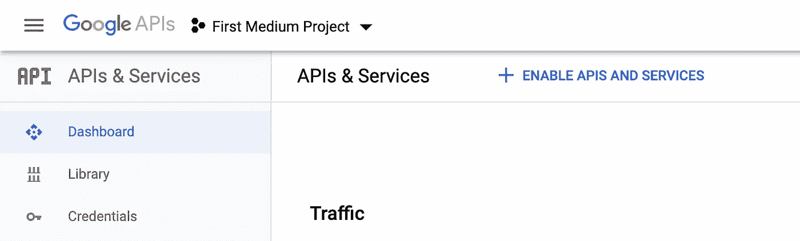
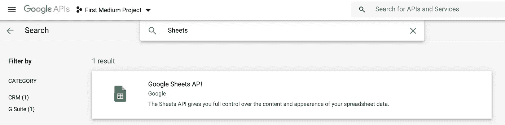
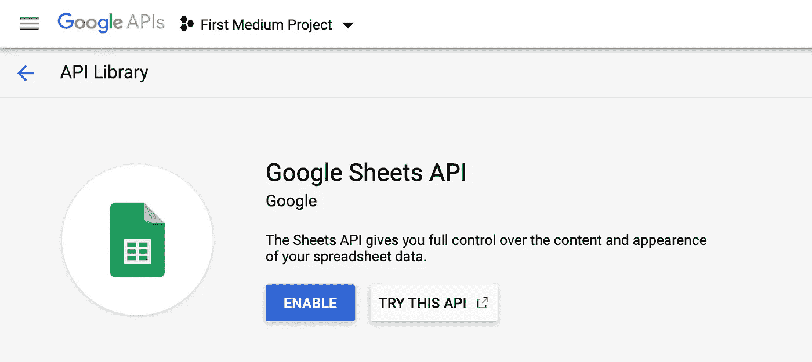
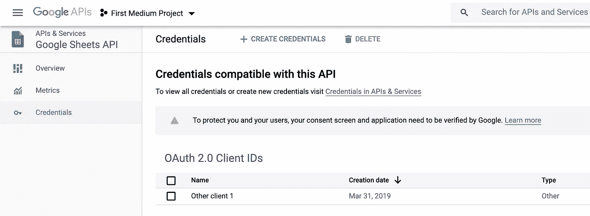
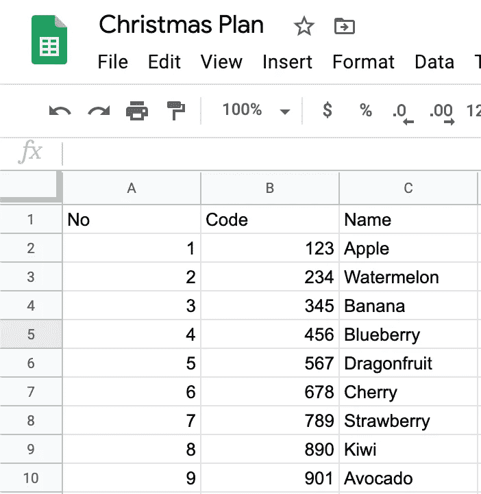

# 如何从 Google 电子表格中按名称下载特定的工作表作为 CSV 文件

> 原文：<https://towardsdatascience.com/how-to-download-a-specific-sheet-by-name-from-a-google-spreadsheet-as-a-csv-file-e8c7b4b79f39?source=collection_archive---------9----------------------->


安迪·凯利在 [Unsplash](https://unsplash.com?utm_source=medium&utm_medium=referral) 上的照片

# 概观

在过去的两篇关于使用 Python 的 Google Drive API 的教程中，我们已经介绍了如何在这里获取凭证[以及在这里](https://medium.com/swlh/google-drive-api-with-python-part-i-set-up-credentials-1f729cb0372b?source=friends_link&sk=53afa8687344dced6d66c9215ed78840)通过名称[在 Google Drive 中搜索特定文件。](https://levelup.gitconnected.com/google-drive-api-with-python-part-ii-connect-to-google-drive-and-search-for-file-7138422e0563?source=friends_link&sk=86c054a6d42c1998f60508f02dae4298)

在本教程中，我们将学习如何从 Google 电子表格中按名称下载特定的工作表到 csv 文件中。一个用例:您需要生成一个报告，该报告的数据存储在一个 Google 电子表格中，该表格有许多工作表，但您只需要其中的一两张。因此，不用下载整个谷歌电子表格，你可以自己挑选你需要的表格。

为什么叫它的名字？因为我从我的工作经验中了解到，人们倾向于坚持命名，并且通常用它的名字来称呼它。例如，一个人可能会这样问他或他的同事:“你能从收入表中提取数据吗？。

不管怎样，你知道我在说什么。💩我们开始吧，好吗？

TLDR；从 [Github](https://github.com/billydh/python-google-drive-api) 下载项目回购。

# 以 csv 格式下载特定的工作表

我们当前的 Python 脚本能够根据文件名搜索特定的文件。让我们修改脚本，这样它就能够引用 Google 电子表格中的特定工作表，并将其下载为 csv 文件。

在本教程的最后，我们将得到一个 Python 脚本，它可以从命令行执行，并带有两个输入参数:

*   Google 电子表格的名称
*   要以 csv 格式下载的工作表名称

要跟进，请查看回购的这个[提交](https://github.com/billydh/python-google-drive-api/tree/6c8d9083825add9de148ac21caae0d7db6595e15)。

## 启用工作表 API

我们需要做的第一件事是启用 Google Sheets API。现在，打开你的浏览器，进入[https://console.developers.google.com/apis/dashboard](https://console.developers.google.com/apis/dashboard)。然后，确保你是在正确的项目上，如果不是，从下拉列表中选择正确的项目。



谷歌开发者控制台

接下来，转到“库”选项卡，在搜索栏中键入“图纸”。



谷歌开发者库

继续点击它。一旦你登陆到 Google Sheets API 页面，点击 **ENABLE** 按钮来启用这个 API。



启用 Google 工作表 API

在那之后，如果你只是去凭证选项卡，你会看到它说我们的凭证，我们早些时候为 Google Drive API 设置的是与 Sheets API 兼容的。这意味着我们可以使用已经拥有并为我们的脚本设置的凭证。🙂



Google Sheets API 证书

## 添加一个功能来下载一个 csv 格式的谷歌表单

为了能够使用 Sheets API，我们需要如下初始化一个 Sheets 服务实例。

```
sheets = discovery.build('sheets', 'v4', credentials=credentials)
```

现在，让我们将上面的代码添加到我们现有的`connect_to_google_drive.py`文件中(我们稍后将重构它)。

既然我们缩小了脚本的功能，我们可以在现有的`retrieve_all_files`中添加一个过滤器，只查找 Google 电子表格类型的文件。为此，我们只需要添加一个参数`q`，如下所示。

```
# define a function to retrieve all files
def retrieve_all_files(api_service, filename_to_search):
    results = []
    page_token = None

    while True:
        try:
            param = {'q': 'mimeType="application/vnd.google-apps.spreadsheet"'}

            if page_token:
                param['pageToken'] = page_token

            files = api_service.files().list(**param).execute()
    ...
    ...
    ...
```

通过添加`mimeType="application/vnd.google-apps.spreadsheet"`，它告诉 Google Drive API 的`list()`方法只返回文件的 mime 类型是 Google 电子表格的结果。

最后，让我们编写一个函数，该函数将使用工作表 API 的`values()`方法从特定的工作表中获取单元格值，并将它们写入一个 csv 文件。

```
# define a function to export sheet to csv
def download_sheet_to_csv(spreadsheet_id, sheet_name):
    result = sheets.spreadsheets().values().get(spreadsheetId=spreadsheet_id, range=sheet_name).execute()
    output_file = f'{sheet_name}.csv'

    with open(output_file, 'w') as f:
        writer = csv.writer(f)
        writer.writerows(result.get('values'))

    f.close()

    print(f'Successfully downloaded {sheet_name}.csv')
```

让我们在脚本的最后调用这个新函数，就像这样。

```
# call the function
filename_to_search = 'Christmas Plan'
all_files, search_file = retrieve_all_files(drive, filename_to_search)

download_sheet_to_csv(search_file.get('id'), 'Sheet2')
```

对于这个例子，Sheet2 的内容是这样的。



工作表 2

酷毙了。现在继续从终端运行这个脚本。记得在运行脚本之前激活您的虚拟环境。🙂这是脚本完成后您将在控制台中看到的内容。

```
$ python connect_to_google_drive.py{'kind': 'drive#file', 'id': '1GyIz1NqCg6Bkr0Z_3Craem0BAwG0195usRswduCtKab', 'name': 'Christmas Plan', 'mimeType': 'application/vnd.google-apps.spreadsheet'}Successfully downloaded Sheet2.csv
```

让我们通过查看其内容来验证下载的文件。

```
$ cat Sheet2.csvNo,Code,Name
1,123,Apple
2,234,Watermelon
3,345,Banana
4,456,Blueberry
5,567,Dragonfruit
6,678,Cherry
7,789,Strawberry
8,890,Kiwi
9,901,Avocado
```

好吧。看起来我们的脚本像预期的那样工作。快乐的日子😃

## 重构代码并允许它接受命令行参数

正如所承诺的，我们现在将重构代码并转换它，以便它将从命令行接受两个输入参数。

为了区分开来，我们将把`connect_to_google_drive.py`中的所有函数提取到单独的 Python 文件中。让我们创建一个文件夹，命名为`google_api_functions`。

首先，让我们将初始化我们的 drive 和 sheets 实例的代码行提取到一个新文件中，并将其命名为`get_api_services.py`。

get_api_services.py

接下来，我们将重构`retrieve_all_files`函数。现在，我们从这个函数中需要的唯一信息是 Google 电子表格的`id`。所以，让我们删除不必要的行，最后，将其提取到一个名为`get_spreadsheet_id.py`的新 Python 文件中。

get _ 电子表格 _id.py

最后要提取出来的函数是`download_sheet_to_csv`函数。让我们将它提取到一个名为`download_sheet_to_csv.py`的新文件中。

下载 _ 工作表 _ 到 _csv.py

现在，我们将把我们的`connect_to_google_drive.py`文件重命名为`main.py`。这是我们将从命令行调用的 Python 文件。

我们将在这个文件中添加一个函数，它将解析通过命令行传递的参数，这些参数将是电子表格名称和工作表名称。

```
def parse_args():
    parser = argparse.ArgumentParser(description="Function to download a specific sheet from a Google Spreadsheet")

    parser.add_argument("--spreadsheet-name", required=True, help="The name of the Google Spreadsheet")
    parser.add_argument("--sheet-name", required=True, help="The name of the sheet in spreadsheet to download as csv")

    return parser.parse_args()
```

最后，让我们编写当从命令行调用脚本`main.py`时将被执行的代码行。

```
if __name__ == '__main__':
    args = parse_args()

    spreadsheet_name = args.spreadsheet_name
    sheet_name = args.sheet_name

    drive, sheets = get_api_services()

    spreadsheet_id = get_spreadsheet_id(drive, spreadsheet_name)
    download_sheet_to_csv(sheets, spreadsheet_id, sheet_name)
```

不错！现在，我们的代码变得更加清晰和易于遵循。🙂

有了这个新的`main.py`脚本，我们可以从命令行调用它的方式如下。

```
$ python main.py --spreadsheet-name "Christmas Plan" --sheet-name Sheet2Successfully downloaded Sheet2.csv
```

就是这样。😺

# 包裹

在过去的三个教程中，我们讨论了以下内容:

*   设置凭证以使用 Google Drive API — [链接](https://medium.com/swlh/google-drive-api-with-python-part-i-set-up-credentials-1f729cb0372b?source=friends_link&sk=53afa8687344dced6d66c9215ed78840)
*   在 Google Drive 中搜索文件— [链接](https://levelup.gitconnected.com/google-drive-api-with-python-part-ii-connect-to-google-drive-and-search-for-file-7138422e0563?source=friends_link&sk=86c054a6d42c1998f60508f02dae4298)
*   以 csv 格式下载特定的工作表

现在，我们应该都熟悉 Google Drive 和 Sheets API 了。我们还可以使用 API 做很多其他的事情，因此，我鼓励大家进一步探索它，并构建一些自动化脚本来帮助您的工作或生活。🙏


照片由 [Anastasia Taioglou](https://unsplash.com/@thenata?utm_source=medium&utm_medium=referral) 在 [Unsplash](https://unsplash.com?utm_source=medium&utm_medium=referral) 上拍摄