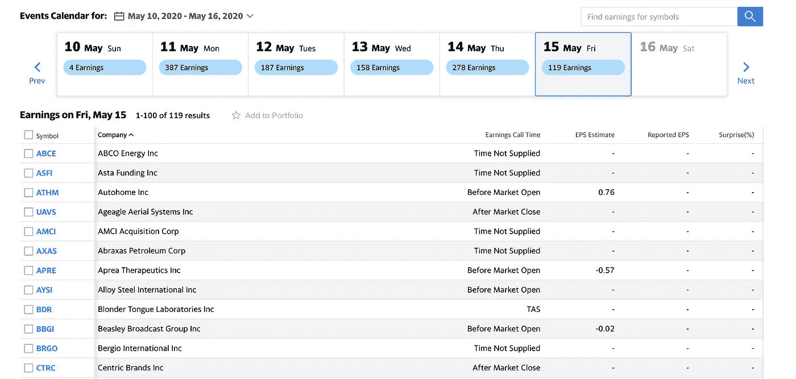
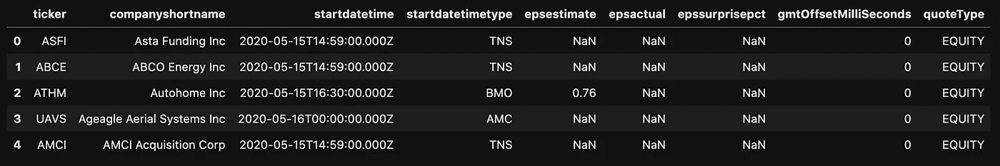
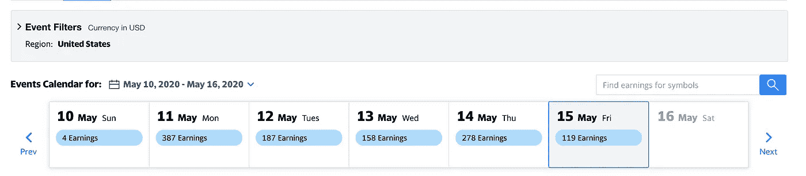
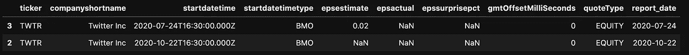

# 如何用 Python 下载上市公司的收益日历

> 原文：<https://towardsdatascience.com/how-to-download-the-public-companies-earnings-calendar-with-python-9241dd3d15d?source=collection_archive---------23----------------------->


威廉·艾文在 [Unsplash](https://unsplash.com/?utm_source=unsplash&utm_medium=referral&utm_content=creditCopyText) 上的照片

## 用几行代码了解公司的最新收益

在撰写本文时，我们目前正接近 Q1 2020 财报季的尾声。对于许多投资者和量化金融爱好者来说，这是一个特别有趣的时期，有许多短期投资机会。这就是为什么在本文中，我想简要介绍收益季节的概念，并展示如何使用 Python 轻松提取所有重要信息。

# 什么是收益季节？

术语**财报季**指的是一年中大多数上市公司向公众发布季度公司财报的时间段。收益季节发生在每个财政季度结束后的几个月，因此这将对应于 1 月、4 月、7 月和 10 月。通常，收益季节持续约 6 周，之后报告的收益补贴数量为淡季频率(仍有一些公司报告淡季，因为它们的财务日历可能与大多数略有不同)。

为什么财报季对潜在投资者来说是一个重要时刻？仅仅是因为在给定公司发布收益的日期前后(主要是在当天)，人们可以预期股票会有一些重大的价格变动。这是因为上市公司报告其财务和一般情况:上一季度的利润/亏损、组织的任何重大变化等。金融分析师利用这些信息评估股票的**内在价值——以确定其当前市场价格是高估还是低估。这反过来又是投资者买入/卖出/持有股票的潜在信号。**

大多数公司都在网站上为潜在/当前投资者开辟了一个专用部分，让他们可以访问收益报告以及即将发布的收益报告的日期。自然，从单个网站获取信息是不可行的(或者至少这不是一次愉快的经历)。这就是为什么我们将参考流行的金融数据来源——雅虎！金融。下面你可以看到一张来自当前收益日历的图片。



[雅虎截图！财务收益日历](https://finance.yahoo.com/calendar/earnings/)

在我之前的一篇文章中，我展示了如何利用一些流行的 Python 库来轻松下载与股票价格相关的信息(以及一些关于公司本身的附加信息)。在本文中，我用一个名为`yahoo-earnings-calendar`的新库来扩展这个工具包(是的，这个名字是不言自明的)。与前面描述的解决方案相比，它确实有一些优势，您将在下面看到。

# 使用 Python 下载收入日历

除了标准库，我们需要通过在终端中运行下面一行代码来安装`yahoo_earnings_calendar`:

```
pip install yahoo_earnings_calendar
```

完成后，我们导入本文中使用的所有库:

下面，我们将介绍下载收入日历的三种可用方法。

## 下载特定日期的收入

我们探索的第一种方法用于下载特定日期的收入。为了下载数据，我们首先使用`datetime`库定义日期。在本例中，我们使用当天(2020 年 5 月 15 日)。然后，我们实例化一个`YahooEarningsCalendar`类的对象。使用`earnings_on`方法，我们以字典列表的形式下载数据。最后，我们将下载的数据存储在一个`pandas.DataFrame`中。

运行代码会生成`DataFrame`的预览。



`startdatetimetype`列包含有关收益电话会议时间的信息。传统上，收益(以及关于公司状况的任何其他重要信息)是在与感兴趣的投资者召开的收益电话会议上宣布的。综上所述，这是向公众公布收益的时候。

`startdatetimetype`栏的图例:

*   蒙特利尔银行——开市前
*   AMC——收市后
*   TAS/TNS —时间未指定

通过运行`df_earnings.shape`，我们看到`DataFrame`有 119 行，这与上面的截图一致。以这种方式下载日历的一个潜在缺点是，我们只能获得美国公司的收益数据。



[Yahoo！财务收益日历](https://finance.yahoo.com/calendar/earnings/)

这是雅虎上使用的过滤器的默认设置。财经网站。下载非美国公司信息最简单、最可靠的方法是使用股票代码。我们将在下面讨论这种方法。

## 下载一系列日期的收入

下载一系列日期的日历与我们已经描述过的非常相似。这一次，我们使用`earnings_between`方法并提供感兴趣的时间段的开始和结束日期。对于下面的例子，我们下载未来 7 天的收益日期。

这次`earnings_df`包含 312 个位置。

处理收入数据时要考虑的一个重要因素是日历会随着时间的推移而变化。因此，在提前几周/几个月下载收益的情况下，您可能希望不时刷新下载，以确保数据仍然有效。

## 下载特定产品的收益

最后，我们下载特定产品的收益日期，在本例中是 Twitter。我们通过使用`get_earnings_of`方法并提供股票代码来做到这一点。这次不同的是，请求将返回过去和未来收入的列表。这就是为什么我们从时间戳字符串中提取日期(它以 [ISO-8601](http://en.wikipedia.org/wiki/ISO_8601) 格式存储)并使用`between`方法只过滤掉未来 180 天的收益。

代码返回下表，其中包含 Twitter 在未来 180 天内的两个收益发布日期。



## 结论

在这篇文章中，我解释了什么是收益季节，以及如何从 Yahoo！金融。

有了可以在 Python 中使用的数据，我可以想到一些潜在的用例:

*   建立一个自动的电子邮件/Slack 机器人通知你相关的收益发布。
*   在用于预测股票价格的 ML 模型中包含收益发布日期。例如，你可以在[脸书的预言](https://facebook.github.io/prophet/)中指出收益日期作为转折点。

就代码行而言,`yahoo-earnings-calendar`库相当紧凑，所以我强烈建议检查代码，以了解数据实际上是如何从 Yahoo！金融。这可能是特别重要的，因为雅虎！倾向于频繁更改网站，这可能导致库变得不可用，至少在修复之前是如此。这就是为什么在将基于它的任何代码投入生产时都应该小心谨慎。此外，熟悉用于抓取数据的方法无疑是有意义的，因此您可以在作者修复任何问题之前修复它们。并且您可以随时使用该更新进行拉取请求:)

你可以在我的 [GitHub](https://github.com/erykml/medium_articles/blob/master/Quantitative%20Finance/earnings_calendar.ipynb) 上找到本文使用的代码。一如既往，我们欢迎任何建设性的反馈。你可以在推特或评论中联系我。

不久前，我出版了一本关于使用 Python 解决金融领域实际任务的书。如果你感兴趣，我在[贴了一篇文章](/introducing-my-book-python-for-finance-cookbook-de219ca0d612)介绍这本书的内容。你可以在亚马逊或者 Packt 的网站上买到这本书。

# 参考

[1]雅虎！收益日历刮刀— [GitHub](https://github.com/wenboyu2/yahoo-earnings-calendar)