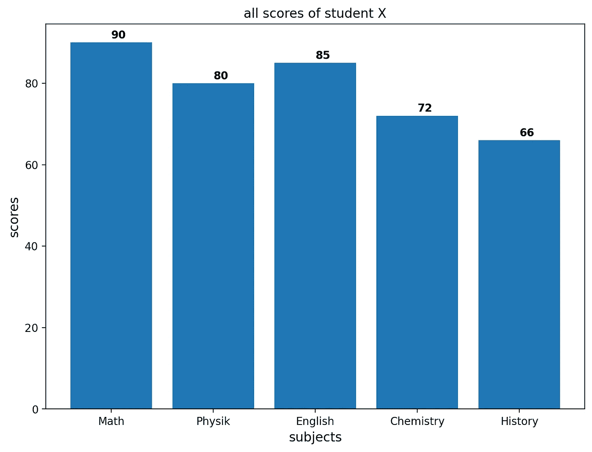
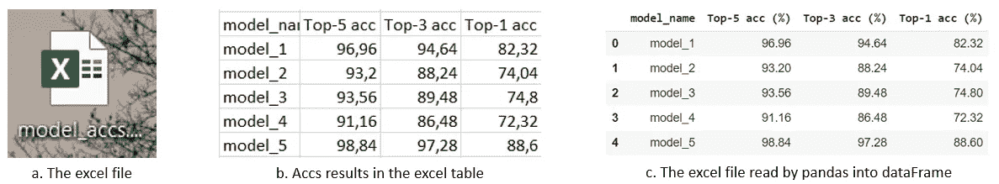
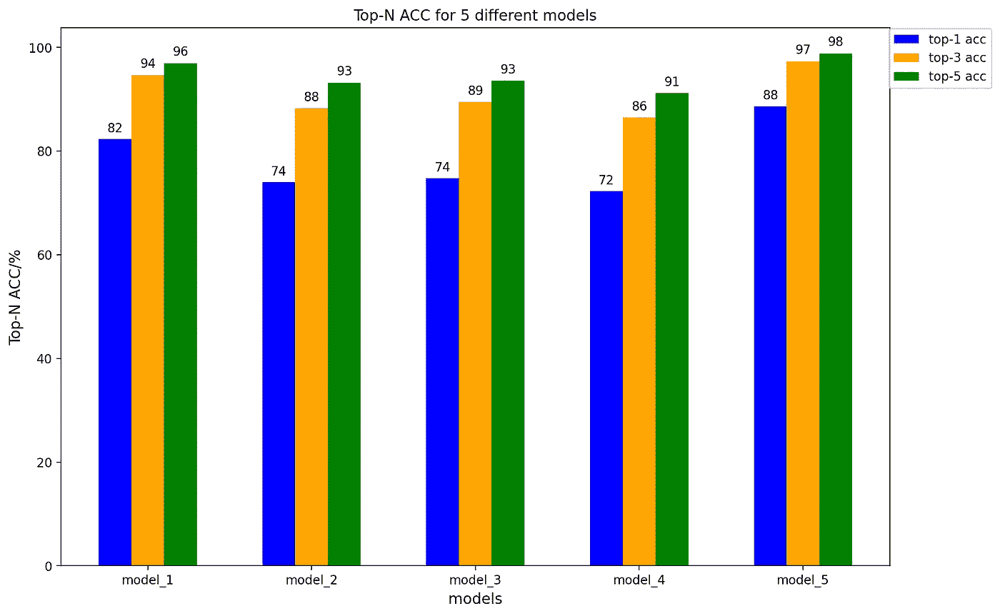
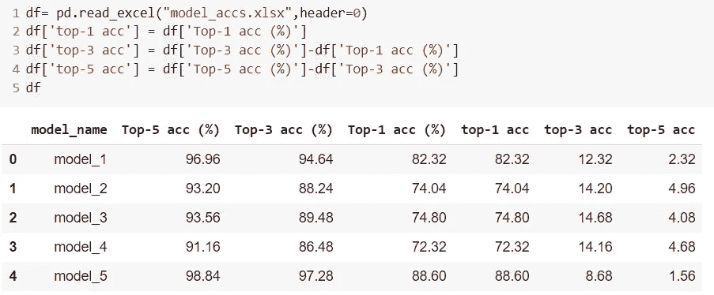
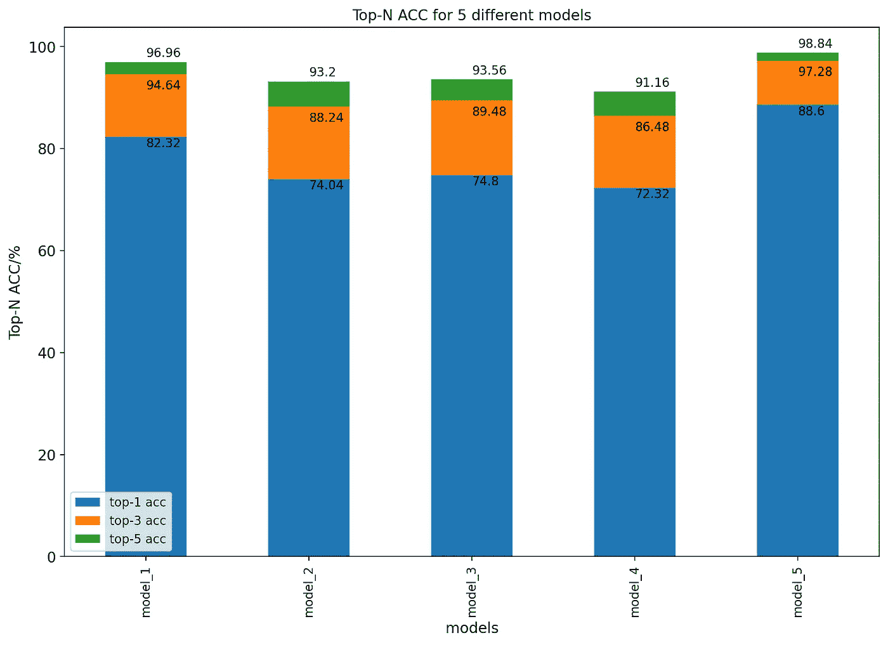

# 如何用 python 为你的科学论文绘制条形图

> 原文：<https://towardsdatascience.com/how-to-draw-a-bar-graph-for-your-scientific-paper-with-python-a6c2a5e6bcd7?source=collection_archive---------24----------------------->


照片由特雷·赫尔利拍摄

条形图📊(也称为条形图或条形图)是一种可视化工具，读者可以使用它来比较不同类别的条形图所显示的数据。在这个故事中，我试图介绍如何用 python 绘制清晰的条形图。

作为一名学生或研究人员，你必须在科学论文中发表你的努力和成果，研究数据应该易于阅读和获取。共享研究数据是我们越来越鼓励，甚至强制要求的事情。同时，这也是我热衷的事情😘。

首先让我们重新认识一下这位朋友，条形图是谁(什么)？

> **条形图**或**条形图**是一种图表或图形，用矩形条表示分类数据，矩形条的高度或长度与它们所代表的值成比例。条形图可以垂直或水平绘制。垂直条形图有时被称为柱形图。[由维基百科](https://en.wikipedia.org/wiki/Bar_chart)提供。

# 第一个例子

我做了一个简单的例子，用竖条图直观的展示了一个学生 X 的各科成绩。



所有分数的条形图

这是由一个非常简单的 Matplotlib 代码实现的:

```
import matplotlib.pyplot as pltfig = plt.figure(figsize=(7,5))ax = fig.add_axes([0,0,1,1])subjects = ['Math', 'Physik', 'English', 'Chemistry', 'History']scores = [90,80,85,72,66]ax.bar(subjects,scores)ax.set_ylabel('scores',fontsize= 12)ax.set_xlabel('subjects',fontsize= 12)ax.set_title('all scores of student X')for i, v in enumerate(scores):ax.text( i ,v + 1, str(v), color='black', fontweight='bold')plt.savefig('barplot_1.png',dpi=200, format='png', bbox_inches='tight')plt.show()
```

# 数据分析中的真实案例

对于少量的结果数据，我们可以定义一个列表来保存整个数据，就像前面的例子一样。但有时数据太多，如果我们已经将相同的数据保存在 excel 文件中，那么再次将每个数据输入到一个列表中是低效的。

如果我们通过导入一个 excel 文件或其他文件来开始绘制条形图的过程，这将非常方便。因此，我们需要一个数据框架，它是二维的、大小可变的、潜在异构的表格数据，包括带标签的轴(行和列)。

在我在论文中写的这个真实案例中，我需要准确地比较不同模型的性能。准确度(ACC)是测量值与特定值的接近程度，这是评估分类模型的一个度量标准。从形式上看，准确性有以下定义:

准确度=正确预测的数量/方向总数

此外，通常在多分类模型中使用的前 N 名准确性意味着正确的类出现在前 N 名概率中，从而被认为是“正确的”。在论文中，我采用了前 1 名、前 3 名和前 5 名的准确度来评估预测。我已经在一个名为“model_accs.xlsx”的 excel 文件中输入了所有前 N 名 ACC。



数据，保存在 excel 表格(b)和熊猫数据框(c)中

有了 pandas，我们可以用 python 从 excel 文件中读取数据。Pandas 是一个开源的、BSD 许可的库，为 Python 编程语言提供了高性能、易于使用的数据结构和数据分析工具。

```
import pandas as pd
df= pd.read_excel("model_accs.xlsx",header=0) # read excel file
```

通过函数 pd.read_excel()，我们可以读取我们的结果 excel 文件。如果数据保存在。csv 文件，那么我们可以使用 pd.read_csv()，类似于 pd.read_excel()。

```
import numpy as nptop_1 = df.iloc[:,3]top_3 = df.iloc[:,2]top_5 = df.iloc[:,1]xlabels = df.iloc[:,0]N =5ind = np.arange(N)  # the x locations for the groupswidth = 0.2       # the width of the barsfig, ax = plt.subplots(figsize=(12,8))rects1 = ax.bar(ind, top_1, width, color='b')rects2 = ax.bar(ind + width, top_3, width, color='orange')rects3 = ax.bar(ind + 2*width, top_5, width, color='g')ax.set_xticks(ind + width)ax.set_xticklabels(xlabels,fontsize=10)ax.set_xlabel("models", fontsize=12)ax.set_ylabel("Top-N ACC/%", fontsize=12)ax.set_title('Top-N ACC for 5 different models')ax.legend((rects1[0], rects2[0],rects3[0]),('top-1 acc', 'top-3 acc','top-5 acc'),bbox_to_anchor=(1.13, 1.01))def labelvalue(rects):for rect in rects:height = rect.get_height()ax.text(rect.get_x() + rect.get_width()/2., 1.01*height,'%d' % int(height),ha='center', va='bottom')labelvalue(rects1)labelvalue(rects2)labelvalue(rects3)plt.savefig('barplot_2.png',dpi=200, format='png', bbox_inches='tight')plt.show()
```

使用上述代码，我们为 5 款车型的 top-N ACC 保存了一个漂亮的条形图，如下所示:



5 款车型的前 N 名 ACC 条形图

# 进步

但是，我们对这个条形图不太满意，因为条形图太多了。我们能简化显示数据吗🤔？例如，我们将前 1 名、前 3 名和前 5 名 acc 合并到一个条形图中，这意味着我们只需要 5 个条形图来显示 5 个型号的前 N 名 acc。情节中的信息要压缩。在这里，我们可以通过以下预处理输入数据来实现，其中我们减去前 5 名 acc 和前 3 名 acc 以获得差异，对前 3 名 acc 和前 1 名 acc 重复相同的操作。



我们用下面的代码绘制了一个新的条形图:

```
ax = df[['top-1 acc','top-3 acc','top-5 acc']].plot(kind='bar', title ="Top-N ACC for 5 different models", figsize=(12, 8), legend=True, fontsize=12,stacked=True)top_1 = df.iloc[:,3]top_3 = df.iloc[:,2]top_5 = df.iloc[:,1]xlabels = df.iloc[:,0]ax.set_xticklabels(xlabels,fontsize=10)ax.set_xlabel("models", fontsize=12)ax.set_ylabel("Top-N ACC/%", fontsize=12)for i, v in enumerate(top_1):ax.text( i ,v - 2, str(v), color='black')for i, v in enumerate(top_3):ax.text( i ,v - 3, str(v), color='black')for i, v in enumerate(top_5):ax.text( i ,v + 1, str(v), color='black')plt.savefig('barplot_2.png',dpi=200, format='png', bbox_inches='tight')plt.show()
```

运行代码后，我们得到一个简单的条形图，它将前 1 名 acc、前 3 名 acc 和前 5 名 acc 集成到一个条形图中。



更直观的 5 款车型前 N 名 ACC 条形图

最后一个条形图看起来非常直观和明显，尽管它包含的信息与倒数第二个有 15 个条形的条形图相同。此外，最后一个条形图的代码比倒数第二个条形图的代码短。因此，我选择在我的论文中使用新的条形图📜。

# 结论

在这个故事中，我根据自己的经验介绍了用 Python 绘制条形图的方法。对于学生和研究人员来说，掌握如何直观地展示他们的研究数据的技能是很重要的。条形图是科学论文中最好和最常用的插图之一。我希望我的故事对你了解 it⛳️.有所帮助

**链接到 GitHub 库:**【https://github.com/Kopfgeldjaeger/Bar_graph_with_Matplotlib 

# 参考

这里有两个对 pandas 和 Matplotlib 有用的文档。

 [## pandas 文档- pandas 1.1.2 文档

### 在文档中看到了一个错别字？想要改进现有功能？投稿指南将指导您…

pandas.pydata.org](https://pandas.pydata.org/pandas-docs/stable/index.html) [](https://matplotlib.org/api/_as_gen/matplotlib.pyplot.bar.html) [## Matplotlib . py plot . bar-Matplotlib 3 . 3 . 2 文档

### 制作条形图。这些条按照给定的对齐方式定位在 x 处。它们的尺寸由高度和宽度给出…

matplotlib.org](https://matplotlib.org/api/_as_gen/matplotlib.pyplot.bar.html)