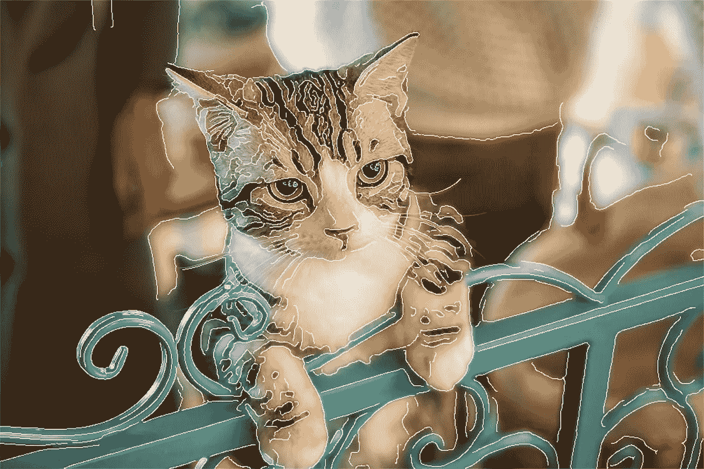
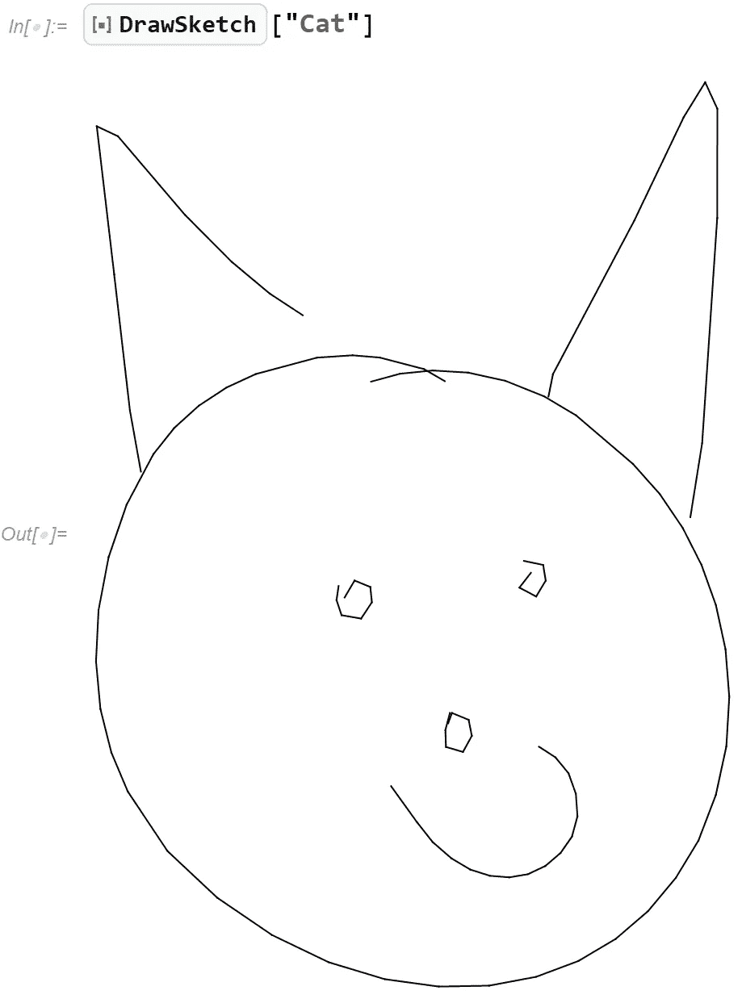
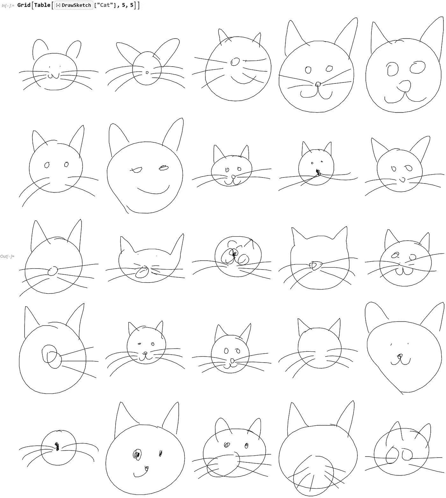
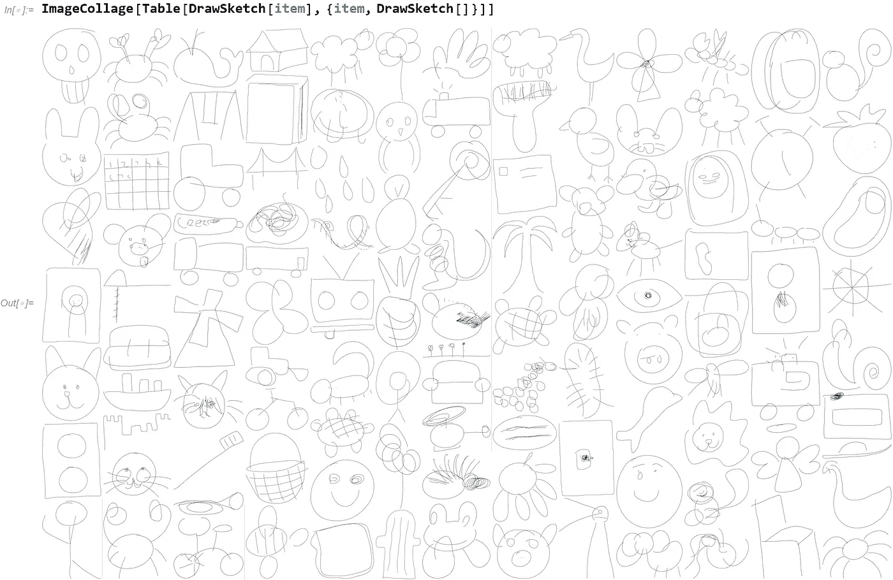
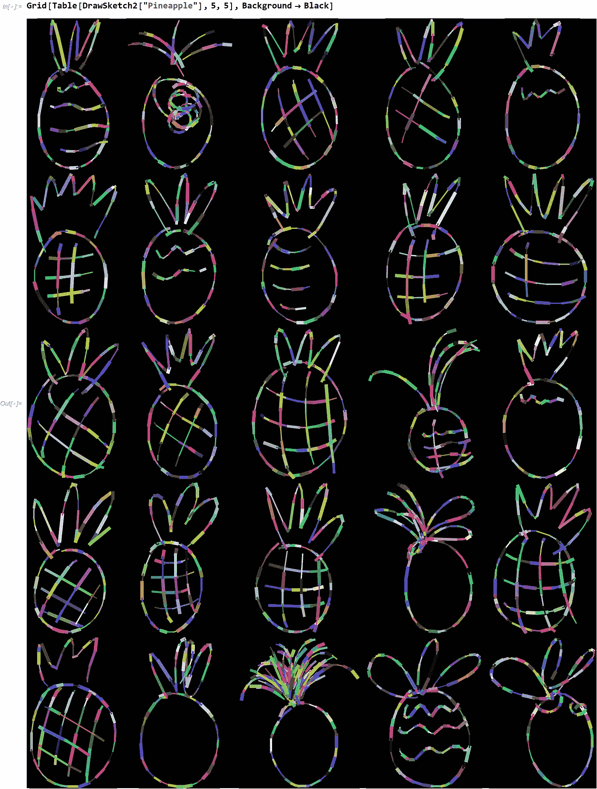

# 如何用 Wolfram 语言画一只猫和其他愚蠢的东西

> 原文：<https://towardsdatascience.com/how-to-draw-a-cat-and-other-silly-things-with-the-wolfram-language-9bf33ac7101f?source=collection_archive---------44----------------------->

## 用草图-RNN 神经网络生成手绘草图



图片由作者根据[春蕾居](https://unsplash.com/@chunlea?utm_source=unsplash&utm_medium=referral&utm_content=creditCopyText)在 [Unsplash](https://unsplash.com/s/photos/cat-drawing?utm_source=unsplash&utm_medium=referral&utm_content=creditCopyText) 上的照片制作

你不能教一只老狗新把戏，但也许你可以教一个神经网络画一只猫的画？前几天，当我在仔细阅读总是很有趣的 [Wolfram 神经网络库](https://resources.wolframcloud.com/NeuralNetRepository/)时，我发现了一个小珍品。一个名为 [Sketch-RNN](https://resources.wolframcloud.com/NeuralNetRepository/resources/Sketch-RNN-Trained-on-QuickDraw-Data) 的神经网络自称能够画出猫、狗、长号、风车和许多其他动物和物体。这个，我不得不试试！

为了画一个草图，这个草图-RNN 页面提示我复制并粘贴一大块 Wolfram 语言代码。这工作得非常好，但我想有一个单一的函数来隐藏所有的复杂性。所以我写了一个简单的 [ResourceFunction](https://reference.wolfram.com/language/ref/ResourceFunction.html) 来做这件事。

这些资源函数非常棒，因为它们基本上是从 web 上自动下载的代码块:

```
DrawSketch = ResourceFunction[
 "user:arnoudb/DeployedResources/Function/DrawSketch"
]
```

有了这个资源函数，我就可以试着画出我的第一只动物:



(图片由作者和人工“智能”提供)

好吧，所以结果更像是毕加索的作品，而不是伦勃朗的，但很明显，它得到了猫的本质。据推测，随着神经网络的改进和更先进的训练数据，这有可能走得更远。

所有的草图都有随机生成元素，所以你可以画 25 只猫，它们看起来都是独一无二的！



(图片由作者和人工“创造”)

使用这个漂亮的函数，你可以画出总共 114 种动物和物体。我决定尝试一下。许多物品一眼就能认出来，而其他一些则有点神秘:



(图片由作者和我们的人工“助手”提供)

您可以通过修改原始的 DrawSketch 函数并添加随机颜色和线条粗细来获得更多乐趣。这是我用菠萝做的一个例子:



(图片由作者在菠萝的帮助下提供)

这里的可能性是无限的，尝试所有的可能性是非常有趣的。我看不出这有什么实际的应用，除了通过提供给他们很多很多的例子让他们临摹来启发学龄前儿童画某些物体。我希望你喜欢这个愚蠢的小故事，如果你有兴趣了解更多关于 Wolfram 语言的知识，可以看看我最近发表的题为“[学习 Wolfram，从零到英雄](/learning-wolfram-from-zero-to-hero-2ac4fd6914d9)”的文章。它有一套很棒的指向这种编程语言学习资源的指针！😻🍍

*   基于[草图——RNN 根据来自 Wolfram](https://resources.wolframcloud.com/NeuralNetRepository/resources/Sketch-RNN-Trained-on-QuickDraw-Data) [神经网络库](https://resources.wolframcloud.com/NeuralNetRepository/)的 QuickDraw 数据进行训练
*   参考:D. Ha，D. Eck，“草图的神经表示”，arXiv:1704.03477 (2017)可从[https://github . com/tensor flow/magenta-demos/tree/master/Sketch-rnn-js](https://github.com/tensorflow/magenta-demos/tree/master/sketch-rnn-js)获得