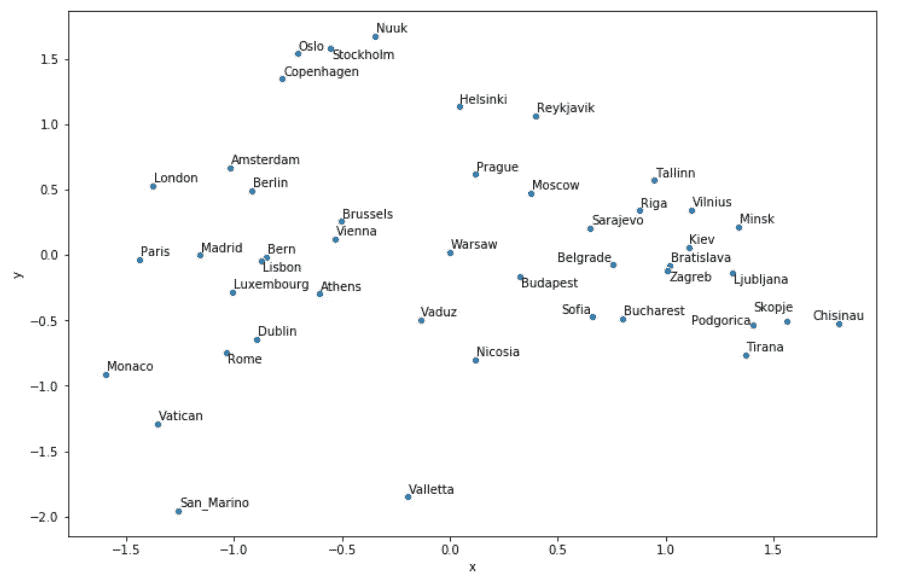

# 如何使用 Python 和 Word2vec 绘制地图

> 原文：<https://towardsdatascience.com/how-to-draw-a-map-using-python-and-word2vec-e9627b4eae34?source=collection_archive---------27----------------------->

## 从欧洲首都的 Word2vec 向量创建的主要组件的二维可视化表示，也称为地图。


雅各布·布朗在 Unsplash[上的照片](https://unsplash.com/s/photos/map-of-europe?utm_source=unsplash&utm_medium=referral&utm_content=creditCopyText)

到目前为止，Word2vec 绝对是我在自然语言处理研究中遇到的最有趣的概念。想象一下，一种算法可以真正成功地模仿理解单词的含义及其在语言中的功能，可以沿着数百个不同的主题测量单词的接近程度，可以回答更复杂的问题，如“*谁对文学来说就像贝多芬对音乐来说*”。

我认为直观地表示 word2vec 向量会很有趣:本质上，我们可以获取国家或城市的向量，应用主成分分析来降低维度，并将其放在二维图表上。然后，我们可以观察我们离实际的地理地图有多近。

在这篇文章中，我们将:

*   广义地讨论 word2vec 理论；
*   下载原始预训练向量；
*   看看一些有趣的应用:从列表中找出奇怪的一个，或者对单词进行算术运算，比如著名的`king — man + woman = queen`例子；
*   看看我们仅仅基于 word2vec 向量就能多精确地画出欧洲的首都。

最初的 word2vec 研究论文和预训练模型来自 2013 年，考虑到 NLP 文献的扩展速度，它在这一点上是旧技术。更新的方法包括 [GloVe](https://nlp.stanford.edu/projects/glove/) (更快的训练，不同的算法，可以在更小的语料库上训练)和 [fastText](https://fasttext.cc/) (能够处理字符 n-grams)。我现在坚持原始算法的结果。

# 快速 Word2Vec 简介

自然语言处理的核心概念之一是我们如何量化单词和表达式，以便能够在模型设置中使用它们。这种语言元素到数字表示的映射被称为[单词嵌入](https://en.wikipedia.org/wiki/Word_embedding)。

Word2vec 是一个单词嵌入过程。这个概念相对简单:它一句接一句地在语料库中循环，并符合一个模型，该模型根据来自预定义大小窗口的相邻单词来预测单词。为此，它使用神经网络，但实际上并不使用预测，一旦模型被保存，它只保存第一层的权重。在最初的模型中，我们将要使用的模型，有 300 个权重，所以每个单词都由一个 300 维的向量表示。

请注意，两个单词不一定要彼此接近才能被视为相似。如果两个单词从未出现在同一个句子中，但它们通常被相同的单词所包围，则可以有把握地假设它们具有相似的意思。

word2vec 中有两种建模方法:*跳跃式语法*和*连续式词汇袋*，这两种方法都有各自的优点，并且对某些超参数很敏感……但是你知道吗？我们不会去适应我们自己的模型，所以我不打算在这上面花更多的时间，你可以在[这篇文章](/nlp-101-word2vec-skip-gram-and-cbow-93512ee24314)或[维基站点](https://en.wikipedia.org/wiki/Word2vec)中阅读更多关于不同方法和参数的内容。

自然，你得到的单词向量依赖于你训练你的模型的语料库。一般来说，你确实需要一个巨大的语料库，有在维基百科上训练过的版本，或者各种来源的新闻文章。我们将要使用的结果是在谷歌新闻上训练出来的。

# 如何下载和安装

首先，您需要下载预先训练好的 word2vec 矢量。您可以从针对不同类型文档的各种模型中进行选择。我用的是最初的模型，在谷歌新闻上受过训练，你可以从很多来源下载，只需搜索“*谷歌新闻向量负 300* ”。比如这个 GitHub 链接就是一个方便的方法:[https://github.com/mmihaltz/word2vec-GoogleNews-vectors](https://github.com/mmihaltz/word2vec-GoogleNews-vectors)。

请注意，该文件有 1.66 GB，但在其辩护中，它包含了 30 亿个单词的 300 维表示。

当谈到在 Python 中使用 word2vec 时，同样，您有许多包可供选择，我们将使用`gensim`库。假设您已经将文件保存在`word2vec_pretrained`文件夹中，您可以像这样用 Python 加载它:

```
from gensim.models.keyedvectors import KeyedVectorsword_vectors = KeyedVectors.load_word2vec_format(\
    './word2vec_pretrained/GoogleNews-vectors-negative300.bin.gz', \
    binary = True, limit = 1000000)
```

limit 参数定义了你要输入多少单词，一百万对我来说已经足够了。

# 玩文字游戏

现在我们已经有了 word2vec 向量，我们可以检查它的一些应用程序。

首先，你实际上可以检查任何单词的矢量表示:

```
word_vectors['dog']
```

正如我们所料，结果是一个 300 维的向量，很难解释。但这是整个概念的基础，我们通过将这些向量相加和相减来对它们进行计算，然后我们计算余弦相似度来找到最匹配的单词。

您可以使用`most_similar`函数查找同义词，`topn`参数定义了您希望列出多少个单词:

```
word_vectors.most_similar(positive = ['nice'], topn = 5)
```

结果是

```
[('good', 0.6836092472076416),
 ('lovely', 0.6676311492919922),
 ('neat', 0.6616737246513367),
 ('fantastic', 0.6569241285324097),
 ('wonderful', 0.6561347246170044)]
```

现在，你可能认为用类似的方法，你也可以找到反义词，你只需要输入单词' *nice* '作为一个`negative`，对吗？不完全是，结果是这样的:

```
[('J.Gordon_###-###', 0.38660115003585815),
 ('M.Kenseth_###-###', 0.35581791400909424),
 ('D.Earnhardt_Jr._###-###', 0.34227001667022705),
 ('G.Biffle_###-###', 0.3420777916908264),
 ('HuMax_TAC_TM', 0.3141660690307617)]
```

这些单词与单词“ *nice* ”相距甚远，表明它并不总是如你所愿。

您可以使用`doesnt_match`功能找出奇数:

```
word_vectors.doesnt_match(
['Hitler', 'Churchill', 'Stalin', 'Beethoven'])
```

返回`Beethoven`。我想这很方便。

最后，让我们来看几个例子，这些例子通过给算法一种错误的智能感而使它出名。如果我们想要组合字向量`father`和`woman`的值，但是减去分配给字向量`man`的值:

```
word_vectors.most_similar(
positive = ['father', 'woman'], negative = ['man'], topn = 1)
```

我们得到:

```
[('mother', 0.8462507128715515)]
```

首先，要理解这个手术有点困难，我认为把这个问题表述成“*父亲对于男人来说，对于女人来说是什么？*“其实没那么有用。想象我们只有两个维度:父母和性别。单词'*女人*'可以用这个向量来表示:`[0, 1]`，'*男人*是`[0, -1]`，'*父亲*是`[1, -1]`，而'*母亲*是`[1, 1]`。现在，如果我们用向量做同样的运算，我们会得到同样的结果。当然，不同之处在于我们有 300 个维度，而不是例子中的 2 个，维度的意义几乎无法解释。

当谈到 word2vec 操作时，有一个著名的性别偏见例子，单词' *doctor'* (我们知道，这是一个中性词)的女性版本曾经被计算为' *nurse'* 。我尝试复制它，但没有得到相同的结果:

```
word_vectors.most_similar(
positive = ['doctor', 'woman'], negative = ['man'], topn = 1) [('gynecologist', 0.7093892097473145)]
```

我猜是进步了吧？

好了，现在我们检查了一些基本的可能性，让我们在我们的地图上工作！

# 映射函数

首先，我们需要一个我们希望我们的映射函数做什么的计划。假设我们有一个想要可视化的字符串列表和一个单词向量对象，我们想要:

1.  找到列表中每个单词的单词向量表示；
2.  使用主成分分析将维度减少到 2；
3.  创建散点图，将单词作为标签添加到每个数据点；
4.  作为一个额外的奖励，可以通过任何维度“翻转”结果-主成分分析的向量具有任意方向，当我们绘制地理单词以更好地与现实世界的方向保持一致时，我们可能希望改变这一点。

我们将需要以下库:

```
import matplotlib.pyplot as plt
import seaborn as sns
from sklearn.decomposition import PCAimport adjustText
```

列表中一个不常用的库是 [adjustText](https://github.com/Phlya/adjustText) ，这是一个非常方便的包，它使得在散点图中编写图例变得简单，而且不会重叠。对我来说，找到这个解决方案出奇的困难，而且据我所知，在 matplotlib 或 seaborn 中没有办法做到这一点。

事不宜迟，这个函数正是我们所需要的:

```
def plot_2d_representation_of_words(
    word_list, 
    word_vectors, 
    flip_x_axis = False,
    flip_y_axis = False,
    label_x_axis = "x",
    label_y_axis = "y", 
    label_label = "city"):

    pca = PCA(n_components = 2)

    word_plus_coordinates=[]

    for word in word_list: 

        current_row = []
        current_row.append(word)
        current_row.extend(word_vectors[word]) word_plus_coordinates.append(current_row)

    word_plus_coordinates = pd.DataFrame(word_plus_coordinates)

    coordinates_2d = pca.fit_transform(
        word_plus_coordinates.iloc[:,1:300])
    coordinates_2d = pd.DataFrame(
        coordinates_2d, columns=[label_x_axis, label_y_axis])
    coordinates_2d[label_label] = word_plus_coordinates.iloc[:,0] if flip_x_axis:
        coordinates_2d[label_x_axis] = \
        coordinates_2d[label_x_axis] * (-1) if flip_y_axis:
        coordinates_2d[label_y_axis] = \
        coordinates_2d[label_y_axis] * (-1)

    plt.figure(figsize = (15,10)) p1=sns.scatterplot(
        data=coordinates_2d, x=label_x_axis, y=label_y_axis)

    x = coordinates_2d[label_x_axis]
    y = coordinates_2d[label_y_axis]
    label = coordinates_2d[label_label]

    texts = [plt.text(x[i], y[i], label[i]) for i in range(len(x))] adjustText.adjust_text(texts)
```

现在该测试功能了。我绘制了欧洲国家的首都，但是你可以使用任何列表，总统或其他历史人物的名字，汽车品牌，烹饪原料，摇滚乐队，等等，只要在`word_list`参数中传递它。我从中得到一些乐趣，有趣的是看到集群形成并试图在两个轴后面找到一个意义。

如果你想重现结果，这里有一些城市:

```
capitals = [
    'Amsterdam', 'Athens', 'Belgrade', 'Berlin', 'Bern', 
    'Bratislava', 'Brussels', 'Bucharest', 'Budapest', 
    'Chisinau', 'Copenhagen','Dublin', 'Helsinki', 'Kiev',
    'Lisbon', 'Ljubljana', 'London', 'Luxembourg','Madrid',
    'Minsk', 'Monaco', 'Moscow', 'Nicosia', 'Nuuk', 'Oslo', 
    'Paris','Podgorica', 'Prague', 'Reykjavik', 'Riga', 
    'Rome', 'San_Marino', 'Sarajevo','Skopje', 'Sofia', 
    'Stockholm', 'Tallinn', 'Tirana', 'Vaduz', 'Valletta',
    'Vatican', 'Vienna', 'Vilnius', 'Warsaw', 'Zagreb']
```

(安道尔的首都安道尔城不在列表中，无法找到 word2vec 识别的格式。我们会接受的。)

假设您仍然拥有我们在上一节中创建的`word_vectors`对象，您可以像这样调用该函数:

```
plot_2d_representation_of_words(
    word_list = capitals, 
    word_vectors = word_vectors, 
    flip_y_axis = True)
```

(y 轴被翻转，以便创建更类似于真实地图的表示。)

结果是:



Word2vec 欧洲地图

我不知道你的感受，当我第一次看到这张地图的时候，我简直不敢相信它的效果是如此之好！是的，当然，你观察的时间越长，你发现的“错误”就越多，一个不祥的结果是莫斯科并不像它应该的那样远离东方……然而，东方和西方几乎完全分开，斯堪的纳维亚和波罗的海国家很好地组合在一起，意大利周围的首都也是如此，这样的例子不胜枚举。

需要强调的是，这绝不意味着纯粹的地理位置，例如，雅典在西边很远，但这是有原因的。让我们回顾一下上面的地图是如何得出的，这样我们就可以充分欣赏它了:

*   谷歌的一组研究人员训练了一个巨大的神经网络，它可以根据上下文预测单词；
*   他们将每个单词的权重保存在一个 300 维的向量表示中；
*   我们取了欧洲各国首都的向量。
*   通过主成分分析将维数降低到 2；
*   将计算出的组件放在图表上。

我觉得这很棒！

# 参考

霍布森、科尔和汉尼斯(2019 年)。自然语言处理实践:理解、分析和用 Python 生成文本。曼宁出版，2019。

[](https://en.wikipedia.org/wiki/Word2vec) [## Word2vec

### Word2vec 是一种自然语言处理技术。word2vec 算法使用神经网络模型来学习…

en.wikipedia.org](https://en.wikipedia.org/wiki/Word2vec)  [## 欢迎阅读 adjustText 的文档！- adjustText 0.7 文档

### adjustText 是一个小的库，帮助您调整 matplotlib 图上的文本位置，以删除或最小化与…的重叠

adjusttext.readthedocs.io](https://adjusttext.readthedocs.io/en/latest/)