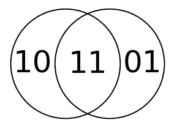
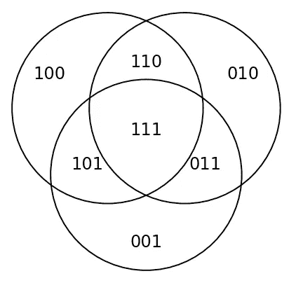

# 如何在 Jupyter 上画维恩图

> 原文：<https://towardsdatascience.com/how-to-draw-venn-diagrams-on-jupyter-75c604b093ac?source=collection_archive---------45----------------------->

## 使用 Matplotlib-Venn 的所有基本逻辑文氏图


freepik 创建的业务向量—[www.freepik.com](http://www.freepik.com)

```
**Table of Contents**[**Introduction**](#8858)1\. [A, B](#53bd)
2\. [TRUE, FALSE](#3ba9)
3\. [A AND B, A NAND B](#3e55)
4\. [A OR B, A NOR B](#ea60)
5\. [A XOR B, A XNOR B](#7811)
6\. [NOT A, NOT B](#296f)
7\. [A NOT B, B NOT A](#f0f1)
8\. [Implication A → B, B → A](#b2c4)
9\. [Mutually exclusive](#76e9)
10\. [Complement](#6b3d)
11\. [Subset](#b30b)[**Conclusion**](#a953)
```

# 介绍

在这篇文章中，你会发现如何在 Jupyter 上绘制[基本维恩图](https://upload.wikimedia.org/wikipedia/en/c/c1/LogicGates.svg)。为此，我们将使用[**matplotlib-Venn**](https://github.com/konstantint/matplotlib-venn)**。matplotlib-venn 用于绘制面积加权的二圆和三圆 venn 图。对于大多数的文氏图，我们将使用双圆文氏图。**

**(更新:我根据这些代码创建了一个 Python 包。请阅读本。)**

**让我们开始吧。**

**[](/how-to-run-jupyter-notebook-on-docker-7c9748ed209f) [## 如何在 Docker 上运行 Jupyter 笔记本

### 不再有 Python 环境和包更新

towardsdatascience.com](/how-to-run-jupyter-notebook-on-docker-7c9748ed209f) [](/introducing-basic-venn-diagram-python-package-vennfig-fa3f8e4dcb36) [## 介绍基本的维恩图 Python 包:Vennfig

### 在 Jupyter 或 Terminal 上用一行代码画一个维恩图

towardsdatascience.com](/introducing-basic-venn-diagram-python-package-vennfig-fa3f8e4dcb36) 

# 甲，乙

文氏图

我们将导入`venn2`和`venn2-circles`并创建一行两列的支线剧情。本文中的大多数图都是我使用的这种设置。

如果你需要所有维恩图都没有支线剧情的**代码，可以在 [**这个链接**](https://jovian.ml/shinokada/venn-diagram2) 找到。**

与使用`set-edgecolor`相比，`venn2-circles`能让你更好地控制边缘线，所以我们同时使用`venn2`和`venn2-circles`。

我们用相同的子集值为`v1`和`c1`设置`ax=ax1`,这样两者会很好地重叠。

我们使用`for`循环遍历每个区域。您可以在下面找到区域 id。



两个圆形区域的 id。图片由作者提供。

在`for`循环中，我们设置[颜色](https://matplotlib.org/api/colors_api.html?highlight=colors)。我们可以使用其中一个字符`{'b', 'g', 'r', 'c', 'm', 'y', 'k', 'w'}`，它是蓝色、绿色、红色、青色、品红色、黄色、黑色和白色的缩写。此外，您可以使用十六进制 RGB 或 RGBA 字符串(例如，`'#4287f5'`或`'#4287f580'`)。

对于区域 A，我们在区域 ID `10`和`11.`中设置颜色

对于区域 B，我们在区域 ID `11`和`01`中设置颜色。

我们用`get_patch_by_id`到`set_color`和`set_alpha`。如果不使用`set_alpha`，如果区域重叠，区域的颜色将是混合色。

我们需要删除数字，所以我们使用下面的代码来完成这项工作。

```
 txt = v1.get_label_by_id(area)
    if txt: txt.set_text('')
```

我们用`set_axis_on`设置一个矩形边界，用`set_facecolor`设置矩形的颜色。

我们使用`set_title`来设置标题和字体大小。

我们需要在底部留出一些空间，所以我们使用下面的代码来完成这项工作。

```
ymin, ymax = ax1.get_ylim()
ax1.set_ylim(ymin - 0.1, ymax)
```

# 真，假

真假文氏图

对于“真实的”文氏图，我们为`for`循环中的所有区域设置颜色`skyblue`。

类似地，对于“假”文氏图，我们为`for`循环中的所有区域设置颜色`white`。

# A 和 B，A 和 B

A 和 B，A 和 B 维恩图

对于“A 和 B”文氏图，我们为区域`11`设置颜色`skyblue`。

对于“A 与 B”维恩图，我们将颜色`skyblue`设置为包括`facecolor`在内的所有区域，除了区域`11`。

# A 或 B，A 也不是 B

A 或 B，A 或非 B 文氏图

对于“A 或 B”文氏图，我们为所有区域设置颜色`skyblue`、`10`、`11`、`01`，并将颜色`white`设置为`facecolor`。

对于“A 或非 B”文氏图，我们将颜色`white`设置为所有区域，将`skyblue`设置为`facecolor`。

# 一个异或 B，一个 XNOR B

一个 XOR B，一个 XNOR B 维恩图

对于“A XOR B”文氏图，我们为区域`10`和`01`设置颜色`skyblue`。

对于“A XNOR B”文氏图，我们将颜色`skyblue`设置为区域`11`和`facecolor`。

# 不是 A，不是 B

不是 A，不是 B 文氏图

对于“非 A”文氏图，我们为区域`01`和`facecolor`设置颜色`skyblue`，否则，我们为区域`10`和`11`设置颜色`white`。

对于“非 B”文氏图，我们为区域`01`和`11`设置颜色`white`，为区域`10`和`facecolor`设置颜色`skyblue`。

# A 不是 B，B 不是 A

A 不是 B，B 不是维恩图

对于“A 不是 B”的文氏图，我们将颜色`skyblue`设置为区域`10`，否则，我们将颜色`white`设置为所有其他区域。

对于“B 非 A”文氏图，我们将颜色`skyblue`设置为区域`01`，否则，我们将颜色`white`设置为所有其他区域。

# 蕴涵 A → B，B → A

A → B，B → A 文氏图

对于隐含的“A → B”文氏图，我们将颜色`white`设置为区域`10`，否则，我们将颜色`white`设置为所有其他区域。

对于隐含的“B → A”文氏图，我们将颜色`white`设置为区域`01`，否则，我们将颜色`white`设置为所有其他区域。

# 互斥的

互斥文氏图

对于互斥的文氏图，我们将颜色`skyblue`设置为区域`10`和`01`。

# 补充

互补文氏图

你可以用一个[圆形补丁](https://matplotlib.org/api/_as_gen/matplotlib.patches.Circle.html)和一个[矩形补丁](https://matplotlib.org/api/_as_gen/matplotlib.patches.Rectangle.html#matplotlib.patches.Rectangle)画一个圆形，但是我们将使用`venn3`和`venn3_circles`。我们画了三个圆，但我们将通过设置颜色`white`来隐藏两个圆，这与`facecolor`相同。

通过使用三圈标识，我们可以修改它的属性。



三个圆形区域的 id。图片由作者提供。

我们还通过使用`text`添加了`U`。

```
ax1.text(-1, 0.2, r'U', fontsize=15)
```

`v.get_label_by_id()`返回一个对象，该对象是 [matplotlib.text.Text](https://matplotlib.org/api/text_api.html#matplotlib.text.Text) 的实例。在这个例子中，我想向您展示如何通过使用`set_fontsize`、`set_color`、`set_rotation`方法来改变它的属性。

# 子集

子集文氏图

我们可以使用`venn2`和`venn2_c`来创建一个子集文氏图。我们将区域`01`设置为 0。

# 结论

matplotlib-venn 包用于绘制面积加权的二圆和三圆的维恩图，但是使用您的创造性思维，您也可以创建一个单圆的维恩图。

请继续关注下一篇文章。

**通过** [**成为**](https://blog.codewithshin.com/membership) **会员，可以完全访问媒体上的每一个故事。**


[https://blog.codewithshin.com/subscribe](https://blog.codewithshin.com/subscribe)**