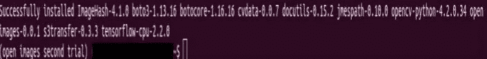

# 如何为你的人工智能应用程序轻松下载谷歌的开放图像数据集

> 原文：<https://towardsdatascience.com/how-to-easily-download-googles-open-images-dataset-for-your-ai-apps-db552a82fc6?source=collection_archive---------16----------------------->


由[作者](https://medium.com/@naveenmanwani)通过 [Canva](https://www.canva.com/) 创作，图片列在( [CC BY 2.0](https://creativecommons.org/licenses/by/2.0/) 许可下)

你是那种想要建立一个自定义图像分类器，但不知道如何从 [Google 的 OpenImages 数据集](https://storage.googleapis.com/openimages/web/factsfigures.htmlhttps://storage.googleapis.com/openimages/web/factsfigures.html)中只下载“**图像**”而不是标签的书呆子吗？

GIF 承接自 G [iphy](https://giphy.com/gifs/pika-detective-pikachu-detpiktrailer2-8YvipzLdVHNKczrJEr/media)

你是那种想要建立一个自定义对象检测器，但不知道如何从谷歌的 OpenImages 数据集的 600 个对象类中下载选定的类的人吗？

好吧，我的朋友，你并不孤单，我也曾经有过同样的问题，直到几周前我偶然发现了这个包裹。

但是在学习使用这个包之前，让我们深入了解一下关于 [Google 的 OpenImages 数据集](https://storage.googleapis.com/openimages/web/factsfigures.html)的基本事实。

# 谷歌的开放图像数据集:拨乱反正的举措

开放图像数据集被称为现有计算机视觉数据集中的巨人。它有大约 900 万张图像，标注有图像级标签、对象边界框、对象分段遮罩、视觉关系和本地化叙述。它包含 1.9M 图像上 600 个对象类的总共 16M 的边界框，使其成为具有对象位置注释的最大的现有数据集*。*


由[作者](https://medium.com/@naveenmanwani)通过 [Canva](https://www.canva.com/) 创建，图像通过[像素](https://www.pexels.com/)拍摄

据说一张图片胜过千言万语，上面的图片展示了如果你不使用开放的图像数据集，你的应用程序可能会变成另一个[物体检测器](/real-time-object-detection-with-tensorflow-detection-model-e7fd20421d5d?source=your_stories_page---------------------------)或另一个[图像分类器](https://www.tensorflow.org/tutorials/images/classification)。但是，如果你利用谷歌开放图像数据集的力量，你可能会把你的人工智能应用程序变成一个**通用的可扩展的**解决方案，可能服务于许多人或一个社区的需求。[难道这不是我们在不同的屋檐下努力工作的原因吗，通过人工智能来帮助那些无法帮助自己的人，这取决于你]。

# 开发者模式:是时候做一些安装了

## 背景故事:

几周前，当我在为我的定制[麸质/非麸质食品](https://www.healthline.com/nutrition/gluten-free-foods)分类器寻找一个更好的解决方案来下载谷歌的开放图像数据集时，我坚持不懈的搜索将我带到了最近在 2 月份发布的名为“ **openimages** 的 [Python](https://www.python.org/) 包。

因此，在博文的这一部分，我将分享我将 python 包安装到我的 Linux 系统中的步骤，以及我如何使用 python 包中的模块来下载数据集中可用的几个类的图像。与此同时，我将分享下载任何类标签的图像和注释所需的命令。

## 包装说明:

openimages 包附带了一个“ **download** ”模块，该模块提供了一个具有两个下载功能的 API 和一个相应的 CLI(命令行界面),其中包括可用于从 OpenImages 数据集下载图像和相应注释的脚本入口点。

# 安装程序:

## 创建虚拟环境:

作为一个最佳实践，始终使用 Python " [虚拟环境](https://packaging.python.org/tutorials/installing-packages/#id16)"来为任何特定的应用程序安装 Python [包](https://packaging.python.org/glossary/#term-distribution-package)，因为最好在一个隔离的位置安装包或库，而不是全局安装。

对于 Linux 用户，键入以下命令

```
virtualenv <DIR>
source <DIR>/bin/activate
```

如果您是 window 用户，请使用

```
virtualenv <DIR>
<DIR>\Scripts\activate
```

当 virtualenv 处于活动状态时，您的 shell 提示符会以 **< DIR >** 为前缀。

现在，在不影响主机系统设置的情况下，开始在虚拟环境中安装软件包。让我们从升级`pip`开始:

```
<DIR>:~$ pip install --upgrade pip
```

openimages 包适用于 Python 3.6+版本。所以，一定要确保你有一个支持 openimages 的版本。现在，在活动的虚拟环境中，键入。

```
<DIR>:~$ pip install openimages
```

该命令将下载一些库，这些库对于从 [Google 的 OpenImages 数据集](https://storage.googleapis.com/openimages/web/factsfigures.html)中下载图像和相应的注释非常重要。

下面列出了将要安装的库:

```
ImageHash-4.1.0
absl-py-0.9.0
astunparse-1.6.3
boto3–1.13.16
botocore-1.16.16
cachetools-4.1.0
cvdata-0.0.7
docutils-0.15.2
gast-0.3.3
google-auth-1.15.0
google-auth-oauthlib-0.4.1
google-pasta-0.2.0
grpcio-1.29.0
jmespath-0.10.0
keras-preprocessing-1.1.2
markdown-3.2.2
oauthlib-3.1.0
opencv-python-4.2.0.34
openimages-0.0.1
opt-einsum-3.2.1
protobuf-3.12.1
pyasn1–0.4.8 
pyasn1-modules-0.2.8
requests-oauthlib-1.3.0 
rsa-4.0 
s3transfer-0.3.3 
tensorboard-2.2.1 
tensorboard-plugin-wit-1.6.0.post3 
tensorflow-cpu-2.2.0 
tensorflow-estimator-2.2.0 
termcolor-1.1.0 
```

这是软件包安装完成后输出的样子[open_images_second_trial]只是一个虚拟环境名。



截图由[作者](https://medium.com/@naveenmanwani)拍摄

与这些包一起，两个 python [入口点](https://en.wikipedia.org/wiki/Entry_point)也被安装在环境中，对应于下面描述的公共 API 函数`oi_download_dataset`和`oi_download_images`:

*   `openimages.download.download_images`仅用于下载图像
*   `openimages.download.download_dataset`用于下载图像和相应的注释。

## 入口点+ CLI == "您下载数据集的途径"

在这一节中，我将通过使用提供的入口点，向您介绍下载数据集的图像和注释所需的命令行参数。请务必参考下图来加深理解。


由[作者](https://medium.com/@naveenmanwani)至 [Canva](https://www.canva.com/) 创建

在了解了命令行参数[CLI]之后，是时候使用它进行进一步的操作了，任何猜测，是的，你是正确的，下载图像和它们的标签。

## I:为类标签下载图像和 PASCAL 格式注释的使用示例

```
<DIR>:~$ oi_download_dataset --csv_dir ~/<dir_A> --base_dir ~/<dir_A> --labels Zebra Binoculars --format pascal --limit 200
```

最好将 CSV 目录和基本目录保存在同一个位置，限制完全取决于你想下载多少带有类别标签的图像。

一旦你运行这个命令，去喝热水或啤酒，因为它需要时间将数据下载到您的计算机存储。

## II:为类标签下载图像的用法示例

```
<DIR>:~$ oi_download_images --csv_dir ~/<dir_A> --base_dir ~/<dir_A> --labels Surfboard --limit 200
```

如果您多次运行这个脚本，那么它将从~/ <dir_a>中读取 CSV 文件，而不是再次下载文件。</dir_a>


截图由[作者](https://medium.com/@naveenmanwani)拍摄

一旦您的课程下载完成，不要忘记退出您的虚拟环境，只需输入:

```
<DIR>:~$ deactivate
:~$
```

这标志着整个过程的结束。我希望当你在读这几行的时候，你的数据下载过程一定已经开始了，你一定已经在计划使用哪种模型或者保持什么样的学习速度等等。

## 资源:

1.  Openimage 0.0.1:从 Google 的 [OpenImages](https://storage.googleapis.com/openimages/web/index.html) 数据集下载图像和相应注释的工具。
2.  OpenImages 数据集 [Github repo](https://github.com/cvdfoundation/open-images-dataset#download-images-with-bounding-boxes-annotations) 。
3.  [OIDv4 工具包](https://github.com/EscVM/OIDv4_ToolKit):下载图像和标签用于物体检测和图像分类任务的实用工具。
4.  [打开图像的快速图像下载器 V4](https://www.learnopencv.com/fast-image-downloader-for-open-images-v4/) 。

**感谢您的关注**


[亲教会媒体](https://unsplash.com/@prochurchmedia?utm_source=unsplash&utm_medium=referral&utm_content=creditCopyText)在 [Unsplash](https://unsplash.com/s/photos/filled-with-gratitude?utm_source=unsplash&utm_medium=referral&utm_content=creditCopyText) 上拍摄的照片

你用你的时间阅读我的作品对我来说意味着一切。我完全是这个意思。

此外，如果你愿意，可以在 Medium、LinkedIn 或 Twitter 上关注我！我很乐意。

[](https://medium.com/@naveenmanwani) [## 纳文·曼瓦尼培养基

### 阅读纳文·曼瓦尼在媒介上的作品。一个机器学习工程师，一个深度学习爱好者|Mentor @ Coursera…

medium.com](https://medium.com/@naveenmanwani) [](https://www.linkedin.com/in/naveen-manwani-65491678/) [## Naveen Manwani -机器学习工程师- AIMonk Labs Private Ltd | LinkedIn

### 查看纳文·曼瓦尼在全球最大的职业社区 LinkedIn 上的个人资料。Naveen 有一份工作列在他们的…

www.linkedin.com](https://www.linkedin.com/in/naveen-manwani-65491678/) [](https://twitter.com/NaveenManwani17) [## 纳文·曼瓦尼

### 纳文·曼瓦尼的最新推文(@纳文·曼瓦尼 17)。机器学习工程师@ AIMONK Labs Pvt ltd，深…

twitter.com](https://twitter.com/NaveenManwani17)