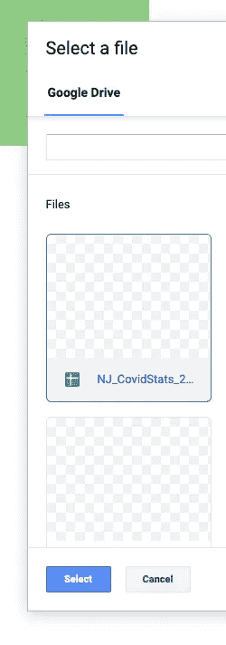

# 如何在 Python 中轻松集成来自 Google Sheets、Dropbox 和你的桌面的电子表格

> 原文：<https://towardsdatascience.com/how-to-easily-integrate-spreadsheets-from-google-sheets-dropbox-and-your-desktop-in-python-9f4065135449?source=collection_archive---------48----------------------->

## 告别电子表格集成难题

*免责声明:这篇文章使用了我做的一个产品，* [*API 电子表格*](http://www.apispreadsheets.com/) *，我相信这确实是最简单的方法。你可以自己去看看。*


当你从事数据科学或分析项目时，通常到处都存储着大量的电子表格。

如果你和我一样，你可能会这样做:

1.  下载你的谷歌工作表作为电子表格
2.  下载你的 Dropbox 电子表格
3.  把它们和你的桌面文件放在同一个文件夹里
4.  使用熊猫读取所有文件

这是一个不错的工作流程。但是营销部门的史蒂夫改变了谷歌表单中的一些数据。

“不要担心”，您在重新下载表单并重新运行工作流程时回复。

现在，人力资源部的卡玛拉又给 Dropbox 添加了两个电子表格。

“我明白了”，你一边慢慢冷静一边说。

然后你的老板告诉你把你所有的电子表格用电子邮件发给她，这样她就可以对你的数据进行三次检查。“哦，顺便说一句”，她说，“不要忘了使用我们副总裁力推的样式来更改所有电子表格的名称”

你正式失去理智了。


照片由[诺亚·布舍尔](https://unsplash.com/@noahbuscher?utm_source=medium&utm_medium=referral)在 [Unsplash](https://unsplash.com?utm_source=medium&utm_medium=referral) 上拍摄

# 更简单的方法

我将向您展示如何使用 [API 电子表格](http://apispreadsheets.com/)和 Python 轻松地将所有这些来源的数据整合在一起。并保持更新和同步。这样你就能保持冷静和快乐！

我们将使用 1 个谷歌表，1 个本地文件和 1 个 Dropbox 文件。每个文件将包含来自一个唯一美国州的 Covid 数据:TX、NJ 或 CA。数据将按县在每行上分解，如下所示:


来自 NJ 文件的样本数据。每个文件中的标题都是相同的

我们开始吧！

# 步骤 0:创建一个空的 Python 文件

创建一个名为**spread sheet _ integration . py**的空 Python 文件，并将其保存在某个地方。

该文件的最终代码如下。我们将在这篇文章中介绍如何到达那里。

最终文件代码

# 步骤 1:创建一个 API 电子表格免费帐户

前往[www.apispreadsheets.com](http://www.apispreadsheets.com)点击注册创建一个免费账户

# 第二步:连接到你的谷歌表单

点击谷歌表单上传框


点击 Google Sheets 上传框开始连接

选择您想要连接的 Google 表单



选择要连接的文件

从 **Read** 选项卡中复制 Python 代码并粘贴到您的 Python 文件中


您的 Python 文件现在将包含以下代码

```
import requestsr = requests.get("[https://api.apispreadsheets.com/data/581/](https://api.apispreadsheets.com/data/581/)")if r.status_code == 200:
    # SUCCESS 
    data = r.json()
else:
    # ERROR
    data=None
```

我们现在要改变代码中的两件事，使数据更容易处理

1.  我们将从 r.json()对象的数据键中访问数据
2.  我们将导入熊猫并将数据转换成熊猫数据框架

我们的代码现在将如下所示

```
import requests
import pandas as pdr = requests.get("[https://api.apispreadsheets.com/data/581/](https://api.apispreadsheets.com/data/581/)")if r.status_code == 200:
    data = pd.DataFrame(r.json()["data"])
else:
    data = None
```

> 这篇文章中的所有 API 链接都是公开的，所以请随意使用这些链接进行测试！

# 步骤 3:连接到你的 Dropbox 文件

点击 Dropbox 上传框。第一次点击会要求您进行身份验证，或者如果您的帐户已经在标签中打开，它会刷新页面。这是 Dropbox 身份验证的预期行为。


点击 Dropbox 上传框开始流程

现在再次点击 Dropbox 上传框，你会看到一个文件选择器。选择您的文件。


按照与上面相同的步骤在文件中复制 Python 代码。

但是，我们现在将更改请求和数据的名称，以便于识别

```
import requests
import pandas as pdgoogle_sheet_request = requests.get("[https://api.apispreadsheets.com/data/581/](https://api.apispreadsheets.com/data/581/)")dropbox_request = requests.get("[https://api.apispreadsheets.com/data/582/](https://api.apispreadsheets.com/data/582/)")if google_sheet_request.status_code == 200:
    google_sheet_data = pd.DataFrame(google_sheet_request.json()["data"])
else:
    google_sheet_data = Noneif dropbox_request.status_code == 200:
    dropbox_data = pd.DataFrame(dropbox_request.json()["data"])
else:
    dropbox_data = None
```

# 步骤 4:从桌面上传文件

现在，我们将从您的桌面上传文件。

我们不会再用这个过程来烦你了。只需点击**上传或删除文件**框，上传您的文件。

按照与上面相同的步骤获取 python 代码，并将其插入到 Python 文件中。然后更改变量名，这样就有意义了。

这将引导我们找到最终的代码

原谅 local_data 上的缩进

就是这样！这就是集成各种来源的电子表格数据有多容易。

最棒的是，如果底层的 Google Sheet 或 Dropbox 文件数据发生变化，那么你的数据会自动更新。

如果你想和别人分享你的数据，你只需要给他们发送 API 链接。

祝你整合之旅好运，如果你遇到任何麻烦或有任何问题，请随时给我在 adhaar@lovespreadsheets.com 留言。