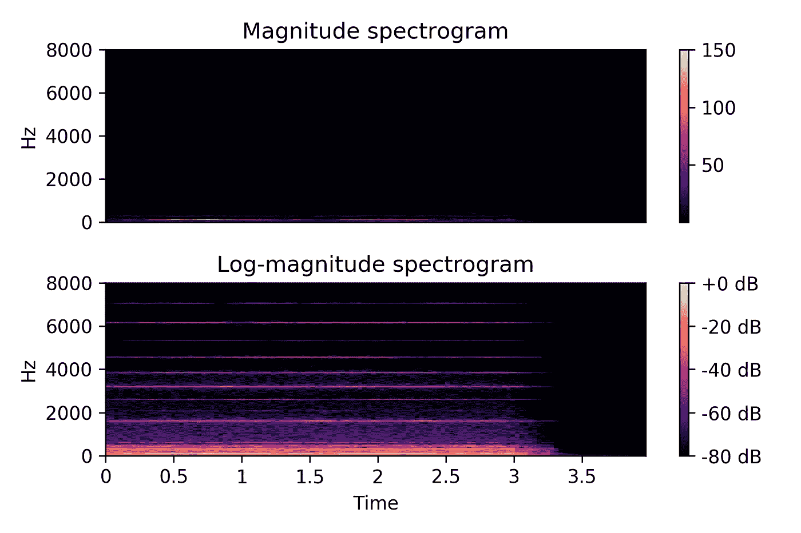
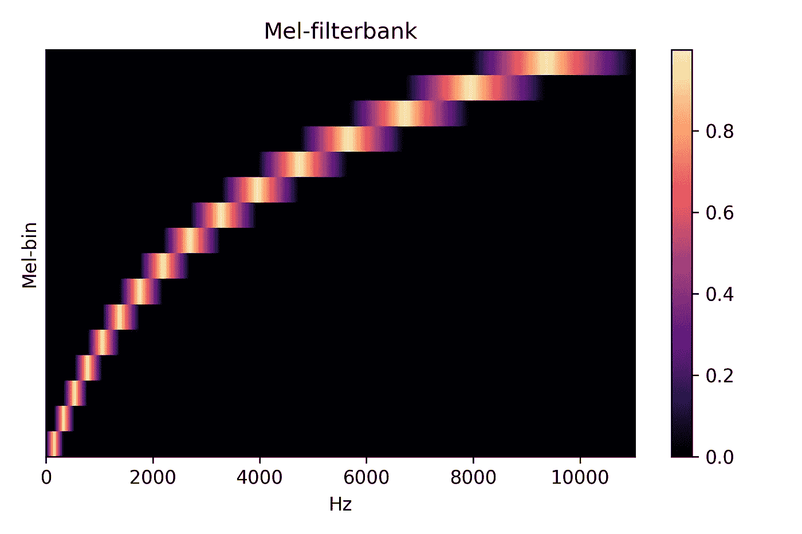
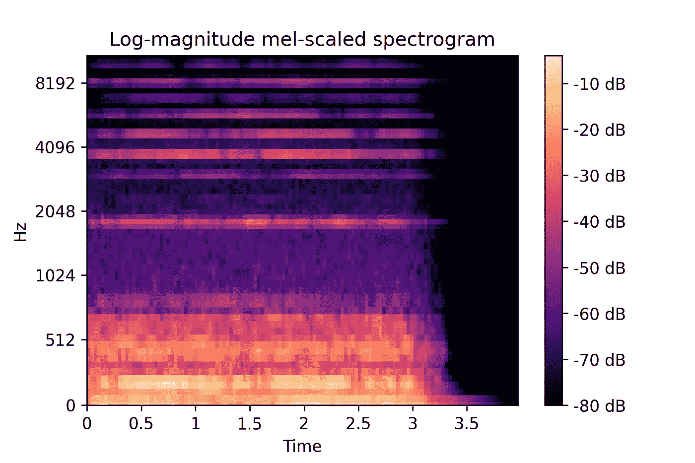

# 如何使用 TensorFlow 在您的 GPU 上轻松处理音频

> 原文：<https://towardsdatascience.com/how-to-easily-process-audio-on-your-gpu-with-tensorflow-2d9d91360f06?source=collection_archive---------4----------------------->

## 使用 TensorFlow 的信号处理模块，充分利用您的 GPU 处理音频数据的能力


由[沙哈达特拉赫曼](https://unsplash.com/@hishahadat?utm_source=unsplash&utm_medium=referral&utm_content=creditCopyText)在 [Unsplash](https://unsplash.com/s/photos/signal-flow?utm_source=unsplash&utm_medium=referral&utm_content=creditCopyText) 上拍摄的照片

对音频数据的深度学习通常需要繁重的预处理步骤。

虽然有些模型运行在原始音频信号上，但其他模型期望将时频表示作为输入。在模型训练之前，预处理通常作为一个单独的步骤来完成，使用像`[librosa](https://librosa.github.io/librosa/)`或`[Essentia](https://essentia.upf.edu/)`这样的工具。

但是，当您开始处理更大的数据集时，此工作流会带来挑战。

任何时候改变参数，比如采样率或 FFT 大小，都需要再次处理整个数据集，然后才能继续训练。

这意味着等待。😴

即使在可用的 CPU 内核上并行化，预处理也需要很长时间。另外，您需要考虑如何存储和访问不同参数的文件。这无疑会浪费磁盘空间和精神资源，并且很快会变得令人头痛。

这些听起来熟悉吗？

厌倦了这种繁琐的两步走的过程，我开始问自己是不是没有更好的办法。

> *“没有更好的办法了吗？”*

我最近[建立了一个高效的音频数据管道](/how-to-build-efficient-audio-data-pipelines-with-tensorflow-2-0-b3133474c3c1)，它使我能够按需将音频从文件路径加载到模型中。

[](/how-to-build-efficient-audio-data-pipelines-with-tensorflow-2-0-b3133474c3c1) [## 如何使用 TensorFlow 2.0 构建高效的音频数据管道

### 使用 TensorFlow 的数据集 API 消除培训工作流程中的瓶颈

towardsdatascience.com](/how-to-build-efficient-audio-data-pipelines-with-tensorflow-2-0-b3133474c3c1) 

我还想对基于声谱图的模型使用相同的数据管道。

在这篇文章中，我想和你分享:

*   如何利用 GPU 的能力来完成信号处理任务。
*   如何构建自定义预处理层以用于任何神经网络。
*   最后还有一点奖金。😲

请继续阅读，了解更多信息。

# 如何用 5 个简单的步骤预处理您的音频数据

[深度学习应用中跨音频域](https://arxiv.org/abs/1905.00078)的流行特征表示是 *mel-spectrogram* 。

mel 谱图是信号频谱随时间变化的直观表示。与标准声谱图的主要区别在于，频率被投射到 [*mel 音阶*](https://en.wikipedia.org/wiki/Mel_scale) 上，其中音高的感知距离等于 mel 频率的距离。这是受我们如何听的启发。

同样，梅尔频谱图的幅度通常是对数标度的，因为这更接近于我们如何感知响度的变化。因此，更精确的术语应该是*对数级 mel 标度频谱图*。但因为这相当拗口，所以大多数人简称它为*对数-梅尔-光谱图*或*梅尔-光谱图*。值得指出的是，尽管 *mel* 指的是频率等级，但是 *log* 描述的是震级的等级。

那么，如何将原始音频信号转换成 mel 频谱图呢？

1.  计算音频信号的[短时傅立叶变换](https://en.wikipedia.org/wiki/Short-time_Fourier_transform)
2.  计算大小
3.  实例化 mel 滤波器组
4.  将线性标度的星等谱图弯曲到 mel 标度
5.  将幅度转换为对数标度

让我们详细看看每一步。

这是我们将要学习的声音示例

## 1.计算短时傅立叶变换

短时傅立叶变换(STFT)将长信号分成较短的片段，通常称为*帧*，并计算每帧的频谱。帧通常会重叠，以尽量减少边缘的数据丢失。将每一帧的光谱结合起来就产生了光谱图。

要使用 TensorFlow 计算 STFT，请使用`[tf.signal.stft(signals)](https://www.tensorflow.org/api_docs/python/tf/signal/stft)`，其中`signals`是包含音频信号的张量。

您需要设置的一些参数是:

*   `frame_length`:样本中每一帧的长度。这通常被称为窗口长度或窗口大小。窗口大小以时间分辨率(短窗口)换取频率分辨率(长窗口)。
*   `frame_step`:帧间样本数。这通常被称为跳长或跳大小。
*   `fft_length`:要应用的 [FFT](https://en.wikipedia.org/wiki/Fast_Fourier_transform) 的大小。这通常称为 FFT 大小，与`frame_length`相匹配。它默认为可以包含一个框架的最小 2 次方。因此，如果`frame_length`是 2 的幂，并且你没有显式地设置`fft_length`，它取相同的值。

```
spectrograms = tf.signal.stft(signals,
                              frame_length=1024,
                              frame_step=512)
```

## 2.计算大小

上一步中的 STFT 返回一个复数值张量。使用`[tf.abs()](https://www.tensorflow.org/api_docs/python/tf/math/abs)`计算震级。

```
magnitude_spectrograms = tf.abs(spectrograms)
```

我们现在可以画出星等谱图。

不过，请注意，在正确缩放数量级之前，您不会看到太多。第二个支线剧情用`librosa.amplitude_to_db()`缩放。所以，从技术上讲，这是一个对数级的功率谱。

在第 5 步中会有更多的介绍。



上图:星等谱图。是全黑吗？不。如果你仔细看，你可以在较低的频率上看到一点能量。下图:对数幅度谱图。当量值用对数标度时，你可以在几个频带中看到能量。

## 3.实例化 Mel-滤波器组

将标准频谱图转换为 mel 频谱图包括将频率扭曲到 mel 标度，并将 FFT 仓组合到 mel 频率仓。

TensorFlow 使这种转变变得容易。

您可以使用`[tf.signal.linear_to_mel_weight_matrix()](https://www.tensorflow.org/api_docs/python/tf/signal/linear_to_mel_weight_matrix)`创建一个 mel-filterbank，将线性标度光谱图扭曲到 mel 标度。

您只需要设置几个参数:

*   `num_mel_bins`:生成的 mel 谱图中 mel 频段的数量。
*   `num_spectrogram_bins`:源谱图中唯一谱图仓的数量，等于`fft_length // 2 + 1`。
*   `sample_rate`:输入信号每秒的样本数。
*   `lower_edge_hertz`:包含在 mel 标度中的最低频率，单位为赫兹。
*   `upper_edge_hertz`:包含在 mel 标度中的最高频率，单位为赫兹。



具有 16 个梅尔槽的梅尔滤波器组

## 4.将线性标度的星等谱图弯曲到 mel 标度

将平方的星等谱图乘以 mel 滤波器组，就可以得到 mel 标度的功率谱图。

```
mel_power_specgrams = tf.matmul(tf.square(magnitude_spectrograms),
                                mel_filterbank)
```

## 5.将幅度转换为对数标度

我们以对数方式感知响度的变化。所以，在这最后一步，我们也想用对数来表示 mel 光谱图的幅度。

做到这一点的一个方法是获取梅尔光谱图的`log`。但是这可能会给你带来麻烦，因为`log(0)`没有定义。相反，您希望以数值稳定的方式将幅度转换为[分贝](https://en.wikipedia.org/wiki/Decibel) (dB)单位。

```
log_magnitude_mel_spectrograms = power_to_db(mel_power_spectrograms)
```

下面是如何在基于`[librosa.power_to_db](https://librosa.github.io/librosa/_modules/librosa/core/spectrum.html#power_to_db)`的 TensorFlow 中做到这一点。

将功率谱转换为张量流中的分贝单位

转换成对数标度后，光谱图的最大值为零，最小值为负`top_db`。



“电子琴”的 mel 频谱图，具有 64 个 Mel 频段、16 kHz 采样率、1024 个样本 FFT 大小和 512 个样本跳数大小

现在有趣的部分来了。

# **准备好立即获得更大的灵活性了吗？**

将各个步骤组合到一个自定义的预处理层中，允许您将原始音频馈送到网络，并在 GPU 上动态计算 Mel-spectro gram。

为了创建你的 mel-spectrogram 层(或任何自定义层)，你从`[tf.keras.layers.Layer](https://www.tensorflow.org/api_docs/python/tf/keras/layers/Layer)`和[子类实现三个方法](https://www.tensorflow.org/tutorials/customization/custom_layers#implementing_custom_layers):

1.  `__init__()`:将层的配置保存在成员变量中。
2.  `build()`:定义你的体重。
3.  `call()`:执行将图层应用到输入张量的逻辑。这是你将音频输入张量转换成梅尔频谱图的地方。

下面是我实现的一个自定义 Keras 层，它将原始音频转换为 log-Mel-spectrogram:

使用此自定义 Keras 层将原始音频转换为 log-Mel-spectrogram

一旦定义好，你就可以在一行代码中添加音频预处理到你的神经网络中。

一个神经网络的例子，它使用了我们上面定义的自定义 LogMelSpectrogram-layer

现在，您可能想知道，将相同的音频信号一次又一次地转换成频谱图，效率会不会低得令人难以置信。

这是一个很好的观点。

在写这篇文章的时候，我遇到了一个“用于音频和音乐信号预处理的 Keras 层”库。作者，Choi 等人，[展示了一个基准](https://arxiv.org/abs/1706.05781)，它显示，他们的预处理层增加了大约 20%的开销。

所以，这是一个权衡。就像生活中的任何事情一样。

在这种情况下，您用存储空间换取了稍长的计算时间。但不仅如此。您还可以摆脱繁琐的两步过程，并立即获得在音频数据上训练深度学习模型的更大灵活性。

尝试不同的预处理参数现在就像用不同的参数重新开始你的训练程序一样简单。

*   不需要维护单独的预处理脚本。
*   无需记住在多个地方更改参数。
*   在继续训练之前，无需处理整个数据集。

值得开销吗？

你自己决定。

# 这里有些东西可以帮你做到这一点

所有代码和示例都可以在这个 Colab 笔记本中找到:

[](https://bit.ly/2QEBKEJ) [## Google Colab:如何使用 TensorFlow 在 GPU 上处理音频

### 免费笔记本，互动体验这篇文章。

colab.research.google.com](https://bit.ly/2QEBKEJ) 

现在轮到你了。

你简化了(或喜欢简化)的工作流程中有哪一个给了你更多的灵活性和思维空间，尽管它稍微贵了一点？

# 参考

*   【[1](https://arxiv.org/abs/1905.00078)】h . Purwins 等，音频信号处理的深度学习(2019)，IEEE 信号处理精选期刊 13.2:206–219
*   [ [2](https://arxiv.org/pdf/1706.05781.pdf) ] K. Choi 等人，Kapre:快速实现深度神经网络模型的 GPU 上音频预处理层，Keras (2017) arXiv 预印本