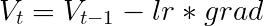

# 如何在 Keras 模型中轻松使用梯度累积

> 原文：<https://towardsdatascience.com/how-to-easily-use-gradient-accumulation-in-keras-models-fa02c0342b60?source=collection_archive---------11----------------------->

## 实现通用梯度累积机制的分步指南


照片由[法比安·格罗斯](https://unsplash.com/@grohsfabian?utm_source=unsplash&utm_medium=referral&utm_content=creditCopyText)在 [Unsplash](https://unsplash.com/?utm_source=unsplash&utm_medium=referral&utm_content=creditCopyText) 上拍摄

在[的另一篇文章](/what-is-gradient-accumulation-in-deep-learning-ec034122cfa?source=friends_link&sk=28226e1d0ffa7e450d7dffa8d5b9cff6)中，我们讨论了什么是深度学习中的梯度累积，以及它如何解决运行大批量神经网络时的问题。

在本文中，我们将首先看到如何轻松使用我们在 [Run:AI](http://www.run.ai) 中实现和使用的通用渐变累积工具。然后，我们将深入研究 Keras 优化器以及我们实现这种通用工具的方式。

代码可以从 GitHub[上获得，同时还有](https://github.com/run-ai/runai/tree/master/runai/ga)[示例](https://github.com/run-ai/runai/tree/master/examples/ga/keras)可以开箱即用。

# 在您自己的模型中使用渐变累积

向 Keras 模型添加渐变累积支持非常简单。首先，使用命令安装 [Run:AI Python 库](https://pypi.org/project/runai/):

```
pip install runai
```

然后，将渐变累积包导入到 Python 代码中:

```
import runai.ga
```

现在，你可以从两个选项中选择一个。您可以用通用的梯度累积包装器包装现有的优化器，或者创建任何内置优化器的梯度累积版本。这两个选项需要指定您想要累积梯度的步数(在下面的示例中作为`STEPS`传递)。

使用下一行包装一个现有的优化器(其中`optimizer`是您的优化器):

```
optimizer = runai.ga.keras.optimizers.Optimizer(
    optimizer, steps=STEPS)
```

或者，使用下一行创建任何内置优化器的渐变累积版本(下一个示例中使用了“Adam”):

```
optimizer = runai.ga.keras.optimizers.Adam(steps=STEPS)
```

就是这样！您已经成功地向 Keras 模型添加了梯度累积支持。

# Keras 优化器概述

在了解了它的易用性之后，现在让我们来看看它到底是怎么回事。首先，我们将研究 Keras 中优化器的概念，并讨论它们的责任和实现。然后，我们将深入探讨我们是如何实现这样一个通用机制的。

## 哲学

Keras 中的优化器负责实现优化算法——负责最小化损失函数的数学公式。它们接收所有模型参数(权重和偏差)作为输入，计算它们的梯度，并使用它们来生成模型参数的更新。模型参数的更新不是梯度本身，而是使用梯度以及其他参数来计算的。

每个优化算法都有参数。有些优化器有相似的参数(如“epsilon”、“beta_1”、“beta_2”等…)，有些可能有独特的(如 Adam 中的“amsgrad”)，它们都支持“学习率”(以及学习率衰减)。

在构建模型时，Keras 将调用优化器并传递两个参数。第一个参数将是模型的所有可训练变量——权重和偏差。第二个参数是损失值。注意，可训练变量和损失是张量，而不是张量的实际值。

然后，优化器获取这些输入张量，并将优化算法添加到模型中。它首先计算可训练变量相对于损失的梯度(通过调用`tf.gradients()`)，然后生成代表数学公式的张量。

然后，Keras 将评估这些张量——由优化器生成——每一步。通过评估这些张量，将计算梯度，然后计算变量更新并将其分配给模型变量，即权重和偏差。

## 履行

Keras 优化器是 Python 类，它们都继承了一个叫做`Optimizer`的基类(这里可以看到)。基类实现了一些方法，并声明了必须在子类中实现的其他(虚拟)方法。让我们简单地检查一下`Optimizer`中的方法:

*   `__init__(self, **kwargs)`:初始化常用成员和配置参数。
*   `get_updates(self, loss, params)`:没有在基类中实现的虚方法，必须在子类中定义，实现优化器的数学公式。
*   `get_gradients(self, loss, params)`:相对于`params`(技术上是`tf.gradients()`的一个包装器)简化`loss`的梯度计算的实用方法。
*   `set_weights(self, weights)`:设置优化器的权重值。
*   `get_weights(self)`:获取优化器的权重值。
*   `get_config(self)`:获取常用配置值。

我们将关注`get_updates()`。此方法仅在基类中声明(虚拟的)；它不在 it 中实现，必须在所有子类中实现。它的实现是不同优化器之间的主要区别。

正如我们所说，Keras 将调用`get_updates()`作为构建模型的一部分。该方法接收两个参数:`loss`和`params`，它们都是张量。并返回一个张量列表，它们是“赋值”操作——在求值时实际赋值变量更新的张量。

# SGD 实现的简化版本



SGD 优化器的算法

让我们检查 SGD 的`get_updates()`实现的简化版本。请注意，这是一个简化版本，而不是 Keras 中的实际代码:

SGD 的 get_updates()的简化版本

首先，在第 2 行，优化器通过调用`self.get_gradients()`来计算`loss`相对于`params`的梯度。

然后，在第 4–6 行，优化器遍历模型的所有可训练变量，以及它们各自的计算梯度。对于每个参数，它使用梯度和学习率计算(第 5 行)变量的新值(`self.lr`是在`__init__()`中初始化的张量)。然后，它创建一个张量，该张量将分配变量的新值(`K.update(p, new_p)`)，并将其添加到此类张量的列表中(`self.updates`)。

最后，在第 8 行，优化器返回“赋值”张量的列表(`self.updates`)，Keras 将在每一步对其进行评估。

在构建模型时，该方法只被调用一次。这可能需要一些时间来消化，但一定要理解，参数和结果是张量对象，而不是实际的张量值。请注意，第 5 行可能会引起误解，看起来它计算的是实际值，但事实并非如此，它只是张量对象上的语法糖(TensorFlow 的操作符重载)。

# 现实中更复杂一点

在检查了简化版本之后，是时候弄清楚现实中会发生什么了。

除了它们的简单算法之外，大多数优化器支持学习率衰减，这意味着它们在模型的整个训练过程中修改学习率，而不是为它提供一个常量值。为了支持随时间修改学习率，应该定义时间的概念。正如预期的那样，学习率不是作为自训练阶段开始以来已经过去的实际时间的函数来修改的，而是作为步数的函数来修改的，并且为了支持这一点，优化器计算步数(在它们的实现中称为`iterations`)。

此外，Keras 中的 SGD 支持动量和内斯特罗夫动量算法，这使事情变得更加复杂。让我们来看看 SGD 的`get_updates()`的实际实现(在 [GitHub](https://github.com/keras-team/keras/blob/2.2.4/keras/optimizers.py#L183-L209) 上也可以看到):

SGD 的 get_updates()

让我们检查一下我们之前检查过的简化版本的附加内容。

在第 3 行，优化器创建了一个“赋值”张量，在每一步中把`self.iterations`增加 1。`self.iterations`是步数计数器(张量对象),在`__init__()`中创建，初始值为 0。

在第 5–7 行中，我们可以看到学习率衰减公式是步进计数器(`self.iterations`)和衰减值(创建时传递给优化器的参数，并设置为`self.decay`)的函数。

在第 11 行，它创造了动量的变量。它为每个可训练变量声明另一个具有相同形状的变量，并将其初始化为 0(调用`K.zeros(shape)`)。

然后，在可训练变量的迭代中，它计算每个动量的新值(第 14 行)，并创建一个“赋值”张量以用新值更新动量(第 15 行)。

然后，在第 17–20 行，它计算参数的新值——取决于是否配置为应用内斯特罗夫动量——并在第 23–24 行对参数应用必要的约束(如果有的话)。

其余的行类似于之前的简化版本。

你可以逛逛[optimizer . py](https://github.com/keras-team/keras/blob/2.2.4/keras/optimizers.py)并阅读 Keras 不同优化器的实现。

# 实施梯度累积机制

现在，在深入研究了什么是 Keras 优化器以及它们是如何实现的之后，我们准备讨论梯度累积机制的不同实现方案。

# 每个优化器特定的实现

可以重写任何优化器来支持梯度累积。梯度应该在几个步骤中累积，然后优化器才应该使用它们来更新模型参数。这不是最佳的，因为梯度累积是一种通用的方法，应该是独立于优化器的，并且这种方法有几个缺陷:

1.  每个优化器都有不同的公式来实现不同的优化算法，因此对于相应的梯度累积版本将需要不同的实现。
2.  这是特定于版本的，每次原始实现发生变化或添加新的优化器时，都需要修改代码。
3.  它会导致代码重复，而且不够优雅。

***一种更可取的方法是设计梯度累积模型，使其能够包装任何 Keras 优化器，而不管其优化算法如何。***

# Keras 优化器的通用包装器

通过具有通用的梯度累积机制，原始优化器中的变化将不需要代码更新。

为了设计和实现通用的梯度累积机制，需要考虑一些事情。

## 为什么我们需要一个复杂的解决方案？

在每个小批量上运行优化算法不会导致模型参数的相同更新。换句话说，我们不能只在每一步评估优化算法——在每一个小批量上。否则，没有必要进行梯度累积，我们可以使用较小的批量。

如果我们使用全局批次，所有梯度都将使用相同的模型参数值(权重和偏差)进行计算。当将全局批量分成几个小批量时，评估每个步骤的优化算法将导致在每个小批量之后更新模型参数。这意味着不会使用相同的权重和偏差值来计算所有小批量的梯度。

此外，优化器使用各种参数作为其公式的一部分，并且这些参数作为优化算法评估的一部分被更新。在每个小批量之后，每步更新这些参数将导致不同小批量之间优化算法的状态变化。

## 那我们该怎么办？

我们的包装器是一个继承了 Keras 的基类`Optimizer`的 Python 类。我们在创建时接收原始优化器作为参数(在`__init__()`中)，以及我们想要累积梯度的步骤数。

我们定义优化器公开的所有方法(即`get_gradients()`、`set_weights()`、`get_weights()`等……)，并透明地调用原始优化器各自的方法。正如所料，主要逻辑位于`get_updates()`中。

让我们开始研究`get_updates()`(也可以在 [GitHub](https://github.com/run-ai/runai/blob/master/runai/ga/keras/optimizers.py) 上看到)，并深入研究算法和实现:

渐变累积包装的 get_updates()

## 计算梯度

第一行(2)应该看起来很熟悉，我们用和其他优化器一样的方法计算梯度。注意`grads`将保存每个小批量的梯度值。

## 声明辅助张量

在第 5 行中，我们声明了一个步长计数器，名为`iterations`，初始值为 0(与其他优化器非常相似)。我们使用步数计数器来判断我们是处于累积的第一步还是最后一步。为此，我们声明两个张量:`first`和`last`(第 6–7 行)。

`first`将被设置为`True`每次我们正好经过`self.steps`步。从技术上讲，此时`iterations % self.steps`将等于 0。例如，如果我们在五个步骤上进行累积，那么在第一个步骤(索引为 0)、第六个步骤(索引为 5)、第十一个步骤(索引为 10)等都是这种情况。在这些情况下，在步骤开始时，我们希望将累积的梯度重置为 0，并再次开始累积。

`last`将被设置为`True`每一步我们要更新的变量。从技术上讲，此时`iterations % self.steps`将等于`self.steps — 1`。继续前面的例子，这将是第五步(索引 4)、第十步(索引 9)等的情况

## 累积的梯度

在第 10 行中，我们声明变量来保存步骤之间的累积梯度值。我们用参数的形状和类型为每个模型参数——为每个可训练的权重或偏差——声明这样一个变量，并用零初始化它们。

使用这些变量，在第 13 行我们声明了张量——`agrads`——来保存每一步中累积的梯度值。我们使用`first`来告诉我们是否应该从现在开始累积梯度或者使用在前面步骤中累积的梯度。如果`first`是`True`——意味着我们从现在开始累积——我们单独使用当前小批量的梯度。如果`first`是`False`——意味着我们应该使用在过去步骤中累积的梯度——我们将当前小批量的梯度加到`vagrads`。使用`K.switch()`将该控制流(检查`first`的值)生成到模型中。

## 好的，那太好了，但是优化算法本身呢？

作为一个通用包装器，我们不实现任何优化算法。最初的优化器对此负责。正如我们所介绍的，每个优化器都在`get_updates()`中实现它的数学公式。在这里，优化器管理并使用公式所需的所有参数(例如，步数计数器、学习率、动量等)。优化器将参数值存储在专用变量中，每次需要更新参数时，它都会将新值赋给专用变量。

方法`get_updates()`被调用一次，生成将在每一步中评估的“赋值”张量。其中一些是模型参数的更新，另一些是优化器参数的更新。

只要我们在累积梯度，我们不希望任何这些更新发生。我们不希望更新模型参数，以使所有小批量从完全相同的点开始，在权重和偏差方面具有相同的值。我们不希望优化器参数被更新，以便优化器以好像在全局批处理上运行的速度前进。例如，我们希望步骤计数器仅在所有小批量通过后才增加，因此学习速率将以正确的速率修改。

我们希望所有的更新都在所有的小批量通过之后才发生。从技术上讲，这意味着我们希望更新发生在累加的最后一步——当`last`为`True`时。

因此，如果我们可以调用最初的优化器的`get_updates()`，同时(1)使它使用累积的梯度，并且(2)使所有的变量更新只发生在累积的最后一步，我们将会实现我们想要的。

幸运的是，在 Python 中替换(挂钩)方法真的很容易，通过用不同的实现替换一些方法，我们可以很容易地做到这一点。

优化器从`get_updates()`调用它们的`get_gradients()`来计算参数相对于损失的梯度。因此，我们将优化器的`get_gradients()`替换为一个只返回累积梯度的函数(`agrads` —我们在第 13 行生成的张量)。这将导致原始优化器在其算法中引用累积的梯度，并将求解(1)。让我们来看看这种替换方法的简化实现:

get_gradients()替换的简化版本

关于(2)，Keras 中的变量可以用三种方法赋值:`K.update()`、`K.update_add()`和`K.update_sub()`。优化器将这些方法用于所有更新——模型参数和优化器参数。我们把他们三个都换掉(可以在 [GitHub](https://github.com/run-ai/runai/blob/master/runai/ga/keras/hooks.py) 上看到)。我们希望使用这些方法创建的所有张量只在最后一个小批量中赋值，否则不做任何事情。因此，在我们的方法中——取代了这三个方法——我们用一个条件开关包装每个被赋值的值，并将这个开关传递给相应的方法。如果这是最后一个小批量(`last`是`True`)，我们将实际值赋给变量，否则，我们赋一个不影响变量的值。对于`K.update_add()`和`K.update_sub()`，我们赋零，导致变量实际上没有增加或减少。对于`K.update()`,我们分配变量的当前值，使变量保持其当前值。让我们来看看这种替换方法的简化实现:

替代赋值方法的简化版本

回到我们的`get_updates()`，在第 15–18 行，我们实际上替换了所有这些方法。我们使用助手类——`runai.utils.Hook`的子类——来实现这一点。

在第 19 行，我们调用原始优化器的`get_updates()`。替换所有这些方法后，我们(1)使其引用累积的梯度，以及(2)使所有更新(“分配”操作)仅在`last`为`True`时发生。

## 更新我们的参数

在每一步的最后，我们还有两件事要做。

首先，我们必须更新我们的变量来保存累积梯度的当前值。这是在第 33 行完成的。

其次，我们必须推进我们的步计数器— `self.iterations`(第 36 行)。为了确保这发生在步骤的最后，我们在所有其他“赋值”操作的控制依赖下生成张量。这导致步数计数器更新仅在所有其他更新已经发生之后才发生。

# 结论

这篇文章和之前的文章旨在详细描述一些事情:

1.  训练神经网络时可能遇到的批量调整问题以及受 GPU 内存限制的问题。
2.  为什么以及如何梯度积累可能有助于解决这些问题。
3.  深入探讨 Keras 优化器以及在构建梯度累积机制时需要考虑的事项。
4.  如何使用 [Run:AI Python 库](https://pypi.org/project/runai/)，轻松为你的 Keras 模型添加渐变累积支持。

我们希望我们能够阐明这些主题，并帮助您更好地理解它们。

# 后续步骤

在 [GitHub](https://github.com/run-ai/runai/tree/master/runai/ga) 上有一个开源的渐变累积工具，以及使用示例和更多资源。

如果你觉得这很有趣并且对运行你自己的神经网络有帮助，请与我们分享！