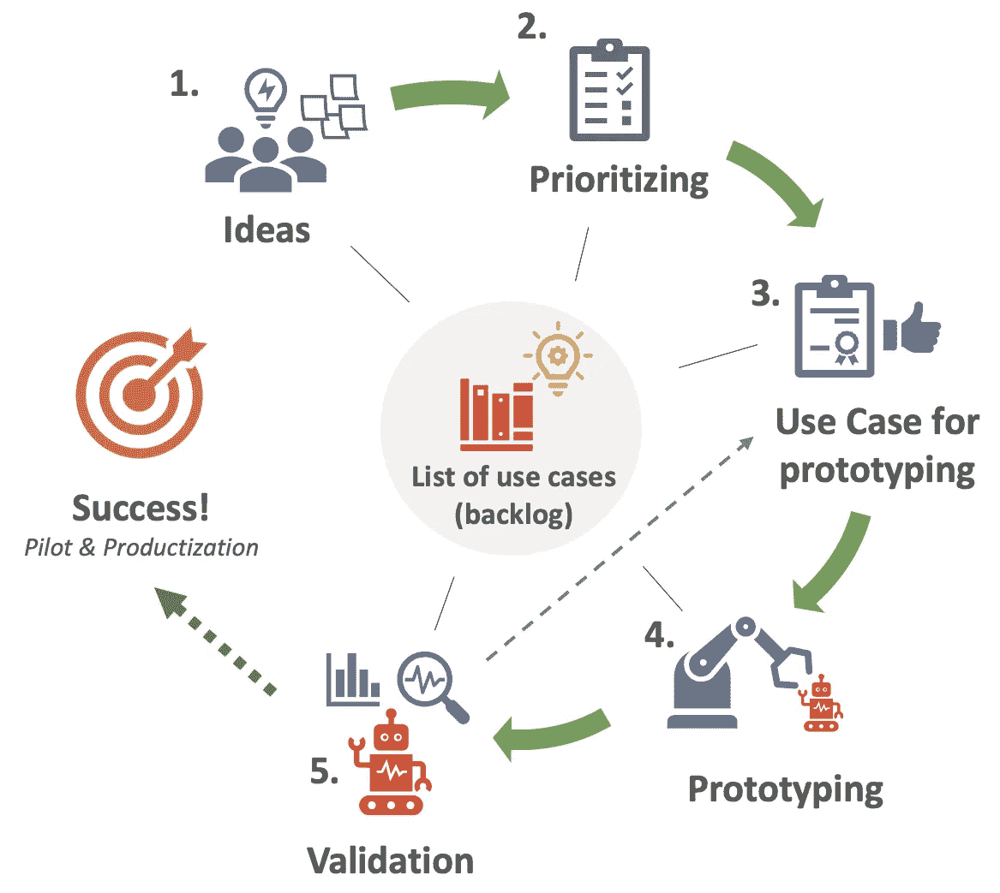

# 如何有效地定义和验证 AI/ML 用例

> 原文：<https://towardsdatascience.com/how-to-effectively-define-and-validate-use-cases-932c284837fe?source=collection_archive---------19----------------------->

## **大多数数据专业人员努力定义转化为数据科学的用例& AI/ML 解决方案带来真正的价值**

来源:[链接](https://www.pexels.com/pl-pl/@rakicevic-nenad-233369?utm_content=attributionCopyText&utm_medium=referral&utm_source=pexels)

**你可能想知道为什么？**

理论上，提出想法、收集反馈和原型以获得演示和验证概念应该很简单。

然而，在现实中，大多数数据科学和机器学习专业人员在该过程的每一步都失败了，结果是交付的解决方案很少达到生产阶段或发布后，并且没有任何价值(没有增加生产力、收入或根本没有娱乐性)。

> 每 10 个数据科学项目中只有一个能够真正投入生产。 *(* [*来源*](https://venturebeat.com/2019/07/19/why-do-87-of-data-science-projects-never-make-it-into-production/) *)*

有人可能会说，数据科学和机器学习项目只是研究性质的，因此很明显，它们中的大多数将会失败。

当然这是真的，但是如何构建用例定义和验证的过程以减少时间和成本并增加成功率呢？建立一个原型通常是一项重大的投资，需要努力和时间，其中一些需要几个月的时间……船上有一大群 ML 工程师。

此外，由于新冠肺炎限制的存在，一些组织在远程协作和生产力方面举步维艰(尽管一些组织被证明比以前更加有效！).

作者图片

毫无疑问，这里没有金科玉律，不同的公司有不同的流程。然而，本文旨在为数据科学和 ML 专业人员提供指导和技术，帮助他们在障碍之间导航，并使他们能够推出满足用户期望并为公司带来好处(收入、效率、敏捷性)的生产解决方案。

无论用例验证的过程是如何构建的，它都将包含以下两个主要阶段:

● **构思** —用例定义和原型制作准备

● **验证** —建造原型并测量结果

# 如何定义一个用例？

> 用例是对如何应用人工智能/人工智能解决特定问题的描述/机会。

一切都始于一个想法，这种想法可能来自不同的来源，有时甚至是不寻常的。也许一位副总裁在 LinkedIn 上看到一篇帖子并受到启发，一位数据科学家可能读过一篇有趣的论文，或者一位 ML 工程师偶然发现了一种新算法并想探索它的潜力。

用例通常来自产品管理、UX 团队或硬件团队，他们刚刚制作了新传感器的原型，或者希望为产品带来令人惊叹的新功能。

上面的每个例子都可能产生有趣的用例，但同时也可能只会导致壮观而昂贵的失败。例如，一个常见的错误是将冷静、复杂的深度学习算法(需要大量不可用的数据)应用于每个问题，即使是那些可以通过启发式或简单的“传统”模型成功解决的问题。

## **好，怎么开始？**

**投资创意&研究！**

最好的开始方式是组织一次跨团队头脑风暴会议，不仅包括您的数据科学/机器学习团队，还包括来自产品管理、用户体验、硬件等团队的其他利益相关者，以及任何其他可能对用例定义和后续验证做出贡献的人。

> *这种不同观点+创造力的融合是成功的关键！*

数据科学是关于创造力和从数据字节中构建有意义的解决方案，让我们的世界变得更美好！

来源:[链接](https://unsplash.com/photos/gcw_WWu_uBQ)

通过发送有趣的用例示例(论文、视频等),可以激发创造力。)在会前发给所涉缔约方。

通过研究竞争对手及其产品、其他行业的使用案例以及适用的研究论文来促进研究。

当前的疫情和远程协作需求也是一个挑战。务必注重适当的引导，并为所有参与者提供充分的机会来分享他们的想法并提供反馈。

列出会议期间出现的所有想法。选择 10 个左右最有趣的用例，让团队使用以下问题列表检查每个用例，以确定用例的优先级，并选择最有希望进行原型制作的用例:

1.  **问题** —如何用数据科学和机器学习解决？
2.  **影响** —用户将如何从建议的解决方案中受益？
3.  **价值/利益** —有形&无形；成本降低、有效性、敏捷性或其他？
4.  **创新** —这个想法有多独特/新颖？涉及多少研究？有类似的吗？任何组件都可以重复使用吗？
5.  **数据** —数据是否可用，或者是否需要为原型制作生成/收集数据？
6.  **验证** —验证有多容易？
7.  **复杂性** —构建一个解决方案有多困难，需要多长时间才能为用户发布解决方案？

此时，没有必要关心答案的绝对准确性，因为它们只是支持用例优先级的粗略估计。上面的列表只是重要问题的一个例子，当然可以根据你的具体需求进行调整/扩展。

然而，保持简短。尽可能应用预定义的答案。这样的答案可以进一步用于应用权重和实现评分算法。

上述练习的最终结果应该是为下一阶段列出的三个用例。

来源:[链接](https://www.pexels.com/pl-pl/@senne-hoekman-167648?utm_content=attributionCopyText&utm_medium=referral&utm_source=pexels)

从有形的商业利益、对用户的影响和上市时间方面选择最有希望的一个(将首先制作原型)来进行简化的可行性研究。

结果应该是一个简短的总结，概述下一阶段(验证)的工作范围，至少包括以下 6 个方面:1)目标，2)商业机会，3)技术，4)验证方法，5)数据，6)团队，7)进度，8)风险。

# 如何验证一个用例？

**答案是快速成型。**

不要在概念验证上花费时间，因为你的主要目标不应该是从技术角度验证构建一个解决方案是否可行。答案永远是肯定的(好吧，几乎总是…)。在大多数合理的情况下，这归结为数据可用性和选择正确算法的问题。

然而，你的验证目标不仅仅是技术可行性，更重要的是构建一个原型来评估产品化解决方案的潜在影响、有用性和好处。此外，评估与开发最终解决方案相关的工作、资源、时间表和风险。

来源:[链接](https://www.pexels.com/pl-pl/@lenin-estrada-117221?utm_content=attributionCopyText&utm_medium=referral&utm_source=pexels)

**我个人对快速原型的一些建议:**

*   明确定义并获得团队对**目标、范围、产出和验证标准**的理解！
*   在**每周冲刺**中组织工作(最多 4-5 个，更长可能导致范围蔓延和失败)。
*   **逐步构建原型**，从基本模型(甚至启发式)开始，然后通过额外的改进来增强，切换到更高级的方法。
*   **小型敏捷跨职能团队**(1-2 名数据科学家，1-2 名 SME，+领导)。将许多 ML 工程师(一种常见的做法)分配给同一个用例是走向失败的路线图。
*   **包括能够验证用例(UX/硬件/产品管理或其他)的中小型企业**。
*   **寻找最简单的方法**，神经网络需要大量你可能没有的数据，并且通常使用经典算法可以获得相同的结果，甚至简单的线性回归或统计模型和试探法的组合。
*   **尝试不同的算法** —不要拘泥于一种，针对同一问题尝试其他算法来评估性能。
*   **投入时间进行研究** —重用可用的架构、模型和软件包。
*   **确保数据质量**并应用必要的数据清理。
*   **确定您的主要利益相关方**并确保持续沟通。

在分布式团队的情况下，特别是考虑到当前的疫情限制，协作可能是困难的，因为快速原型在并置的团队中执行是最有效的。然而，有许多不同的技术和技巧可以应用，从任务管理工具、看板板，到通过视频和即席消息来赶上进度。我不会在这里推广任何特定的工具，因为每个公司都使用他们自己的一套工具，可以有效地应用于预期的目的。

## **验证，最重要的部分！**

来源:[链接](https://www.pexels.com/pl-pl/@rags-fehrenbach-2737525?utm_content=attributionCopyText&utm_medium=referral&utm_source=pexels)

显然，我们的目标不是验证模型(这仍然很重要)，而是确保构建的原型/演示符合我们定义的用例，有可能对用户产生影响，并且能够**产生切实的商业价值**。

在这一阶段，您应该在项目开始之前，根据您与团队和利益相关者定义的定量和定性成功标准来验证原型。

**量化标准**可以是模型必须达到的误差阈值(MSE、召回或任何其他相关的)。它也可以是与模型或原型的性能相关的不同度量的组合。

这部分很容易。

最具挑战性的部分是定性的，在这里你无法衡量一些方面，比如原型可能为用户带来的价值和好处。当然，你可以运行一个焦点小组或者可用性研究，但是，这样的技术需要时间和大量的成本投入。因此，让他们进入下一阶段，暂时依靠您的中小企业——UX 和产品管理的专业知识。也让你公司的其他团队参与进来，分享原型并收集反馈。

> **然而，请记住——归根结底，这一切都是为了钱……**

如果你想让你的商业利益相关者相信你的演示是有价值的，并且可能带来财务利润，你应该进行**成本效益分析**。首先列出所有直接的、间接的以及无形的成本和收益，包括那些与绩效提高和客户满意度相关的成本和收益。对所有头寸进行货币计量、汇总和比较。如果你很难展示收益，那就和你的团队一起确定并量化它们。

我应该什么时候开始验证？

答案是——一旦你开始快速成型。这应该是一个持续的过程，目的是验证用例的有用性。

在快速原型制作过程中，将结果传达给利益相关者，以获得他们的认同和对后续步骤的同意。这可以是一个简短的周会和/或每日更新的形式。

**不管验证的结果如何，总结发现。**

摘要可以是文档或演示文稿，不仅应该包括结果，还应该包括与产品化相关的方面，例如在进入下一阶段和开发解决方案时需要考虑的已确定的问题和风险。

当项目由于在特定时间缺乏能力或其他公司优先事项而被搁置时，摘要文档也是有用的。这样的总结可以作为一个很好的起点，甚至对于其他考虑开发的类似用例也是如此。

如果验证后的特定用例没有计划进一步的开发，回顾你的积压工作，挑选下一个并再次启动原型。

来源:[链接](https://www.pexels.com/pl-pl/@rakicevic-nenad-233369?utm_content=attributionCopyText&utm_medium=referral&utm_source=pexels)

最终，你将永远不会达到你所有的用例都通过验证并被安排产品化的地步。

坦率地说，你不应该指望他们。为什么？

因为原型设计和验证是研究的一部分，旨在确保只有最有希望的用例被转化为解决方案，并避免失败。

希望这篇文章能为你提供一些经过验证的技巧和指导，告诉你如何构建你的用例定义、原型和验证过程，从而最大化你的成功率。但一如既往，如何在自己的公司内组织和应用这些建议的指导方针，并将其嵌入到已经到位的流程和工具中，这取决于您。

祝你成功！🙂

感谢阅读。请随时联系 LinkedIn 或发表评论。

如果你管理或想要建立一个数据科学或 AI/ML 团队，你可能会发现我的另一篇文章很有趣:

 [## 我如何建立一个数据科学实验室并休假

### 了解如何有效地开发数据科学单元并避免常见陷阱

towardsdatascience.com](/how-to-build-data-science-unit-f84ee3de63f5)