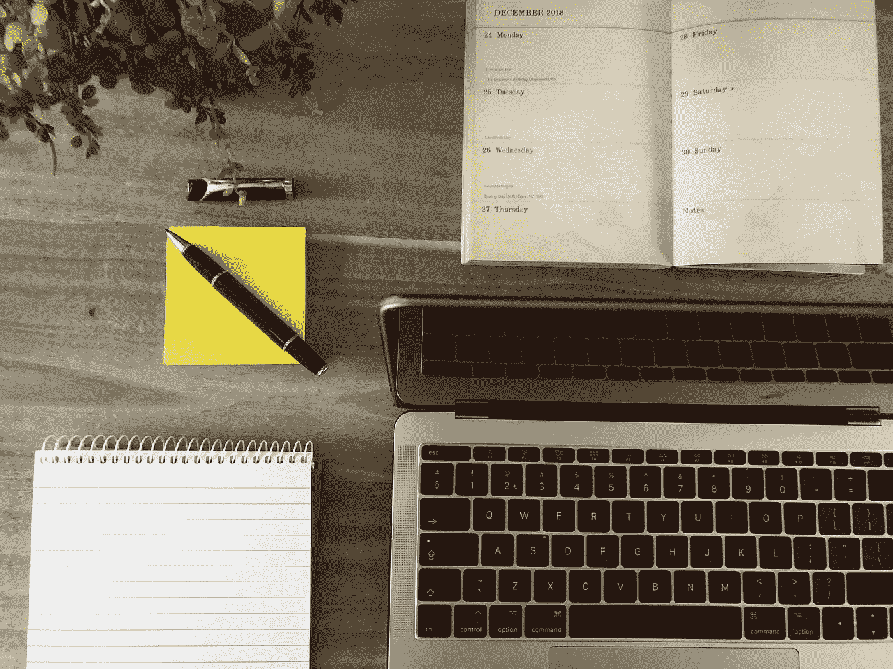

# 如何有效地学习和掌握 Python，用于数据科学、人工智能或机器学习。

> 原文：<https://towardsdatascience.com/how-to-effectively-learn-and-master-python-for-data-science-artificial-intelligence-or-machine-8d88a4fb03a3?source=collection_archive---------22----------------------->

## 学习如何重新编码或学习一门新的编程语言可能会非常困难。大多数情况下，我们发现这是因为我们学习的方法不对。

丹尼斯·简斯在 [Unsplash](https://unsplash.com/s/photos/laptop?utm_source=unsplash&utm_medium=referral&utm_content=creditCopyText) 拍摄的照片

如果你正在读这篇文章，那可能是因为你已经迈出了大胆的一步，在数据科学、人工智能或 ML 的众多选择中学习 python。我不会用冗长的演讲来烦你，比如 python 是什么，为什么对于任何想涉足数据科学、人工智能或机器学习领域的人来说，python 是一种很好的语言选择。相反，我将与您分享一些技巧，告诉您如何有效地学习 python 编程语言，踏上精通这门语言的旅程。

> Python 是一门真正奇妙的语言。当有人想出一个好主意时，只需要 1 分钟和 5 行代码就可以完成你想要的事情。然后只需要一个小时就可以将脚本扩展到 300 行，之后它仍然几乎做你想做的事情。—杰克·詹森

# 保持一致

无论你用什么方法或途径学习 python，都要坚持下去。学习，总的来说，没有一个公式。这就是说，许多人可以通过许多不同的方式学习一些东西，并且仍然可以实现他们的目标。然而，找到适合自己的方法取决于每个人。建立一个学习计划。这个计划不能一概而论。你的学习计划应该考虑到你的工作、学校和健康计划。不要对自己太严格。当这一切都完成后，一定要坚持你的学习计划。养成学习的习惯，热爱你所学的东西。通过这样做，你会对你所学的东西产生渴望，并且每天都期待着学习。

# 写下你学到的东西

写笔记是学习 python 和任何其他编程语言的一个极好的方法。当我们从书本、讲座或辅导视频中学习时，我们不能把所有的东西都记在脑子里。我们必须对重要的观点和话题做笔记，这样我们就可以试着在我们所写的观点上更进一步。通过写笔记，我们可以通过阅读我们写在笔记上的几行来尝试重现我们所学的内容。这对记忆概念和原则以及训练我们的大脑记住我们所学的重要东西非常有帮助。你也可以养成写博客的习惯，在博客上你可以和世界上的其他人分享你的进步，以帮助激励代码新手。写作很有趣，从一个尝试写作并且不想停下来的程序员身上可以看出这一点😄，你可以学习专业写作或只是作为一种爱好，仅仅写你喜欢做的事情就能赚很多钱。

# 享受乐趣，尝试尝试

让你所学的东西变得有趣和愉快。Python 是一门非常有趣的语言，因此，在学习这门语言的时候，尽你所能享受其中的乐趣。你可以通过写一些关于你所学主题的小脚本来做到这一点。你可以建立迷你项目，这样你就可以实际了解你学到了什么。对代码做大量的实验，找到新的做事方法，如果你找到了使事情变得更简单或修复 bug 的方法，就贡献给你使用的公共库和包。你可以和志同道合的人一起编写你的包或库。

> Python 是可执行的伪代码。—布鲁斯·埃凯尔

# 休息，不要把自己累坏了

编码会变得非常上瘾，个人需要知道什么时候休息。你必须知道什么时候休息，这样你才不会筋疲力尽。倦怠并不是与长时间或过度编码相关的唯一问题，还有严重的健康风险。因此，你需要经常休息。放松，呼吸新鲜空气，偶尔散散步，照顾好自己——看起来整洁健康。不要剥夺自己的休息时间，以至于你看起来像电影中典型的程序员的刻板形象，看起来不修边幅，病怏怏的，脸色苍白。作为程序员要学会把自己，自己的身心健康放在一切之上。

# 给自己找个搭档

有一个一起学习如何编码的伙伴是非常有趣的，你们可以从对方身上学到很多东西。个人编写代码的方式是独一无二的，通过成对编程，你可以学习编写代码或做其他你不知道的事情的方法。你们可以分享新的资源，举行模拟面试来锻炼自己，甚至一起向专业人士寻求指导。有一个伙伴有助于填补孤独的空虚感，这种空虚感在那些一天花很多时间独自写代码，没有人可以聊天或放松或做其他事情的人身上很常见。

[斯科特·格雷厄姆](https://unsplash.com/@sctgrhm?utm_source=unsplash&utm_medium=referral&utm_content=creditCopyText)在 [Unsplash](https://unsplash.com/s/photos/team-work?utm_source=unsplash&utm_medium=referral&utm_content=creditCopyText) 上拍照

> **编写 Python 代码的乐趣应该在于看到短小、简洁、易读的类，这些类用少量清晰的代码表达了大量的动作，而不是大量让读者厌烦得要死的琐碎代码。**
> 
> *—吉多·范·罗苏姆*

我相信我在这篇文章中分享的一切对寻求进入该领域的初学者和学习进展不顺的中级程序员都有帮助。这些技巧是我从业内专业人士那里学到的，比如德里克·德贝杜伊

我已经策划了几本[书](https://drive.google.com/drive/folders/1ZR1wYaCelt0hAUQMwhTVjJMtRBRVl03a?usp=sharing)来帮助你学习和欣赏 python 编程语言，理解一般编程的核心原理，学习数据科学、人工智能和 ML，享受😀

感谢您抽出时间阅读这个故事。我希望你学到了一些东西，这对你有所帮助。欢迎您在回复部分分享您的想法和观点，您可以直接在 [Twitter](https://twitter.com/buabaj_) 或 [LinkedIn](https://www.linkedin.com/in/jerry-buaba-768351172/) 上联系我。黑客快乐！

*非常感谢* [*安娜·阿依库*](mailto:ayikuanna44@gmail.com) *为我校对并纠正我写这篇文章时犯的许多错误。*