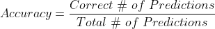
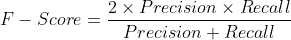
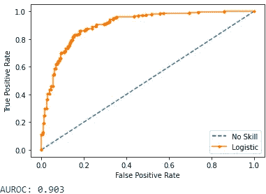
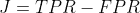
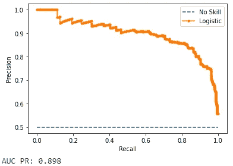
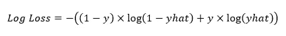
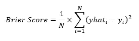
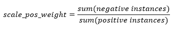

# 如何有效预测 Python 中的不平衡类

> 原文：<https://towardsdatascience.com/how-to-effectively-predict-imbalanced-classes-in-python-e8cd3b5720c4?source=collection_archive---------5----------------------->

## 处理不平衡机器学习分类问题所需的所有细节


图片由 [Eneida Nieves](https://www.pexels.com/@fariphotography) 在 [Unsplash](https://www.pexels.com/photo/sweet-potatoes-on-top-of-black-metal-beam-balance-1084584/) 拍摄

奇怪的是，我花在分类问题上的时间比花在回归问题上的时间要多得多。幸运的是，我经常处理不平衡的数据集。也许这是因为我的日常工作包括预测和分析信用风险、违约概率和其他欺诈风险！

在通常的情况下，一个人经常遇到付款违约、付款延迟和欺诈事件是不常见的。这就是说，与按时付款或正常的非欺诈活动相比，这类事件的比例通常很低。

这是不平衡数据集的一个非常简单的说明，其中一组(或一类)活动(如违约付款)在样本中的活动(如违约和正常付款)总数中所占的比例非常低。

现在，让我们看看为什么我们在面对不平衡的分类问题时需要小心，以及如何处理这些问题。该员额的其余部分结构如下:

1.  介绍
2.  模型评估指标
3.  成本敏感学习
4.  取样方法

# 介绍

当处理不平衡分类问题时，我们通常更关心正确预测少数类别(也称为肯定类别)，例如欺诈事件、支付违约、垃圾邮件等。换句话说，与误报(例如，将正常电子邮件分类为垃圾邮件)相比，减少误报(例如，将欺诈性交易分类为非欺诈性交易)的数量对我们来说更加重要。

直觉上，给定较小的样本大小和偏斜的类分布，ML 模型正确地学习少数类的所有特征要困难得多。一个简单的模型可以通过简单地预测所有情况下的多数类来获得合理的准确性。

# 模型评估指标

评估指标只是评估特定模型在做出正确预测方面的效率和准确性。对于分类问题，评估度量将模型预测的类别标签(或其概率)与实际的类别标签进行比较，并给出预测的准确性。有几个标准评估指标在平衡的分类问题(例如，准确性)上工作得非常好，但是在倾斜的数据集上却失败得很惨。

因此，我们应该利用某些更适合不平衡分类问题的特定度量。

在继续之前，让我们回顾一下由 Cesar Ferri 等人分类的各种类型的评估指标:

1.  阈值度量，基于对误差的阈值或定性理解:[准确度](https://en.wikipedia.org/wiki/Accuracy_and_precision#In_binary_classification)、[灵敏度/召回率](https://en.wikipedia.org/wiki/Sensitivity_and_specificity#Sensitivity)、[特异性](https://en.wikipedia.org/wiki/Sensitivity_and_specificity#Specificity)、[精确度](https://en.wikipedia.org/wiki/Positive_and_negative_predictive_values#Definition)、 [F 值](https://en.wikipedia.org/wiki/F1_score)、灵敏度和特异性的几何平均值 [Kappa 统计量](https://en.wikipedia.org/wiki/Cohen%27s_kappa)。
2.  分级标准基于模型对类别(可分离性的概念)的分级程度:在[接收器操作特性](https://en.wikipedia.org/wiki/Receiver_operating_characteristic)曲线下的面积( [AUROC](https://en.wikipedia.org/wiki/Receiver_operating_characteristic#Area_under_the_curve) )和在精度-召回曲线下的[面积(PR AUC)。](https://scikit-learn.org/stable/auto_examples/model_selection/plot_precision_recall.html)
3.  概率度量测量与真实类别概率的偏差: [LogLoss](https://en.wikipedia.org/wiki/Cross_entropy#Cross-entropy_loss_function_and_logistic_regression) 和 [Brier Score](https://en.wikipedia.org/wiki/Brier_score) 。请注意，在使用这些指标之前，需要校准预测的概率。

## 准确性悖论

尽管它是分类问题中使用最广泛、最容易解释的度量标准，但请不要犯在不平衡数据集的情况下使用准确性度量标准来评估您的分类模型的新手错误。

精度计算如下:



或者，就[混淆矩阵](https://en.wikipedia.org/wiki/Confusion_matrix)而言:


考虑一个具有 1:100 类不平衡的高度偏斜数据集-对于少数类(正)的每个实例，有 100 个多数类(负)的样本。一个简单的分类器(或者，甚至一个人)可以通过对每个测试样本默认预测多数类来实现 99%的预测准确性，而不需要任何实际的机器学习。然而，这并没有描绘真实的画面，因为可能正确预测少数类在上下文中更重要，例如在欺诈检测或垃圾邮件过滤算法中。

## 不平衡分类问题的评价指标

好的，那么我们应该用什么度量来评估我们的分类器呢？现在让我们来看一些适合不平衡分类的度量标准。

**精度**

精度是真阳性与分类器预测的总阳性的比率。请记住，在不平衡分类问题的背景下，阳性是指少数类。根据混淆矩阵计算如下:


精度值介于 0 和 1 之间。由于 Precision 本身不涉及假阴性，并且旨在最小化假阳性的数量，因此 Precision 并不真正代表我们也涉及最小化假阴性的全部情况(例如，预测交易为非欺诈性的，而实际上它是欺诈性的)。

Scikit-learn 的`[precision_score](https://scikit-learn.org/stable/modules/generated/sklearn.metrics.precision_score.html)`函数计算二元和多类分类问题的精度:

```
from sklearn.metrics import precision_score# calculate precision for binary classification problem
precision = precision_score(y_true, y_pred, average='binary')# calculate precision for multi-class classification problem
precision = precision_score(y_true, y_pred, labels=[1,2], average='micro')
# labels is a list of all possible class labels
```

**召回**

召回率也称为敏感度和真阳性率(TPR)，是样本中真阳性与真实阳性的比率。与 Precision 不同，Recall 还考虑了未被归类为阳性(少数)病例的数量。根据混淆矩阵计算如下:


召回值范围在 0 和 1 之间。召回与误报的数量无关，而是旨在最小化误报的数量。

Scikit-learn 的`[recall_score](https://scikit-learn.org/stable/modules/generated/sklearn.metrics.recall_score.html)`函数以与`precision_score`完全相同的方式计算二元和多类分类问题的召回率。

**F 分数**

当我们更关心最小化假阳性时，精确度是合适的，而当假阴性的数量更关键时，召回是合适的。

但是，如果我们想同时最大化精确度和召回率，以最小的假阳性和假阴性准确地预测阳性类别呢？例如，在欺诈检测算法中，我们希望准确预测所有欺诈案例，同时不将非欺诈案例预测为欺诈案例。同时最大化精确度和召回率是一个很好的平衡行为，这就是 F 值的作用。

F-Score 提供了一个衡量精确度和召回率的单一分数。因此，最大化 F-Score 将意味着我们将最大化精确度和召回率。F-Score 是精度和召回率的简单调和平均值，并且广泛用于不平衡分类问题。



同样，F 值介于 0 和 1 之间。就像 Precision 和 Recall 一样，scikit-learn 的`[f1_score](https://scikit-learn.org/stable/modules/generated/sklearn.metrics.f1_score.html)`函数以完全相同的方式和语法计算二进制和多类问题的 F 分数。

**受试者工作特性曲线下面积(AUROC)**

ROC 曲线在 x 轴上绘制二元分类器的假阳性率(FPR ),在 y 轴上绘制真阳性率(TPR，召回),所有可能的概率阈值在 0 和 1 之间。TPR 计算如下:


任何分类器的默认概率阈值通常为 0.5，也就是说，如果样本的预测概率大于 0.5，则将该样本分类为属于阳性类别。然而，这个默认的假设不应该用于不平衡的数据集，稍后会有更多的介绍。

完美的分类器应该能够将 TPR 最大化为 1，将 FPR 最小化为 0，因此完美的分类器将在 ROC 曲线的左上象限(坐标 0，1)中一样高。ROC 并不特别偏向多数或少数类，因此，它是平衡和不平衡分类问题的普遍选择。

比较两个分类器的一种简便方法是计算 ROC 曲线下的面积 AUROC，它给出了一个分类器在所有概率阈值上的单一得分。AUROC 的范围在 0 到 1 之间，1 是一个非常熟练的分类器的分数。

使用 scikit-learn 的`[roc_curve](https://scikit-learn.org/stable/modules/generated/sklearn.metrics.roc_curve.html)`和`[roc_auc_score](https://scikit-learn.org/stable/modules/generated/sklearn.metrics.roc_auc_score.html)`函数绘制 ROC 曲线和计算 AUROC 的完整示例如下:

输出将类似于这样:



**针对不平衡分类的 ROC 阈值移动**

如上所述，在不平衡分类问题的情况下，使用默认概率阈值 0.5 来预测类别标签将可能导致较差的模型性能。幸运的是，在 ROC 曲线的情况下，确定最佳概率阈值非常简单。直观上，这个最佳阈值最接近 ROC 曲线的左上角，并且可以使用 [Youden 的 J 统计](https://en.wikipedia.org/wiki/Youden%27s_J_statistic)很容易地确定。

为由`roc_curve`返回的每个阈值计算 J 统计，最大的 J 值是最佳阈值。最简单的 J 统计量计算公式为:



一旦我们调用了`roc_curve`函数，使用 J 统计量确定最佳阈值就非常简单了:

```
#import the required library
from numpy import argmax# calculate inputs for the roc curve
fpr, tpr, thresholds = roc_curve(test_y, yhat_positive)# get the best threshold
J = tpr - fpr
ix = argmax(J)
best_thresh = thresholds[ix]
print('Best Threshold: %f' % (best_thresh))
```

所有预测概率(`yhat`)大于该阈值的样本应被分配到阳性类别。

**精确召回曲线下面积(PR AUC)**

对于所有可能的概率阈值，PR 曲线在 x 轴上绘制召回，在 y 轴上绘制精度。与 ROC 曲线相反，一个非常熟练的模型向坐标为(1，1)的右上轴弯曲。由于精度和召回率都与真阳性(少数类)有关，这使得它成为不平衡分类问题的有效工具。

比较两个分类器的一种简便方法是计算 PR 曲线下的面积 PR AUC，它给出了一个分类器在所有概率阈值上的单一得分。PR AUC 的范围在 0 和 1 之间，1 是一个完全熟练的分类器的分数。

使用 scikit-learn 的`[precision_recall_curve](https://scikit-learn.org/stable/modules/generated/sklearn.metrics.precision_recall_curve.html)`和`[auc](https://scikit-learn.org/stable/modules/generated/sklearn.metrics.auc.html)`函数绘制 PR 曲线和计算 PR AUC 的完整示例如下:

输出将类似于这样:



**不平衡分类的 PR 曲线阈值移动**

类似于 ROC 曲线，在 PR 曲线的情况下，确定最佳概率阈值是足够简单的。直观地说，这个最佳阈值最接近 PR 曲线的右上角，可以使用 F 值轻松确定。

一旦我们调用了`precision_recall_curve`函数，使用 F 值的最佳阈值确定如下:

```
#import the required library
from numpy import argmax# calculate inputs for the roc curve
precision, recall, thresholds = precision_recall_curve(test_y, yhat_positive)# Calculate F-Scores and find the index of ideal score
fscore = (2 * precision * recall) / (precision + recall)
ix = argmax(fscore)
best_thresh = thresholds[ix]
print('Best Threshold: %f' % (best_thresh))
```

预测概率(`yhat`)大于该阈值的所有样本应被分配到阳性类别。

**日志损失分数**

Log Loss Score 是一种基于概率的评估指标，与预测的分类标签无关。相反，它用于评估预测的**校准的**概率。一些模型预测校准概率作为训练过程的一部分(例如，逻辑回归)，
但是许多模型不预测，并且在使用 LogLoss 或 Brier 分数之前需要校准(例如，支持向量机、决策树和神经网络)。使用 scikit-learn 的`[CalibratedClassifierCV](https://scikit-learn.org/stable/modules/generated/sklearn.calibration.CalibratedClassifierCV.html)`类可以很容易地校准概率。

可能的最佳对数损失分数为 0，范围从 0 到无穷大，分数越高越差。它被定义为基于地面真实类别标签(`y`)预测概率(`yhat`)的分类器的负对数似然性:



Scikit-learn 的`[log_loss](https://scikit-learn.org/stable/modules/generated/sklearn.metrics.log_loss.html)`函数使我们在获得如下预测类概率后计算对数损失分数变得容易:

```
from sklearn.metrics import log_loss# fit a model
model = LogisticRegression()
model.fit(train_X, train_y)# predict probabilities
yhat = model.predict_proba(test_X)# calculate and print Log Loss Score
logloss = log_loss(test_y, yhat)
print('Log Loss Score: %.3f' % (logloss))
```

**欧石南得分**

以 Glenn Brier 命名的 [Brier Score](https://neptune.ai/blog/brier-score-and-model-calibration) 计算预测概率和它们各自的正类值之间的均方误差。Brier Score 通常仅适用于二元分类问题，并评估**阳性**类别的概率。Brier 和 Log Loss 得分之间的关键区别在于 Brier 得分中只考虑了阳性类别的预测概率。

与对数损失分数相反，Brier 分数的范围在 0 到 1 之间，0 是一个非常熟练的分类器的分数。其计算如下，其中`yhat`是正类的预测概率，而`y`是正类的基本事实标签:



Scikit-learn 的`[brier_score_loss](https://scikit-learn.org/stable/modules/generated/sklearn.metrics.brier_score_loss.html)`函数使得一旦我们有了如下预测的正类概率，就可以很容易地计算 Brier 分数:

```
from sklearn.metrics import brier_score_loss# fit a model
model = LogisticRegression()
model.fit(train_X, train_y)# predict probabilities
yhat = model.predict_proba(test_X)
# retrieve the probabilities for the positive class
yhat_positive = yhat[:, 1]# calculate and print Brier Score
brier = brier_score_loss(test_y, yhat_positive)
print('Brier Score: %.3f' % (brier))
```

## 不平衡数据集的交叉验证

[k 倍](https://scikit-learn.org/stable/modules/generated/sklearn.model_selection.KFold.html) [交叉验证](https://scikit-learn.org/stable/modules/generated/sklearn.model_selection.cross_val_score.html)技术在评估平衡甚至轻微偏斜数据集的分类器时非常高效和有效。然而，它在不平衡数据集的情况下失败，因为训练数据通常被分成假设均匀概率分布的折叠。在不平衡数据的情况下，这有可能导致某些折叠完全遗漏在阳性(少数)类别中，或者只有很少的样本。因此，这很可能导致误导性的模型评估。

一种改进的 k-fold 交叉验证，称为分层 k-fold 交叉验证，更适合不平衡分类问题。[分层 k-fold](https://scikit-learn.org/stable/modules/generated/sklearn.model_selection.StratifiedKFold.html) 或[重复分层 k-fold](https://scikit-learn.org/stable/modules/generated/sklearn.model_selection.RepeatedStratifiedKFold.html) 保留了每个 fold 中不平衡的类分布。这些 k 倍技术中的任何一种都可以与`[cross_val_score](https://scikit-learn.org/stable/modules/generated/sklearn.model_selection.cross_val_score.html)`结合使用来预测和评估每个折叠。前面解释的所有评估指标都可以用作`cross_val_score`中的`scoring`参数。在此参考完整列表[。成本敏感学习一节稍后将提供实际演示。](https://scikit-learn.org/stable/modules/model_evaluation.html#scoring-parameter)

# 成本敏感学习

在不平衡分类问题的情况下，分类器的误分类错误的感知成本通常是不同的。也就是说，缺失一个正(少数)类的代价通常比负(多数)类的错误分类更关键。换句话说，假阴性比假阳性更关键。

例如，拒绝给一个好客户贷款，并不像给一个可能永远不会还款的坏客户贷款那样糟糕。或者，诊断一个健康的癌症患者并进行更多的医学测试比让一个实际患有癌症的患者出院更好。

成本敏感性学习是 ML 的一个子领域，它考虑了各种错误的成本(包括误分类成本)，同时在模型训练期间最小化模型误差。

用于不平衡分类的成本敏感学习集中于首先将不同的成本分配给可能产生的错误分类错误的类型，然后使用专门的方法将这些成本考虑在内。

但是如何将这些成本分配给错误分类，具体来说，是误报和漏报？真阳性和真阴性通常被赋予零成本。由于假阴性通常更重要，假阴性比假阳性的成本更高。在某些情况下，领域知识可以帮助我们。在保险索赔场景中，误报的成本可能是客户跟踪的潜在货币成本，而误报的成本可能是潜在的保险索赔成本。

然而，在所有情况下，分配错误分类成本可能并不简单。在这种情况下，一个有效的起点是将类别分布比率的倒数分配给假阳性和假阴性。例如，如果我们有一个 1:100 类平衡的数据集，假阴性的成本为 100，而假阳性的成本为 1。这是假设在现实生活中进行预测时，相同的类别分布也将成立。

现在，让我们通过某些 ML 模型，看看这种成本敏感的学习可以被纳入其中。

## 成本敏感的逻辑回归

Scikit-learns 的标准逻辑回归模型可通过`class_weight`参数轻松修改，以考虑阶级不平衡。该参数对于来自多数类的示例中出现的错误对模型的惩罚较小，而对于来自少数类的示例中出现的错误对模型的惩罚较大。

`class_weight`参数包含所有可能的分类标签及其相关权重/成本的字典，以便在模型拟合过程中加以考虑。同样，这些类权重可以由领域专家通过网格搜索、行业最佳实践或使用前面解释的类分布的逆来确定。

上面最后一个使用逆类分布作为权重的选项是通过将`balanced`作为输入传递给`class_weight`参数来指定的，而不是手动计算分布。

使用类别加权逻辑回归模型和使用重复分层 k 倍进行评估的完整示例如下:

## 成本敏感决策树

通过在确定每个节点的分裂点时考虑每个类别的重要性，在决策树中考虑类别不平衡。

就像逻辑回归一样，scikit-learn 的`DecisionTreeClassifier`类有一个`class_weight`参数，其功能与逻辑回归中的完全一样。

使用类别加权决策树并使用重复分层 k-fold 对其进行评估的完整示例如下:

## 对成本敏感的 XGBoost

XGBoost 是多个决策树的[集合](https://en.wikipedia.org/wiki/Ensemble_learning)，是[随机梯度推进](https://en.wikipedia.org/wiki/Gradient_boosting#Stochastic_gradient_boosting)的高效实现。它被广泛用于分类和回归问题，并被发现在几个具有挑战性的机器学习问题中非常有效。

`[XGBoostClassifier](https://xgboost.readthedocs.io/en/latest/python/python_api.html#xgboost.XGBClassifier)`的`scale_pos_weight`参数用于训练不平衡数据的类加权 XGBoost 分类器。XGBoost 的[文档](https://xgboost.readthedocs.io/en/latest/parameter.html)提供了一种估算`scale_pos_weight`理想值的便捷方法，如下所示:



使用类加权 XGBoostClassifier 并使用重复分层 k-fold 对其进行评估的完整示例如下:

# 取样方法

一般来说，我不太喜欢使用各种过采样和欠采样方法来处理训练数据集中的类不平衡。我倾向于在尝试以下任何一种采样方法来纠正类别不平衡之前，对成本敏感的 ML 算法使用适当的评估指标。

首先，让我们确定三种主要类型的抽样方法来补救类别不平衡:

1.  过采样包括复制或合成来自少数类的新样本
2.  欠采样包括从多数类中删除或只选择一个样本
3.  综合方法结合了过采样和欠采样

我通常不喜欢抽样方法而不喜欢成本敏感学习的原因:

1.  然而，过采样情况下的潜在过拟合，后面解释的一些高级技术试图解决这个问题
2.  采样不足导致有用数据丢失
3.  过采样后学习和处理时间增加

如果你决定采用抽样方法，那么在实施时要非常小心。应该**仅对训练数据集执行**采样。它不会在整个数据集、维持集或验证数据集上执行。原因在于，其目的不是从数据中消除类别偏差，而是继续评估生产中真实和预期的数据的结果模型，以及实际现实问题的代表。

## 过采样方法

现在，让我们简要了解一些主要的过采样方法。请注意，我不会讨论随机过采样技术(`[RandomOverSampler](https://imbalanced-learn.readthedocs.io/en/stable/generated/imblearn.over_sampling.RandomOverSampler.html#imblearn-over-sampling-randomoversampler)`)，因为我认为它更容易过拟合。

**合成少数过采样技术(SMOTE)**

SMOTE 合成来自阳性(少数)类的新数据样本，没有随机复制，并由 Nitesh Chawla 等人在其 2002 年的论文中介绍。来自该论文:“通过获取每个少数类样本并沿着连接任意/所有 k 个少数类最近邻居的线段引入合成样本，对少数类进行过采样。”。

Python 的[不平衡学习](https://imbalanced-learn.readthedocs.io/en/stable/)库包含了 SMOTE 的一个实现，这个实现的类名副其实:`[SMOTE](https://imbalanced-learn.readthedocs.io/en/stable/generated/imblearn.over_sampling.SMOTE.html?#imblearn-over-sampling-smote)`(以及这里描述的许多其他采样方法)。与 scikit-learn 中的任何其他数据转换对象一样，实现了`SMOTE`类:它必须被定义和配置，适合数据集，然后被应用来创建数据集的新转换版本。

**边界线-SMOTE**

韩晖等人在 2005 年提出的边界 SMOTE 是对 SMOTE 的扩展，它使用 k 近邻算法识别并合成少数类的边界实例。`imblearn`库的类实现了类似于 SMOTE 的边界 SMOTE。

**濒临崩溃的 SVM**

边界线-SMOTE SVM 与边界线-SMOTE 相同，但用于识别边界线情况的技术不同，其中使用 SVM 算法而不是 KNN 算法来识别错误分类的边界线情况。这是由 Hien Nguyen 等人在 2011 年的 paper⁴.中提出的`imblearn`库的类实现了类似于 SMOTE 的边界 SMOTE SVM。

**自适应合成采样(ADASYN)**

ADASYN 是由 al.⁵的何海波等人在他们 2008 年的论文中提出的。来自该论文:“ADASYN 基于根据分布自适应地生成少数数据样本的思想:与那些更容易学习的少数样本相比，为更难学习的少数类样本生成更多的合成数据。”。`imblearn`库的`[ADASYN](https://imbalanced-learn.readthedocs.io/en/stable/generated/imblearn.over_sampling.ADASYN.html#imblearn-over-sampling-adasyn)`类实现了类似于 SMOTE 的 ADASYN。

**实际演示**

下面是使用`RepeatedStratifiedKFold`的`Pipeline`中的`DecisionTreeClassifier`使用上述四种过采样技术的完整实践演示(注意，这些类别的某些参数可以调整):

## 欠采样方法

现在，让我们简要了解一些主要的欠采样方法。注意，我不会讨论随机欠采样(`[RandomUnderSampler](https://imbalanced-learn.readthedocs.io/en/stable/generated/imblearn.under_sampling.RandomUnderSampler.html#imblearn-under-sampling-randomundersampler)`)技术，因为我认为它更有可能导致有用数据的丢失。

**欠采样未遂**

接近失败指的是三种欠采样方法的集合，这些方法基于多数类实例和少数类实例之间的距离来选择样本。这些方法是由张建平和因德吉特·马尼在他们 2003 年的 paper⁶.中提出的这三种方法是:

*   NearMiss-1 仅对那些与预定数量的最近少数类实例具有最小平均距离的多数类实例进行欠采样
*   NearMiss-2 仅对那些与预定数量的最远少数类实例具有最小平均距离的多数类实例进行欠采样
*   NearMiss-3 仅对那些与每个少数类实例具有最小距离的多数类实例进行欠采样

`imblearn`库的`[NearMiss](https://imbalanced-learn.readthedocs.io/en/stable/generated/imblearn.under_sampling.NearMiss.html#imblearn-under-sampling-nearmiss)`类实现了与 SMOTE 相似的 NearMiss 的所有三个版本。

**其他欠采样方法**

下面的`imblearn`库中包含了其他几种欠采样方法，它们以类似的方式实现:

*   浓缩近邻 Rule⁷ — `[CondensedNearestNeighbour](https://imbalanced-learn.readthedocs.io/en/stable/generated/imblearn.under_sampling.CondensedNearestNeighbour.html#imblearn-under-sampling-condensednearestneighbour)`
*   CNN⁸的两次修改— `[TomekLinks](https://imbalanced-learn.readthedocs.io/en/stable/generated/imblearn.under_sampling.TomekLinks.html#imblearn-under-sampling-tomeklinks)`
*   一面倒的 Selection⁹ — `[OneSidedSelection](https://imbalanced-learn.readthedocs.io/en/stable/generated/imblearn.under_sampling.OneSidedSelection.html#imblearn-under-sampling-onesidedselection)`
*   已编辑最近邻⁰ — `[EditedNearestNeighbors](https://imbalanced-learn.readthedocs.io/en/stable/generated/imblearn.under_sampling.EditedNearestNeighbours.html#imblearn-under-sampling-editednearestneighbours)`
*   邻域清理规则— `[NeighborhoodCleaningRule](https://imbalanced-learn.readthedocs.io/en/stable/generated/imblearn.under_sampling.NeighbourhoodCleaningRule.html#imblearn-under-sampling-neighbourhoodcleaningrule)`

## 合成方法

有时将过采样和欠采样方法结合起来会更有效。就像上面用一个`Pipeline`演示 SMOTE 一样，类似的流水线也可以用来创建一个多采样方法序列，最后用一个分类器。然后，该管道与`RepeatedStratifiedKFold`和`cross_val_score`一起用于评估预测。

在流水线中结合 SMOTE 和随机过采样的简单示例如下:

```
# import required libraries
from imblearn.pipeline import Pipeline
from imblearn.over_sampling import SMOTE
from imblearn.under_sampling import RandomUnderSampler
from sklearn.model_selection import cross_val_score
from sklearn.model_selection import RepeatedStratifiedKFold
from sklearn.tree import DecisionTreeClassifier# define model
model = DecisionTreeClassifier()# define pipeline
oversample = SMOTE(sampling_strategy=0.1)
undersample = RandomUnderSampler(sampling_strategy=0.5)
steps = [('o', oversample), ('u', undersample), ('m', model)]
pipeline = Pipeline(steps=steps)# define cross-validation procedure
cv = RepeatedStratifiedKFold(n_splits=10, n_repeats=3, random_state=1)# evaluate model
scores = cross_val_score(pipeline, X, y, scoring='roc_auc', cv=cv, n_jobs=-1)
```

然而，代替这些手动组合，`imblearn`有如下几个标准的合成实现:

*   SMOTE 和 Tomek 链接— `[SMOTETomek](https://imbalanced-learn.readthedocs.io/en/stable/generated/imblearn.combine.SMOTETomek.html#imblearn-combine-smotetomek)`

```
# import required libraries
from imblearn.pipeline import Pipeline
from imblearn.combine import SMOTETomek
from imblearn.under_sampling import TomekLinks
from sklearn.model_selection import cross_val_score
from sklearn.model_selection import RepeatedStratifiedKFold
from sklearn.tree import DecisionTreeClassifier# define model
model = DecisionTreeClassifier()# define sampling strategy
resample = SMOTETomek(tomek=TomekLinks(sampling_strategy='majority'))# define pipeline
pipeline = Pipeline(steps=[('r', resample), ('m', model)])# define cross-validation procedure
cv = RepeatedStratifiedKFold(n_splits=10, n_repeats=3, random_state=1)# evaluate model
scores = cross_val_score(pipeline, X, y, scoring='roc_auc', cv=cv, n_jobs=-1)
```

*   SMOTE 和编辑最近邻— `[SMOTEENN](https://imbalanced-learn.readthedocs.io/en/stable/generated/imblearn.combine.SMOTEENN.html#imblearn-combine-smoteenn)`

```
# import required libraries
from imblearn.pipeline import Pipeline
from imblearn.combine import SMOTEENN
from sklearn.model_selection import cross_val_score
from sklearn.model_selection import RepeatedStratifiedKFold
from sklearn.tree import DecisionTreeClassifier# define model
model = DecisionTreeClassifier()# define pipeline
pipeline = Pipeline(steps=[('r', SMOTEENN()), ('m', model)])# define cross-validation procedure
cv = RepeatedStratifiedKFold(n_splits=10, n_repeats=3, random_state=1)# evaluate model
scores = cross_val_score(pipeline, X, y, scoring='roc_auc', cv=cv, n_jobs=-1)
```

# 结论

我希望上面关于不平衡数据集分类问题的讨论对你有用，就像对我一样。

欢迎联系 [me](http://www.finlyticshub.com) 讨论任何与机器学习或数据和金融分析相关的问题。

继续学习！

# 参考

来自[机器学习大师](https://machinelearningmastery.com/)的杰森·布朗利博士的灵感和功劳，他在我的人工智能之旅中发挥了重要作用

[1] Ferri，c .，Hernández-Orallo，j .，& Modroiu，R. (2009 年)。分类性能测量的实验比较。模式识别。列特。, 30, 27–38.

[2]乔拉、鲍耶、霍尔和凯格尔迈耶(2002 年)。SMOTE:合成少数过采样技术。j .阿提夫。智能。已获授权(JAIR)。16.321–357.10.1613/杰尔 953

[3]韩，黄，王，魏。，&毛，BH。(2005) Borderline-SMOTE:不平衡数据集学习中的一种新的过采样方法。在:黄 DS。，张晓萍。，黄 GB。智能计算的进展。ICIC 2005。

[4] Nguyen，h .，Cooper，e .和 Kamei，K. (2011 年)。不平衡数据分类的边界过采样。国际知识工程和软数据范例杂志。3.4–21.10.1504/IJKESDP

[5]海波，杨，b，加西亚，E. A. &李，S. (2008)。“ADASYN:用于不平衡学习的自适应合成采样方法”，2008 年 IEEE 神经网络国际联合会议(IEEE 计算智能世界大会)，香港，2008，第 1322–1328 页，doi:10.1109/ij CNN . 2008 . 20020386306

[6]张，j .和 Mani，I. (2003).不平衡数据分布的 KNN 方法:涉及信息提取的案例研究。ICML 2003 年不平衡数据集学习研讨会会议录。

[7] Hart，p .，“压缩最近邻规则”，载于《信息论》，IEEE 会刊，第 14 卷(3)，第 515-516 页，1968 年。

[8] Tomek，I .,“CNN 的两次修改”，载于《系统、人和控制论》，IEEE 汇刊，第 6 卷，第 769-772 页，2010 年。

[9]m . Kubat 和 s . Matwin，“解决不平衡训练集的诅咒:片面选择”，载于《ICML》，第 97 卷，第 179-186 页，1997 年。

[10]Wilson d,“使用编辑数据的最近邻规则的渐近性质”,载于 IEEE 系统、人类和控制论汇刊，第 2 卷(3)，第 408-421 页，1972 年。

[11] Laurikkala，j .，“通过平衡班级分布改进困难小班的识别”Springer Berlin Heidelberg，2001 年。