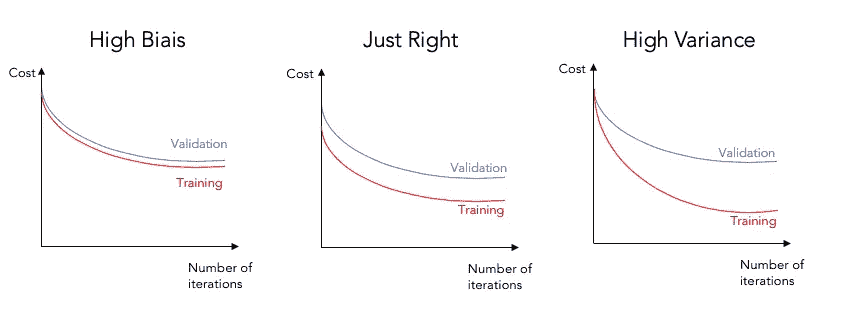
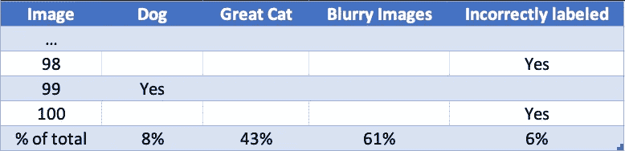

# 如何高效地设计机器学习系统

> 原文：<https://towardsdatascience.com/how-to-efficiently-design-machine-learning-system-caef9e05d5fb?source=collection_archive---------61----------------------->

## 吴恩达对机器学习设计的重要见解

在 [Unsplash](https://unsplash.com?utm_source=medium&utm_medium=referral) 上由 [Rohan Makhecha](https://unsplash.com/@rohanmakhecha?utm_source=medium&utm_medium=referral) 拍摄的照片

比方说，你正在设计一个机器学习系统，你已经使用你最喜欢的模型用默认参数对你的数据进行了训练，但它的性能不够好。

从那以后，你可能会在黑暗中摸索，到处尝试，没有一个真正的计划，也不能保证你所做的会提高你的模型的性能。

幸运的是，机器学习之父吴恩达给了我们一种有效调整机器学习模型的方法。在这里。

1.  尽快实现数据管道
2.  诊断高偏差和/或高方差，并采取相应措施
3.  手动分析未分类记录并寻找模式

*使用选定的评估指标不断测试和学习*

# 1.尽快实现数据管道

您的数据管道应该执行以下步骤:

*   清除不需要的值(异常值)
*   填充或删除空值
*   规范化数字特征
*   对分类特征进行编码
*   将数据分成 3 组训练(70%) /交叉验证(15%) /测试(15%)(非大数据应用的组大小)
*   使用您最喜欢的模型进行拟合和预测
*   使用您选择的指标(F1、精度、召回率、MAE 等)评估训练/交叉验证集上的模型性能

Andrew 对此的建议是，尽可能快地编写与上述每个步骤相对应的代码，不要太担心前两个步骤。它们会很快变得很耗时，最好在第一次实现时就做出强有力的假设，然后再重复这些假设。

# 2.诊断高偏差或/和高方差

诊断偏差和/或方差的方法有很多，Andrew 提出了两种方法:

## 学习曲线

学习曲线被定义为交叉验证和测试集的梯度下降迭代次数的成本演变的表示。

遗憾的是，根据定义，它只与使用梯度下降或优化 it 参数的变体的算法相关。

通过观察它们，你可以快速诊断高偏差和高方差。下图不言自明。

## 比较交叉验证准确性、训练准确性和人的表现

> **贝叶斯误差:**针对特定问题的最优(不可达)误差率。通常使用最佳可用人类表现来近似。

*高方差:*训练误差非常接近贝叶斯误差，交叉验证误差比两者都更差。

*高偏差:*训练误差非常接近交叉验证误差，并且两者都比贝叶斯误差更差。

*高偏差和高方差:*训练误差比交叉验证误差好得多，但都比贝叶斯误差差得多。

我使用了“相当”一词来强调这样一个事实，即没有经验法则来定义交叉验证误差、训练误差和贝叶斯误差的差异应该有多大或多小。

## 基于诊断采取措施

根据偏差/方差诊断，您可以采取的措施因型号而异。

在这篇文章中，我将只提出逻辑和线性回归和神经网络，但你可以找到基于树的模型，KNN 和 SVM 的快速谷歌搜索相应的行动。

这里的关键见解是，您应该尽快诊断您的问题类型(高偏差或高方差)。

**高偏置:**

*   增加梯度下降迭代次数(全部)
*   添加多项式要素(线性和逻辑回归)
*   特征工程(全部)
*   增加层数/每层的单元数(神经网络)

**高方差:**

*   添加正则化:L1 范数(所有)，退出正则化(神经网络)
*   添加更多数据(全部)

# 3.误差分析

误差分析包括在分类问题的情况下从测试集中收集未分类记录的随机样本，或者在回归问题的情况下收集预测误差高的记录的随机样本。然后你应该分析样本在不同类别中的分布。

在上面的错误分析输出表中，您可以看到该方法在 cat 检测器算法中的实际示例。

从该表中可以得出的主要见解是，61%的模糊图像和 43%的未分类记录是未分类的。基于这些结果，花一些时间来提高算法在大 Cat 和模糊图像上的性能似乎是值得的。

数据集可能包含也可能不包含关于其记录的详细信息。这就是为什么手动查看记录可以帮助您根据您的观察创建类别。

在上面的例子中，只有通过手动查看和分类图像，才能发现关于如何提高性能的重要见解。

# 使用您的评估标准不断测试和学习

在第二步和第三步中，使用步骤 1 中构建的评估设置来跟踪算法性能的改善。

您还应该使用此设置来测试不同的超参数/模型，并测试填充空值和过滤异常值的不同方法。

如果你觉得我错过了什么，请让我知道！

一切归功于吴恩达，也就是机器学习的教皇。